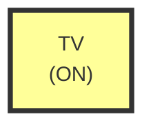
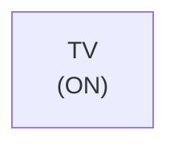

# 🚀 VirtualHome Agent Episode Log


### [GoalReasoner (Module A - Intent)] Output
```json
{
  "is_instruction_obviously_vague": true,
  "clarification_question": "What should I turn on if no one is watching the TV?",
  "target_object": "TV",
  "location_hint": null,
  "reasoning_chain": [
    {
      "question": "Why does the user want this object?",
      "answer": "The instruction references the TV being on when nobody is watching it."
    },
    {
      "question": "Why is that important?",
      "answer": "It appears the user wants the TV to be turned on conditionally based on whether it is being watched."
    },
    {
      "question": "What fundamental need does this fulfill?",
      "answer": "The core intent is to manage the operational state of a device in response to occupancy or attention."
    },
    {
      "question": "Are there any deeper psychological or physical motivations?",
      "answer": "The motivation may be to keep the device active for a purpose, but the exact intended action is unclear because the instruction is conditional and lacks a concrete target beyond the TV state."
    }
  ],
  "deep_intent": "The user wants a device to be operated based on whether it is being observed.",
  "acceptable_alternatives_properties": [
    {
      "priority": 1,
      "description": "Other indoor display devices or screens that can be turned on when unattended"
    },
    {
      "priority": 2,
      "description": "Similar household electronics with an on/off state"
    },
    {
      "priority": 3,
      "description": "Any powered entertainment device that can remain active"
    },
    {
      "priority": 4,
      "description": "A different household appliance that can be switched on for passive operation"
    }
  ]
}
```

### [PerceptionFilter] Output
```json
{
  "reasoning": "The goal is to turn on the TV, so the only strictly necessary target class is the TV itself. No other tools, locations, or backup devices are required by the SDG or intent.",
  "selected_classes": [
    "door",
    "character",
    "tv"
  ],
  "raw_class_count": 99
}
```

### [LLMExecutor] Output
```json
{
  "reasoning": "The goal is to satisfy N1 by turning the TV on. The instruction is marked obviously vague and includes a clarification question, so I should not guess which device to operate beyond the given target. The TV is already identified in the graph as tv(238) and is currently OFF, so the next step toward the SDG is to move to it before any interaction. Since switch actions require proximity, I will walk to the TV first.",
  "satisfied_nodes": [],
  "current_node_focus": "N1",
  "mapped_variables": {},
  "action": "[walk] <tv> (238)"
}
```
## Step 0
- **Action**: `[walk] <tv> (238)`
- **SDG Status**:

- **Observed Items (10)**: character(1), kitchen(11), door(47) [OPEN], livingroom(183), tv(238) [OFF], bedroom(241), door(254) [OPEN], bathroom(285), door(305) [OPEN], bedroom(346)


### [PerceptionFilter] Output
```json
{
  "reasoning": "The goal and SDG explicitly require the TV to be ON. To operate it, the minimal necessary physical control is the remotecontrol or an equivalent direct control if available, but only TV is explicitly required by the SDG. Since the user asks about turning on the TV when unattended, the TV itself must be retained along with the most relevant control device present.",
  "selected_classes": [
    "door",
    "remotecontrol",
    "character",
    "tv"
  ],
  "raw_class_count": 99
}
```

### [LLMExecutor] Output
```json
{
  "reasoning": "The SDG has a single unmet node: TV must be ON. I am already close to tv(238), and it has HAS_SWITCH and HAS_PLUG, so the correct next step is to turn it on. No clarification is needed for execution because the target object is explicitly the TV in the SDG and current graph.",
  "satisfied_nodes": [],
  "current_node_focus": "N1",
  "mapped_variables": {},
  "action": "[switchon] <tv> (238)"
}
```
## Step 1
- **Action**: `[switchon] <tv> (238)`
- **SDG Status**:

- **Observed Items (11)**: character(1), kitchen(11), door(47) [OPEN], livingroom(183), tv(238) [OFF], bedroom(241), door(254) [OPEN], bathroom(285), door(305) [OPEN], bedroom(346), remotecontrol(389) [OFF]


### [PerceptionFilter] Output
```json
{
  "reasoning": "The goal is to turn on the TV, and the SDG explicitly requires the TV to be ON. No other tools or locations are needed for this state-change task.",
  "selected_classes": [
    "door",
    "character",
    "tv"
  ],
  "raw_class_count": 99
}
```
## Step 2
- **Action**: `FINISH (Goal Reached)`
- **SDG Status**:

- **Observed Items (10)**: character(1), kitchen(11), door(47) [OPEN], livingroom(183), tv(238) [ON], bedroom(241), door(254) [OPEN], bathroom(285), door(305) [OPEN], bedroom(346)

