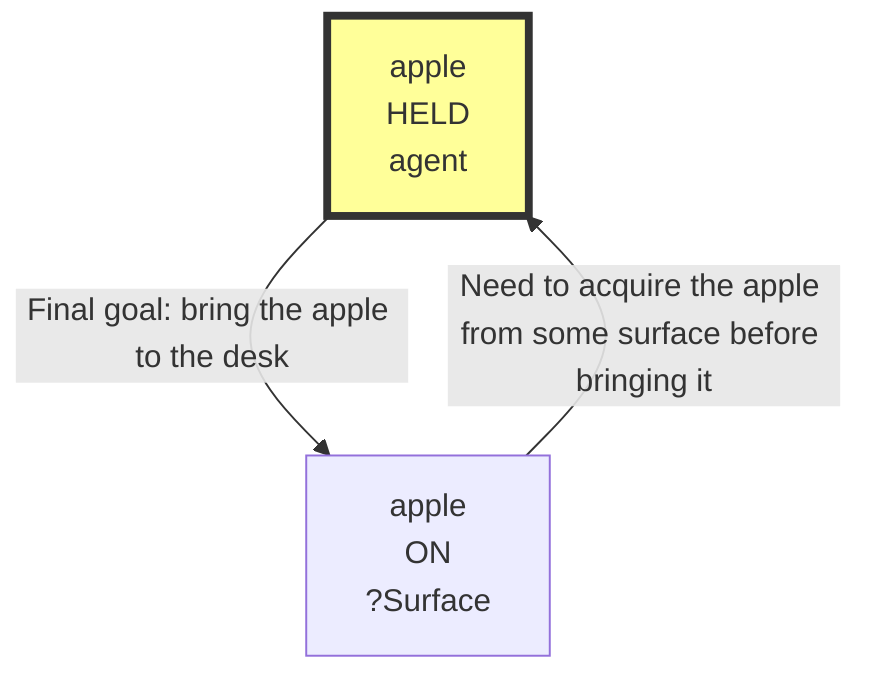
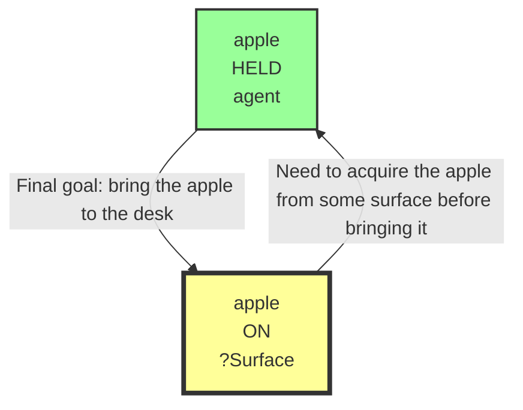
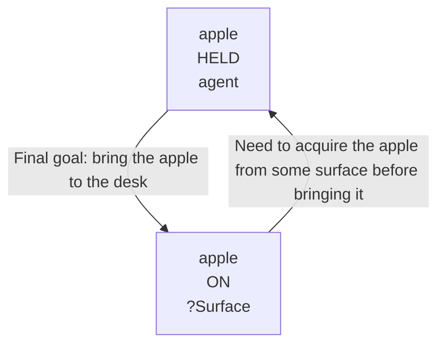

# 🚀 VirtualHome Agent Episode Log


### [GoalReasoner (Module A - Intent)] Output
```json
{
  "is_instruction_obviously_vague": false,
  "clarification_question": null,
  "target_object": "apple",
  "location_hint": "your desk",
  "reasoning_chain": [
    {
      "question": "Why does the user want this object?",
      "answer": "To have the apple delivered to their desk."
    },
    {
      "question": "Why is that important?",
      "answer": "So they can access and use or eat the apple at their desk."
    },
    {
      "question": "What fundamental need does this fulfill?",
      "answer": "It fulfills the need to consume food and potentially relieve hunger."
    },
    {
      "question": "Are there any deeper psychological or physical motivations?",
      "answer": "The primary motivation is likely physical nourishment, convenience, or immediate availability while working at the desk."
    }
  ],
  "deep_intent": "The user wants to relieve hunger or obtain a convenient edible snack at their desk.",
  "acceptable_alternatives_properties": [
    {
      "priority": 1,
      "description": "Other ready-to-eat fruits, such as a banana, pear, or orange"
    },
    {
      "priority": 2,
      "description": "Other fresh snack items with similar ease of eating, such as grapes or cut fruit"
    },
    {
      "priority": 3,
      "description": "Packaged snack foods that can be eaten at a desk, such as crackers or granola bars"
    },
    {
      "priority": 4,
      "description": "Any portable food item that can satisfy hunger, such as a sandwich or other simple snack"
    }
  ]
}
```

### [PerceptionFilter] Output
```json
{
  "reasoning": "The goal is to acquire and deliver the apple to the desk. The only strictly necessary target object is the apple, plus the destination/location object explicitly implied by the goal: the desk. No tools or additional receptacles are required for this simple transport task.",
  "selected_classes": [
    "character",
    "desk",
    "crackers",
    "apple"
  ],
  "raw_class_count": 112
}
```

### [LLMExecutor] Output
```json
{
  "reasoning": "The apple is already CLOSE to the character, but to satisfy N1 we need the apple held by the agent. Since grabbing requires being near the object and we are close to apple(437), the next atomic step is to walk directly to the apple before attempting to grab it.",
  "satisfied_nodes": [],
  "current_node_focus": "N1",
  "mapped_variables": {},
  "action": "[walk] <apple> (437)"
}
```
## Step 0
- **Action**: `[walk] <apple> (437)`
- **SDG Status**:

- **Observed Items (9)**: character(1), bathroom(11), bedroom(73), desk(108) [CLOSED], kitchen(205), crackers(332), livingroom(335), desk(373) [CLOSED], apple(437)


### [PerceptionFilter] Output
```json
{
  "reasoning": "The goal is to acquire and deliver the apple to the desk. The SDG requires the apple itself and indicates it is currently on some surface, so we keep the target object plus the desk as the destination/location. No additional tools or appliances are required for simply moving the apple.",
  "selected_classes": [
    "character",
    "desk",
    "crackers",
    "apple"
  ],
  "raw_class_count": 112
}
```

### [LLMExecutor] Output
```json
{
  "reasoning": "The apple is close to the agent, and the SDG node N1 requires the apple to be HELD by the agent. The previous action already moved us to the apple, so the next atomic step is to grab it. This is the necessary prerequisite before later placing it on the desk to satisfy N2.",
  "satisfied_nodes": [],
  "current_node_focus": "N1",
  "mapped_variables": {},
  "action": "[grab] <apple> (437)"
}
```
## Step 1
- **Action**: `[grab] <apple> (437)`
- **SDG Status**:

- **Observed Items (9)**: character(1), bathroom(11), bedroom(73), desk(108) [CLOSED], kitchen(205), crackers(332), livingroom(335), desk(373) [CLOSED], apple(437)


### [PerceptionFilter] Output
```json
{
  "reasoning": "The goal is to deliver the apple to the desk. The only strictly necessary object class is the target food item itself, plus the location/furniture explicitly mentioned as the destination: desk. No extra tools are required because the SDG only needs the apple to be acquired and held, then brought to the desk.",
  "selected_classes": [
    "character",
    "desk",
    "crackers",
    "apple"
  ],
  "raw_class_count": 112
}
```

### [LLMExecutor] Output
```json
{
  "reasoning": "N1 is already satisfied because the agent is holding apple(437). The remaining goal is N2: place the apple on the desk. Since the target location hint is \"your desk\" and the graph shows a desk object available, the next step must be to move to the desk before any putback action. The most plausible desk for the user's desk is desk(108) in the bedroom, so I will walk there next.",
  "satisfied_nodes": [
    "N1"
  ],
  "current_node_focus": "N2",
  "mapped_variables": {
    "?Surface": "desk(108)"
  },
  "action": "[walk] <desk> (108)"
}
```
## Step 2
- **Action**: `[walk] <desk> (108)`
- **SDG Status**:

- **Observed Items (9)**: character(1), bathroom(11), bedroom(73), desk(108) [CLOSED], kitchen(205), crackers(332), livingroom(335), desk(373) [CLOSED], apple(437)


### [PerceptionFilter] Output
```json
{
  "reasoning": "The goal is to bring the apple to the desk. So the only strictly necessary classes are the target object itself and the destination location/furniture explicitly implied by the goal. No tool or alternate food is needed for this acquisition task.",
  "selected_classes": [
    "character",
    "desk",
    "crackers",
    "apple"
  ],
  "raw_class_count": 112
}
```

### [LLMExecutor] Output
```json
{
  "reasoning": "N1 is already satisfied because the agent is holding apple(437). The remaining unsatisfied node is N2: place the apple ON the target surface. The current graph shows the character is already CLOSE to desk(108), so the next atomic step can be to put the held apple onto the desk. The desk is a valid flat surface, so [putback] is the correct action.",
  "satisfied_nodes": [
    "N1"
  ],
  "current_node_focus": "N2",
  "mapped_variables": {
    "?Surface": "desk(108)"
  },
  "action": "[putback] <apple> (437) <desk> (108)"
}
```
## Step 3
- **Action**: `[putback] <apple> (437) <desk> (108)`
- **SDG Status**:

- **Observed Items (9)**: character(1), bathroom(11), bedroom(73), desk(108) [CLOSED], kitchen(205), crackers(332), livingroom(335), desk(373) [CLOSED], apple(437)


### [PerceptionFilter] Output
```json
{
  "reasoning": "The goal is to bring the apple to the desk, so the only strictly necessary target item is the apple. The desk is the implied destination/location and must be retained because it is explicitly referenced in the goal. No extra tools are required for simply transporting the apple, and no alternative food is needed because the target is exact.",
  "selected_classes": [
    "character",
    "desk",
    "crackers",
    "apple"
  ],
  "raw_class_count": 112
}
```
## Step 4
- **Action**: `FINISH (Goal Reached)`
- **SDG Status**:

- **Observed Items (9)**: character(1), bathroom(11), bedroom(73), desk(108) [CLOSED], kitchen(205), crackers(332), livingroom(335), desk(373) [CLOSED], apple(437)

