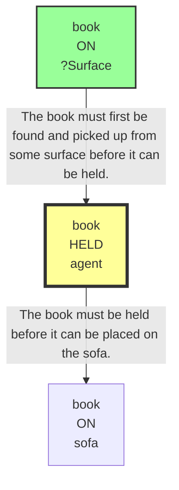
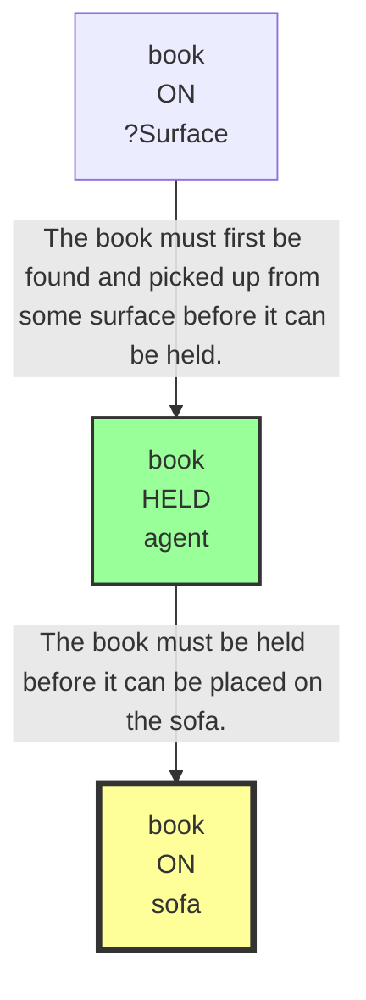
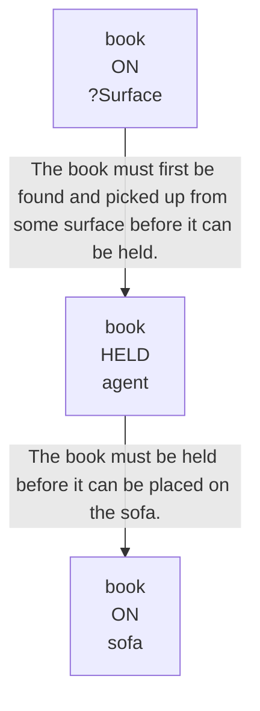

# 🚀 VirtualHome Agent Episode Log


### [GoalReasoner (Module A - Intent)] Output
```json
{
  "is_instruction_obviously_vague": false,
  "clarification_question": null,
  "target_object": "book",
  "location_hint": "sofa",
  "reasoning_chain": [
    {
      "question": "Why does the user want this object?",
      "answer": "To move an unorganized book to the sofa."
    },
    {
      "question": "Why is that important?",
      "answer": "To place the book in a desired location instead of leaving it unorganized somewhere else."
    },
    {
      "question": "What fundamental need does this fulfill?",
      "answer": "The user wants to organize or relocate an item within the room."
    },
    {
      "question": "Are there any deeper psychological or physical motivations?",
      "answer": "The user likely wants to tidy the space or make the book accessible on the sofa."
    }
  ],
  "deep_intent": "The user wants to organize or relocate an item within the room.",
  "acceptable_alternatives_properties": [
    {
      "priority": 1,
      "description": "Other reading materials or small household items that are similarly out of place and can be moved to the sofa"
    },
    {
      "priority": 2,
      "description": "Other paper-based items like magazines, notebooks, or documents"
    },
    {
      "priority": 3,
      "description": "Small portable objects that are cluttering a space and can be tidied up"
    },
    {
      "priority": 4,
      "description": "Any similar lightweight item that needs to be moved to improve organization"
    }
  ]
}
```

### [PerceptionFilter] Output
```json
{
  "reasoning": "The goal is to relocate a book to the sofa. The SDG requires the book itself, the sofa as the destination location, and a surface where the book may currently be found so it can be picked up. Since the exact source surface is unknown, the minimum relevant set is the target object, destination furniture, and a plausible surface category represented in the scene.",
  "selected_classes": [
    "desk",
    "nightstand",
    "character",
    "bench",
    "sofa",
    "book",
    "chair",
    "coffeetable",
    "bed",
    "table",
    "kitchentable"
  ],
  "raw_class_count": 99
}
```

### [LLMExecutor] Output
```json
{
  "reasoning": "The goal is to place the book on the sofa. The book(105) is already close to the agent and currently on the coffeetable(215), so the first required step is to pick it up. N3 (book on some surface) is effectively satisfied by the book being on the coffeetable, but N2 (book held by agent) is not yet satisfied, and N1 cannot be achieved until the book is held.",
  "satisfied_nodes": [
    "N3"
  ],
  "current_node_focus": "N2",
  "mapped_variables": {},
  "action": "[grab] <book> (105)"
}
```
## Step 0
- **Action**: `[grab] <book> (105)`
- **SDG Status**:

- **Observed Items (24)**: character(1), kitchen(11), book(105) [CLOSED], bench(130), kitchentable(131), bench(132), bench(133), bench(134), kitchentable(135), chair(160), livingroom(183), sofa(214), coffeetable(215), bedroom(241), desk(281) [CLOSED]...


### [PerceptionFilter] Output
```json
{
  "reasoning": "The goal is to move the target object, book, onto the sofa. The SDG shows the book must be held and found on some surface before placement, so the only strictly necessary classes are the target object, the destination location, and a generic surface where it may currently be found.",
  "selected_classes": [
    "desk",
    "bookshelf",
    "nightstand",
    "character",
    "sofa",
    "book",
    "coffeetable",
    "bed",
    "table",
    "kitchentable"
  ],
  "raw_class_count": 99
}
```

### [LLMExecutor] Output
```json
{
  "reasoning": "The book is already held in the agent's right hand, so SDG node N2 (book HELD by agent) is satisfied. The next missing step toward placing the book on the sofa is to move near the sofa before a putback action can be executed. The sofa(214) is the intended destination surface and is already identified in the living room.",
  "satisfied_nodes": [
    "N2"
  ],
  "current_node_focus": "N1",
  "mapped_variables": {},
  "action": "[walk] <sofa> (214)"
}
```
## Step 1
- **Action**: `[walk] <sofa> (214)`
- **SDG Status**:

- **Observed Items (23)**: character(1), kitchen(11), book(105) [CLOSED], kitchentable(131), kitchentable(135), bookshelf(158), bookshelf(159), livingroom(183), bookshelf(210), bookshelf(211), sofa(214), coffeetable(215), bedroom(241), bookshelf(280), desk(281) [CLOSED]...


### [PerceptionFilter] Output
```json
{
  "reasoning": "The goal is to move the target object book to the sofa. The SDG requires the book itself, the sofa as the destination location, and whatever surface the book is currently on so it can be picked up first. No other tools are required for this simple relocate task.",
  "selected_classes": [
    "character",
    "sofa",
    "book"
  ],
  "raw_class_count": 99
}
```

### [LLMExecutor] Output
```json
{
  "reasoning": "The book is already held in the right hand and the agent is already close to the sofa after the previous walk. The remaining missing SDG node is placing the held book onto the sofa surface, which now satisfies the proximity requirement for a putback action.",
  "satisfied_nodes": [
    "N2"
  ],
  "current_node_focus": "N1",
  "mapped_variables": {},
  "action": "[putback] <book> (105) <sofa> (214)"
}
```
## Step 2
- **Action**: `[putback] <book> (105) <sofa> (214)`
- **SDG Status**:

- **Observed Items (8)**: character(1), kitchen(11), book(105) [CLOSED], livingroom(183), sofa(214), bedroom(241), bathroom(285), bedroom(346)


### [PerceptionFilter] Output
```json
{
  "reasoning": "The goal is to move a book onto the sofa, so the only strictly necessary classes are the target object and the destination location. The SDG confirms the book must be held and then placed on the sofa, but no extra tool is required beyond picking it up.",
  "selected_classes": [
    "character",
    "sofa",
    "book"
  ],
  "raw_class_count": 99
}
```
## Step 3
- **Action**: `FINISH (Goal Reached)`
- **SDG Status**:

- **Observed Items (8)**: character(1), kitchen(11), book(105) [CLOSED], livingroom(183), sofa(214), bedroom(241), bathroom(285), bedroom(346)

