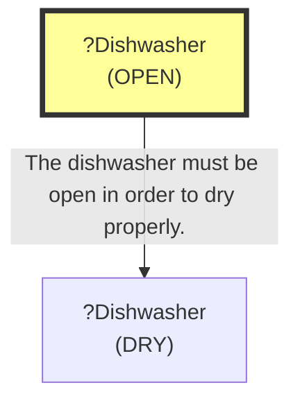
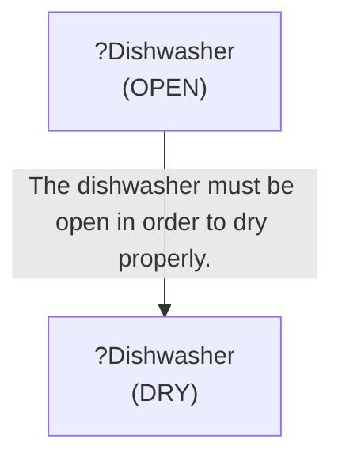

# 🚀 VirtualHome Agent Episode Log


### [GoalReasoner (Module A - Intent)] Output
```json
{
  "is_instruction_obviously_vague": false,
  "clarification_question": null,
  "target_object": "dishwasher",
  "location_hint": null,
  "reasoning_chain": [
    {
      "question": "Why does the user want this object?",
      "answer": "To keep the appliance open."
    },
    {
      "question": "Why is that important?",
      "answer": "So the inside can dry after use."
    },
    {
      "question": "What fundamental need does this fulfill?",
      "answer": "It helps remove moisture and prevent trapped dampness."
    },
    {
      "question": "Are there any deeper psychological or physical motivations?",
      "answer": "The likely motivation is maintaining a dry, hygienic appliance and reducing lingering moisture-related odors or buildup."
    }
  ],
  "deep_intent": "The user wants to remove moisture and keep an appliance dry.",
  "acceptable_alternatives_properties": [
    {
      "priority": 1,
      "description": "Other ways to ventilate the appliance, such as leaving the door slightly ajar or using a drying cycle if available"
    },
    {
      "priority": 2,
      "description": "Methods to dry enclosed household spaces or containers, such as opening them to air out"
    },
    {
      "priority": 3,
      "description": "Household drying aids like a fan or absorbent towels to reduce moisture"
    },
    {
      "priority": 4,
      "description": "Any practical indoor drying approach that prevents trapped dampness in a closed compartment"
    }
  ]
}
```

### [PerceptionFilter] Output
```json
{
  "reasoning": "The goal is to keep the dishwasher open so it can dry. The only strictly necessary class from the visible objects is the dishwasher itself, since the SDG only requires the dishwasher to be OPEN and then DRY. No additional tool or location is explicitly required.",
  "selected_classes": [
    "door",
    "towel",
    "dishwasher",
    "character"
  ],
  "raw_class_count": 99
}
```

### [LLMExecutor] Output
```json
{
  "reasoning": "The dishwasher is present and currently CLOSED, so the first unsatisfied SDG node is to make it OPEN. No prior walk has occurred, and opening requires being near the dishwasher, so the next atomic step is to walk to it.",
  "satisfied_nodes": [],
  "current_node_focus": "N1",
  "mapped_variables": {
    "?Dishwasher": "dishwasher(165)"
  },
  "action": "[walk] <dishwasher> (165)"
}
```
## Step 0
- **Action**: `[walk] <dishwasher> (165)`
- **SDG Status**:

- **Observed Items (15)**: character(1), kitchen(11), door(47) [OPEN], dishwasher(165) [CLOSED,OFF], livingroom(183), bedroom(241), door(254) [OPEN], bathroom(285), door(305) [OPEN], towel(328), towel(329), towel(330), towel(342), towel(343), bedroom(346)


### [PerceptionFilter] Output
```json
{
  "reasoning": "The goal is to keep the dishwasher open so it can dry. The only strictly necessary object class explicitly involved is the dishwasher itself; no additional tools or locations are required by the SDG.",
  "selected_classes": [
    "door",
    "towel",
    "dishwasher",
    "character"
  ],
  "raw_class_count": 99
}
```

### [LLMExecutor] Output
```json
{
  "reasoning": "The dishwasher is currently CLOSED and OFF, and the previous step already moved me to it successfully (it is marked CLOSE character(1)). The first unsatisfied SDG node is N1: dishwasher OPEN. Since I am already near the dishwasher, the next atomic action is to open it. Once open, the appliance can dry to satisfy N2.",
  "satisfied_nodes": [],
  "current_node_focus": "N1",
  "mapped_variables": {
    "?Dishwasher": "dishwasher(165)"
  },
  "action": "[open] <dishwasher> (165)"
}
```
## Step 1
- **Action**: `[open] <dishwasher> (165)`
- **SDG Status**:

- **Observed Items (15)**: character(1), kitchen(11), door(47) [OPEN], dishwasher(165) [CLOSED,OFF], livingroom(183), bedroom(241), door(254) [OPEN], bathroom(285), door(305) [OPEN], towel(328), towel(329), towel(330), towel(342), towel(343), bedroom(346)


### [PerceptionFilter] Output
```json
{
  "reasoning": "The goal is to keep the dishwasher open so it can dry. The only strictly necessary class from the scene is the dishwasher itself; no additional tools or alternative drying appliances are required by the SDG.",
  "selected_classes": [
    "door",
    "towel",
    "dishwasher",
    "character"
  ],
  "raw_class_count": 99
}
```
## Step 2
- **Action**: `FINISH (Goal Reached)`
- **SDG Status**:

- **Observed Items (15)**: character(1), kitchen(11), door(47) [OPEN], dishwasher(165) [OPEN,OFF], livingroom(183), bedroom(241), door(254) [OPEN], bathroom(285), door(305) [OPEN], towel(328), towel(329), towel(330), towel(342), towel(343), bedroom(346)

