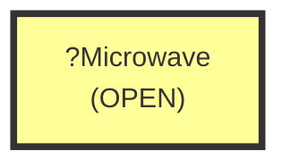
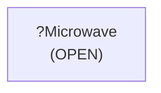

# 🚀 VirtualHome Agent Episode Log


### [GoalReasoner (Module A - Intent)] Output
```json
{
  "is_instruction_obviously_vague": false,
  "clarification_question": null,
  "target_object": "microwave",
  "location_hint": null,
  "reasoning_chain": [
    {
      "question": "Why does the user want this object?",
      "answer": "To keep the microwave in a state that supports maintenance."
    },
    {
      "question": "Why is that important?",
      "answer": "Because an always-open microwave may be easier to inspect, dry, clean, or service."
    },
    {
      "question": "What fundamental need does this fulfill?",
      "answer": "It helps maintain appliance readiness and upkeep."
    },
    {
      "question": "Are there any deeper psychological or physical motivations?",
      "answer": "The user likely wants to reduce wear, prevent lingering moisture or odors, and make routine maintenance simpler."
    }
  ],
  "deep_intent": "The user wants to support appliance maintenance and upkeep.",
  "acceptable_alternatives_properties": [
    {
      "priority": 1,
      "description": "Other appliance states or actions that support maintenance, such as leaving a door ajar after cleaning or drying"
    },
    {
      "priority": 2,
      "description": "Similar household appliances that can be kept open or ventilated for upkeep, such as an oven or dishwasher"
    },
    {
      "priority": 3,
      "description": "General maintenance-supporting conditions like ventilation or drying airflow around household devices"
    },
    {
      "priority": 4,
      "description": "Other routine upkeep tasks for household equipment, such as cleaning or inspection, that achieve the same maintenance goal"
    }
  ]
}
```

### [PerceptionFilter] Output
```json
{
  "reasoning": "The goal and SDG require the microwave itself and its OPEN state for maintenance/upkeep. No other tools or locations are explicitly needed.",
  "selected_classes": [
    "dishwasher",
    "character",
    "microwave",
    "door"
  ],
  "raw_class_count": 99
}
```

### [LLMExecutor] Output
```json
{
  "reasoning": "The SDG requires the microwave to be OPEN. The current graph shows microwave(171) is CLOSED and CAN_OPEN, and the agent is already inside the kitchen where it is located, so the next atomic step is to open it.",
  "satisfied_nodes": [],
  "current_node_focus": "N1",
  "mapped_variables": {
    "?Microwave": "microwave(171)"
  },
  "action": "[open] <microwave> (171)"
}
```
## Step 0
- **Action**: `[open] <microwave> (171)`
- **SDG Status**:

- **Observed Items (11)**: character(1), kitchen(11), door(47) [OPEN], dishwasher(165) [CLOSED,OFF], microwave(171) [CLOSED,OFF], livingroom(183), bedroom(241), door(254) [OPEN], bathroom(285), door(305) [OPEN], bedroom(346)


### [PerceptionFilter] Output
```json
{
  "reasoning": "The goal and SDG only require the microwave itself and its OPEN state for maintenance/upkeep. No additional tools or locations are needed beyond the target appliance, since the task is about keeping that specific appliance open.",
  "selected_classes": [
    "dishwasher",
    "character",
    "microwave",
    "door"
  ],
  "raw_class_count": 99
}
```
## Step 1
- **Action**: `FINISH (Goal Reached)`
- **SDG Status**:

- **Observed Items (11)**: character(1), kitchen(11), door(47) [OPEN], dishwasher(165) [CLOSED,OFF], microwave(171) [OPEN,OFF], livingroom(183), bedroom(241), door(254) [OPEN], bathroom(285), door(305) [OPEN], bedroom(346)

