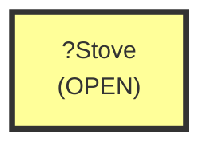
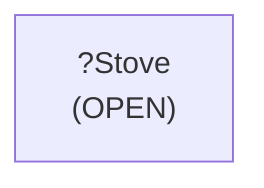

# 🚀 VirtualHome Agent Episode Log


### [GoalReasoner (Module A - Intent)] Output
```json
{
  "is_instruction_obviously_vague": false,
  "clarification_question": null,
  "target_object": "stove",
  "location_hint": null,
  "reasoning_chain": [
    {
      "question": "Why does the user want this object?",
      "answer": "To keep the stove in an open state."
    },
    {
      "question": "Why is that important?",
      "answer": "To ensure the stove remains accessible or ready for use."
    },
    {
      "question": "What fundamental need does this fulfill?",
      "answer": "The need to maintain a desired physical state in the kitchen."
    },
    {
      "question": "Are there any deeper psychological or physical motivations?",
      "answer": "Possibly convenience, readiness for cooking, or a preference for a specific appliance state."
    }
  ],
  "deep_intent": "The user wants to maintain access to a cooking appliance by keeping it in a desired state.",
  "acceptable_alternatives_properties": [
    {
      "priority": 1,
      "description": "Other kitchen appliance states that preserve access or readiness, such as keeping a comparable appliance door or lid open if that matches the intended function."
    },
    {
      "priority": 2,
      "description": "Other nearby cooking-related items left accessible and ready for use, such as oven doors, microwave doors, or cabinet doors for cooking tools."
    },
    {
      "priority": 3,
      "description": "Alternative ways to keep the cooking area ready, such as arranging utensils or ingredients so they are easy to reach."
    },
    {
      "priority": 4,
      "description": "Different household items that maintain immediate accessibility, even if they are not cooking appliances."
    }
  ]
}
```

### [PerceptionFilter] Output
```json
{
  "reasoning": "The goal and SDG only require the stove itself, specifically in an OPEN state. No other tools, locations, or backup appliances are necessary for this state-based objective.",
  "selected_classes": [
    "door",
    "character",
    "stove",
    "microwave",
    "cabinet"
  ],
  "raw_class_count": 99
}
```

### [LLMExecutor] Output
```json
{
  "reasoning": "The SDG requires the stove to be in the OPEN state. The current graph shows stove(163) is CLOSED and is located inside the kitchen, which is reachable from the current location. To change its state, I must first be near the stove before I can open it. No other nodes are satisfied yet because the required OPEN state has not been achieved.",
  "satisfied_nodes": [],
  "current_node_focus": "N1",
  "mapped_variables": {
    "?Stove": "stove(163)"
  },
  "action": "[walk] <stove> (163)"
}
```
## Step 0
- **Action**: `[walk] <stove> (163)`
- **SDG Status**:

- **Observed Items (12)**: character(1), kitchen(11), door(47) [OPEN], stove(163) [OFF,CLOSED], microwave(171) [CLOSED,OFF], livingroom(183), bedroom(241), door(254) [OPEN], bathroom(285), door(305) [OPEN], bedroom(346), cabinet(396) [CLOSED]


### [PerceptionFilter] Output
```json
{
  "reasoning": "The goal and SDG require keeping the stove in an OPEN state, so the stove itself must be included. No other objects are strictly necessary for this state goal; alternative cooking appliances are not required by the SDG.",
  "selected_classes": [
    "door",
    "character",
    "stove",
    "microwave",
    "cabinet"
  ],
  "raw_class_count": 99
}
```

### [LLMExecutor] Output
```json
{
  "reasoning": "The required SDG node N1 is to make the stove OPEN. The filtered graph shows stove(163) is already CLOSE to the character and has CAN_OPEN, so no additional walking is needed. The next atomic step is to open the stove.",
  "satisfied_nodes": [],
  "current_node_focus": "N1",
  "mapped_variables": {
    "?Stove": "stove(163)"
  },
  "action": "[open] <stove> (163)"
}
```
## Step 1
- **Action**: `[open] <stove> (163)`
- **SDG Status**:

- **Observed Items (12)**: character(1), kitchen(11), door(47) [OPEN], stove(163) [OFF,CLOSED], microwave(171) [CLOSED,OFF], livingroom(183), bedroom(241), door(254) [OPEN], bathroom(285), door(305) [OPEN], bedroom(346), cabinet(396) [CLOSED]


### [PerceptionFilter] Output
```json
{
  "reasoning": "The goal and SDG require keeping a stove in the OPEN state, so the stove itself must be selected. Because the intent allows comparable cooking appliances or access-preserving alternatives, nearby cooking appliances that could serve as functional backups should also be retained, especially those with doors/lids that can be open for readiness.",
  "selected_classes": [
    "door",
    "microwave",
    "stove",
    "character",
    "cabinet"
  ],
  "raw_class_count": 99
}
```
## Step 2
- **Action**: `FINISH (Goal Reached)`
- **SDG Status**:

- **Observed Items (12)**: character(1), kitchen(11), door(47) [OPEN], stove(163) [OFF,OPEN], microwave(171) [CLOSED,OFF], livingroom(183), bedroom(241), door(254) [OPEN], bathroom(285), door(305) [OPEN], bedroom(346), cabinet(396) [CLOSED]

