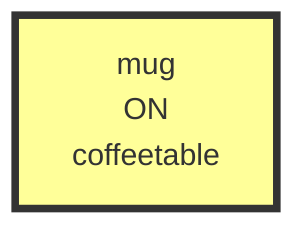
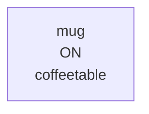

# 🚀 VirtualHome Agent Episode Log


### [GoalReasoner (Module A - Intent)] Output
```json
{
  "is_instruction_obviously_vague": false,
  "clarification_question": null,
  "target_object": "mug",
  "location_hint": "coffeetable",
  "reasoning_chain": [
    {
      "question": "Why does the user want this object?",
      "answer": "To keep the mug on the coffeetable."
    },
    {
      "question": "Why is that important?",
      "answer": "The user wants the mug maintained in a specific physical location."
    },
    {
      "question": "What fundamental need does this fulfill?",
      "answer": "It fulfills the need to keep a household item organized and within a designated place."
    },
    {
      "question": "Are there any deeper psychological or physical motivations?",
      "answer": "It may reduce clutter, make the mug easy to find, and preserve a preferred arrangement in the room."
    }
  ],
  "deep_intent": "The user wants to keep a household item organized in a designated location.",
  "acceptable_alternatives_properties": [
    {
      "priority": 1,
      "description": "Other small drinkware items that can be kept on the coffeetable, such as a cup or glass"
    },
    {
      "priority": 2,
      "description": "Other tabletop household items that can serve a similar organized placement role, such as a coaster or small bowl"
    },
    {
      "priority": 3,
      "description": "Any small household object that can be kept neatly in a fixed spot on the coffeetable"
    },
    {
      "priority": 4,
      "description": "Other everyday items that help maintain an orderly room arrangement, even if they are not drinkware"
    }
  ]
}
```

### [PerceptionFilter] Output
```json
{
  "reasoning": "The goal is to keep the mug on the coffeetable, so the only strictly necessary classes are the target object and the destination location. No extra tools or containers are required.",
  "selected_classes": [
    "character",
    "coffeetable",
    "mug"
  ],
  "raw_class_count": 99
}
```

### [LLMExecutor] Output
```json
{
  "reasoning": "The goal is to place the mug on the coffeetable. The mug is currently close to the character and inside the kitchen, while the coffeetable is in the living room. Since placing onto a surface requires being next to the destination first, the correct next step is to walk to the coffeetable. The mug is grabbable and there are no dirty-state constraints shown.",
  "satisfied_nodes": [],
  "current_node_focus": "N1",
  "mapped_variables": {
    "?TargetSurface": "coffeetable(215)"
  },
  "action": "[walk] <coffeetable> (215)"
}
```
## Step 0
- **Action**: `[walk] <coffeetable> (215)`
- **SDG Status**:

- **Observed Items (8)**: character(1), kitchen(11), livingroom(183), coffeetable(215), bedroom(241), bathroom(285), bedroom(346), mug(384)


### [PerceptionFilter] Output
```json
{
  "reasoning": "The goal is to keep the target object mug on the coffeetable, so both the target and the specified location are required. No additional tools or receptacles are needed for this simple placement task.",
  "selected_classes": [
    "character",
    "coffeetable",
    "mug"
  ],
  "raw_class_count": 99
}
```

### [LLMExecutor] Output
```json
{
  "reasoning": "The coffeetable is already close to the character, so the proximity requirement for placing an object onto a surface is satisfied. The mug is also close and is the target object for the SDG relation N1 (mug ON coffeetable). The next required step is to grab the mug before it can be placed on the coffeetable.",
  "satisfied_nodes": [],
  "current_node_focus": "N1",
  "mapped_variables": {
    "?TargetObject": "mug(384)",
    "?Surface": "coffeetable(215)"
  },
  "action": "[grab] <mug> (384)"
}
```
## Step 1
- **Action**: `[grab] <mug> (384)`
- **SDG Status**:

- **Observed Items (8)**: character(1), kitchen(11), livingroom(183), coffeetable(215), bedroom(241), bathroom(285), bedroom(346), mug(384)


### [PerceptionFilter] Output
```json
{
  "reasoning": "The goal is to keep the target object, mug, in the specified location, coffeetable. So only the target item and the location object are needed; no tools or alternative functional objects are required for this simple placement relation.",
  "selected_classes": [
    "character",
    "coffeetable",
    "mug"
  ],
  "raw_class_count": 99
}
```

### [LLMExecutor] Output
```json
{
  "reasoning": "The mug is already held in the right hand, and the coffeetable is already close to the character. The SDG goal N1 (mug ON coffeetable) is not yet satisfied because the mug is not placed on the surface. Since putting an object onto a surface requires being near the destination and the previous step already established proximity to the coffeetable, the next atomic action is to place the held mug onto the coffeetable.",
  "satisfied_nodes": [],
  "current_node_focus": "N1",
  "mapped_variables": {},
  "action": "[putback] <mug> (384) <coffeetable> (215)"
}
```
## Step 2
- **Action**: `[putback] <mug> (384) <coffeetable> (215)`
- **SDG Status**:

- **Observed Items (8)**: character(1), kitchen(11), livingroom(183), coffeetable(215), bedroom(241), bathroom(285), bedroom(346), mug(384)


### [PerceptionFilter] Output
```json
{
  "reasoning": "The goal explicitly requires the mug and the coffeetable, and the SDG states the mug must be on the coffeetable. No extra tools or alternative appliances are needed because this is a placement/organization task, not a preparation or manipulation task.",
  "selected_classes": [
    "character",
    "coffeetable",
    "mug"
  ],
  "raw_class_count": 99
}
```
## Step 3
- **Action**: `FINISH (Goal Reached)`
- **SDG Status**:

- **Observed Items (8)**: character(1), kitchen(11), livingroom(183), coffeetable(215), bedroom(241), bathroom(285), bedroom(346), mug(384)

