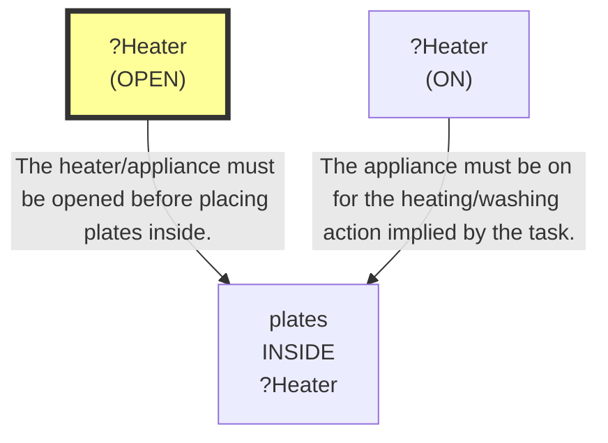
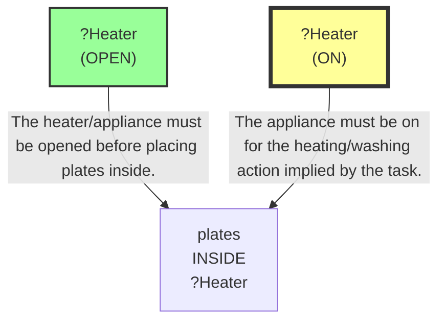
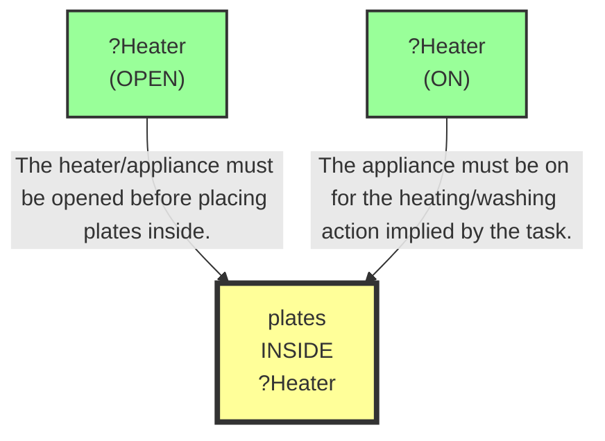
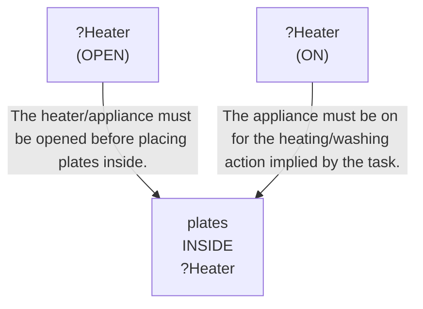

# 🚀 VirtualHome Agent Episode Log


### [GoalReasoner (Module A - Intent)] Output
```json
{
  "is_instruction_obviously_vague": false,
  "clarification_question": null,
  "target_object": "plates",
  "location_hint": "microwave",
  "reasoning_chain": [
    {
      "question": "Why does the user want this object?",
      "answer": "To wash dishes."
    },
    {
      "question": "Why is that important?",
      "answer": "To clean the dishes and remove residue or dirt."
    },
    {
      "question": "What fundamental need does this fulfill?",
      "answer": "It fulfills the need to have clean dishware available for later use."
    },
    {
      "question": "Are there any deeper psychological or physical motivations?",
      "answer": "The user likely wants to complete a cleaning task efficiently and restore order in the kitchen."
    }
  ],
  "deep_intent": "The user wants to clean dishware.",
  "acceptable_alternatives_properties": [
    {
      "priority": 1,
      "description": "Other dirty dishware items that can be cleaned in a similar way, such as bowls, cups, or utensils"
    },
    {
      "priority": 2,
      "description": "Other washable kitchen items made of similar material, such as serving dishes or small containers"
    },
    {
      "priority": 3,
      "description": "A broader set of dirty kitchenware that needs cleaning"
    },
    {
      "priority": 4,
      "description": "Other household items that need surface cleaning, if the exact dishware is unavailable"
    }
  ]
}
```

### [PerceptionFilter] Output
```json
{
  "reasoning": "The goal is to clean plates, and the SDG indicates an OPEN and ON heater/appliance for the task. The exact target class plate must be kept, and the visible appliance matching the needed heater/washing capability is microwave. Since dish cleaning may require a cleaning location/appliance backup, dishwasher is also a functional alternative for washing dishes.",
  "selected_classes": [
    "dishwasher",
    "microwave",
    "character",
    "plate"
  ],
  "raw_class_count": 99
}
```

### [LLMExecutor] Output
```json
{
  "reasoning": "The goal SDG requires the plates to be inside a heater/appliance that is OPEN and ON. The best matching appliance in the filtered graph is the microwave(171), since it is explicitly a heater-like container with CAN_OPEN and HAS_SWITCH and is already close to the character. The current gap is that the microwave is CLOSED and OFF. Because opening it is a prerequisite for placing the plate inside, the next atomic action should satisfy N2 first. The plate is already held in the right hand, so no grab is needed.",
  "satisfied_nodes": [],
  "current_node_focus": "N2",
  "mapped_variables": {
    "?Heater": "microwave(171)"
  },
  "action": "[open] <microwave> (171)"
}
```
## Step 0
- **Action**: `[open] <microwave> (171)`
- **SDG Status**:

- **Observed Items (9)**: character(1), kitchen(11), plate(67), dishwasher(165) [CLOSED,OFF], microwave(171) [CLOSED,OFF], livingroom(183), bedroom(241), bathroom(285), bedroom(346)


### [PerceptionFilter] Output
```json
{
  "reasoning": "The goal is to clean dishware, and the SDG requires plates to be inside an open, on appliance. The visible appliance matching the heater/cooker role is the microwave, so we keep it along with the target plates. No extra tools are implied beyond the appliance needed for the task.",
  "selected_classes": [
    "microwave",
    "character",
    "plates",
    "plate"
  ],
  "raw_class_count": 99
}
```

### [LLMExecutor] Output
```json
{
  "reasoning": "The microwave is already OPEN, satisfying N2. The remaining gap toward the SDG is N3: the heater/appliance must be ON. Since the character is close to microwave(171) and it has a switch, the next atomic action is to turn it on. The plate is already held, so no movement or grab is needed before switching.",
  "satisfied_nodes": [
    "N2"
  ],
  "current_node_focus": "N3",
  "mapped_variables": {
    "?Heater": "microwave(171)"
  },
  "action": "[switchon] <microwave> (171)"
}
```
## Step 1
- **Action**: `[switchon] <microwave> (171)`
- **SDG Status**:

- **Observed Items (8)**: character(1), kitchen(11), plate(67), microwave(171) [OPEN,OFF], livingroom(183), bedroom(241), bathroom(285), bedroom(346)


### [PerceptionFilter] Output
```json
{
  "reasoning": "The goal is to clean plates, and the SDG says the plates must be inside an OPEN, ON heater/appliance. The location hint and visible options point to the microwave as the needed appliance. Since alternatives retention applies, the other viable heating/cleaning appliances visible should also be kept as backups: dishwasher, sink, stove, and washingmachine.",
  "selected_classes": [
    "microwave",
    "stove",
    "character",
    "sink",
    "plates",
    "plate",
    "washingmachine",
    "dishwasher"
  ],
  "raw_class_count": 99
}
```

### [LLMExecutor] Output
```json
{
  "reasoning": "The SDG requires the plates to be INSIDE a heater/appliance that is OPEN and ON. The microwave(171) is the best binding for ?Heater and is already OPEN and ON, so N2 and N3 are satisfied. The remaining unsatisfied relation is N1: the held plate must be placed inside the open microwave. Since I am already close to the microwave and holding plate(67), the next atomic action is to put the plate into it.",
  "satisfied_nodes": [
    "N2",
    "N3"
  ],
  "current_node_focus": "N1",
  "mapped_variables": {
    "?Heater": "microwave(171)"
  },
  "action": "[putin] <plate> (67) <microwave> (171)"
}
```
## Step 2
- **Action**: `[putin] <plate> (67) <microwave> (171)`
- **SDG Status**:

- **Observed Items (13)**: character(1), kitchen(11), plate(67), sink(155), stove(163) [OFF,CLOSED], dishwasher(165) [CLOSED,OFF], microwave(171) [OPEN,ON], livingroom(183), bedroom(241), bathroom(285), sink(326), washingmachine(345) [CLOSED,OFF], bedroom(346)


### [PerceptionFilter] Output
```json
{
  "reasoning": "The goal is to clean plates, and the SDG shows they must be placed inside an open, on appliance/heater. The visible object list includes the exact target class plates? Actually the exact class present is plate, which is needed as the dishware target. For the required appliance, microwave matches the heater/appliance role in the SDG and the location hint. No other tools are explicitly required.",
  "selected_classes": [
    "microwave",
    "character",
    "plate"
  ],
  "raw_class_count": 99
}
```
## Step 3
- **Action**: `FINISH (Goal Reached)`
- **SDG Status**:

- **Observed Items (8)**: character(1), kitchen(11), plate(67) [HOT], microwave(171) [OPEN,ON], livingroom(183), bedroom(241), bathroom(285), bedroom(346)

