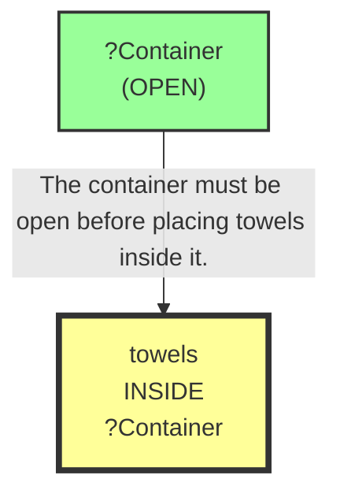
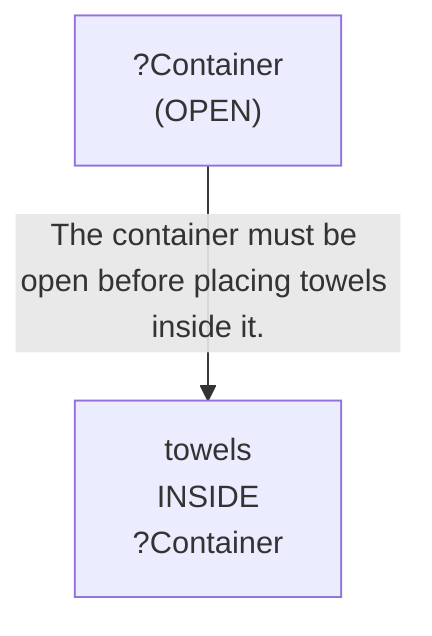

# 🚀 VirtualHome Agent Episode Log


### [GoalReasoner (Module A - Intent)] Output
```json
{
  "is_instruction_obviously_vague": false,
  "clarification_question": null,
  "target_object": "towels",
  "location_hint": null,
  "reasoning_chain": [
    {
      "question": "Why does the user want this object?",
      "answer": "To have the towels moved into the dishwasher when they are found."
    },
    {
      "question": "Why is that important?",
      "answer": "The user likely wants the towels handled in a specific way as part of organizing, cleaning, or following a household instruction."
    },
    {
      "question": "What fundamental need does this fulfill?",
      "answer": "It fulfills a need to manage household items according to a desired placement or cleaning-related action."
    },
    {
      "question": "Are there any deeper psychological or physical motivations?",
      "answer": "The motivation is likely to keep the environment orderly or to direct items to a designated location."
    }
  ],
  "deep_intent": "The user wants household items to be relocated into a designated appliance or container.",
  "acceptable_alternatives_properties": [
    {
      "priority": 1,
      "description": "Other soft household textiles or linens that the user may want placed in the same location."
    },
    {
      "priority": 2,
      "description": "Similar fabric items such as washcloths, cleaning cloths, or napkins."
    },
    {
      "priority": 3,
      "description": "Other household items intended for collection, sorting, or relocation."
    },
    {
      "priority": 4,
      "description": "Nearby loose items that can be gathered and moved into the requested destination if the user’s goal is general tidying."
    }
  ]
}
```

### [PerceptionFilter] Output
```json
{
  "reasoning": "The goal is to place towels into an open container, and the SDG requires the container to be open. The visible classes that can function as the destination appliance/container are the dishwasher, washingmachine, and also other plausible openable storage/container options if needed; the target object class towels must be included exactly.",
  "selected_classes": [
    "closet",
    "dishwasher",
    "towel",
    "box",
    "washingmachine",
    "character",
    "cabinet"
  ],
  "raw_class_count": 99
}
```

### [LLMExecutor] Output
```json
{
  "reasoning": "The goal is to place towels inside an open container. The only clearly relevant destination container currently visible is the dishwasher(165), which is already OPEN, satisfying N2. The towel(328) is present in the bathroom and is grabbable. Since the next required step toward N1 is to obtain the towel before moving it into the open container, I should first walk to the towel.",
  "satisfied_nodes": [
    "N2"
  ],
  "current_node_focus": "N1",
  "mapped_variables": {
    "?Container": "dishwasher(165)"
  },
  "action": "[walk] <towel> (328)"
}
```
## Step 0
- **Action**: `[walk] <towel> (328)`
- **SDG Status**:

- **Observed Items (15)**: character(1), kitchen(11), box(114) [CLOSED], dishwasher(165) [OPEN,OFF], livingroom(183), box(231) [CLOSED], bedroom(241), box(270) [CLOSED], bathroom(285), towel(328), washingmachine(345) [CLOSED,OFF], bedroom(346), box(382) [CLOSED], closet(395) [CLOSED], cabinet(396) [CLOSED]


### [PerceptionFilter] Output
```json
{
  "reasoning": "The goal is to place towels into an open container/appliance. The SDG requires the target towels and an open ?Container. Since the description says the destination is a dishwasher, and alternatives must be retained for possible functional backups, I keep all visible appliances that could serve as the intended container for relocating/cleaning items, plus the exact target towel class.",
  "selected_classes": [
    "dishwasher",
    "fridge",
    "towel",
    "washingmachine",
    "box",
    "character",
    "cabinet",
    "sink",
    "microwave"
  ],
  "raw_class_count": 99
}
```

### [LLMExecutor] Output
```json
{
  "reasoning": "The towel(328) is now adjacent to the character and grabbable. The SDG requires towels to end up inside an open container, and the currently visible open destination from prior context is the dishwasher(165), so the next progress-making step is to pick up the towel before transporting it there. N2 (container open) is already satisfied for the dishwasher.",
  "satisfied_nodes": [
    "N2"
  ],
  "current_node_focus": "N1",
  "mapped_variables": {
    "?Container": "dishwasher(165)"
  },
  "action": "[grab] <towel> (328)"
}
```
## Step 1
- **Action**: `[grab] <towel> (328)`
- **SDG Status**:

- **Observed Items (18)**: character(1), kitchen(11), box(114) [CLOSED], sink(155), fridge(162) [CLOSED], dishwasher(165) [OPEN,OFF], microwave(171) [CLOSED,OFF], livingroom(183), box(231) [CLOSED], bedroom(241), box(270) [CLOSED], bathroom(285), sink(326), towel(328), washingmachine(345) [CLOSED,OFF]...


### [PerceptionFilter] Output
```json
{
  "reasoning": "The goal is to place towels into an open container/appliance. The SDG requires the target object class towels and an open ?Container. Because the destination is described as a dishwasher, I must keep the dishwasher as the likely container; no other tools are needed.",
  "selected_classes": [
    "character",
    "dishwasher",
    "towel"
  ],
  "raw_class_count": 99
}
```

### [LLMExecutor] Output
```json
{
  "reasoning": "The towel(328) is already held in the right hand, and the destination container dishwasher(165) is already known and OPEN. The remaining gap toward N1 is to place the towel inside the open container. Per proximity and container rules, I must first walk to the dishwasher before any putin action.",
  "satisfied_nodes": [
    "N2"
  ],
  "current_node_focus": "N1",
  "mapped_variables": {
    "?Container": "dishwasher(165)"
  },
  "action": "[walk] <dishwasher> (165)"
}
```
## Step 2
- **Action**: `[walk] <dishwasher> (165)`
- **SDG Status**:

- **Observed Items (8)**: character(1), kitchen(11), dishwasher(165) [OPEN,OFF], livingroom(183), bedroom(241), bathroom(285), towel(328), bedroom(346)


### [PerceptionFilter] Output
```json
{
  "reasoning": "The goal is to place towels into an open container/appliance. The SDG requires the target item class towels and an open ?Container, so I must keep towels plus all plausible container/appliance options that could satisfy the open-placement task. Since the intent specifically mentions dishwasher, I include it, along with the alternative washing machine and other openable receptacles that could serve as containers for relocation.",
  "selected_classes": [
    "closet",
    "dishwasher",
    "towel",
    "box",
    "washingmachine",
    "character",
    "cabinet"
  ],
  "raw_class_count": 99
}
```

### [LLMExecutor] Output
```json
{
  "reasoning": "The towel(328) is already held in the right hand, and the dishwasher(165) is already close and OPEN. This satisfies the prerequisite container state (N2), so the remaining gap is to place the towel inside the dishwasher to satisfy N1.",
  "satisfied_nodes": [
    "N2"
  ],
  "current_node_focus": "N1",
  "mapped_variables": {
    "?Container": "dishwasher(165)"
  },
  "action": "[putin] <towel> (328) <dishwasher> (165)"
}
```
## Step 3
- **Action**: `[putin] <towel> (328) <dishwasher> (165)`
- **SDG Status**:

- **Observed Items (15)**: character(1), kitchen(11), box(114) [CLOSED], dishwasher(165) [OPEN,OFF], livingroom(183), box(231) [CLOSED], bedroom(241), box(270) [CLOSED], bathroom(285), towel(328), washingmachine(345) [CLOSED,OFF], bedroom(346), box(382) [CLOSED], closet(395) [CLOSED], cabinet(396) [CLOSED]


### [PerceptionFilter] Output
```json
{
  "reasoning": "The goal is to place towels into an open container/appliance. The SDG requires the target object class towels and an open ?Container. Since the intent explicitly says the destination is a dishwasher, and exact-match retention applies, dishwasher must be kept as the likely container. No extra tools are required beyond the target and destination.",
  "selected_classes": [
    "character",
    "dishwasher",
    "towel"
  ],
  "raw_class_count": 99
}
```
## Step 4
- **Action**: `FINISH (Goal Reached)`
- **SDG Status**:

- **Observed Items (8)**: character(1), kitchen(11), dishwasher(165) [OPEN,OFF], livingroom(183), bedroom(241), bathroom(285), towel(328), bedroom(346)

