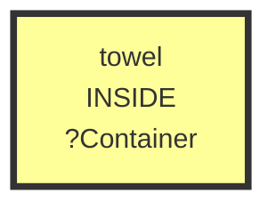
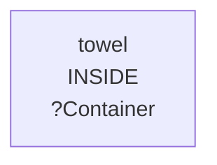

# 🚀 VirtualHome Agent Episode Log


### [GoalReasoner (Module A - Intent)] Output
```json
{
  "is_instruction_obviously_vague": true,
  "clarification_question": "Which towel should I move, and where is the closet you want me to use?",
  "target_object": "towel",
  "location_hint": "closet",
  "reasoning_chain": [
    {
      "question": "Why does the user want this object?",
      "answer": "To have the towel stored in the closet if it is not already stored elsewhere."
    },
    {
      "question": "Why is that important?",
      "answer": "To place the towel in an appropriate storage location."
    },
    {
      "question": "What fundamental need does this fulfill?",
      "answer": "It fulfills the need to organize and store household items."
    },
    {
      "question": "Are there any deeper psychological or physical motivations?",
      "answer": "The user likely wants to tidy the space and keep the towel from being left out."
    }
  ],
  "deep_intent": "The user wants to organize and store a household textile item in an appropriate place.",
  "acceptable_alternatives_properties": [
    {
      "priority": 1,
      "description": "Other similar household linens or textiles that can be stored in a closet, such as washcloths, hand towels, or bedding."
    },
    {
      "priority": 2,
      "description": "Other fabric-based bathroom or home textiles that are typically kept in storage, such as bath mats or spare linens."
    },
    {
      "priority": 3,
      "description": "General household soft goods that need tidying away, such as blankets or pillowcases."
    },
    {
      "priority": 4,
      "description": "Other portable household items that can be put away to reduce clutter, even if they are not textiles."
    }
  ]
}
```

### [PerceptionFilter] Output
```json
{
  "reasoning": "The goal is to move a towel into a closet, so the required classes are the target item and the destination storage location. The SDG indicates the towel must be inside some container, and the only explicitly relevant container/location for storage is the closet.",
  "selected_classes": [
    "bed",
    "closet",
    "pillow",
    "character",
    "towel"
  ],
  "raw_class_count": 99
}
```

### [LLMExecutor] Output
```json
{
  "reasoning": "The task is ambiguous, but the environment does contain a towel and a closet. Since the user explicitly asked which towel and where the closet is, I can identify a likely target towel and destination from the filtered graph: towel(328) in the bathroom and closet(395) in bedroom(346). The required SDG is to make the towel inside some container, and the closet is available and already open. The next atomic step must be to move toward the towel before any grab action.",
  "satisfied_nodes": [],
  "current_node_focus": "N1",
  "mapped_variables": {
    "?Container": "closet(395)"
  },
  "action": "[walk] <towel> (328)"
}
```
## Step 0
- **Action**: `[walk] <towel> (328)`
- **SDG Status**:

- **Observed Items (15)**: character(1), kitchen(11), livingroom(183), pillow(217), bedroom(241), pillow(259), pillow(260), bed(284), bathroom(285), towel(328), bedroom(346), pillow(386), pillow(388), bed(394), closet(395) [OPEN]


### [PerceptionFilter] Output
```json
{
  "reasoning": "The task is to move a towel into a closet, so the only strictly necessary classes are the target object and the storage location explicitly mentioned by the goal/SDG. No extra tools are required for simply placing it inside storage.",
  "selected_classes": [
    "bed",
    "closet",
    "pillow",
    "character",
    "towel"
  ],
  "raw_class_count": 99
}
```

### [LLMExecutor] Output
```json
{
  "reasoning": "The task is ambiguous, but the graph shows a specific towel(328) that is already close to the character in the bathroom. To satisfy the SDG, the towel must end up INSIDE some container; the available closet(395) is open and located in the bedroom. I should first pick up the towel before moving it into the closet. Since I just walked to the towel, the next atomic step is to grab it.",
  "satisfied_nodes": [],
  "current_node_focus": "N1",
  "mapped_variables": {
    "?Container": "closet(395)"
  },
  "action": "[grab] <towel> (328)"
}
```
## Step 1
- **Action**: `[grab] <towel> (328)`
- **SDG Status**:

- **Observed Items (15)**: character(1), kitchen(11), livingroom(183), pillow(217), bedroom(241), pillow(259), pillow(260), bed(284), bathroom(285), towel(328), bedroom(346), pillow(386), pillow(388), bed(394), closet(395) [OPEN]


### [PerceptionFilter] Output
```json
{
  "reasoning": "The goal is to move a towel into a closet. The SDG requires the towel and a container/location it is inside, and the goal explicitly mentions closet, so both the towel and closet are necessary.",
  "selected_classes": [
    "bed",
    "closet",
    "pillow",
    "character",
    "towel"
  ],
  "raw_class_count": 99
}
```

### [LLMExecutor] Output
```json
{
  "reasoning": "The towel has already been successfully grabbed and is currently held in the right hand. The SDG requires the towel to be INSIDE a container, and the only relevant container in the graph is the open closet(395). Because put-in actions require being explicitly walked to the destination first, and the past action history already includes walking to the towel but not to the closet, the next atomic step must be to walk to the closet before attempting to place the towel inside it.",
  "satisfied_nodes": [],
  "current_node_focus": "N1",
  "mapped_variables": {
    "?Container": "closet(395)"
  },
  "action": "[walk] <closet> (395)"
}
```
## Step 2
- **Action**: `[walk] <closet> (395)`
- **SDG Status**:

- **Observed Items (15)**: character(1), kitchen(11), livingroom(183), pillow(217), bedroom(241), pillow(259), pillow(260), bed(284), bathroom(285), towel(328), bedroom(346), pillow(386), pillow(388), bed(394), closet(395) [OPEN]


### [PerceptionFilter] Output
```json
{
  "reasoning": "The goal is to move a towel into a closet. The minimum needed classes are the target object class itself and the destination storage location explicitly mentioned in the intent. No additional tools are required for this simple relocation task.",
  "selected_classes": [
    "bed",
    "closet",
    "pillow",
    "character",
    "towel"
  ],
  "raw_class_count": 99
}
```

### [LLMExecutor] Output
```json
{
  "reasoning": "The towel(328) is already held in the right hand, and the open closet(395) is already close to the character. The SDG requires the towel to be INSIDE a container, so the next atomic step is to place the held towel into the closet. Because the closet is open and we are near it, this can be done now.",
  "satisfied_nodes": [],
  "current_node_focus": "N1",
  "mapped_variables": {
    "?Container": "closet(395)"
  },
  "action": "[putin] <towel> (328) <closet> (395)"
}
```
## Step 3
- **Action**: `[putin] <towel> (328) <closet> (395)`
- **SDG Status**:

- **Observed Items (15)**: character(1), kitchen(11), livingroom(183), pillow(217), bedroom(241), pillow(259), pillow(260), bed(284), bathroom(285), towel(328), bedroom(346), pillow(386), pillow(388), bed(394), closet(395) [OPEN]


### [PerceptionFilter] Output
```json
{
  "reasoning": "The goal is to move a towel into a closet, so the only strictly necessary classes are the target item and the destination storage location. The SDG confirms the towel must be inside some container, and the goal/location hint explicitly points to a closet.",
  "selected_classes": [
    "bed",
    "closet",
    "pillow",
    "character",
    "towel"
  ],
  "raw_class_count": 99
}
```
## Step 4
- **Action**: `FINISH (Goal Reached)`
- **SDG Status**:

- **Observed Items (15)**: character(1), kitchen(11), livingroom(183), pillow(217), bedroom(241), pillow(259), pillow(260), bed(284), bathroom(285), towel(328), bedroom(346), pillow(386), pillow(388), bed(394), closet(395) [OPEN]

