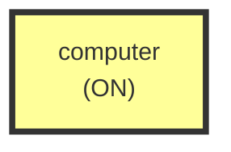
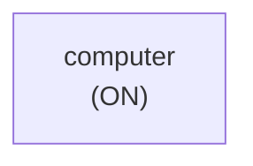

# 🚀 VirtualHome Agent Episode Log


### [GoalReasoner (Module A - Intent)] Output
```json
{
  "is_instruction_obviously_vague": false,
  "clarification_question": null,
  "target_object": "computer",
  "location_hint": null,
  "reasoning_chain": [
    {
      "question": "Why does the user want this object?",
      "answer": "To have the computer powered on and usable."
    },
    {
      "question": "Why is that important?",
      "answer": "Because a computer that stays off cannot be interacted with or used for tasks."
    },
    {
      "question": "What fundamental need does this fulfill?",
      "answer": "It fulfills the need to access and use computing functionality."
    },
    {
      "question": "Are there any deeper psychological or physical motivations?",
      "answer": "The user likely wants to continue work, communication, or another activity that requires the computer to be operational."
    }
  ],
  "deep_intent": "The user wants to enable access to a usable computer.",
  "acceptable_alternatives_properties": [
    {
      "priority": 1,
      "description": "Other powered-on computing devices that can provide similar access, such as a laptop or tablet."
    },
    {
      "priority": 2,
      "description": "Any alternative computer device that is already on and functional."
    },
    {
      "priority": 3,
      "description": "A different household digital device that can support the same task, such as a desktop, laptop, or tablet."
    },
    {
      "priority": 4,
      "description": "A device used for the same work or communication need, if it can substitute for the computer in context."
    }
  ]
}
```

### [PerceptionFilter] Output
```json
{
  "reasoning": "The goal is to have the computer powered on and usable, so the minimum required class is the computer itself. No separate tool or location is required by the SDG beyond the computer being ON, and the request does not imply needing alternative devices or furniture.",
  "selected_classes": [
    "character",
    "desk",
    "computer"
  ],
  "raw_class_count": 99
}
```

### [LLMExecutor] Output
```json
{
  "reasoning": "The goal is to make the computer ON. The filtered graph shows the computer(397) is OFF and located inside bedroom(346). I am currently in bedroom(241) near desk(281), so I cannot switch on the computer from here. The next required step is to walk to the computer first, because proximity is mandatory before operating it.",
  "satisfied_nodes": [],
  "current_node_focus": "N1",
  "mapped_variables": {
    "?Computer": "computer(397)"
  },
  "action": "[walk] <computer> (397)"
}
```
## Step 0
- **Action**: `[walk] <computer> (397)`
- **SDG Status**:

- **Observed Items (9)**: character(1), kitchen(11), livingroom(183), bedroom(241), desk(281) [CLOSED], bathroom(285), bedroom(346), desk(393) [CLOSED], computer(397) [OFF]


### [PerceptionFilter] Output
```json
{
  "reasoning": "The goal is to have the computer powered on and usable, so the only strictly necessary class is the computer itself. The SDG directly requires computer = ON, and the visible list includes computer as an exact match. No other tools or locations are needed for this state goal.",
  "selected_classes": [
    "character",
    "desk",
    "computer"
  ],
  "raw_class_count": 99
}
```

### [LLMExecutor] Output
```json
{
  "reasoning": "The computer(397) is already CLOSE to the character and is the exact target object for the SDG. The required state is ON, and because it has HAS_SWITCH, the next step is to switch it on. No additional walking is needed.",
  "satisfied_nodes": [],
  "current_node_focus": "N1",
  "mapped_variables": {},
  "action": "[switchon] <computer> (397)"
}
```
## Step 1
- **Action**: `[switchon] <computer> (397)`
- **SDG Status**:

- **Observed Items (9)**: character(1), kitchen(11), livingroom(183), bedroom(241), desk(281) [CLOSED], bathroom(285), bedroom(346), desk(393) [CLOSED], computer(397) [OFF]


### [PerceptionFilter] Output
```json
{
  "reasoning": "The goal is to have a computer powered on and usable. The required SDG explicitly specifies the computer must be ON, so the only strictly necessary object class is the computer itself. No tools, locations, or alternative devices are needed for this minimal selection.",
  "selected_classes": [
    "character",
    "desk",
    "computer"
  ],
  "raw_class_count": 99
}
```
## Step 2
- **Action**: `FINISH (Goal Reached)`
- **SDG Status**:

- **Observed Items (9)**: character(1), kitchen(11), livingroom(183), bedroom(241), desk(281) [CLOSED], bathroom(285), bedroom(346), desk(393) [CLOSED], computer(397) [ON]

