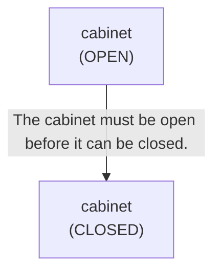

# 🚀 VirtualHome Agent Episode Log


### [GoalReasoner (Module A - Intent)] Output
```json
{
  "is_instruction_obviously_vague": false,
  "clarification_question": null,
  "target_object": "cabinet",
  "location_hint": null,
  "reasoning_chain": [
    {
      "question": "Why does the user want this object?",
      "answer": "To change the cabinet’s state from open to closed if needed."
    },
    {
      "question": "Why is that important?",
      "answer": "A closed cabinet can keep the space tidier, safer, or more organized."
    },
    {
      "question": "What fundamental need does this fulfill?",
      "answer": "The user wants to restore or maintain a desired physical state in the environment."
    },
    {
      "question": "Are there any deeper psychological or physical motivations?",
      "answer": "The user may want order, reduced clutter, or to prevent accidental contact with the cabinet’s contents."
    }
  ],
  "deep_intent": "The user wants to ensure a cabinet is in a closed state.",
  "acceptable_alternatives_properties": [
    {
      "priority": 1,
      "description": "Other similar storage furniture or compartments that can be closed, such as a drawer, closet, or cupboard door."
    },
    {
      "priority": 2,
      "description": "Any household opening that can be shut to restore a closed state, such as a lid or hatch."
    },
    {
      "priority": 3,
      "description": "Other container-like objects in the home that can be secured or covered to maintain order."
    },
    {
      "priority": 4,
      "description": "Different storage closures that achieve the same goal of enclosing items and reducing exposure."
    }
  ]
}
```

### [PerceptionFilter] Output
```json
{
  "reasoning": "The goal is to close a cabinet, so the only strictly needed class is the cabinet itself. No tools or alternative closures are required by the SDG beyond the target object and its open/closed state change.",
  "selected_classes": [
    "door",
    "character",
    "closet",
    "cabinet"
  ],
  "raw_class_count": 99
}
```
## Step 0
- **Action**: `FINISH (Goal Reached)`
- **SDG Status**:

- **Observed Items (11)**: character(1), kitchen(11), door(47) [OPEN], livingroom(183), bedroom(241), door(254) [OPEN], bathroom(285), door(305) [OPEN], bedroom(346), closet(395) [CLOSED], cabinet(396) [CLOSED]

