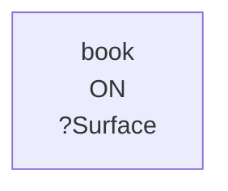

# 🚀 VirtualHome Agent Episode Log


### [GoalReasoner (Module A - Intent)] Output
```json
{
  "is_instruction_obviously_vague": true,
  "clarification_question": "What exactly should I put back, and where should I put it back?",
  "target_object": "book",
  "location_hint": null,
  "reasoning_chain": [
    {
      "question": "Why does the user want this object?",
      "answer": "To restore it to its proper place after someone has finished reading it."
    },
    {
      "question": "Why is that important?",
      "answer": "To keep the area tidy and make the item available where it belongs."
    },
    {
      "question": "What fundamental need does this fulfill?",
      "answer": "It fulfills the need to maintain order in the environment."
    },
    {
      "question": "Are there any deeper psychological or physical motivations?",
      "answer": "It may reduce clutter, prevent misplacement, and support an organized shared space."
    }
  ],
  "deep_intent": "The user wants to restore order by returning an item to its proper place.",
  "acceptable_alternatives_properties": [
    {
      "priority": 1,
      "description": "Other loose items that have been used and should be returned to their storage spot, such as magazines, notebooks, or documents"
    },
    {
      "priority": 2,
      "description": "Other reading materials or paper items that belong on a shelf or table"
    },
    {
      "priority": 3,
      "description": "Common household items that should be put away after use to reduce clutter"
    },
    {
      "priority": 4,
      "description": "Any portable item whose purpose is to be returned to its designated place after use"
    }
  ]
}
```

### [PerceptionFilter] Output
```json
{
  "reasoning": "The goal is to put back the book, and the SDG says it is currently on some surface. To achieve this, we only need the target object class and possible place-like storage/surface classes that could be its proper resting location; since the exact destination is unspecified, keep the shelf/storage options most relevant to putting a book away.",
  "selected_classes": [
    "wallshelf",
    "cabinet",
    "character",
    "book",
    "desk",
    "bookshelf",
    "coffeetable",
    "table"
  ],
  "raw_class_count": 99
}
```
## Step 0
- **Action**: `FINISH (Goal Reached)`
- **SDG Status**:

- **Observed Items (21)**: character(1), kitchen(11), book(105) [CLOSED], bookshelf(158), bookshelf(159), livingroom(183), wallshelf(209), bookshelf(210), bookshelf(211), wallshelf(212), wallshelf(213), coffeetable(215), bedroom(241), bookshelf(280), desk(281) [CLOSED]...

