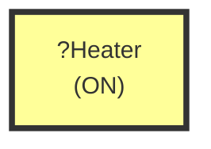
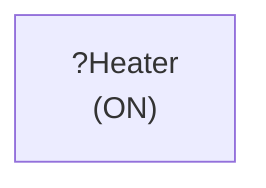

# 🚀 VirtualHome Agent Episode Log


### [GoalReasoner (Module A - Intent)] Output
```json
{
  "is_instruction_obviously_vague": false,
  "clarification_question": null,
  "target_object": "stove",
  "location_hint": null,
  "reasoning_chain": [
    {
      "question": "Why does the user want this object?",
      "answer": "To have the stove turned on for preheating."
    },
    {
      "question": "Why is that important?",
      "answer": "Preheating prepares the cooking appliance for use at the desired temperature."
    },
    {
      "question": "What fundamental need does this fulfill?",
      "answer": "It supports meal preparation and cooking readiness."
    },
    {
      "question": "Are there any deeper psychological or physical motivations?",
      "answer": "The user likely wants to reduce waiting time and ensure the appliance is ready for cooking."
    }
  ],
  "deep_intent": "The user wants to prepare a cooking appliance so it is ready for cooking.",
  "acceptable_alternatives_properties": [
    {
      "priority": 1,
      "description": "Any available cooking appliance that can be preheated and is suitable for the intended cooking task, such as an oven or toaster oven."
    },
    {
      "priority": 2,
      "description": "A similar heat-generating kitchen appliance that can be brought to cooking temperature, if the stove is unavailable."
    },
    {
      "priority": 3,
      "description": "Another appliance or setup that can warm up for food preparation, such as a hot plate or countertop cooker."
    },
    {
      "priority": 4,
      "description": "Any indoor cooking method that achieves a comparable ready-to-cook heat state, even if it is a different device."
    }
  ]
}
```

### [PerceptionFilter] Output
```json
{
  "reasoning": "The goal is to have a cooking appliance turned on for preheating, so we need the exact target appliance and any alternative heat-based cooking appliances that can serve the same function if the stove is unavailable. The SDG only requires an ON heater state, so no extra tools or containers are needed.",
  "selected_classes": [
    "toaster",
    "hotplate",
    "door",
    "plate",
    "oven",
    "stove",
    "microwave",
    "character"
  ],
  "raw_class_count": 99
}
```

### [LLMExecutor] Output
```json
{
  "reasoning": "The SDG requires ?Heater to be ON. The filtered graph shows a stove(163) in the kitchen with states OFF and CLOSED, and it is the best match for the heater variable. Because I cannot switch on the stove from across the room, the next atomic step must be to walk to the stove first. Opening is not required just to satisfy ON, and the stove is a valid hardwired cooking appliance.",
  "satisfied_nodes": [],
  "current_node_focus": "N1",
  "mapped_variables": {
    "?Heater": "stove(163)"
  },
  "action": "[walk] <stove> (163)"
}
```
## Step 0
- **Action**: `[walk] <stove> (163)`
- **SDG Status**:

- **Observed Items (26)**: character(1), kitchen(11), door(47) [OPEN], plate(67), plate(68), plate(75), plate(76), plate(83), plate(84), plate(91), plate(103), plate(104), stove(163) [OFF,CLOSED], toaster(166) [OFF], microwave(171) [CLOSED,OFF]...


### [PerceptionFilter] Output
```json
{
  "reasoning": "The goal is to turn on a cooking appliance for preheating, so we only need the appliance classes that can serve as the heater. I included the exact target class stove plus alternative preheatable cooking appliances and similar heat sources available in the scene, since backups must be retained.",
  "selected_classes": [
    "toaster",
    "hotplate",
    "door",
    "plate",
    "oven",
    "stove",
    "microwave",
    "character",
    "coffeemaker"
  ],
  "raw_class_count": 99
}
```

### [LLMExecutor] Output
```json
{
  "reasoning": "The goal is to satisfy N1: the heater must be ON. We are already close to the best-matched heater, stove(163), and the stove is currently OFF. Since switching on an appliance requires proximity and no other preconditions are indicated for the stove (it is hardwired, so no plug action is needed), the next step is to switch it on.",
  "satisfied_nodes": [],
  "current_node_focus": "N1",
  "mapped_variables": {
    "?Heater": "stove(163)"
  },
  "action": "[switchon] <stove> (163)"
}
```
## Step 1
- **Action**: `[switchon] <stove> (163)`
- **SDG Status**:

- **Observed Items (27)**: character(1), kitchen(11), door(47) [OPEN], plate(67), plate(68), plate(75), plate(76), plate(83), plate(84), plate(91), plate(103), plate(104), stove(163) [OFF,CLOSED], toaster(166) [OFF], coffeemaker(169) [OFF]...


### [PerceptionFilter] Output
```json
{
  "reasoning": "The goal is to turn on a cooking appliance for preheating. The SDG requires a heater state of ON, so I must keep cooking/heating appliances that can satisfy this, including backups and alternatives. The exact target object stove must be included, and related preheatable kitchen appliances are retained as functional alternatives.",
  "selected_classes": [
    "toaster",
    "hotplate",
    "door",
    "plate",
    "oven",
    "stove",
    "microwave",
    "character"
  ],
  "raw_class_count": 99
}
```
## Step 2
- **Action**: `FINISH (Goal Reached)`
- **SDG Status**:

- **Observed Items (26)**: character(1), kitchen(11), door(47) [OPEN], plate(67), plate(68), plate(75), plate(76), plate(83), plate(84), plate(91), plate(103), plate(104), stove(163) [CLOSED,ON], toaster(166) [OFF], microwave(171) [CLOSED,OFF]...

