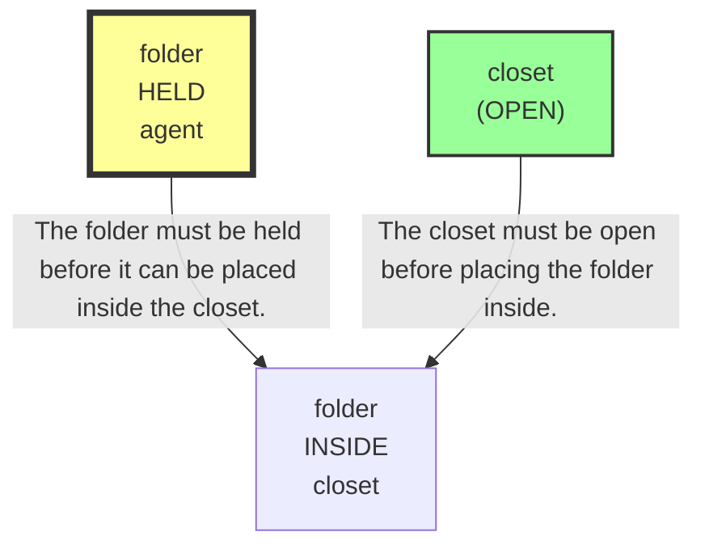
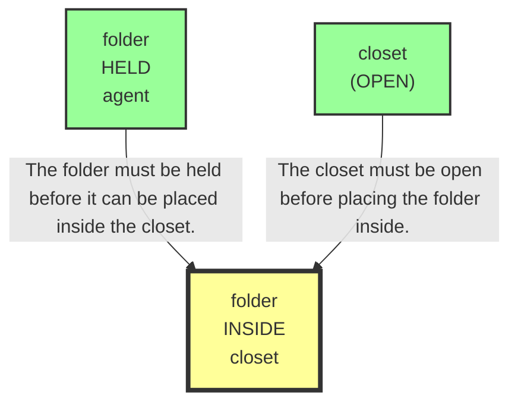
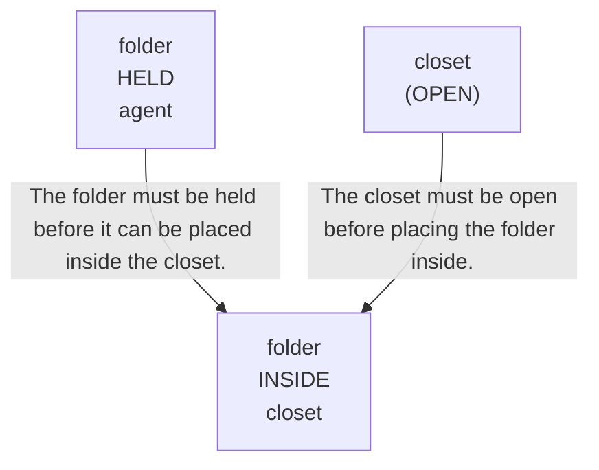

# 🚀 VirtualHome Agent Episode Log


### [GoalReasoner (Module A - Intent)] Output
```json
{
  "is_instruction_obviously_vague": false,
  "clarification_question": null,
  "target_object": "folder",
  "location_hint": "closet",
  "reasoning_chain": [
    {
      "question": "Why does the user want this object?",
      "answer": "They want the folder placed away in a storage location."
    },
    {
      "question": "Why is that important?",
      "answer": "It likely helps organize the space and keep the folder out of the way."
    },
    {
      "question": "What fundamental need does this fulfill?",
      "answer": "It fulfills the need to store or organize an item."
    },
    {
      "question": "Are there any deeper psychological or physical motivations?",
      "answer": "It may reduce clutter, protect the folder, or make the room tidier and easier to use."
    }
  ],
  "deep_intent": "The user wants to organize or store an item out of the way.",
  "acceptable_alternatives_properties": [
    {
      "priority": 1,
      "description": "Other paper storage items or document holders that can be placed in the closet, such as a binder, stack of papers, or document box"
    },
    {
      "priority": 2,
      "description": "Other small office or paper-related items that can be stored similarly, such as notebooks or files"
    },
    {
      "priority": 3,
      "description": "General household items that help reduce clutter by being stored in a closet"
    },
    {
      "priority": 4,
      "description": "Any safe, portable item that can be put away to improve organization"
    }
  ]
}
```

### [PerceptionFilter] Output
```json
{
  "reasoning": "The goal is to store the folder away in the closet. The SDG requires the folder and the closet, and the closet must be open before placing the folder inside. No other tools or receptacles are needed.",
  "selected_classes": [
    "box",
    "closet",
    "folder",
    "book",
    "character"
  ],
  "raw_class_count": 99
}
```

### [LLMExecutor] Output
```json
{
  "reasoning": "The SDG requires the folder to be held and then placed inside the closet. The closet(395) is already OPEN, so N2 is satisfied. The folder target is folder(121), which is present in the environment but currently inside bedroom(241), while the agent is in bedroom(241) as well? The graph shows character(1) INSIDE bedroom(241) and folder(121) INSIDE bedroom(241), so the agent is already co-located with the folder. Therefore the next required progress is to grab the folder before it can be put inside the open closet.",
  "satisfied_nodes": [
    "N2"
  ],
  "current_node_focus": "N3",
  "mapped_variables": {
    "?Container": "closet(395)"
  },
  "action": "[grab] <folder> (121)"
}
```
## Step 0
- **Action**: `[grab] <folder> (121)`
- **SDG Status**:

- **Observed Items (31)**: character(1), kitchen(11), book(105) [CLOSED], book(106) [CLOSED], book(107) [CLOSED], book(108) [CLOSED], book(109) [CLOSED], book(110) [CLOSED], box(114) [CLOSED], folder(121) [CLOSED], livingroom(183), book(224) [CLOSED], book(229) [CLOSED], book(230) [CLOSED], box(231) [CLOSED]...


### [PerceptionFilter] Output
```json
{
  "reasoning": "The goal is to store the folder in the closet, so the only necessary classes are the target item and the required location/furniture. The closet must be included because it is explicitly mentioned and must be open to place the folder inside.",
  "selected_classes": [
    "box",
    "closet",
    "folder",
    "book",
    "character"
  ],
  "raw_class_count": 99
}
```

### [LLMExecutor] Output
```json
{
  "reasoning": "The folder is already held in the agent's right hand, satisfying N3. The closet relevant to the task is closet(395), which is OPEN, satisfying N2. To complete N1, the next required step is to move to the closet before putting the folder inside it. I should not repeat a grab or any other action because the remaining gap is proximity to the destination container.",
  "satisfied_nodes": [
    "N2",
    "N3"
  ],
  "current_node_focus": "N1",
  "mapped_variables": {
    "?Container": "closet(395)"
  },
  "action": "[walk] <closet> (395)"
}
```
## Step 1
- **Action**: `[walk] <closet> (395)`
- **SDG Status**:

- **Observed Items (31)**: character(1), kitchen(11), book(105) [CLOSED], book(106) [CLOSED], book(107) [CLOSED], book(108) [CLOSED], book(109) [CLOSED], book(110) [CLOSED], box(114) [CLOSED], folder(121) [CLOSED], livingroom(183), book(224) [CLOSED], book(229) [CLOSED], book(230) [CLOSED], box(231) [CLOSED]...


### [PerceptionFilter] Output
```json
{
  "reasoning": "The goal is to store the folder in the closet, so the essential objects are the target item and the storage location. The closet must be open to place the folder inside, and the folder must be present to move it.",
  "selected_classes": [
    "box",
    "closet",
    "folder",
    "book",
    "character"
  ],
  "raw_class_count": 99
}
```

### [LLMExecutor] Output
```json
{
  "reasoning": "The folder is already held in the right hand, satisfying N3. The closet(395) is open and the agent is already close to it, so N2 is satisfied and proximity is satisfied. The remaining unmet requirement is to place the held folder inside the open closet, which is the direct next step toward N1.",
  "satisfied_nodes": [
    "N2",
    "N3"
  ],
  "current_node_focus": "N1",
  "mapped_variables": {
    "?Container": "closet(395)"
  },
  "action": "[putin] <folder> (121) <closet> (395)"
}
```
## Step 2
- **Action**: `[putin] <folder> (121) <closet> (395)`
- **SDG Status**:

- **Observed Items (31)**: character(1), kitchen(11), book(105) [CLOSED], book(106) [CLOSED], book(107) [CLOSED], book(108) [CLOSED], book(109) [CLOSED], book(110) [CLOSED], box(114) [CLOSED], folder(121) [CLOSED], livingroom(183), book(224) [CLOSED], book(229) [CLOSED], book(230) [CLOSED], box(231) [CLOSED]...


### [PerceptionFilter] Output
```json
{
  "reasoning": "The goal is to store the folder inside the closet, so the necessary classes are the target object folder and the location closet. The SDG also requires the closet to be open before placing the folder inside, so closet must be retained as the relevant receptacle/location.",
  "selected_classes": [
    "box",
    "closet",
    "folder",
    "book",
    "character"
  ],
  "raw_class_count": 99
}
```
## Step 3
- **Action**: `FINISH (Goal Reached)`
- **SDG Status**:

- **Observed Items (31)**: character(1), kitchen(11), book(105) [CLOSED], book(106) [CLOSED], book(107) [CLOSED], book(108) [CLOSED], book(109) [CLOSED], book(110) [CLOSED], box(114) [CLOSED], folder(121) [CLOSED], livingroom(183), book(224) [CLOSED], book(229) [CLOSED], book(230) [CLOSED], box(231) [CLOSED]...

