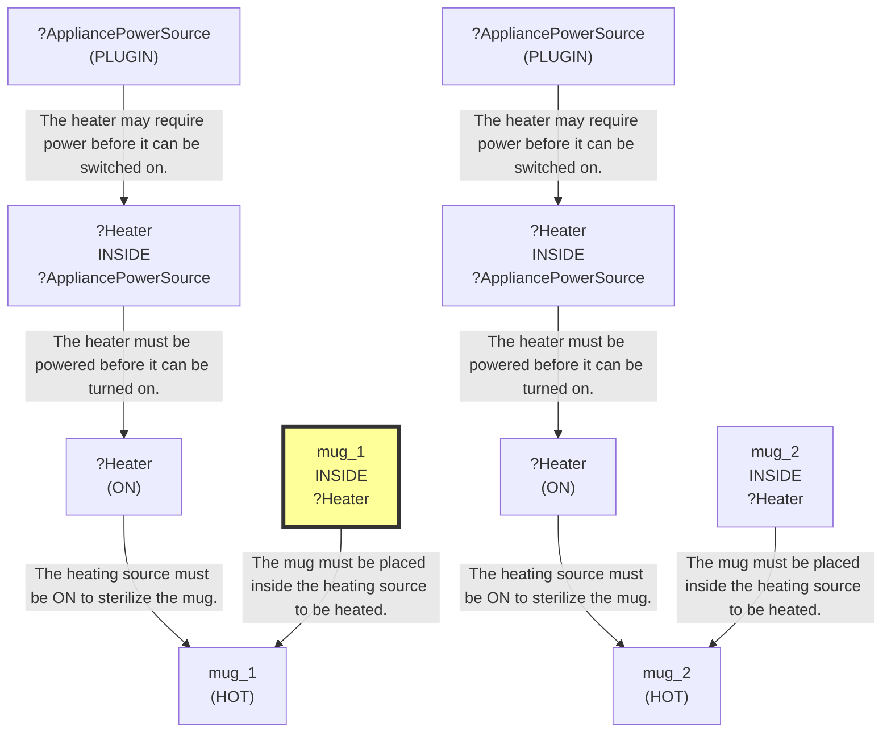
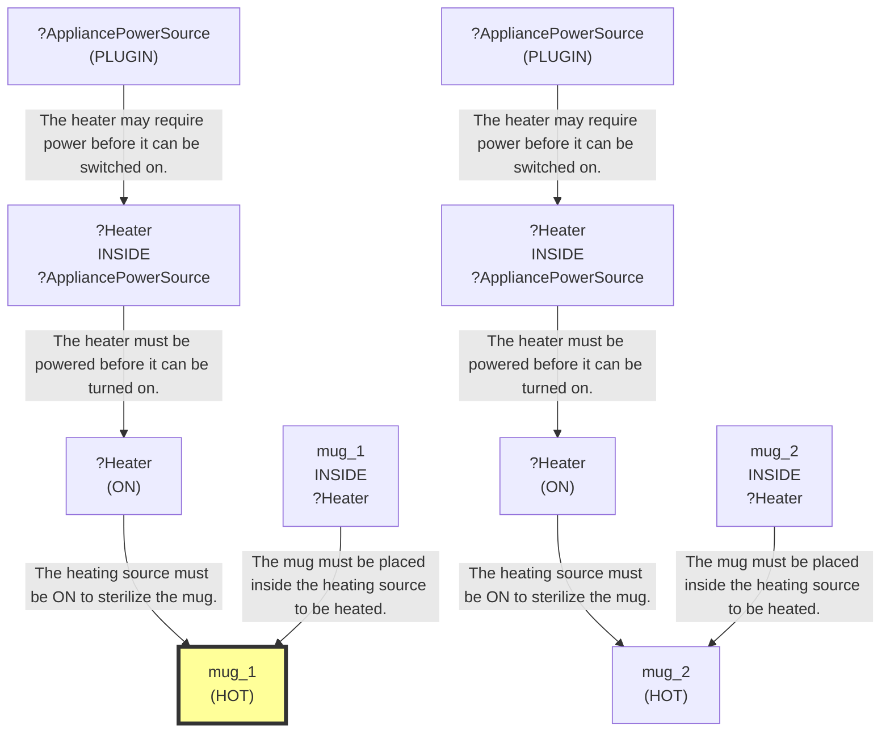
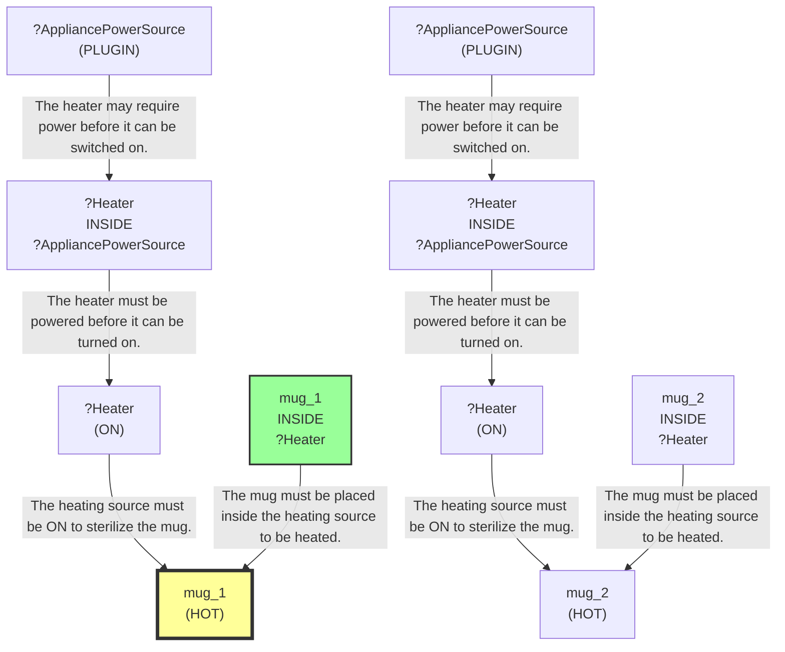
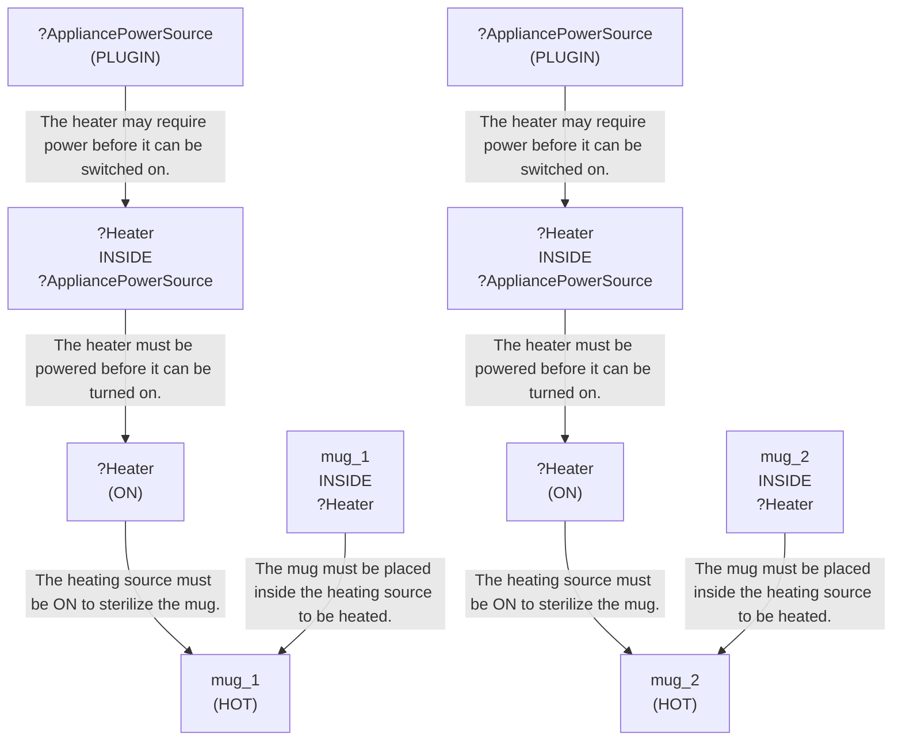

# 🚀 VirtualHome Agent Episode Log


### [GoalReasoner (Module A - Intent)] Output
```json
{
  "is_instruction_obviously_vague": false,
  "clarification_question": null,
  "target_object": "mug",
  "location_hint": null,
  "reasoning_chain": [
    {
      "question": "Why does the user want this object?",
      "answer": "To have the visible mugs heated in the microwave."
    },
    {
      "question": "Why is that important?",
      "answer": "To sterilize the mugs."
    },
    {
      "question": "What fundamental need does this fulfill?",
      "answer": "The user wants to reduce germs and make the mugs hygienic for use."
    },
    {
      "question": "Are there any deeper psychological or physical motivations?",
      "answer": "The user likely wants cleanliness, safety, or sanitation before drinking from them."
    }
  ],
  "deep_intent": "The user wants to sanitize drinking containers.",
  "acceptable_alternatives_properties": [
    {
      "priority": 1,
      "description": "Other microwave-safe drinking containers that can be sanitized, such as cups or small bowls."
    },
    {
      "priority": 2,
      "description": "Other washable kitchenware made from similar materials that can be cleaned and sanitized, such as glasses or ceramic cups."
    },
    {
      "priority": 3,
      "description": "Any nearby microwave-safe items that are safe to heat for sanitation purposes."
    },
    {
      "priority": 4,
      "description": "Other household items that can be disinfected by washing or heat sanitation if microwaving is not suitable."
    }
  ]
}
```

### [PerceptionFilter] Output
```json
{
  "reasoning": "The goal is to sanitize mug(s) by heating them. The SDG requires the target mug class and a heater appliance that can be powered on, plus the power source. From the visible objects, the minimal matching heater is microwave, and it needs a powersocket. Since the intent and acceptable alternatives mention drinking containers, waterglass is also a relevant target alternative class to retain alongside mug.",
  "selected_classes": [
    "powersocket",
    "microwave",
    "character",
    "mug",
    "waterglass"
  ],
  "raw_class_count": 99
}
```

### [LLMExecutor] Output
```json
{
  "reasoning": "The goal requires heating mug_1 (mug 384) in the microwave. The mug is already close to the character in the kitchen, but to interact with it I must first explicitly walk to it. The microwave is available in the kitchen and is the best match for ?Heater, but the immediate missing prerequisite is proximity to the mug before I can grab it.",
  "satisfied_nodes": [],
  "current_node_focus": "N2",
  "mapped_variables": {
    "?Heater": "microwave(171)",
    "?AppliancePowerSource": "powersocket(57)"
  },
  "action": "[walk] <mug> (384)"
}
```
## Step 0
- **Action**: `[walk] <mug> (384)`
- **SDG Status**:

- **Observed Items (20)**: character(1), kitchen(11), powersocket(57), waterglass(64), waterglass(71), waterglass(72), waterglass(79), waterglass(80), waterglass(87), waterglass(88), waterglass(100), microwave(171) [CLOSED,OFF], livingroom(183), powersocket(240), bedroom(241)...


### [PerceptionFilter] Output
```json
{
  "reasoning": "The goal is to sanitize the visible mugs by heating them in a microwave. The minimum needed classes are the target mugs and the heating appliance. Since the heater must be powered, the power source is also required. No other objects are necessary.",
  "selected_classes": [
    "powersocket",
    "microwave",
    "character",
    "mug"
  ],
  "raw_class_count": 99
}
```

### [LLMExecutor] Output
```json
{
  "reasoning": "The mug required by the SDG is mug(384), and the current graph shows it is CLOSE to the character in the kitchen, so the next prerequisite is to pick it up. The microwave is the best match for ?Heater, but I cannot place the mug inside or operate the microwave until I hold the mug. No object is dirty, and no power or opening actions are needed before grabbing the mug.",
  "satisfied_nodes": [],
  "current_node_focus": "N1",
  "mapped_variables": {},
  "action": "[grab] <mug> (384)"
}
```
## Step 1
- **Action**: `[grab] <mug> (384)`
- **SDG Status**:

- **Observed Items (11)**: character(1), kitchen(11), powersocket(57), microwave(171) [CLOSED,OFF], livingroom(183), powersocket(240), bedroom(241), powersocket(279), bathroom(285), bedroom(346), mug(384)


### [PerceptionFilter] Output
```json
{
  "reasoning": "The goal is to sanitize the visible mugs by heating them in a microwave. The minimum needed items are the target mugs plus the heating appliance and its power source. Since the SDG requires a heater that is on and plugged in, the microwave and powersocket are necessary. I also keep the alternative heating appliances that could serve the same function if needed, but only if they are functional backups for heating/sanitation: microwave is the primary heater, and stove is a valid backup heat source in the environment.",
  "selected_classes": [
    "powersocket",
    "microwave",
    "stove",
    "character",
    "mug"
  ],
  "raw_class_count": 99
}
```

### [LLMExecutor] Output
```json
{
  "reasoning": "The target mug is already in hand, and the best match for ?Heater is the microwave(171). To progress toward heating the mug, I should move to the microwave before I can open it and place the mug inside. The microwave is closed and off, but those can only be addressed after I am near it.",
  "satisfied_nodes": [],
  "current_node_focus": "N2",
  "mapped_variables": {
    "?Heater": "microwave(171)",
    "?AppliancePowerSource": "powersocket(57)"
  },
  "action": "[walk] <microwave> (171)"
}
```
## Step 2
- **Action**: `[walk] <microwave> (171)`
- **SDG Status**:

- **Observed Items (12)**: character(1), kitchen(11), powersocket(57), stove(163) [OFF,CLOSED], microwave(171) [CLOSED,OFF], livingroom(183), powersocket(240), bedroom(241), powersocket(279), bathroom(285), bedroom(346), mug(384)


### [PerceptionFilter] Output
```json
{
  "reasoning": "The goal is to sanitize visible mugs by heating them. The SDG requires the target mugs plus a heater that can be powered on. From the visible objects, the relevant heating appliance is the microwave, and it may need a powersocket to be plugged in. Since the user wants mugs sanitized, keep the exact target class mug, plus the heating tool and power source.",
  "selected_classes": [
    "powersocket",
    "microwave",
    "character",
    "mug"
  ],
  "raw_class_count": 99
}
```

### [LLMExecutor] Output
```json
{
  "reasoning": "The mug(384) is already in hand, and the character is already close to the microwave(171). The next prerequisite toward making the mug hot is to open the microwave so the mug can later be placed inside. The microwave is the correct heater and it has CAN_OPEN and HAS_SWITCH, so opening it is valid. This is the single next atomic step; I should not repeat walking because proximity is already satisfied.",
  "satisfied_nodes": [],
  "current_node_focus": "N2",
  "mapped_variables": {
    "?Heater": "microwave(171)",
    "?AppliancePowerSource": "microwave(171)"
  },
  "action": "[open] <microwave> (171)"
}
```
## Step 3
- **Action**: `[open] <microwave> (171)`
- **SDG Status**:

- **Observed Items (11)**: character(1), kitchen(11), powersocket(57), microwave(171) [CLOSED,OFF], livingroom(183), powersocket(240), bedroom(241), powersocket(279), bathroom(285), bedroom(346), mug(384)


### [PerceptionFilter] Output
```json
{
  "reasoning": "The goal is to sanitize mugs by heating them in a microwave. The minimum needed are the target mugs plus the heating appliance and its power source. The SDG explicitly requires a heater that is on and plugged in, and the visible list includes a microwave and powersocket. Since alternatives must be retained, the microwave heating alternative is included; no extra irrelevant objects are needed.",
  "selected_classes": [
    "powersocket",
    "microwave",
    "character",
    "mug"
  ],
  "raw_class_count": 99
}
```

### [LLMExecutor] Output
```json
{
  "reasoning": "The mug(384) is already held, and the microwave(171) is already open and nearby. The remaining prerequisite to heat the mug is to place it inside the microwave. Because putin requires the target container to be open and explicit proximity is already satisfied, the next atomic action should be to insert the mug into the microwave. The microwave is the correct ?Heater and is already open, so this directly advances toward mug_1 becoming HOT.",
  "satisfied_nodes": [
    "N2"
  ],
  "current_node_focus": "N1",
  "mapped_variables": {
    "?Heater": "microwave(171)"
  },
  "action": "[putin] <mug> (384) <microwave> (171)"
}
```
## Step 4
- **Action**: `[putin] <mug> (384) <microwave> (171)`
- **SDG Status**:

- **Observed Items (11)**: character(1), kitchen(11), powersocket(57), microwave(171) [OPEN,OFF], livingroom(183), powersocket(240), bedroom(241), powersocket(279), bathroom(285), bedroom(346), mug(384)


### [PerceptionFilter] Output
```json
{
  "reasoning": "The goal is to sanitize the visible mugs by heating them. The SDG requires the target mug class and a heating appliance that can be powered on, plus a power source. To keep functional backups, I should retain all plausible heating appliances present that could serve as the heater (microwave, stove, coffeemaker, toaster, washingmachine is not a heater and can be excluded). The exact target object class mug must be included, along with the power outlet needed to operate appliances.",
  "selected_classes": [
    "powersocket",
    "microwave",
    "stove",
    "character",
    "mug",
    "coffeemaker"
  ],
  "raw_class_count": 99
}
```
## Step 5
- **Action**: `FINISH (Goal Reached)`
- **SDG Status**:

- **Observed Items (13)**: character(1), kitchen(11), powersocket(57), stove(163) [OFF,CLOSED], coffeemaker(169) [OFF], microwave(171) [OPEN,OFF], livingroom(183), powersocket(240), bedroom(241), powersocket(279), bathroom(285), bedroom(346), mug(384)

