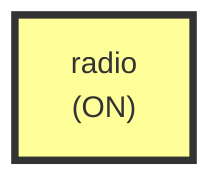
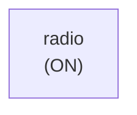

# 🚀 VirtualHome Agent Episode Log


### [GoalReasoner (Module A - Intent)] Output
```json
{
  "is_instruction_obviously_vague": false,
  "clarification_question": null,
  "target_object": "radio",
  "location_hint": null,
  "reasoning_chain": [
    {
      "question": "Why does the user want this object?",
      "answer": "To have the radio powered on if it is currently off."
    },
    {
      "question": "Why is that important?",
      "answer": "So the radio can produce sound or be available for use."
    },
    {
      "question": "What fundamental need does this fulfill?",
      "answer": "The user wants to enable access to audio output or listening."
    },
    {
      "question": "Are there any deeper psychological or physical motivations?",
      "answer": "The user may want entertainment, information, or background audio."
    }
  ],
  "deep_intent": "The user wants to enable audio playback or access to sound.",
  "acceptable_alternatives_properties": [
    {
      "priority": 1,
      "description": "Other indoor audio devices that can be turned on and used for listening, such as a speaker or stereo."
    },
    {
      "priority": 2,
      "description": "Other household devices that provide audio output, such as a television or smart display."
    },
    {
      "priority": 3,
      "description": "Any available media device that can produce sound for entertainment or information."
    },
    {
      "priority": 4,
      "description": "A different source of audio content, such as a phone or tablet, if the goal is simply to hear something."
    }
  ]
}
```

### [PerceptionFilter] Output
```json
{
  "reasoning": "To achieve the goal, the only strictly necessary class is the radio itself, since the SDG requires the radio to be ON. No additional tools or locations are needed for this state change from the provided information.",
  "selected_classes": [
    "character",
    "door",
    "radio"
  ],
  "raw_class_count": 99
}
```

### [LLMExecutor] Output
```json
{
  "reasoning": "The only SDG node requires the radio to be ON, and the current graph shows radio(403) is OFF in bedroom(346). To switch it on, I must first be near the radio. The next atomic step is to walk to the radio.",
  "satisfied_nodes": [],
  "current_node_focus": "N1",
  "mapped_variables": {},
  "action": "[walk] <radio> (403)"
}
```
## Step 0
- **Action**: `[walk] <radio> (403)`
- **SDG Status**:

- **Observed Items (10)**: character(1), kitchen(11), door(47) [OPEN], livingroom(183), bedroom(241), door(254) [OPEN], bathroom(285), door(305) [OPEN], bedroom(346), radio(403) [OFF]


### [PerceptionFilter] Output
```json
{
  "reasoning": "The goal is to turn the radio ON, so the only strictly necessary class is the radio itself. No alternative audio devices are required because the SDG specifically targets the radio state.",
  "selected_classes": [
    "character",
    "door",
    "radio"
  ],
  "raw_class_count": 99
}
```

### [LLMExecutor] Output
```json
{
  "reasoning": "The radio is already nearby (CLOSE to character) and the only missing SDG state is ON. Since it has HAS_SWITCH and is not currently ON, the next atomic step is to switch it on. No plug-in action is required before switching because the prompt does not indicate it is unplugged or that switching is blocked, and the goal is simply to power it on.",
  "satisfied_nodes": [],
  "current_node_focus": "N1",
  "mapped_variables": {},
  "action": "[switchon] <radio> (403)"
}
```
## Step 1
- **Action**: `[switchon] <radio> (403)`
- **SDG Status**:

- **Observed Items (10)**: character(1), kitchen(11), door(47) [OPEN], livingroom(183), bedroom(241), door(254) [OPEN], bathroom(285), door(305) [OPEN], bedroom(346), radio(403) [OFF]


### [PerceptionFilter] Output
```json
{
  "reasoning": "The goal is to turn the radio ON, so the only strictly necessary class is the radio itself. No extra tools or locations are required by the SDG or intent.",
  "selected_classes": [
    "character",
    "door",
    "radio"
  ],
  "raw_class_count": 99
}
```
## Step 2
- **Action**: `FINISH (Goal Reached)`
- **SDG Status**:

- **Observed Items (10)**: character(1), kitchen(11), door(47) [OPEN], livingroom(183), bedroom(241), door(254) [OPEN], bathroom(285), door(305) [OPEN], bedroom(346), radio(403) [ON]

