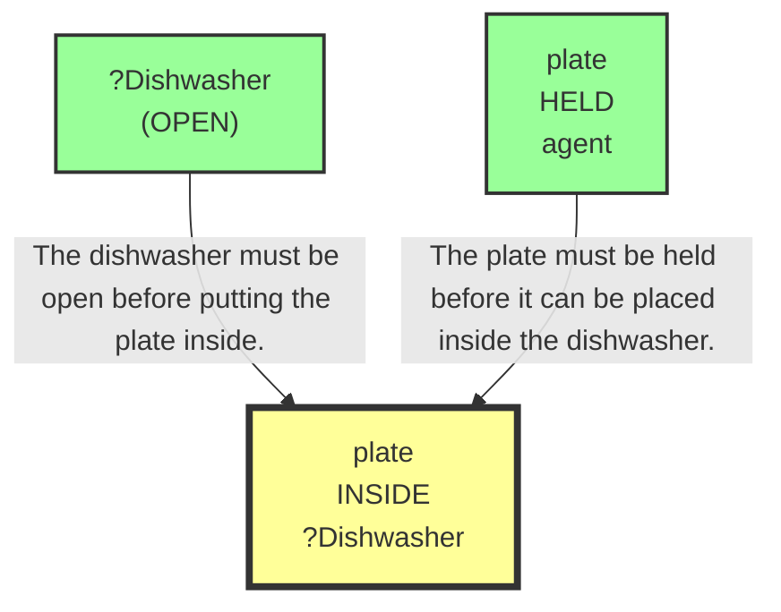
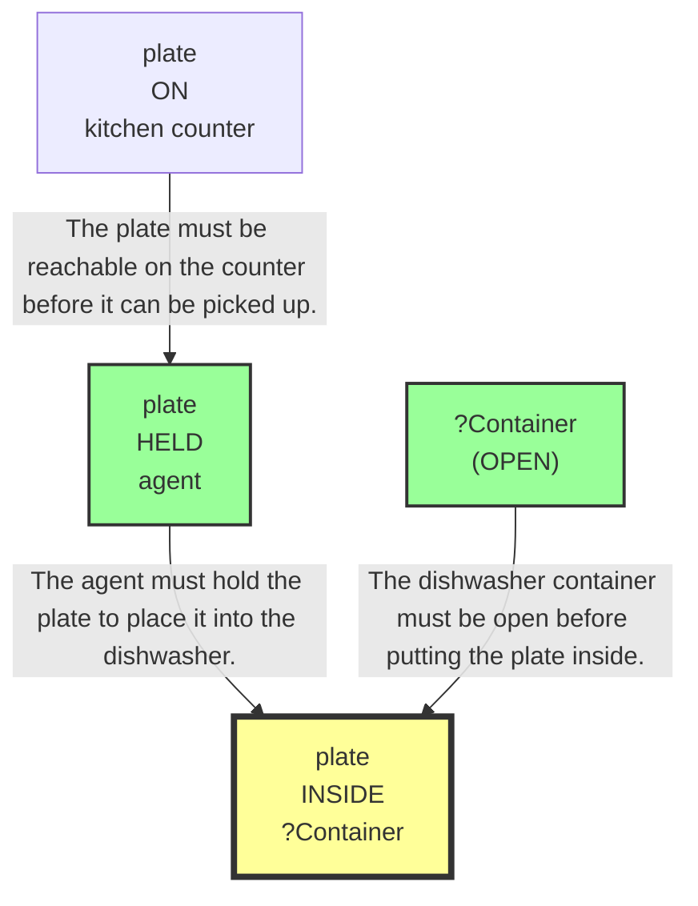
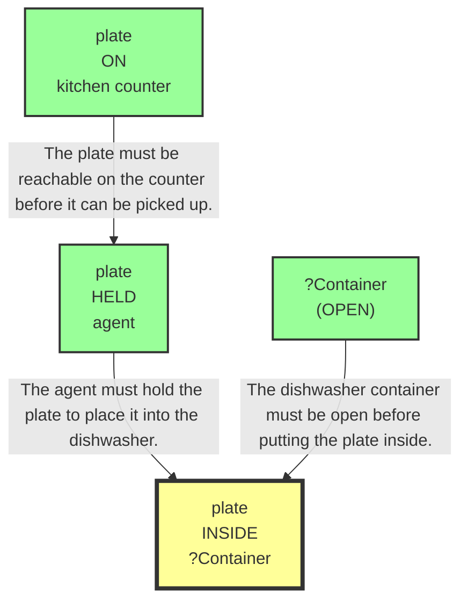
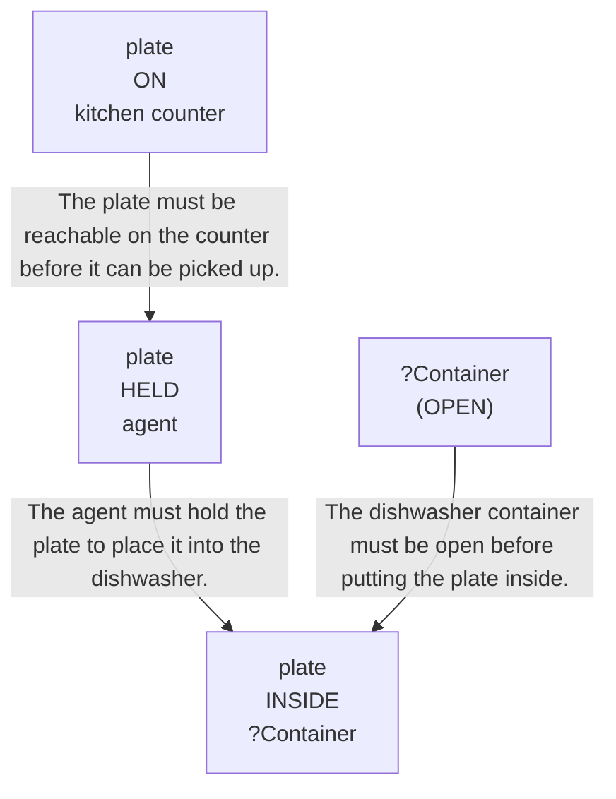

# 🚀 VirtualHome Agent Episode Log


### [GoalReasoner (Module A - Intent)] Output
```json
{
  "is_instruction_obviously_vague": true,
  "clarification_question": "Which specific plate are you referring to, and where is it currently left?",
  "target_object": "plate",
  "location_hint": null,
  "reasoning_chain": [
    {
      "question": "Why does the user want this object?",
      "answer": "To have the plate returned to the dishwasher after it was used for washing dishes and left somewhere."
    },
    {
      "question": "Why is that important?",
      "answer": "To keep the kitchen organized and ensure the plate is placed in the correct cleaning/storage location."
    },
    {
      "question": "What fundamental need does this fulfill?",
      "answer": "It helps maintain cleanliness and order in the household."
    },
    {
      "question": "Are there any deeper psychological or physical motivations?",
      "answer": "It may reduce clutter, prevent items from being misplaced, and support efficient dish handling."
    }
  ],
  "deep_intent": "The user wants to restore order by placing a used dish item into its proper cleaning appliance location.",
  "acceptable_alternatives_properties": [
    {
      "priority": 1,
      "description": "Other used dishware items that belong in the dishwasher, such as bowls, cups, or utensils."
    },
    {
      "priority": 2,
      "description": "Other kitchenware that should be collected and loaded into the dishwasher after use."
    },
    {
      "priority": 3,
      "description": "Similar dirty dining items that need to be gathered from where they were left and moved to the dishwasher."
    },
    {
      "priority": 4,
      "description": "Other household items that need to be returned to their proper storage or cleaning location to reduce clutter."
    }
  ]
}
```

### [PerceptionFilter] Output
```json
{
  "reasoning": "The goal is to place the plate into the dishwasher, so the only needed classes are the target object and the cleaning appliance required by the SDG. The dishwasher must also be open before loading the plate, but 'open' is a state, not an object class.",
  "selected_classes": [
    "dishwasher",
    "character",
    "plate"
  ],
  "raw_class_count": 99
}
```

### [LLMExecutor] Output
```json
{
  "reasoning": "The task is ambiguous because the user explicitly asks which specific plate they mean, and the clarification question is required before acting. Although a plate is already held and the dishwasher is open, the instruction itself is vague about which plate should be returned.",
  "satisfied_nodes": [
    "N2",
    "N3"
  ],
  "current_node_focus": "N1",
  "mapped_variables": {
    "?Dishwasher": "dishwasher(165)"
  },
  "action": "[ask] Which specific plate are you referring to, and where is it currently left?"
}
```
## Step 0
- **Action**: `[ask] Which specific plate are you referring to, and where is it currently left?`
- **SDG Status**:

- **Observed Items (8)**: character(1), kitchen(11), plate(67), dishwasher(165) [OFF,OPEN], livingroom(183), bedroom(241), bathroom(285), bedroom(346)


### [GoalReasoner (Module A - Intent)] Output
```json
{
  "is_instruction_obviously_vague": false,
  "clarification_question": null,
  "target_object": "plate",
  "location_hint": "kitchen counter",
  "reasoning_chain": [
    {
      "question": "Why does the user want this object moved?",
      "answer": "To have the plate placed where dirty dishes are cleaned and stored."
    },
    {
      "question": "Why is that important?",
      "answer": "So the plate can be washed or managed properly instead of remaining on the counter."
    },
    {
      "question": "What fundamental need does this fulfill?",
      "answer": "It fulfills the need to organize and clean up a used dish."
    },
    {
      "question": "Are there any deeper psychological or physical motivations?",
      "answer": "The user likely wants to tidy the kitchen and prepare the dish for cleaning."
    }
  ],
  "deep_intent": "The user wants to tidy up by properly placing a used dish for cleaning.",
  "acceptable_alternatives_properties": [
    {
      "priority": 1,
      "description": "Other dirty dishware that can also be loaded into the dishwasher, such as a bowl, cup, or utensil"
    },
    {
      "priority": 2,
      "description": "Other washable kitchen items that are typically dishwasher-safe and ready for cleaning"
    },
    {
      "priority": 3,
      "description": "A small set of similarly soiled dishes from the counter that need to be put away for washing"
    },
    {
      "priority": 4,
      "description": "Any nearby used eating items that need to be cleared from the kitchen counter and cleaned"
    }
  ]
}
```

### [PerceptionFilter] Output
```json
{
  "reasoning": "The goal is to move a used plate from the kitchen counter into an open dishwasher for cleaning. Minimum needed classes are the target plate, the dishwasher as the cleaning receptacle, and the kitchen counter because it is explicitly part of the SDG/location context. No extra tools are required since the action is to place the plate into the dishwasher.",
  "selected_classes": [
    "kitchencounter",
    "dishwasher",
    "character",
    "plate"
  ],
  "raw_class_count": 99
}
```

### [LLMExecutor] Output
```json
{
  "reasoning": "The plate is already held in the right hand, and the dishwasher container is already OPEN. The remaining missing SDG relation is placing the plate inside the dishwasher. Per the proximity rule, I must first walk to the destination receptacle before any putin action.",
  "satisfied_nodes": [
    "N2",
    "N3"
  ],
  "current_node_focus": "N1",
  "mapped_variables": {
    "?Container": "dishwasher(165)"
  },
  "action": "[walk] <dishwasher> (165)"
}
```
## Step 1
- **Action**: `[walk] <dishwasher> (165)`
- **SDG Status**:

- **Observed Items (11)**: character(1), kitchen(11), plate(67), kitchencounter(136) [CLOSED], kitchencounter(137) [CLOSED], kitchencounter(146) [CLOSED], dishwasher(165) [OFF,OPEN], livingroom(183), bedroom(241), bathroom(285), bedroom(346)


### [PerceptionFilter] Output
```json
{
  "reasoning": "The goal is to place a used plate for cleaning. The SDG explicitly requires the plate, the kitchen counter location, and an open container that can accept the plate; the relevant appliance here is the dishwasher. To satisfy the alternative/backup rule for washing tools, the sink is also kept as a functional backup cleaning location. Plate must be included as the target object, and kitchen counter is retained as the specified starting location.",
  "selected_classes": [
    "plate",
    "sink",
    "character",
    "kitchencounter",
    "dishwasher"
  ],
  "raw_class_count": 99
}
```

### [LLMExecutor] Output
```json
{
  "reasoning": "The plate is already held in the right hand, and the dishwasher is already open and close to the agent. The remaining missing SDG node is to place the plate inside the dishwasher. Since I have just walked to the dishwasher, the next atomic step is to put the held plate into it.",
  "satisfied_nodes": [
    "N2",
    "N3",
    "N4"
  ],
  "current_node_focus": "N1",
  "mapped_variables": {
    "?Container": "dishwasher(165)"
  },
  "action": "[putin] <plate> (67) <dishwasher> (165)"
}
```
## Step 2
- **Action**: `[putin] <plate> (67) <dishwasher> (165)`
- **SDG Status**:

- **Observed Items (13)**: character(1), kitchen(11), plate(67), kitchencounter(136) [CLOSED], kitchencounter(137) [CLOSED], kitchencounter(146) [CLOSED], sink(155), dishwasher(165) [OFF,OPEN], livingroom(183), bedroom(241), bathroom(285), sink(326), bedroom(346)


### [PerceptionFilter] Output
```json
{
  "reasoning": "The goal is to move a used plate from the kitchen counter into a place where dirty dishes are cleaned and stored. The SDG requires the target plate, the kitchen counter for reachability, and an open container that matches the cleaning/storage appliance, which is the dishwasher. Since the goal is about dish cleanup, the plate is the target and the dishwasher is the needed receptacle/appliance.",
  "selected_classes": [
    "kitchencounter",
    "dishwasher",
    "character",
    "plate"
  ],
  "raw_class_count": 99
}
```
## Step 3
- **Action**: `FINISH (Goal Reached)`
- **SDG Status**:

- **Observed Items (11)**: character(1), kitchen(11), plate(67), kitchencounter(136) [CLOSED], kitchencounter(137) [CLOSED], kitchencounter(146) [CLOSED], dishwasher(165) [OFF,OPEN], livingroom(183), bedroom(241), bathroom(285), bedroom(346)

