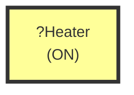
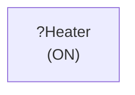

# 🚀 VirtualHome Agent Episode Log


### [GoalReasoner (Module A - Intent)] Output
```json
{
  "is_instruction_obviously_vague": false,
  "clarification_question": null,
  "target_object": "microwave",
  "location_hint": null,
  "reasoning_chain": [
    {
      "question": "Why does the user want this object?",
      "answer": "To have the microwave powered on."
    },
    {
      "question": "Why is that important?",
      "answer": "Because the user wants the microwave to be operating instead of being off."
    },
    {
      "question": "What fundamental need does this fulfill?",
      "answer": "It fulfills the need to make an appliance active and ready for use."
    },
    {
      "question": "Are there any deeper psychological or physical motivations?",
      "answer": "The underlying motivation is likely to enable heating or cooking tasks that require the appliance to be on."
    }
  ],
  "deep_intent": "The user wants to activate an appliance so it is ready for use.",
  "acceptable_alternatives_properties": [
    {
      "priority": 1,
      "description": "Any similar household appliance that can be turned on to perform the needed function, such as a toaster oven or air fryer."
    },
    {
      "priority": 2,
      "description": "Another kitchen appliance that provides heating or cooking capability."
    },
    {
      "priority": 3,
      "description": "Any indoor device that can be switched from off to on to become operational."
    },
    {
      "priority": 4,
      "description": "A different appliance or tool that can satisfy the same underlying need for food preparation or heating."
    }
  ]
}
```

### [PerceptionFilter] Output
```json
{
  "reasoning": "The goal is to turn on the target appliance, and the SDG only requires an object that can be ON. The exact target class microwave must be kept, and similar heating/cooking appliances are retained as functional alternatives/backups in case the microwave is unavailable.",
  "selected_classes": [
    "toaster",
    "door",
    "stove",
    "microwave",
    "tv",
    "character",
    "oventray",
    "radio",
    "coffeemaker"
  ],
  "raw_class_count": 99
}
```

### [LLMExecutor] Output
```json
{
  "reasoning": "The SDG requires ?Heater to be ON. The filtered graph shows a microwave(171) in the kitchen with HAS_SWITCH and currently OFF. It also has HAS_PLUG, but its current state is CLOSED and OFF. To turn it on, I must first be near the microwave before issuing the switch action. No other node is satisfied yet.",
  "satisfied_nodes": [],
  "current_node_focus": "N1",
  "mapped_variables": {
    "?Heater": "microwave(171)"
  },
  "action": "[walk] <microwave> (171)"
}
```
## Step 0
- **Action**: `[walk] <microwave> (171)`
- **SDG Status**:

- **Observed Items (16)**: character(1), kitchen(11), door(47) [OPEN], stove(163) [OFF,CLOSED], oventray(164), toaster(166) [OFF], coffeemaker(169) [OFF], microwave(171) [CLOSED,OFF], livingroom(183), tv(238) [OFF], bedroom(241), door(254) [OPEN], bathroom(285), door(305) [OPEN], bedroom(346)...


### [PerceptionFilter] Output
```json
{
  "reasoning": "The goal is to turn on the target appliance, and the SDG only requires an object that can be ON. The exact target class must be retained, and a functional alternative heating/cooking appliance should also be kept as a backup in case the microwave is unavailable.",
  "selected_classes": [
    "toaster",
    "airfryer",
    "door",
    "stove",
    "microwave",
    "character",
    "oventray"
  ],
  "raw_class_count": 99
}
```

### [LLMExecutor] Output
```json
{
  "reasoning": "The microwave(171) is already nearby and the only unsatisfied SDG node is that the heater must be ON. The microwave has HAS_SWITCH and is currently OFF, so the next atomic step is to switch it on. It also has HAS_PLUG, but the current graph does not show it unplugged, so no plugin action is required before switching on.",
  "satisfied_nodes": [],
  "current_node_focus": "N1",
  "mapped_variables": {
    "?Heater": "microwave(171)"
  },
  "action": "[switchon] <microwave> (171)"
}
```
## Step 1
- **Action**: `[switchon] <microwave> (171)`
- **SDG Status**:

- **Observed Items (13)**: character(1), kitchen(11), door(47) [OPEN], stove(163) [OFF,CLOSED], oventray(164), toaster(166) [OFF], microwave(171) [CLOSED,OFF], livingroom(183), bedroom(241), door(254) [OPEN], bathroom(285), door(305) [OPEN], bedroom(346)


### [PerceptionFilter] Output
```json
{
  "reasoning": "The goal is to activate a heating/cooking appliance, and the SDG requires a device state to be ON. The exact target object is microwave, and we should also retain alternative appliances that can fulfill similar heating/cooking functionality in case the microwave is unavailable or broken. Since the task is about powering on an appliance, the relevant power-related control/location items are also kept if needed for operation.",
  "selected_classes": [
    "lightswitch",
    "toaster",
    "airfryer",
    "powersocket",
    "door",
    "stove",
    "microwave",
    "character",
    "oventray"
  ],
  "raw_class_count": 99
}
```
## Step 2
- **Action**: `FINISH (Goal Reached)`
- **SDG Status**:

- **Observed Items (21)**: character(1), kitchen(11), door(47) [OPEN], powersocket(57), lightswitch(58) [ON], stove(163) [OFF,CLOSED], oventray(164), toaster(166) [OFF], microwave(171) [CLOSED,ON], livingroom(183), lightswitch(239) [ON], powersocket(240), bedroom(241), door(254) [OPEN], lightswitch(278) [ON]...

