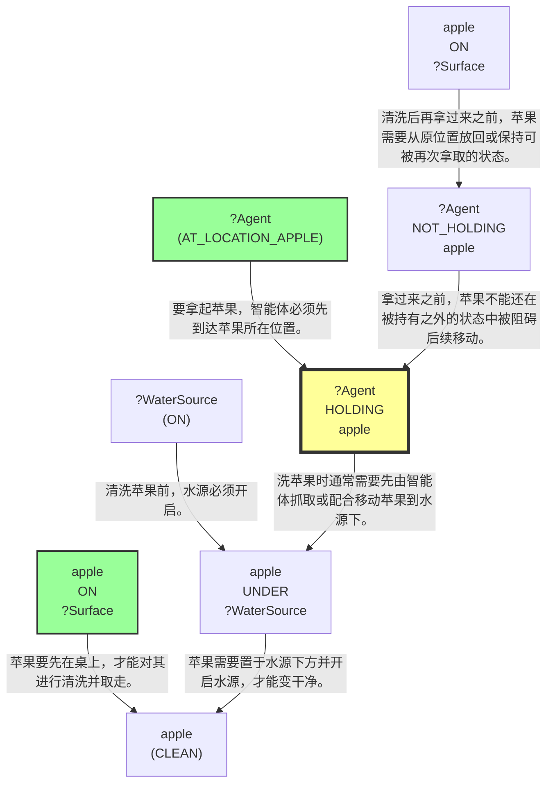
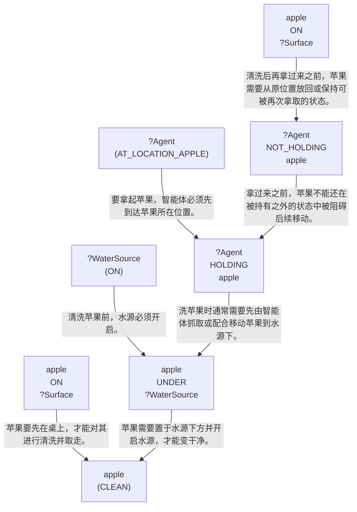

# 🚀 VirtualHome Agent Episode Log


### [GoalReasoner (Module A - Intent)] Output
```json
{
  "is_instruction_obviously_vague": false,
  "clarification_question": null,
  "target_object": "apple",
  "location_hint": "桌上",
  "reasoning_chain": [
    {
      "question": "Why does the user want this object?",
      "answer": "They want the apple cleaned and brought to them."
    },
    {
      "question": "Why is that important?",
      "answer": "So it is ready for handling or eating and accessible to the user."
    },
    {
      "question": "What fundamental need does this fulfill?",
      "answer": "It supports the need to obtain a clean piece of food."
    },
    {
      "question": "Are there any deeper psychological or physical motivations?",
      "answer": "The user likely wants convenience and hygiene, possibly to eat the fruit immediately."
    }
  ],
  "deep_intent": "The user wants to obtain clean, ready-to-consume food.",
  "acceptable_alternatives_properties": [
    {
      "priority": 1,
      "description": "Other fresh, ready-to-eat fruits that can be washed and served, such as pears or grapes"
    },
    {
      "priority": 2,
      "description": "Other washable whole fruits available indoors, such as oranges or bananas"
    },
    {
      "priority": 3,
      "description": "Other hygienic, ready-to-eat snack foods that require little preparation"
    },
    {
      "priority": 4,
      "description": "Another clean, edible item available indoors that can satisfy hunger"
    }
  ]
}
```

### [PerceptionFilter] Output
```json
{
  "reasoning": "Need the target apple plus the minimum physical items implied by the SDG for cleaning and retrieving it: the apple itself, a surface/table it is on, a water source to wash it, and the faucet/sink as the available washing appliance and its control. The agent is implicit and not included as an object ID.",
  "selected_ids": [
    437,
    231,
    247,
    248
  ],
  "raw_item_count": 109
}
```

### [LLMExecutor] Output
```json
{
  "reasoning": "The apple is already on the kitchen table and the agent is already close to it, so the next required step toward cleaning is to pick it up. This satisfies progress toward holding the apple before moving to the sink and washing it.",
  "satisfied_nodes": [
    "N2",
    "N4"
  ],
  "current_node_focus": "N3",
  "mapped_variables": {
    "?Surface": "kitchentable(231)",
    "?WaterSource": "faucet(248)"
  },
  "action": "[grab] apple (437)"
}
```
## Step 0
- **Action**: `[grab] <apple> (437)`
- **SDG Status**:

- **Observed Items (5)**: kitchentable(231), sink(247), faucet(248) [OFF,ON], apple(437) [DIRTY], character(1)


### [PerceptionFilter] Output
```json
{
  "reasoning": "Needed objects are the apple target, a location/support surface implied by 'on the table', and a water source for cleaning. The SDG also requires the agent to be at the apple location, so the kitchen table and sink/faucet are essential. I keep both sink and faucet because water source capability may require either component, and I include the apple itself.",
  "selected_ids": [
    437,
    231,
    247,
    248
  ],
  "raw_item_count": 110
}
```
## Step 1
- **Action**: `FINISH (Goal Reached)`
- **SDG Status**:

- **Observed Items (6)**: kitchentable(231), sink(247), faucet(248) [OFF,ON], character(1), apple(437) [DIRTY], apple(437) [DIRTY]

