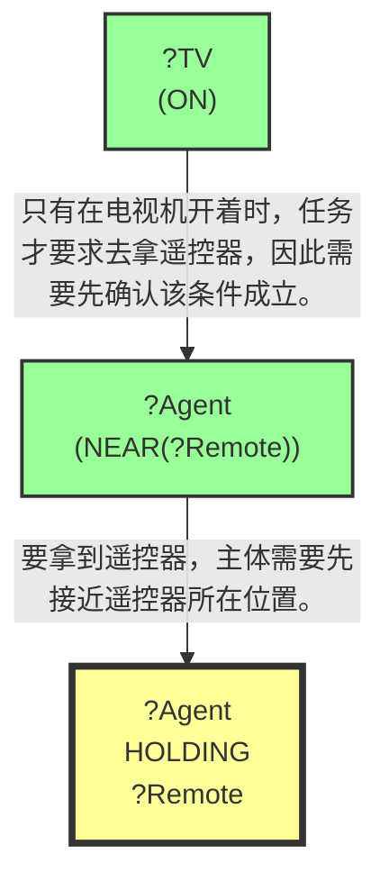
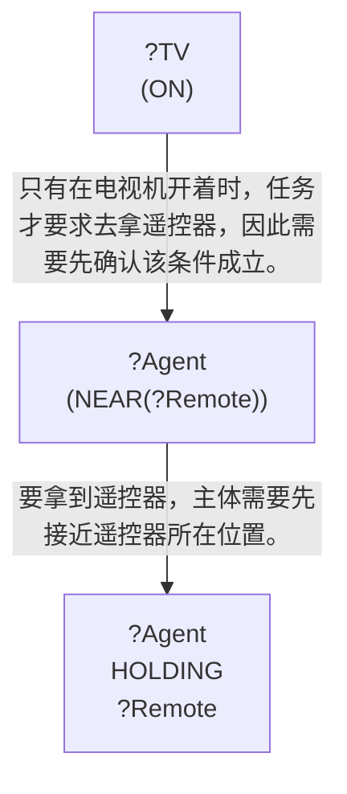

# 🚀 VirtualHome Agent Episode Log


### [GoalReasoner (Module A - Intent)] Output
```json
{
  "is_instruction_obviously_vague": false,
  "clarification_question": null,
  "target_object": "遥控器",
  "location_hint": "电视机附近",
  "reasoning_chain": [
    {
      "question": "Why does the user want this object?",
      "answer": "因为电视机如果开着，用户可能需要遥控器来操作或控制电视。"
    },
    {
      "question": "Why is that important?",
      "answer": "因为用户希望能够管理电视的状态，例如关闭、调节音量或切换节目。"
    },
    {
      "question": "What fundamental need does this fulfill?",
      "answer": "这满足了用户对控制和调整观看环境的需求。"
    },
    {
      "question": "Are there any deeper psychological or physical motivations?",
      "answer": "可能是为了减少干扰、改善观看体验，或方便在不离开当前区域的情况下管理电视。"
    }
  ],
  "deep_intent": "用户想获得控制电视的手段，以便管理观看状态。",
  "acceptable_alternatives_properties": [
    {
      "priority": 1,
      "description": "其他可用于控制电视的设备，例如通用遥控器或电视配套遥控器"
    },
    {
      "priority": 2,
      "description": "可替代控制功能的家用输入设备，例如智能手机上的遥控应用或语音控制设备"
    },
    {
      "priority": 3,
      "description": "具有相同控制用途的近似设备，例如机顶盒遥控器或家庭娱乐系统遥控器"
    },
    {
      "priority": 4,
      "description": "可直接操作电视的替代方式，例如电视机侧面的物理按键"
    }
  ]
}
```

### [PerceptionFilter] Output
```json
{
  "reasoning": "需要保留目标遥控器，以及与任务直接相关的电视机和其附近的放置位置/家具；根据SDG，电视处于开启状态且需要靠近并拿起遥控器，因此只保留电视、电视柜和遥控器即可。",
  "selected_ids": [
    426,
    369,
    452
  ],
  "raw_item_count": 75
}
```

### [LLMExecutor] Output
```json
{
  "reasoning": "The SDG requires the TV to be ON before going for the remote. The filtered graph shows tv(426) already has state ON, so N1 is satisfied. The agent is already CLOSE to remotecontrol(452), so N2 is satisfied as well. The remaining unsatisfied node is holding the remote, and because proximity is already established, the correct next atomic action is to grab the remotecontrol(452).",
  "satisfied_nodes": [
    "N1",
    "N2"
  ],
  "current_node_focus": "N3",
  "mapped_variables": {
    "?TV": "tv(426)",
    "?Remote": "remotecontrol(452)"
  },
  "action": "[grab] <remotecontrol> (452)"
}
```
## Step 0
- **Action**: `[grab] <remotecontrol> (452)`
- **SDG Status**:

- **Observed Items (4)**: tvstand(369), tv(426) [OFF,ON], remotecontrol(452) [OFF], character(1)


### [PerceptionFilter] Output
```json
{
  "reasoning": "需要保留目标物遥控器，以及与任务直接相关的电视机和其附近的放置家具/位置线索。根据SDG，遥控器是必须抓取的目标，电视机用于确认控制对象，电视柜/电视架是电视附近的关键位置参考。",
  "selected_ids": [
    426,
    369,
    452
  ],
  "raw_item_count": 76
}
```
## Step 1
- **Action**: `FINISH (Goal Reached)`
- **SDG Status**:

- **Observed Items (5)**: tvstand(369), tv(426) [OFF,ON], character(1), remotecontrol(452) [OFF], remotecontrol(452) [OFF]

