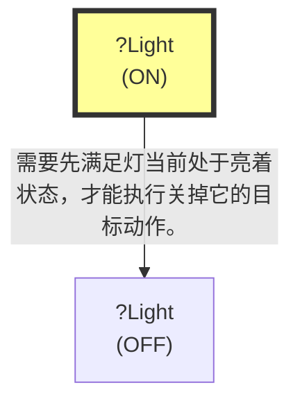
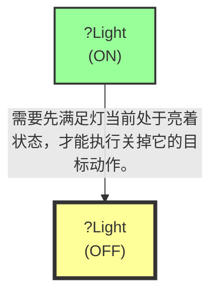
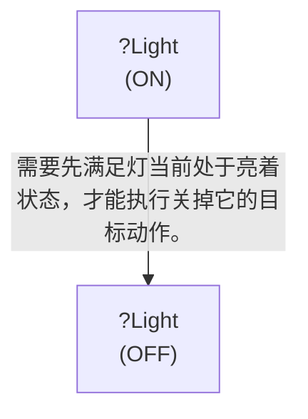

# 🚀 VirtualHome Agent Episode Log


### [GoalReasoner (Module A - Intent)] Output
```json
{
  "is_instruction_obviously_vague": false,
  "clarification_question": null,
  "target_object": "灯",
  "location_hint": null,
  "reasoning_chain": [
    {
      "question": "Why does the user want this object?",
      "answer": "Because they want the light source to be turned off if it is currently on."
    },
    {
      "question": "Why is that important?",
      "answer": "Because an illuminated light may be undesired and they want the environment to be in a non-illuminated state."
    },
    {
      "question": "What fundamental need does this fulfill?",
      "answer": "The need to control the lighting state of the environment."
    },
    {
      "question": "Are there any deeper psychological or physical motivations?",
      "answer": "It may be to reduce brightness, save energy, avoid disturbance, or create a more comfortable setting."
    }
  ],
  "deep_intent": "The user wants to turn off an active light source.",
  "acceptable_alternatives_properties": [
    {
      "priority": 1,
      "description": "Other indoor light sources that can be switched off, such as a lamp, ceiling light, or desk light"
    },
    {
      "priority": 2,
      "description": "Any controllable household lighting fixture that provides illumination"
    },
    {
      "priority": 3,
      "description": "Other devices with an on/off illumination function, such as a night light or LED light strip"
    },
    {
      "priority": 4,
      "description": "If the exact light cannot be accessed, reducing illumination by turning off nearby light-emitting devices can satisfy the same need"
    }
  ]
}
```

### [PerceptionFilter] Output
```json
{
  "reasoning": "The goal is to turn off an active light source. I should keep the controllable lighting fixtures that could be the target, plus the lightswitch as the likely control. To satisfy alternative retention, I include all visible indoor light sources that can plausibly be switched off.",
  "selected_ids": [
    101,
    102,
    103,
    173
  ],
  "raw_item_count": 70
}
```

### [LLMExecutor] Output
```json
{
  "reasoning": "The SDG requires a light that is currently ON and then OFF. In the filtered graph, tablelamp(102) is explicitly ON and controllable via switch, so it is a valid binding for ?Light. Since switching requires proximity first, the next atomic step is to walk to that lamp before turning it off.",
  "satisfied_nodes": [
    "N1"
  ],
  "current_node_focus": "N1",
  "mapped_variables": {
    "?Light": "tablelamp(102)"
  },
  "action": "[walk] <tablelamp> (102)"
}
```
## Step 0
- **Action**: `[walk] <tablelamp> (102)`
- **SDG Status**:

- **Observed Items (5)**: ceilinglamp(101), tablelamp(102) [ON], tablelamp(103) [ON], lightswitch(173) [ON], character(1)


### [PerceptionFilter] Output
```json
{
  "reasoning": "Need only the controllable light sources and the switch to turn the active light off. I kept all plausible lighting fixtures as backups, including ceiling lamp, table lamp, candle, and the lightswitch, since the goal is to reduce illumination by switching off a light source.",
  "selected_ids": [
    101,
    102,
    173,
    181
  ],
  "raw_item_count": 69
}
```

### [LLMExecutor] Output
```json
{
  "reasoning": "The SDG requires a light source that is currently ON, then to transition it to OFF. tablelamp(102) is explicitly ON and the past action already walked the robot close to it, so the proximity requirement is satisfied. The next atomic step is to switch off the selected light to satisfy N2.",
  "satisfied_nodes": [
    "N1"
  ],
  "current_node_focus": "N2",
  "mapped_variables": {
    "?Light": "tablelamp(102)"
  },
  "action": "[switchoff] <tablelamp> (102)"
}
```
## Step 1
- **Action**: `[switchoff] <tablelamp> (102)`
- **SDG Status**:

- **Observed Items (5)**: ceilinglamp(101), tablelamp(102) [ON], lightswitch(173) [ON], candle(181) [OFF], character(1)


### [PerceptionFilter] Output
```json
{
  "reasoning": "The goal is to turn off a light source, so I must keep the controllable lighting fixtures and the control needed to switch them off. I included all plausible indoor light alternatives/backups: ceilinglamp, tablelamp, candle, and lightswitch.",
  "selected_ids": [
    101,
    102,
    173,
    181
  ],
  "raw_item_count": 69
}
```
## Step 2
- **Action**: `FINISH (Goal Reached)`
- **SDG Status**:

- **Observed Items (5)**: ceilinglamp(101), tablelamp(102) [OFF], lightswitch(173) [ON], candle(181) [OFF], character(1)

