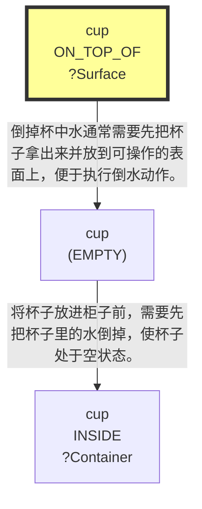
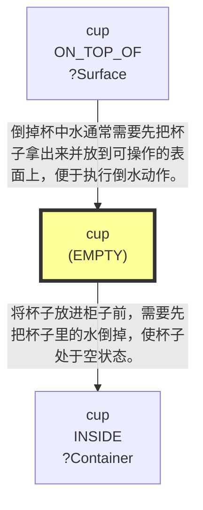
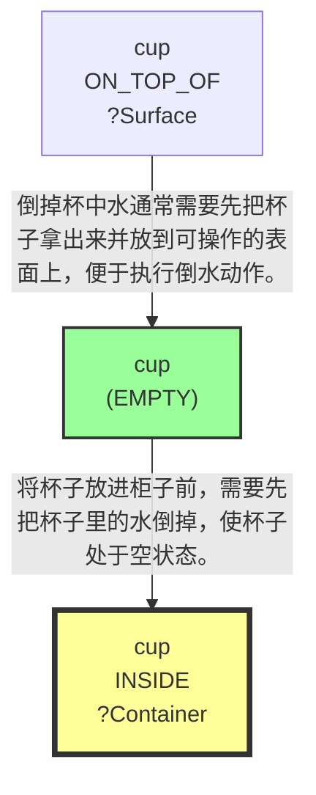
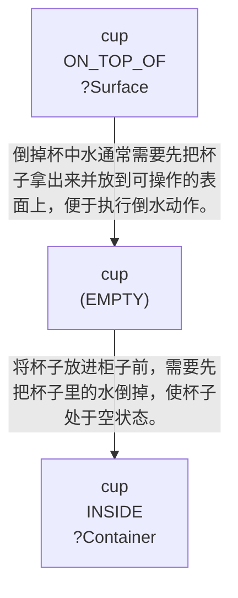

# 🚀 VirtualHome Agent Episode Log


### [GoalReasoner (Module A - Intent)] Output
```json
{
  "is_instruction_obviously_vague": false,
  "clarification_question": null,
  "target_object": "cup",
  "location_hint": "cabinet",
  "reasoning_chain": [
    {
      "question": "Why does the user want this object?",
      "answer": "To handle the cup based on whether it contains water, then put it away."
    },
    {
      "question": "Why is that important?",
      "answer": "To leave the cup in a desired stored state and remove the water from it first."
    },
    {
      "question": "What fundamental need does this fulfill?",
      "answer": "The user wants to organize household items and ensure the cup is empty before storage."
    },
    {
      "question": "Are there any deeper psychological or physical motivations?",
      "answer": "This may reflect a desire to tidy the space, prevent spills, or prepare the cup for later use."
    }
  ],
  "deep_intent": "The user wants to empty a container and store it away neatly.",
  "acceptable_alternatives_properties": [
    {
      "priority": 1,
      "description": "Other small reusable drink containers or cups that can be emptied and stored away."
    },
    {
      "priority": 2,
      "description": "Other empty tabletop containers or kitchen vessels suitable for cabinet storage."
    },
    {
      "priority": 3,
      "description": "Similar household items that can be put away after being cleared of contents."
    },
    {
      "priority": 4,
      "description": "Any container that needs to be emptied before being stored to keep the area tidy."
    }
  ]
}
```

### [PerceptionFilter] Output
```json
{
  "reasoning": "Needed objects are the target cup and the cabinet location implied by the goal, plus a valid surface to place the cup on while emptying it. The sink is the physical tool for removing water, and the mug/waterglass alternatives are retained as similar container backups under the goal's acceptable alternatives. I selected only the minimal relevant IDs among visible container options and storage location.",
  "selected_ids": [
    234,
    247,
    270,
    274,
    281,
    282,
    194
  ],
  "raw_item_count": 109
}
```

### [LLMExecutor] Output
```json
{
  "reasoning": "The SDG requires a cup-like object to be EMPTY before it can be stored inside the cabinet. The best matching exact object in the filtered graph is mug(194), since it is a small reusable drink container and is currently FILLED_WATER. I cannot pour yet because I am not holding it, and I also need to be near it before grabbing. The cabinet is closed and will matter later for the putin step, but the immediate missing prerequisite is to get to the mug so it can be picked up and then emptied. This action directly advances toward satisfying N2 and then N1/N3 later.",
  "satisfied_nodes": [],
  "current_node_focus": "N3",
  "mapped_variables": {
    "?Container": "kitchencabinet(234)",
    "?Surface": "unknown yet"
  },
  "action": "[walk] <mug> (194)"
}
```
## Step 0
- **Action**: `[walk] <mug> (194)`
- **SDG Status**:

- **Observed Items (8)**: kitchencabinet(234) [CLOSED], sink(247), waterglass(270), waterglass(274), waterglass(281), waterglass(282), mug(194) [FILLED_WATER], character(1)


### [PerceptionFilter] Output
```json
{
  "reasoning": "The goal is to empty the target cup and then store it in the cabinet. So I need the target cup, a valid surface to place it on while emptying it (table/counter/sink as workable surfaces), and the cabinet(s) as the intended storage location. I also keep other drink containers as acceptable alternatives/backup containers per the intent, plus the sink/faucet as functional tools for emptying if needed.",
  "selected_ids": [
    231,
    238,
    247,
    248,
    234,
    235,
    236,
    237,
    270,
    274,
    281,
    282,
    298,
    299,
    194
  ],
  "raw_item_count": 109
}
```

### [LLMExecutor] Output
```json
{
  "reasoning": "The goal requires the cup-like object to be empty before storing it in a cabinet. I am already close to mug(194), and the next missing prerequisite is to pick it up so it can later be moved and emptied. The cabinet is still closed, but opening it is a later step after the mug is handled. Since I should not repeat the recent walk action, the best next atomic action is to grab the mug now.",
  "satisfied_nodes": [],
  "current_node_focus": "N2",
  "mapped_variables": {
    "?Container": "kitchencabinet(234)",
    "?Surface": "kitchentable(231)"
  },
  "action": "[grab] <mug> (194)"
}
```
## Step 1
- **Action**: `[grab] <mug> (194)`
- **SDG Status**:

- **Observed Items (16)**: kitchentable(231), kitchencabinet(234) [CLOSED], kitchencabinet(235) [CLOSED], kitchencabinet(236) [CLOSED], kitchencabinet(237) [CLOSED], kitchencounter(238) [CLOSED], sink(247), faucet(248) [OFF], waterglass(270), waterglass(274), waterglass(281), waterglass(282), wineglass(298), wineglass(299), mug(194) [FILLED_WATER]...


### [PerceptionFilter] Output
```json
{
  "reasoning": "Need the target cup-like container and the location container implied by the goal (cabinet), plus a usable surface for placing it while emptying. The sink is the needed functional tool for pouring out water, and the cabinet is the storage location. The mug is the visible cup target, and the table is the surface to set it on during the task.",
  "selected_ids": [
    194,
    231,
    234,
    247
  ],
  "raw_item_count": 110
}
```

### [LLMExecutor] Output
```json
{
  "reasoning": "The cup-like object is already in hand (HOLDS_RH mug(194)) and is still FILLED_WATER, so the next missing prerequisite toward the SDG is to empty it. To pour, I must be holding the source and be near the target; the sink(247) is the best available recipient for emptying the mug before later placing it in the cabinet. The cabinet is currently closed, but that is a later step after the mug is emptied. I should walk to the sink now so pouring can be performed in the following step.",
  "satisfied_nodes": [],
  "current_node_focus": "N2",
  "mapped_variables": {
    "?Container": "kitchencabinet(234)",
    "?Surface": "sink(247)"
  },
  "action": "[walk] <sink> (247)"
}
```
## Step 2
- **Action**: `[walk] <sink> (247)`
- **SDG Status**:

- **Observed Items (6)**: kitchentable(231), kitchencabinet(234) [CLOSED], sink(247), character(1), mug(194) [FILLED_WATER], mug(194) [FILLED_WATER]


### [PerceptionFilter] Output
```json
{
  "reasoning": "Needed objects are the target cup (mug) and the likely storage location (cabinet). The SDG also requires a surface for placing the cup while emptying it, so the kitchen table or counter can serve that role. I also keep the sink as the practical place to pour out water, and the mug itself as the target container.",
  "selected_ids": [
    194,
    234,
    235,
    236,
    237,
    231,
    238,
    247
  ],
  "raw_item_count": 110
}
```

### [LLMExecutor] Output
```json
{
  "reasoning": "The mug is already held and I am already close to the sink, which is the correct target to empty it before storage. The SDG says the cup must be EMPTY before it can go inside the cabinet, so the next missing prerequisite is to pour the water out. No cabinet interaction should happen yet because the mug is still filled.",
  "satisfied_nodes": [],
  "current_node_focus": "N2",
  "mapped_variables": {
    "?Container": "kitchencabinet(234)",
    "?Surface": "sink(247)"
  },
  "action": "[pour] <mug> (194) <sink> (247)"
}
```
## Step 3
- **Action**: `[pour] <mug> (194) <sink> (247)`
- **SDG Status**:

- **Observed Items (10)**: kitchentable(231), kitchencabinet(234) [CLOSED], kitchencabinet(235) [CLOSED], kitchencabinet(236) [CLOSED], kitchencabinet(237) [CLOSED], kitchencounter(238) [CLOSED], sink(247), character(1), mug(194) [FILLED_WATER], mug(194) [FILLED_WATER]


### [PerceptionFilter] Output
```json
{
  "reasoning": "The goal requires the cup to be emptied and then stored in a cabinet. So I need the target cup object, a place to set it down while emptying it (a table/counter), and the storage location (cabinet). Because the SDG allows alternative cup-like containers and the instructions require retaining functional backups, I also keep the other visible drink containers that could serve the same purpose if needed.",
  "selected_ids": [
    234,
    235,
    236,
    237,
    231,
    238,
    270,
    274,
    281,
    282,
    298,
    299,
    194
  ],
  "raw_item_count": 110
}
```

### [LLMExecutor] Output
```json
{
  "reasoning": "The mug is already EMPTY and currently held, so N2 is satisfied. The cabinet is the intended storage container, but it is currently CLOSED, and to satisfy the INSIDE relation I must first open a cabinet while close to it. I am already close to kitchencabinet(236) from the filtered graph, so the best next step is to open that cabinet before any putin action.",
  "satisfied_nodes": [
    "N2"
  ],
  "current_node_focus": "N1",
  "mapped_variables": {
    "?Container": "kitchencabinet(236)",
    "?Surface": "kitchentable(231)"
  },
  "action": "[open] <kitchencabinet> (236)"
}
```
## Step 4
- **Action**: `[open] <kitchencabinet> (236)`
- **SDG Status**:

- **Observed Items (15)**: kitchentable(231), kitchencabinet(234) [CLOSED], kitchencabinet(235) [CLOSED], kitchencabinet(236) [CLOSED], kitchencabinet(237) [CLOSED], kitchencounter(238) [CLOSED], waterglass(270), waterglass(274), waterglass(281), waterglass(282), wineglass(298), wineglass(299), character(1), mug(194) [EMPTY], mug(194) [EMPTY]


### [PerceptionFilter] Output
```json
{
  "reasoning": "Need the target cup/mug and the likely receptacles/surfaces involved in emptying and storing it: the sink for pouring out liquid, a counter/table as the working surface, and the cabinet for storage. I also keep the target cup itself and the equivalent mug since the intent allows similar reusable drink containers.",
  "selected_ids": [
    247,
    231,
    238,
    234,
    194,
    270,
    274,
    281,
    282
  ],
  "raw_item_count": 110
}
```

### [LLMExecutor] Output
```json
{
  "reasoning": "The mug(194) is already EMPTY and currently held, and the target storage container kitchencabinet(234) is now open. This satisfies the prerequisite for putting the mug inside the cabinet. The next missing SDG node is the INSIDE relation (N1), so the best single next action is to place the mug into the open cabinet.",
  "satisfied_nodes": [
    "N2"
  ],
  "current_node_focus": "N1",
  "mapped_variables": {
    "?Container": "kitchencabinet(234)"
  },
  "action": "[putin] <mug> (194) <kitchencabinet> (234)"
}
```
## Step 5
- **Action**: `[putin] <mug> (194) <kitchencabinet> (234)`
- **SDG Status**:

- **Observed Items (11)**: kitchentable(231), kitchencabinet(234) [CLOSED], kitchencounter(238) [CLOSED], sink(247), waterglass(270), waterglass(274), waterglass(281), waterglass(282), character(1), mug(194) [EMPTY], mug(194) [EMPTY]


### [PerceptionFilter] Output
```json
{
  "reasoning": "Needed objects are the target cup(s) and the storage location implied by the cabinet. Since the task is to empty the cup and put it away, I keep the cup instances visible and all cabinet options as potential storage containers. A sink is also needed as the functional alternative location/tool for emptying the cup before storage.",
  "selected_ids": [
    234,
    235,
    236,
    237,
    247,
    270,
    274,
    281,
    282,
    298,
    299
  ],
  "raw_item_count": 108
}
```

### [LLMExecutor] Output
```json
{
  "reasoning": "The mug has already been emptied and the open cabinet kitchencabinet(236) is the correct storage target. The remaining missing SDG node is the INSIDE relation for the mug, so the next atomic action should place the held mug into that open cabinet. I should not walk again because I am already close to the cabinet and the previous action was a successful open, not a walk.",
  "satisfied_nodes": [
    "N2"
  ],
  "current_node_focus": "N1",
  "mapped_variables": {
    "?Container": "kitchencabinet(236)"
  },
  "action": "[putin] <mug> (194) <kitchencabinet> (236)"
}
```
## Step 6
- **Action**: `[putin] <mug> (194) <kitchencabinet> (236)`
- **SDG Status**:

- **Observed Items (12)**: kitchencabinet(234) [CLOSED], kitchencabinet(235) [CLOSED], kitchencabinet(236) [OPEN], kitchencabinet(237) [CLOSED], sink(247), waterglass(270), waterglass(274), waterglass(281), waterglass(282), wineglass(298), wineglass(299), character(1)


### [PerceptionFilter] Output
```json
{
  "reasoning": "Need the target cup and a valid surface to place it on while emptying it, plus the cabinet location for storage. A sink is the best appliance for pouring out water, and the cabinet is required by the location hint. The visible cup matches as waterglass objects, so I keep one representative cup and the relevant storage/retrieval fixtures.",
  "selected_ids": [
    247,
    234,
    270
  ],
  "raw_item_count": 108
}
```

### [LLMExecutor] Output
```json
{
  "reasoning": "The previous putin failed because it targeted the wrong cabinet instance (234 is CLOSED and not the one previously opened). The currently relevant open storage target in the recent history is kitchencabinet(236), but it is no longer present in the filtered graph, so I cannot safely use it. The goal requires the cup-like object to end up inside a cabinet after being emptied; however, the only cabinet visible now is kitchencabinet(234), which is CLOSED. Since I am already at the cabinet area, the next required step toward N1 is to open the visible cabinet before any putin can succeed.",
  "satisfied_nodes": [
    "N2"
  ],
  "current_node_focus": "N1",
  "mapped_variables": {
    "?Container": "kitchencabinet(234)"
  },
  "action": "[open] <kitchencabinet> (234)"
}
```
## Step 7
- **Action**: `[open] <kitchencabinet> (234)`
- **SDG Status**:

- **Observed Items (4)**: kitchencabinet(234) [CLOSED], sink(247), waterglass(270), character(1)


### [PerceptionFilter] Output
```json
{
  "reasoning": "Need the target cup/mug and a valid surface to place it on while emptying it, plus the cabinet location for storage. The sink is the functional tool for emptying liquid, and the cabinet is the implied storage destination. The observed mug is the target cup-like container.",
  "selected_ids": [
    247,
    234,
    194
  ],
  "raw_item_count": 109
}
```
## Step 8
- **Action**: `FINISH (Goal Reached)`
- **SDG Status**:

- **Observed Items (4)**: kitchencabinet(234) [OPEN], sink(247), character(1), mug(194) [EMPTY]

