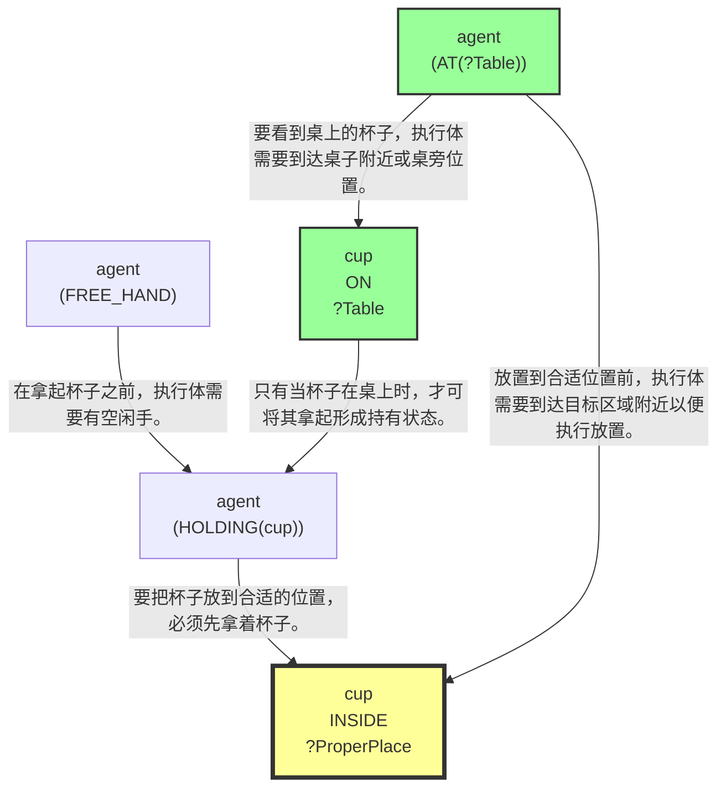
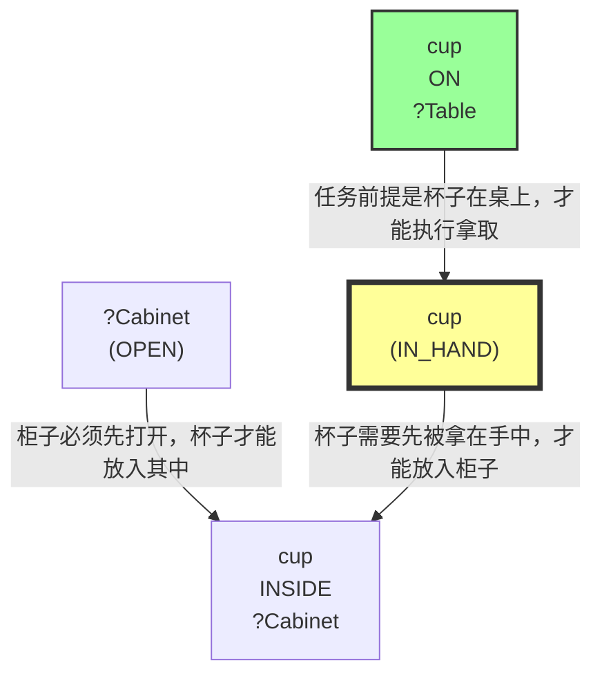
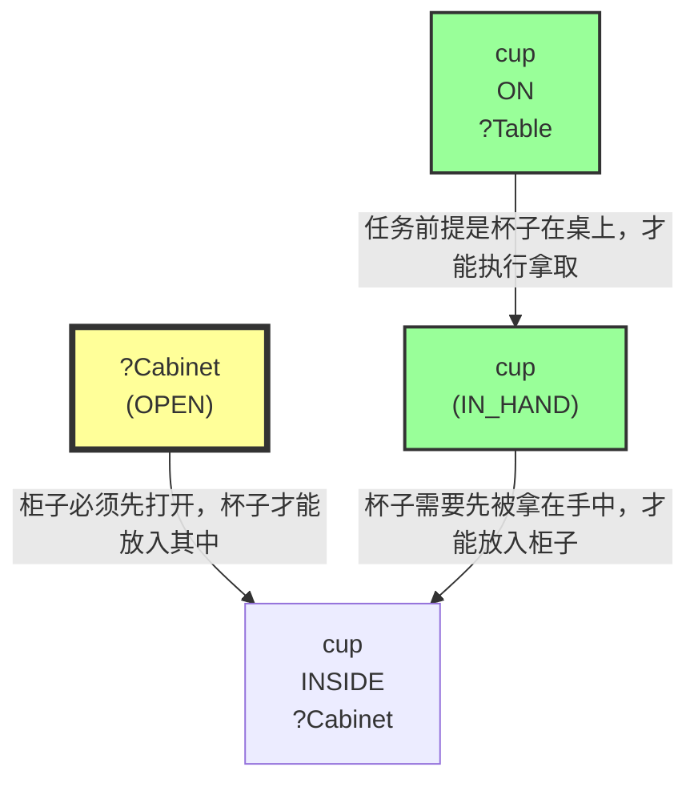
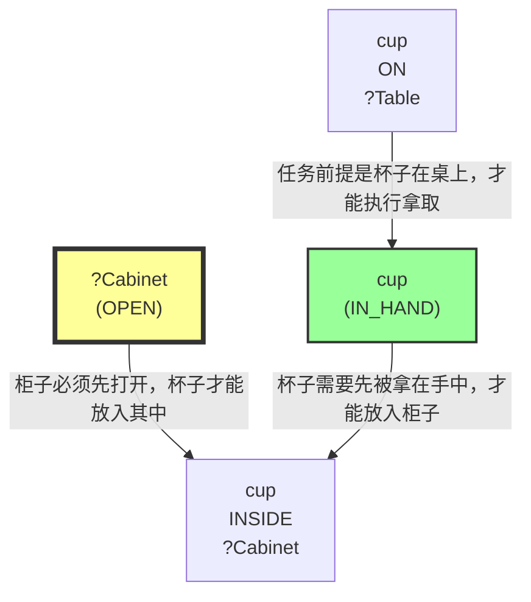
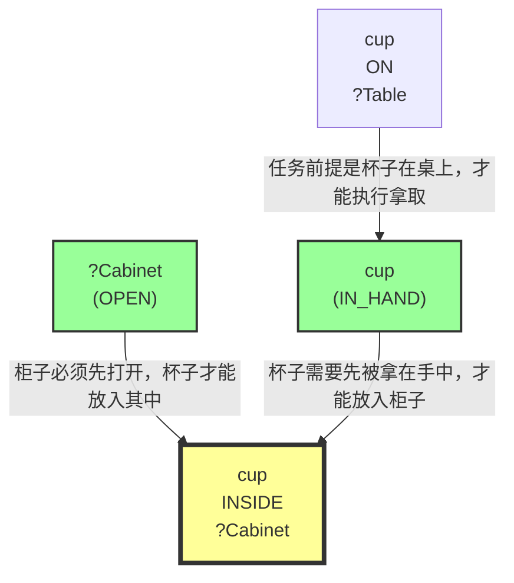
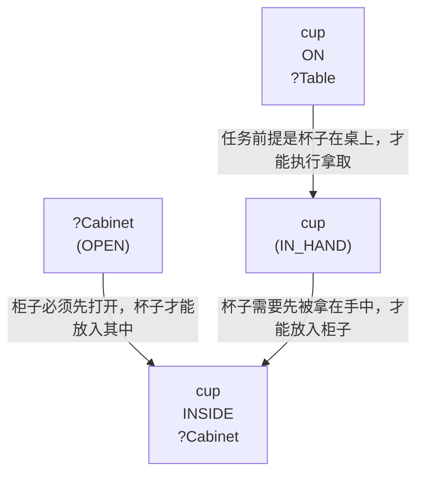

# 🚀 VirtualHome Agent Episode Log


### [GoalReasoner (Module A - Intent)] Output
```json
{
  "is_instruction_obviously_vague": true,
  "clarification_question": "请问“该放的地方”具体是哪里？例如是杯架、厨房台面、洗碗池旁，还是别的位置？",
  "target_object": "杯子",
  "location_hint": "桌上",
  "reasoning_chain": [
    {
      "question": "Why does the user want this object?",
      "answer": "用户希望把桌上的杯子移走并归位。"
    },
    {
      "question": "Why is that important?",
      "answer": "这样可以让桌面恢复整洁，并让物品回到应放的位置。"
    },
    {
      "question": "What fundamental need does this fulfill?",
      "answer": "这满足了整理和收纳的需求，减少杂乱，便于后续使用。"
    },
    {
      "question": "Are there any deeper psychological or physical motivations?",
      "answer": "可能是为了获得更有序的环境、避免桌面占用空间，或确保杯子在正确地点以方便取用。"
    }
  ],
  "deep_intent": "用户想整理并归位一个物品，使环境更有序。",
  "acceptable_alternatives_properties": [
    {
      "priority": 1,
      "description": "其他可收纳的日常餐具或饮具，例如碗、盘子、勺子等，前提是它们也需要被归位。"
    },
    {
      "priority": 2,
      "description": "同类的饮用容器，例如马克杯、玻璃杯或水瓶。"
    },
    {
      "priority": 3,
      "description": "桌面上需要整理收纳的轻小物品，例如餐具、餐巾纸盒或小型厨房用品。"
    },
    {
      "priority": 4,
      "description": "其他需要从桌面移到指定收纳位置的家居物品，只要它们的核心需求同样是整理归位。"
    }
  ]
}
```

### [PerceptionFilter] Output
```json
{
  "reasoning": "Need the target cup and the likely destination/nearby furniture relevant to putting it away. The intent says the cup is on the table, and SDG requires the table location plus a proper place for placement. Since the exact proper place is unclear, keep plausible storage/placement options and the other drink containers as functional alternatives/backups for the same task context.",
  "selected_ids": [
    231,
    194,
    270,
    274,
    281,
    282,
    298,
    299,
    326
  ],
  "raw_item_count": 109
}
```

### [LLMExecutor] Output
```json
{
  "reasoning": "当前任务目标是把桌上的杯子归位，但用户明确指出“该放的地方”是模糊的，需要先澄清具体收纳位置；在没有明确目标位置前，不应猜测把杯子放到哪里。根据规则，属于歧义情况，必须先询问澄清。",
  "satisfied_nodes": [
    "N1",
    "N4"
  ],
  "current_node_focus": "N2",
  "mapped_variables": {},
  "action": "[ask] 请问“该放的地方”具体是哪里？例如是杯架、厨房台面、洗碗池旁，还是别的位置？"
}
```
## Step 0
- **Action**: `[ask] 请问“该放的地方”具体是哪里？例如是杯架、厨房台面、洗碗池旁，还是别的位置？`
- **SDG Status**:

- **Observed Items (10)**: kitchentable(231), waterglass(270), waterglass(274), waterglass(281), waterglass(282), wineglass(298), wineglass(299), dishbowl(326), mug(194), character(1)


### [GoalReasoner (Module A - Intent)] Output
```json
{
  "is_instruction_obviously_vague": false,
  "clarification_question": null,
  "target_object": "cup",
  "location_hint": "table",
  "reasoning_chain": [
    {
      "question": "Why does the user want this object?",
      "answer": "To relocate the cup from the table into the cabinet."
    },
    {
      "question": "Why is that important?",
      "answer": "To remove the cup from the tabletop and place it in a storage area."
    },
    {
      "question": "What fundamental need does this fulfill?",
      "answer": "The user wants to organize or clear the tabletop by storing the item."
    },
    {
      "question": "Are there any deeper psychological or physical motivations?",
      "answer": "This likely supports household tidiness, reducing clutter, and keeping items in an appropriate storage location."
    }
  ],
  "deep_intent": "The user wants to organize household items by storing a visible item away from a surface.",
  "acceptable_alternatives_properties": [
    {
      "priority": 1,
      "description": "Other small household items currently on the tabletop that can be safely stored in the cabinet."
    },
    {
      "priority": 2,
      "description": "Similar tabletop objects that are meant to be put away in storage, such as dishes or other containers."
    },
    {
      "priority": 3,
      "description": "General clutter items from the table that belong in a cabinet or other storage space."
    },
    {
      "priority": 4,
      "description": "Any safe, portable household object that helps clear and organize the tabletop by moving it into storage."
    }
  ]
}
```

### [PerceptionFilter] Output
```json
{
  "reasoning": "The goal requires the target cup and the cabinet that can be opened to store it. Since the cup is specified as being on the table, the table is also needed to satisfy the precondition and locate the item. I included both visible cabinet options as functional alternatives/backups because the SDG requires an open cabinet and multiple cabinets are present.",
  "selected_ids": [
    231,
    234,
    235,
    194
  ],
  "raw_item_count": 109
}
```

### [LLMExecutor] Output
```json
{
  "reasoning": "The clarified goal is to move the cup/mug from the table into a cabinet. In the current graph, the only tabletop cup-like object is mug(194), and it is on kitchentable(231) and close to the character, so it is the correct bind for the cup. The cabinet candidates are kitchencabinet(234) and kitchencabinet(235), both closed. To satisfy the SDG, the first missing prerequisite is having the cup in hand (N1) before it can be placed inside an open cabinet. Since we are already close to the mug, the best next atomic step is to grab it.",
  "satisfied_nodes": [
    "N4"
  ],
  "current_node_focus": "N1",
  "mapped_variables": {
    "?Cabinet": "kitchencabinet(234)",
    "?Table": "kitchentable(231)"
  },
  "action": "[grab] mug (194)"
}
```
## Step 1
- **Action**: `[grab] <mug> (194)`
- **SDG Status**:

- **Observed Items (5)**: kitchentable(231), kitchencabinet(234) [CLOSED], kitchencabinet(235) [CLOSED], mug(194), character(1)


### [PerceptionFilter] Output
```json
{
  "reasoning": "Need the target cup/mug, the table it is on, and the cabinet that must be opened to store it. The SDG requires the cup to be on the table, in hand, and then inside an open cabinet, so I keep the cup, the table, and all cabinet candidates visible as physical storage alternatives.",
  "selected_ids": [
    231,
    234,
    235,
    236,
    237,
    194
  ],
  "raw_item_count": 110
}
```

### [LLMExecutor] Output
```json
{
  "reasoning": "The cup/mug is already in hand, satisfying N1. The next missing prerequisite toward placing it into the cabinet is opening a cabinet, but the robot must be near the chosen cabinet first. Among the available cabinets, kitchencabinet(234) is a valid openable container and no cabinet is currently selected or open. Since the immediate actionable progress is to approach a cabinet before opening it, I will move to one cabinet instance to prepare for opening and later placement. I choose kitchencabinet(234) as a valid cabinet candidate.",
  "satisfied_nodes": [
    "N1",
    "N4"
  ],
  "current_node_focus": "N3",
  "mapped_variables": {
    "?Cabinet": "kitchencabinet(234)",
    "?Table": "kitchentable(231)"
  },
  "action": "[walk] <kitchencabinet> (234)"
}
```
## Step 2
- **Action**: `[walk] <kitchencabinet> (234)`
- **SDG Status**:

- **Observed Items (8)**: kitchentable(231), kitchencabinet(234) [CLOSED], kitchencabinet(235) [CLOSED], kitchencabinet(236) [CLOSED], kitchencabinet(237) [CLOSED], character(1), mug(194), mug(194)


### [PerceptionFilter] Output
```json
{
  "reasoning": "The goal requires the target cup/mug and the cabinet it must be placed into, plus the table it is currently on. The SDG also requires the cabinet to be open, so I keep the cabinet and the tabletop location. The visible target object is the mug/cup with ID 194, and the relevant table and cabinet are IDs 231 and 234/235/236/237; I include all cabinet instances as potential valid storage options and to preserve alternatives.",
  "selected_ids": [
    194,
    231,
    234,
    235,
    236,
    237
  ],
  "raw_item_count": 110
}
```

### [LLMExecutor] Output
```json
{
  "reasoning": "The cup/mug is already in hand (N1 satisfied), and we are already close to kitchencabinet(234) from the previous walk. The next missing prerequisite for placing it inside is to open the selected cabinet. I will open kitchencabinet(234) to progress toward N3 and enable the eventual putin action.",
  "satisfied_nodes": [
    "N1"
  ],
  "current_node_focus": "N3",
  "mapped_variables": {
    "?Cabinet": "kitchencabinet(234)"
  },
  "action": "[open] <kitchencabinet> (234)"
}
```
## Step 3
- **Action**: `[open] <kitchencabinet> (234)`
- **SDG Status**:

- **Observed Items (8)**: kitchentable(231), kitchencabinet(234) [CLOSED], kitchencabinet(235) [CLOSED], kitchencabinet(236) [CLOSED], kitchencabinet(237) [CLOSED], character(1), mug(194), mug(194)


### [PerceptionFilter] Output
```json
{
  "reasoning": "The goal requires the target cup (here visible as a mug) on the table and a cabinet to store it in. The SDG also requires the cabinet to be open. I keep the table, the cabinet options, and the target mug, plus a backup openable storage option if needed.",
  "selected_ids": [
    231,
    234,
    235,
    236,
    237,
    194
  ],
  "raw_item_count": 110
}
```

### [LLMExecutor] Output
```json
{
  "reasoning": "N1 is already satisfied because the character is holding mug(194). N3 is satisfied because kitchencabinet(234) is open. The remaining gap toward the goal is N2: place the cup inside the open cabinet. The mug is currently in hand and we are close to the cabinet, so the correct next atomic action is to put it in the open cabinet.",
  "satisfied_nodes": [
    "N1",
    "N3"
  ],
  "current_node_focus": "N2",
  "mapped_variables": {
    "?Cabinet": "kitchencabinet(234)"
  },
  "action": "[putin] <mug> (194) <kitchencabinet> (234)"
}
```
## Step 4
- **Action**: `[putin] <mug> (194) <kitchencabinet> (234)`
- **SDG Status**:

- **Observed Items (8)**: kitchentable(231), kitchencabinet(234) [OPEN], kitchencabinet(235) [CLOSED], kitchencabinet(236) [CLOSED], kitchencabinet(237) [CLOSED], character(1), mug(194), mug(194)


### [PerceptionFilter] Output
```json
{
  "reasoning": "Needed items are the target cup/mug, the table where it is currently located, and a cabinet to store it. The SDG also requires the cabinet to be opened before placing the cup inside, so cabinet IDs are retained. Since the target is a cup and the visible object matching that function is a mug, I include it as the portable target container.",
  "selected_ids": [
    231,
    234,
    235,
    236,
    237,
    194
  ],
  "raw_item_count": 109
}
```
## Step 5
- **Action**: `FINISH (Goal Reached)`
- **SDG Status**:

- **Observed Items (7)**: kitchentable(231), kitchencabinet(234) [OPEN], kitchencabinet(235) [CLOSED], kitchencabinet(236) [CLOSED], kitchencabinet(237) [CLOSED], character(1), mug(194)

