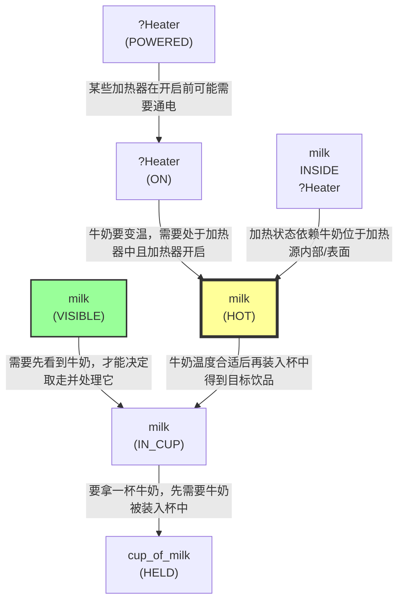
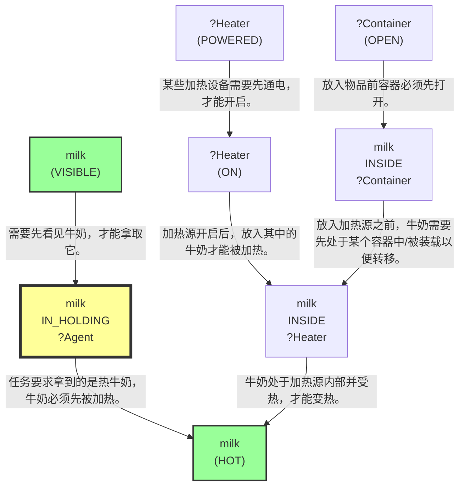
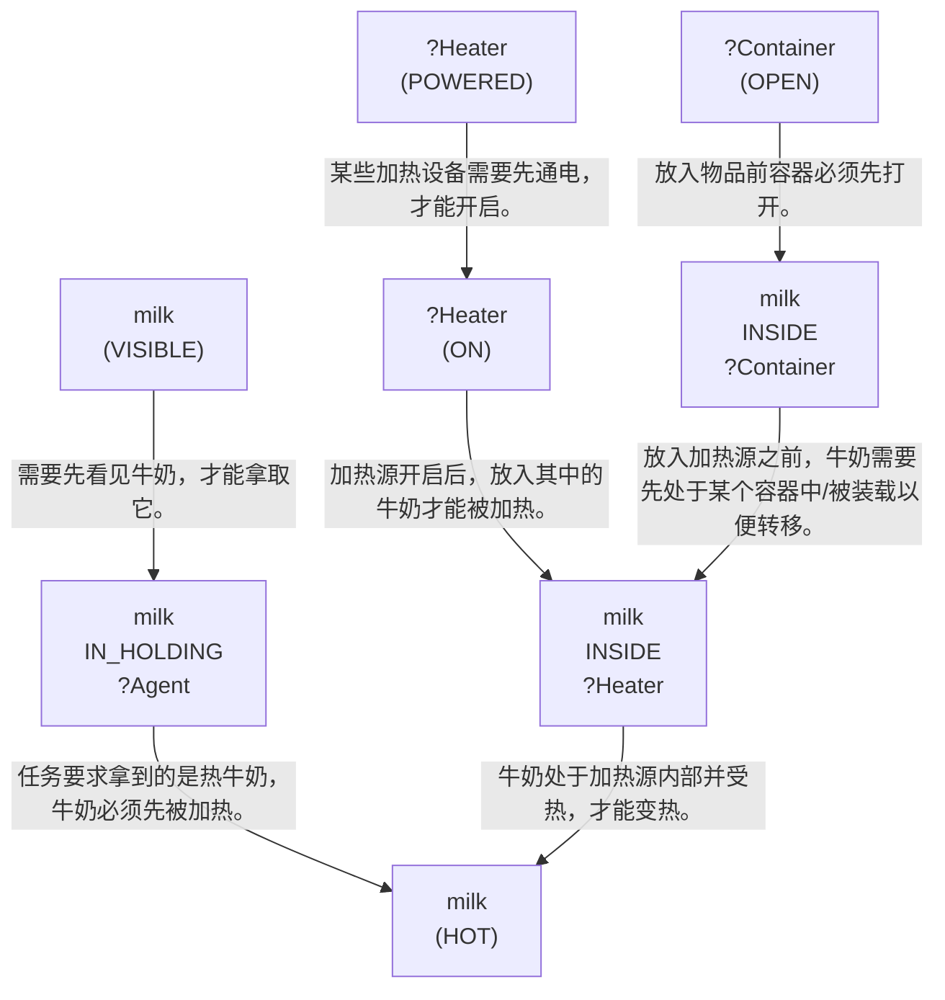

# 🚀 VirtualHome Agent Episode Log


### [GoalReasoner (Module A - Intent)] Output
```json
{
  "is_instruction_obviously_vague": true,
  "clarification_question": "请问“温度合适”具体是指偏冷、常温，还是温热？",
  "target_object": "牛奶",
  "location_hint": null,
  "reasoning_chain": [
    {
      "question": "Why does the user want this object?",
      "answer": "用户想要一杯牛奶。"
    },
    {
      "question": "Why is that important?",
      "answer": "因为用户可能想直接饮用，获得口感或补充饮品。"
    },
    {
      "question": "What fundamental need does this fulfill?",
      "answer": "满足饮用和口感/补给的需求。"
    },
    {
      "question": "Are there any deeper psychological or physical motivations?",
      "answer": "可能是解渴、补充能量，或获得符合偏好的饮用温度。"
    }
  ],
  "deep_intent": "用户想获得一杯适合饮用的液体饮品以满足口渴或补给需求",
  "acceptable_alternatives_properties": [
    {
      "priority": 1,
      "description": "其他可直接饮用的乳制品饮品，例如酸奶饮品或其他类似口感的饮品"
    },
    {
      "priority": 2,
      "description": "其他适合饮用的乳饮或植物奶饮品，例如豆奶、燕麦奶等"
    },
    {
      "priority": 3,
      "description": "常见的即饮饮品，例如果汁、茶饮或瓶装饮料"
    },
    {
      "priority": 4,
      "description": "能够满足补水需求的其他饮品，例如白开水"
    }
  ]
}
```

### [PerceptionFilter] Output
```json
{
  "reasoning": "Need the target milk, a cup to hold the milk, and all plausible heating tools from the SDG and visible scene because the goal mentions warm drink and the graph requires a heater. The visible appliances that can act as heater alternatives are stove, microwave, toaster, coffeemaker, and fridge is not a heater so excluded. Since the intent is vague about temperature, we keep the milk itself and the main container.",
  "selected_ids": [
    176,
    177,
    64,
    163,
    171,
    166,
    169
  ],
  "raw_item_count": 154
}
```

### [LLMExecutor] Output
```json
{
  "reasoning": "The instruction is explicitly marked vague: '温度合适' could mean cold, room temperature, or warm. Per the ambiguity rule, I must ask for clarification before taking any physical action. The SDG also indicates milk is already visible and already HOT, but the target temperature preference is underspecified.",
  "satisfied_nodes": [
    "N1",
    "N3"
  ],
  "current_node_focus": "N3",
  "mapped_variables": {},
  "action": "[ask] 请问“温度合适”具体是指偏冷、常温，还是温热？"
}
```
## Step 0
- **Action**: `[ask] 请问“温度合适”具体是指偏冷、常温，还是温热？`
- **SDG Status**:

- **Observed Items (8)**: waterglass(64), stove(163) [OFF,CLOSED], toaster(166) [OFF], coffeemaker(169) [OFF], microwave(171) [CLOSED,OFF], milk(176) [COLD,HOT,CLOSED], milk(177) [COLD,HOT,CLOSED], character(1)


### [GoalReasoner (Module A - Intent)] Output
```json
{
  "is_instruction_obviously_vague": false,
  "clarification_question": null,
  "target_object": "milk",
  "location_hint": null,
  "reasoning_chain": [
    {
      "question": "Why does the user want this object?",
      "answer": "They want a cup of hot milk brought to them."
    },
    {
      "question": "Why is that important?",
      "answer": "Because they likely want a warm beverage to drink."
    },
    {
      "question": "What fundamental need does this fulfill?",
      "answer": "It fulfills the need to consume a warm drink, which can provide comfort, hydration, or warmth."
    },
    {
      "question": "Are there any deeper psychological or physical motivations?",
      "answer": "The user may be seeking comfort, relaxation, or to warm up physically."
    }
  ],
  "deep_intent": "The user wants a warm drink for comfort or warmth.",
  "acceptable_alternatives_properties": [
    {
      "priority": 1,
      "description": "Other hot beverages such as warm water, tea, or coffee."
    },
    {
      "priority": 2,
      "description": "Dairy-based warm drinks or similar warm beverages."
    },
    {
      "priority": 3,
      "description": "Any ready-to-drink heated beverage that can provide warmth and hydration."
    },
    {
      "priority": 4,
      "description": "Room-temperature drinks if a hot drink is unavailable, though they are less ideal for warmth."
    }
  ]
}
```

### [PerceptionFilter] Output
```json
{
  "reasoning": "Need the target milk, plus all plausible heating appliances (microwave, stove, coffeemaker) and the container/receptacle needed to hold milk while moving or heating (cup/glass or bowl, if used). Also keep the sink/faucet as a possible place to obtain water-like heating support is not required here, but the main heating and holding tools are essential. The milk IDs are both retained as backups because multiple milk items are visible.",
  "selected_ids": [
    176,
    177,
    171,
    163,
    169,
    64,
    71,
    72,
    100,
    115,
    116,
    117,
    118,
    119,
    180,
    155,
    156
  ],
  "raw_item_count": 154
}
```

### [LLMExecutor] Output
```json
{
  "reasoning": "The SDG requires milk to be visible, held, heated, and ultimately inside an open container. In the current graph there are two milk instances, and both are already visible, HOT, and close to the agent. Since the next unmet prerequisite toward holding the milk is to pick the correct milk object. Both milk(176) and milk(177) satisfy the visible/hot criteria; I choose milk(176) as the binding for ?Container? later, but for the immediate focus the actionable step is to grab the milk while it is already near the agent. This advances N2 (IN_HOLDING) toward the heating sequence.",
  "satisfied_nodes": [
    "N1",
    "N3"
  ],
  "current_node_focus": "N2",
  "mapped_variables": {},
  "action": "[grab] <milk> (176)"
}
```
## Step 1
- **Action**: `[grab] <milk> (176)`
- **SDG Status**:

- **Observed Items (18)**: waterglass(64), waterglass(71), waterglass(72), waterglass(100), dishbowl(115), dishbowl(116), dishbowl(117), dishbowl(118), dishbowl(119), sink(155), faucet(156) [OFF], stove(163) [OFF,CLOSED], coffeemaker(169) [OFF], microwave(171) [CLOSED,OFF], dishbowl(180)...


### [PerceptionFilter] Output
```json
{
  "reasoning": "Needed items are the target milk plus all plausible heating tools and containers/openable receptacles implied by the SDG. For heating, keep the microwave, stove, and coffeemaker as alternative warm-beverage/heating options, plus the fridge if milk must be retrieved from storage. For container handling, keep the waterglass and dishbowl as possible containers, and the sink as a receptacle/location relevant to liquid handling.",
  "selected_ids": [
    176,
    177,
    162,
    171,
    163,
    169,
    64,
    71,
    115,
    155
  ],
  "raw_item_count": 155
}
```
## Step 2
- **Action**: `FINISH (Goal Reached)`
- **SDG Status**:

- **Observed Items (12)**: waterglass(64), waterglass(71), dishbowl(115), sink(155), fridge(162) [CLOSED], stove(163) [OFF,CLOSED], coffeemaker(169) [OFF], microwave(171) [CLOSED,OFF], milk(177) [COLD,HOT,CLOSED], character(1), milk(176) [COLD,HOT,CLOSED], milk(176) [COLD,HOT,CLOSED]

