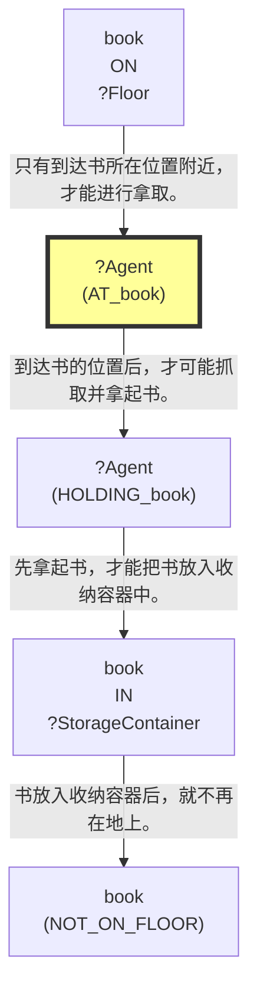
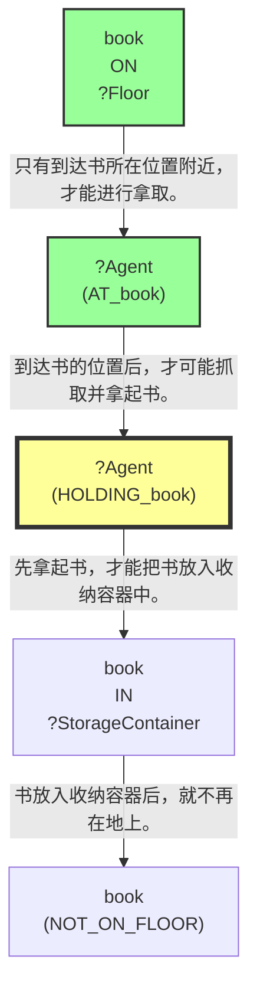
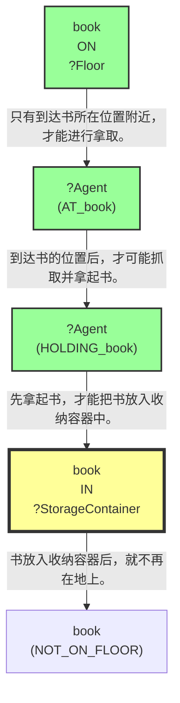
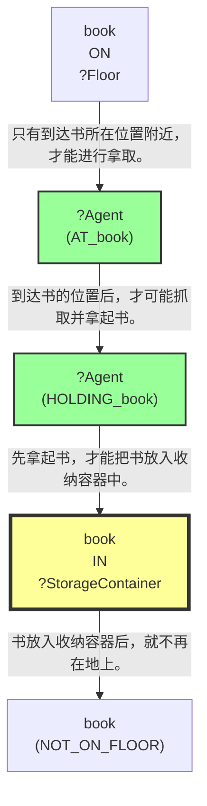
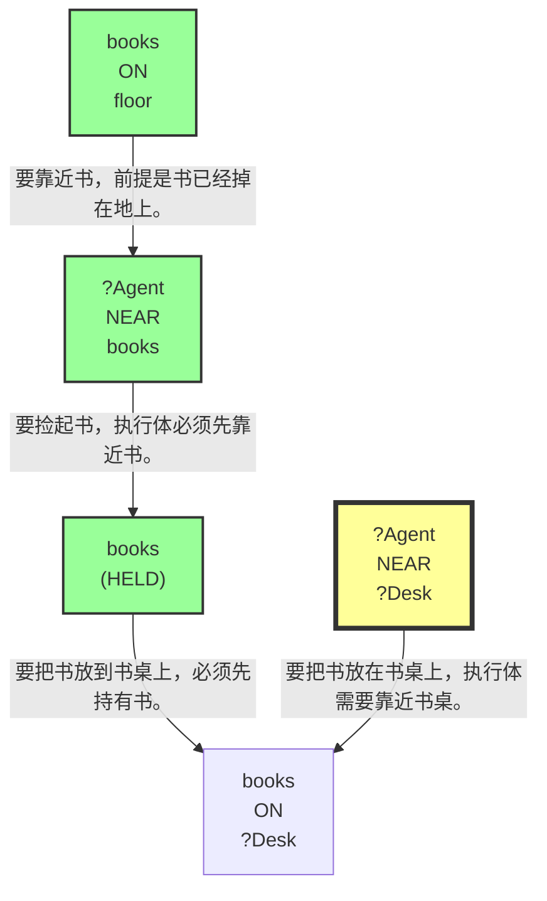
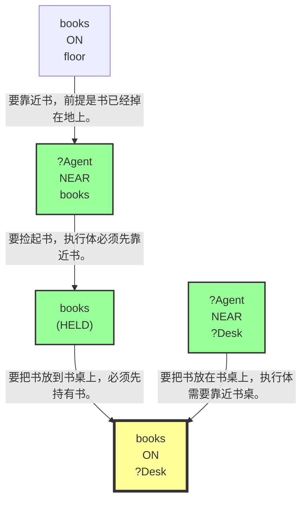
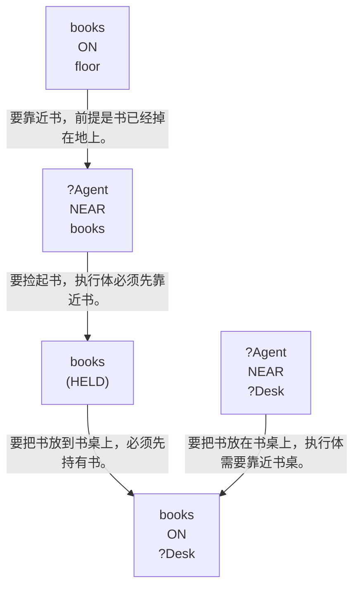

# 🚀 VirtualHome Agent Episode Log


### [GoalReasoner (Module A - Intent)] Output
```json
{
  "is_instruction_obviously_vague": false,
  "clarification_question": null,
  "target_object": "book",
  "location_hint": "floor",
  "reasoning_chain": [
    {
      "question": "Why does the user want this object?",
      "answer": "To restore the book to an orderly state after it has fallen to the floor."
    },
    {
      "question": "Why is that important?",
      "answer": "Because items on the floor are less organized and may be in the wrong place."
    },
    {
      "question": "What fundamental need does this fulfill?",
      "answer": "The user wants to tidy up and maintain an orderly environment."
    },
    {
      "question": "Are there any deeper psychological or physical motivations?",
      "answer": "It may reduce clutter, improve accessibility, and create a sense of neatness and control."
    }
  ],
  "deep_intent": "The user wants to tidy and organize a displaced item to restore order.",
  "acceptable_alternatives_properties": [
    {
      "priority": 1,
      "description": "Other similarly displaced household items that can be put back in their proper place, such as papers, magazines, or notebooks"
    },
    {
      "priority": 2,
      "description": "Other loose reading materials or flat objects that belong on a shelf or table"
    },
    {
      "priority": 3,
      "description": "Small clutter items that can be gathered and arranged neatly in an indoor space"
    },
    {
      "priority": 4,
      "description": "Any household objects that are out of place and can be returned to an organized state"
    }
  ]
}
```

### [PerceptionFilter] Output
```json
{
  "reasoning": "Need the displaced book(s) and the storage/receptacle furniture where books can be placed back to restore order. The goal is to pick up a book from the floor and return it to an organized storage location, so I keep the books and the likely storage furniture (bookshelf, cabinet, closet, desk, coffeetable) as possible valid destinations/backups.",
  "selected_ids": [
    190,
    191,
    268,
    370,
    374,
    415,
    373,
    371
  ],
  "raw_item_count": 78
}
```

### [LLMExecutor] Output
```json
{
  "reasoning": "The SDG requires the agent to be at the book before grabbing it. The filtered graph shows three book instances, and all are close to the character, but the goal is to tidy a book on the floor. No explicit floor relation is shown for any instance, so the best next step is to move to a valid book candidate to satisfy the proximity prerequisite before attempting a grab. I will start with book(190) as a valid grabbable book instance.",
  "satisfied_nodes": [],
  "current_node_focus": "N4",
  "mapped_variables": {
    "?Floor": "floor",
    "?StorageContainer": "bookshelf(370)"
  },
  "action": "[walk] <book> (190)"
}
```
## Step 0
- **Action**: `[walk] <book> (190)`
- **SDG Status**:

- **Observed Items (9)**: bookshelf(370), coffeetable(371), desk(373) [CLOSED], closet(374) [CLOSED], cabinet(415) [CLOSED], book(190) [CLOSED], book(191) [CLOSED], book(268) [CLOSED], character(1)


### [PerceptionFilter] Output
```json
{
  "reasoning": "The goal is to tidy a displaced book by locating the book(s) on the floor and any likely storage location for putting it back. I selected the book IDs and the clearly relevant storage furniture (bookshelf) needed for returning it to an orderly state.",
  "selected_ids": [
    190,
    191,
    268,
    370
  ],
  "raw_item_count": 78
}
```

### [LLMExecutor] Output
```json
{
  "reasoning": "The agent is already close to the candidate books, so the proximity requirement for grabbing is satisfied. The SDG progression is currently at N4 (AT_book) leading to N3 (HOLDING_book). Among the visible book instances, book(190) is a valid grabbable book and the best match to satisfy the holding prerequisite before any storage action. The next atomic step is to pick it up.",
  "satisfied_nodes": [
    "N1",
    "N4"
  ],
  "current_node_focus": "N3",
  "mapped_variables": {},
  "action": "[grab] <book> (190)"
}
```
## Step 1
- **Action**: `[grab] <book> (190)`
- **SDG Status**:

- **Observed Items (5)**: bookshelf(370), book(190) [CLOSED], book(191) [CLOSED], book(268) [CLOSED], character(1)


### [PerceptionFilter] Output
```json
{
  "reasoning": "Need the target book(s) that are on the floor, plus a storage/container location to restore order. Since the SDG requires moving a book from floor to storage, I keep the visible books as potential targets and the likely storage furniture/bookshelf/cabinet/closet that can receive it.",
  "selected_ids": [
    191,
    268,
    190,
    370,
    374,
    415,
    435
  ],
  "raw_item_count": 79
}
```

### [LLMExecutor] Output
```json
{
  "reasoning": "The agent is already holding book(190), which satisfies N3 (HOLDING_book). To restore the book to an orderly state and satisfy N2/N5, the next required step is to place it into an appropriate storage container. The visible open/accessible storage option is the box(435), which is a RECIPIENT container and is close to the agent. Since the book is already held, the correct next atomic action is to put it into the box.",
  "satisfied_nodes": [
    "N1",
    "N4",
    "N3"
  ],
  "current_node_focus": "N2",
  "mapped_variables": {
    "?StorageContainer": "box(435)",
    "?Floor": "floor"
  },
  "action": "[putin] <book> (190) <box> (435)"
}
```
## Step 2
- **Action**: `[putin] <book> (190) <box> (435)`
- **SDG Status**:

- **Observed Items (9)**: bookshelf(370), closet(374) [CLOSED], cabinet(415) [CLOSED], box(435) [CLOSED], book(191) [CLOSED], book(268) [CLOSED], character(1), book(190) [CLOSED], book(190) [CLOSED]


### [PerceptionFilter] Output
```json
{
  "reasoning": "Need the target book(s) that may be on the floor and the likely storage location to return them to. Since the goal is to tidy a displaced book, keep all visible books as possible targets/backups and the bookshelf as the relevant storage container.",
  "selected_ids": [
    191,
    268,
    190,
    370
  ],
  "raw_item_count": 79
}
```

### [LLMExecutor] Output
```json
{
  "reasoning": "The previous putin into box(435) failed, and the current filtered graph does not show any valid container state for that box. However, the goal is to tidy the book by storing it or placing it on an appropriate surface. The agent is already holding book(190), and a close bookshelf(370) is available as a valid storage surface/container-like object. Since the book is already in hand and the shelf is nearby, the best next atomic step is to place the book back onto the bookshelf rather than retrying the failed box action.",
  "satisfied_nodes": [
    "N4",
    "N3"
  ],
  "current_node_focus": "N2",
  "mapped_variables": {
    "?StorageContainer": "bookshelf(370)",
    "?Floor": "floor"
  },
  "action": "[putback] <book> (190) <bookshelf> (370)"
}
```
## Step 3
- **Action**: `[putback] <book> (190) <bookshelf> (370)`
- **SDG Status**:

- **Observed Items (6)**: bookshelf(370), book(191) [CLOSED], book(268) [CLOSED], character(1), book(190) [CLOSED], book(190) [CLOSED]


### [PerceptionFilter] Output
```json
{
  "reasoning": "The goal is to tidy a displaced book by locating the book on the floor and likely moving it to storage. I must keep the target book(s) that could satisfy the instruction and the relevant storage furniture that can hold books, especially the bookshelf and other possible receptacles like the desk, coffee table, closet, and cabinet as potential placement/storage options.",
  "selected_ids": [
    191,
    268,
    190,
    370,
    371,
    373,
    374,
    415
  ],
  "raw_item_count": 79
}
```

### [LLMExecutor] Output
```json
{
  "reasoning": "The agent is already holding book(190), so N3 is satisfied. The previous putin/putback attempts failed because the chosen container/surface was not executable for that object/state. The best available tidy-up action that progresses toward the book being off the floor is to place the held book onto the nearby bookshelf(370), which is close and functions as a valid surface/storage location. This would move toward N2/N5 without needing another walk.",
  "satisfied_nodes": [
    "N3",
    "N4"
  ],
  "current_node_focus": "N2",
  "mapped_variables": {
    "?StorageContainer": "bookshelf(370)"
  },
  "action": "[putback] <book> (190) <bookshelf> (370)"
}
```
## Step 4
- **Action**: `[putback] <book> (190) <bookshelf> (370)`
- **SDG Status**:

- **Observed Items (10)**: bookshelf(370), coffeetable(371), desk(373) [CLOSED], closet(374) [CLOSED], cabinet(415) [CLOSED], book(191) [CLOSED], book(268) [CLOSED], character(1), book(190) [CLOSED], book(190) [CLOSED]


### [PerceptionFilter] Output
```json
{
  "reasoning": "The goal is to tidy a book that is on the floor, so I need the book targets and the floor location to identify the displaced item. Since a storage container is required by the SDG but not explicitly visible as a distinct object, I retain the visible likely storage furniture that could serve that role, especially the bookshelf and cabinet/closet options as backups.",
  "selected_ids": [
    191,
    268,
    190,
    336,
    337,
    338,
    339,
    340,
    341,
    342,
    343,
    344,
    370,
    374,
    415
  ],
  "raw_item_count": 79
}
```

### [LLMExecutor] Output
```json
{
  "reasoning": "The agent is already holding book(190), so the holding prerequisite N3 is satisfied. The previous putin/putback attempts failed because the chosen destination was not executable; however, the current graph shows a valid nearby storage surface/container: bookshelf(370), which is CLOSE to the character and can serve as the proper place to restore the book. Since the book is already in hand and the shelf is nearby, the next atomic step should be to place it back there to progress toward N2 and N5.",
  "satisfied_nodes": [
    "N3",
    "N4"
  ],
  "current_node_focus": "N2",
  "mapped_variables": {
    "?StorageContainer": "bookshelf(370)"
  },
  "action": "[putback] <book> (190) <bookshelf> (370)"
}
```
## Step 5
- **Action**: `[putback] <book> (190) <bookshelf> (370)`
- **SDG Status**:

- **Observed Items (17)**: floor(336), floor(337), floor(338), floor(339), floor(340), floor(341), floor(342), floor(343), floor(344), bookshelf(370), closet(374) [CLOSED], cabinet(415) [CLOSED], book(191) [CLOSED], book(268) [CLOSED], character(1)...


### [PerceptionFilter] Output
```json
{
  "reasoning": "The goal is to tidy a displaced book by locating the book itself and the likely storage/replacement location where it should be put back. Per the SDG, we need the book and a storage container/furniture option. Since the visible list includes a bookshelf and several books, I keep the target book IDs plus the bookshelf as the relevant receptacle; no other objects are needed.",
  "selected_ids": [
    191,
    268,
    190,
    370
  ],
  "raw_item_count": 79
}
```

### [LLMExecutor] Output
```json
{
  "reasoning": "The agent is already holding book(190), so the next missing SDG piece is to move it into a storage location. However, the previous attempts to put it on the bookshelf were impossible, and the bookshelf is the only visible storage-like object besides the book instances. The book is a CAN_OPEN object, but the goal does not require opening the book itself; instead, the most direct next step toward getting the book off the floor is to place it back onto the bookshelf surface. Because repeated putback attempts have failed, the safest progress-making action is to ask for clarification about the intended storage location rather than guessing a different destination.",
  "satisfied_nodes": [
    "N3",
    "N4"
  ],
  "current_node_focus": "N2",
  "mapped_variables": {
    "?StorageContainer": "bookshelf(370)"
  },
  "action": "[ask] The book is already in hand, but putting it back on the bookshelf has failed repeatedly and there is no other clearly valid storage container for the book in the current scene. Which exact place should I store the book?"
}
```
## Step 6
- **Action**: `[ask] The book is already in hand, but putting it back on the bookshelf has failed repeatedly and there is no other clearly valid storage container for the book in the current scene. Which exact place should I store the book?`
- **SDG Status**:

- **Observed Items (6)**: bookshelf(370), book(191) [CLOSED], book(268) [CLOSED], character(1), book(190) [CLOSED], book(190) [CLOSED]


### [GoalReasoner (Module A - Intent)] Output
```json
{
  "is_instruction_obviously_vague": false,
  "clarification_question": null,
  "target_object": "book",
  "location_hint": "地上; 书桌上",
  "reasoning_chain": [
    {
      "question": "Why does the user want this object?",
      "answer": "To gather the books that have fallen onto the floor and place them back onto the desk."
    },
    {
      "question": "Why is that important?",
      "answer": "To restore order and prevent the books from remaining scattered on the floor."
    },
    {
      "question": "What fundamental need does this fulfill?",
      "answer": "The need to organize and tidy the environment."
    },
    {
      "question": "Are there any deeper psychological or physical motivations?",
      "answer": "It may reduce clutter, make the space easier to use, and create a neater, more controlled setting."
    }
  ],
  "deep_intent": "The user wants to restore order by tidying up scattered items.",
  "acceptable_alternatives_properties": [
    {
      "priority": 1,
      "description": "Other paper-based reading materials or documents that are scattered on the floor and should be placed together on the desk."
    },
    {
      "priority": 2,
      "description": "Similar desk-related items such as notebooks, magazines, or folders that can be organized on the desk."
    },
    {
      "priority": 3,
      "description": "Other loose household items that can be grouped and neatly put away to reduce clutter."
    },
    {
      "priority": 4,
      "description": "Any scattered items in the room that can be collected and arranged to improve tidiness."
    }
  ]
}
```

### [PerceptionFilter] Output
```json
{
  "reasoning": "The goal is to pick up books that are on the floor and place them on the desk. So I must keep the target books, the floor as their current location, and the desk as the destination. The SDG also requires the agent to be near both the books and the desk.",
  "selected_ids": [
    191,
    268,
    190,
    336,
    337,
    338,
    339,
    340,
    341,
    342,
    343,
    344,
    373
  ],
  "raw_item_count": 79
}
```

### [LLMExecutor] Output
```json
{
  "reasoning": "The goal is to place the books on the desk. The filtered graph shows the desk(373) is a movable surface and currently closed, but as a surface it does not need to be opened for putback. The agent is already holding book(190) in the right hand and is close to the desk? The graph does not explicitly show NEAR desk, so the SDG node N5 (agent near desk) is not yet satisfied. Since a putback onto the desk requires being near the desk, the next step must be to walk to the desk before attempting to place the book there. This progresses toward satisfying N5 and then N1.",
  "satisfied_nodes": [
    "N2",
    "N3",
    "N4"
  ],
  "current_node_focus": "N5",
  "mapped_variables": {
    "?Desk": "desk(373)"
  },
  "action": "[walk] <desk> (373)"
}
```
## Step 7
- **Action**: `[walk] <desk> (373)`
- **SDG Status**:

- **Observed Items (15)**: floor(336), floor(337), floor(338), floor(339), floor(340), floor(341), floor(342), floor(343), floor(344), desk(373) [CLOSED], book(191) [CLOSED], book(268) [CLOSED], character(1), book(190) [CLOSED], book(190) [CLOSED]


### [PerceptionFilter] Output
```json
{
  "reasoning": "Need only the scattered books on the floor and the desk they must be placed on; these are the required target objects and location/furniture for the tidying task. Including all visible book IDs covers the target and possible alternatives/backups for collecting and organizing them on the desk.",
  "selected_ids": [
    191,
    268,
    190,
    373
  ],
  "raw_item_count": 79
}
```

### [LLMExecutor] Output
```json
{
  "reasoning": "The agent is already close to the desk(373) and the filtered graph explicitly shows CLOSE character(1) to desk(373). The remaining gap toward the goal is to place the held book onto the desk. Since the desk is a surface, it does not need to be opened for putback. The next atomic action should therefore be to put the held book onto the desk.",
  "satisfied_nodes": [
    "N2",
    "N4",
    "N5"
  ],
  "current_node_focus": "N1",
  "mapped_variables": {
    "?Desk": "desk(373)"
  },
  "action": "[putback] <book> (190) <desk> (373)"
}
```
## Step 8
- **Action**: `[putback] <book> (190) <desk> (373)`
- **SDG Status**:

- **Observed Items (6)**: desk(373) [CLOSED], book(191) [CLOSED], book(268) [CLOSED], character(1), book(190) [CLOSED], book(190) [CLOSED]


### [PerceptionFilter] Output
```json
{
  "reasoning": "Need the scattered books as targets, plus the desk as the required destination/receptacle. The SDG requires the books to be on the floor, held, near the books, and near the desk, so the book IDs and desk ID are necessary. I also keep the additional book IDs because they are the same target type and may be the books to collect.",
  "selected_ids": [
    191,
    268,
    190,
    373
  ],
  "raw_item_count": 78
}
```
## Step 9
- **Action**: `FINISH (Goal Reached)`
- **SDG Status**:

- **Observed Items (5)**: desk(373) [CLOSED], book(191) [CLOSED], book(268) [CLOSED], book(190) [CLOSED], character(1)

