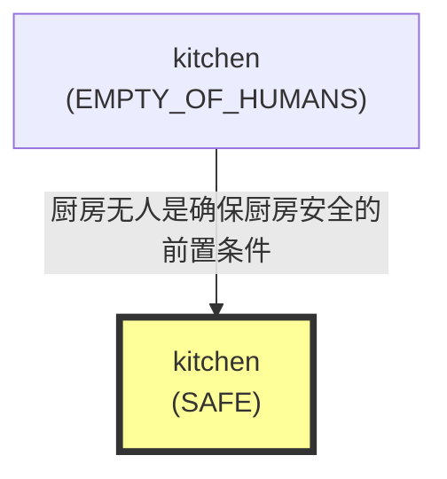
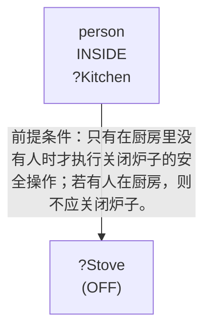

# 🚀 VirtualHome Agent Episode Log


### [GoalReasoner (Module A - Intent)] Output
```json
{
  "is_instruction_obviously_vague": true,
  "clarification_question": "请问你希望我具体检查或处理厨房里的哪些安全事项，例如炉灶是否关闭、刀具是否收好、还是电器是否断电？",
  "target_object": "kitchen",
  "location_hint": "厨房",
  "reasoning_chain": [
    {
      "question": "Why does the user want this object?",
      "answer": "To ensure the kitchen is safe when no one is there."
    },
    {
      "question": "Why is that important?",
      "answer": "To reduce the risk of accidents, damage, or hazards while the kitchen is unattended."
    },
    {
      "question": "What fundamental need does this fulfill?",
      "answer": "The need to maintain physical safety and prevent harm in the home."
    },
    {
      "question": "Are there any deeper psychological or physical motivations?",
      "answer": "Likely to create peace of mind by confirming the environment is secure and free from immediate danger."
    }
  ],
  "deep_intent": "The user wants to ensure physical safety in an unattended kitchen.",
  "acceptable_alternatives_properties": [
    {
      "priority": 1,
      "description": "Other immediate home safety checks in the kitchen, such as confirming appliances are off or hazards are put away"
    },
    {
      "priority": 2,
      "description": "Basic household hazard reduction actions, such as securing sharp objects or closing openings"
    },
    {
      "priority": 3,
      "description": "General unattended-room safety measures, such as turning off devices or removing obvious risks"
    },
    {
      "priority": 4,
      "description": "Safety assurance in another indoor area that could pose similar hazard concerns, such as a laundry room or garage"
    }
  ]
}
```

### [PerceptionFilter] Output
```json
{
  "reasoning": "To assess unattended-kitchen safety, I only need the kitchen-relevant safety targets and the human presence state. The key appliances and potential hazard items are the stove, microwave, toaster, coffeemaker, fridge, sink/faucet, and sharp tools like knives; these cover the main checks for whether heat, power, water, or dangerous objects are left unsafe. I omit decorative and unrelated furniture.",
  "selected_ids": [
    247,
    248,
    271,
    275,
    280,
    283,
    305,
    306,
    308,
    311,
    313,
    1
  ],
  "raw_item_count": 108
}
```

### [LLMExecutor] Output
```json
{
  "reasoning": "The task is explicitly vague: the user asks to ensure the kitchen is safe, but the clarification prompt indicates multiple possible safety checks (stove off, knives stored, appliances unplugged). Per the rules, I must ask for clarification before taking physical actions rather than guessing which safety condition to address first.",
  "satisfied_nodes": [],
  "current_node_focus": "N1",
  "mapped_variables": {},
  "action": "[ask] 请问你希望我具体检查或处理厨房里的哪些安全事项，例如炉灶是否关闭、刀具是否收好、还是电器是否断电？"
}
```
## Step 0
- **Action**: `[ask] 请问你希望我具体检查或处理厨房里的哪些安全事项，例如炉灶是否关闭、刀具是否收好、还是电器是否断电？`
- **SDG Status**:

- **Observed Items (12)**: sink(247), faucet(248) [OFF], cutleryknife(271), cutleryknife(275), cutleryknife(280), cutleryknife(283), fridge(305) [CLOSED], coffeemaker(306) [OFF], toaster(308) [OFF], stove(311) [CLOSED,ON,OFF], microwave(313) [CLOSED,OFF], character(1)


### [GoalReasoner (Module A - Intent)] Output
```json
{
  "is_instruction_obviously_vague": false,
  "clarification_question": null,
  "target_object": "stove",
  "location_hint": "kitchen",
  "reasoning_chain": [
    {
      "question": "Why does the user want this object?",
      "answer": "To turn it off if the kitchen is empty."
    },
    {
      "question": "Why is that important?",
      "answer": "To reduce a potential hazard in the kitchen."
    },
    {
      "question": "What fundamental need does this fulfill?",
      "answer": "To improve safety and prevent danger in the home."
    },
    {
      "question": "Are there any deeper psychological or physical motivations?",
      "answer": "The user likely wants to avoid fire risk or accidental overheating and maintain a safe environment."
    }
  ],
  "deep_intent": "The user wants to ensure home safety by eliminating a potential kitchen hazard.",
  "acceptable_alternatives_properties": [
    {
      "priority": 1,
      "description": "Other controllable kitchen heat sources or appliances that can be switched off to remove the immediate hazard"
    },
    {
      "priority": 2,
      "description": "Any active appliance or device in the kitchen that could pose a safety risk if left on unattended"
    },
    {
      "priority": 3,
      "description": "Safety-related checks in the kitchen, such as verifying that heat-generating equipment is off"
    },
    {
      "priority": 4,
      "description": "Broader home-safety actions that reduce immediate fire or accident risk"
    }
  ]
}
```

### [PerceptionFilter] Output
```json
{
  "reasoning": "The goal is to verify/turn off the stove if the kitchen is empty. The SDG requires the stove state and the presence check for a person in the kitchen. So I keep the stove as the target appliance and the kitchen-relevant context objects that could matter for a safety check or alternative heat source: stove, microwave, toaster, coffeemaker, and fridge are the main kitchen appliances visible; stovefan is also directly tied to the stove. The person/character is included because the SDG explicitly depends on whether someone is inside the kitchen.",
  "selected_ids": [
    1,
    304,
    305,
    306,
    308,
    311,
    313
  ],
  "raw_item_count": 108
}
```
## Step 1
- **Action**: `FINISH (Goal Reached)`
- **SDG Status**:

- **Observed Items (7)**: stovefan(304), fridge(305) [CLOSED], coffeemaker(306) [OFF], toaster(308) [OFF], stove(311) [CLOSED,ON,OFF], microwave(313) [CLOSED,OFF], character(1)

