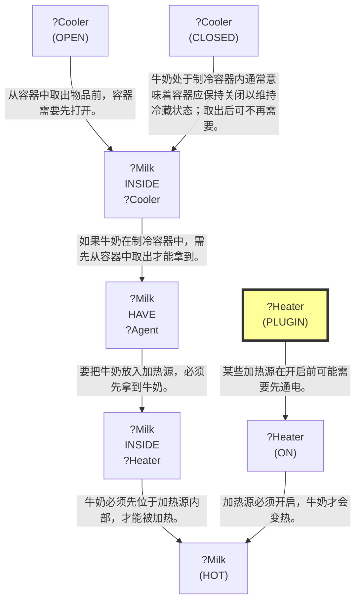
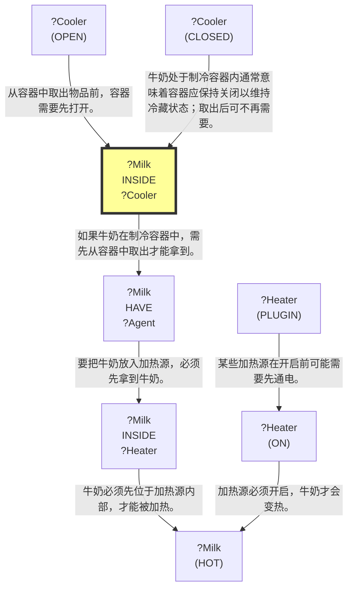
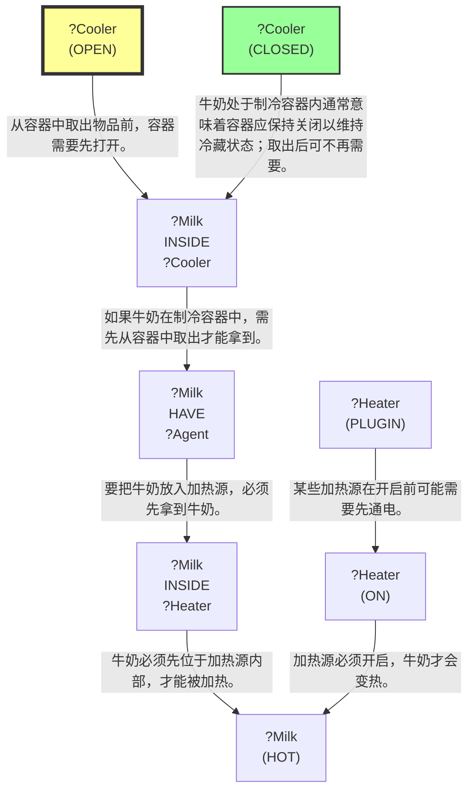
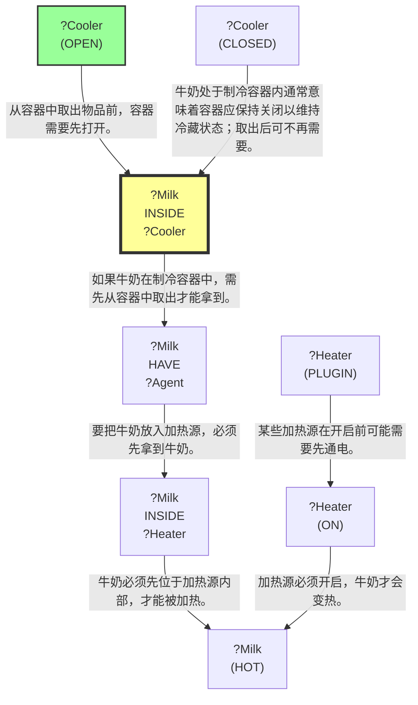
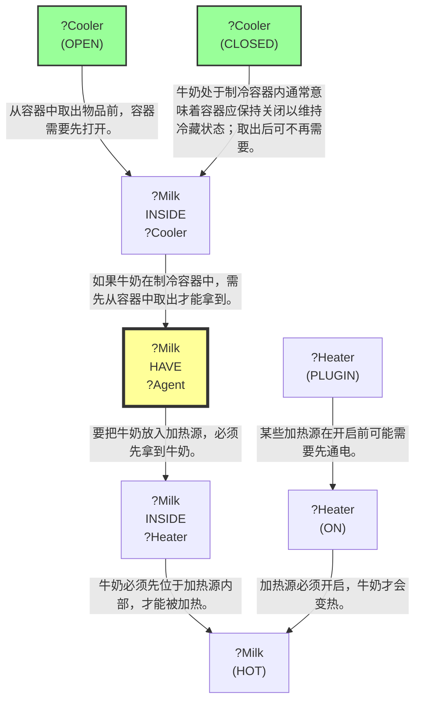
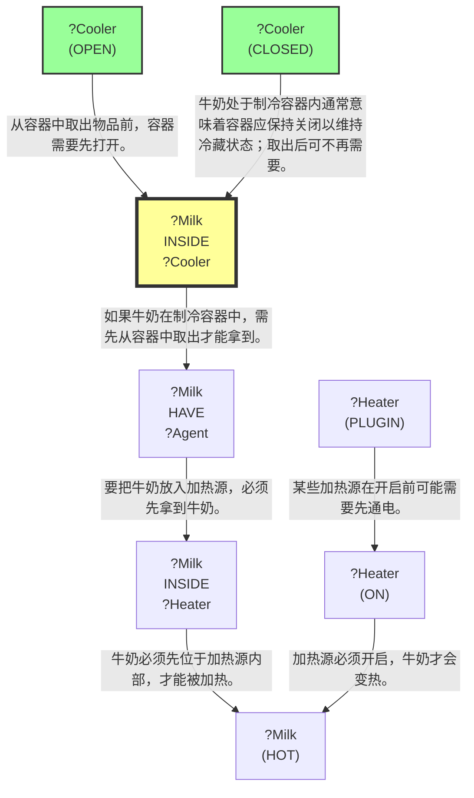

# 🚀 VirtualHome Agent Episode Log


### [GoalReasoner (Module A - Intent)] Output
```json
{
  "is_instruction_obviously_vague": false,
  "clarification_question": null,
  "target_object": "milk",
  "location_hint": "refrigerator",
  "reasoning_chain": [
    {
      "question": "Why does the user want this object?",
      "answer": "They want a warm cup of milk."
    },
    {
      "question": "Why is that important?",
      "answer": "Warming the milk makes it ready to drink in the desired form."
    },
    {
      "question": "What fundamental need does this fulfill?",
      "answer": "It fulfills the need to have a warm beverage for drinking."
    },
    {
      "question": "Are there any deeper psychological or physical motivations?",
      "answer": "The user likely wants comfort, convenience, or to satisfy thirst with a warm drink."
    }
  ],
  "deep_intent": "The user wants a warm drink for comfort or hydration.",
  "acceptable_alternatives_properties": [
    {
      "priority": 1,
      "description": "Other milk-based drinks that can be warmed, such as flavored milk or milk mixed with a small amount of cocoa"
    },
    {
      "priority": 2,
      "description": "Other ready-to-heat beverages in the same category, such as soy milk, oat milk, or hot chocolate mix prepared with milk"
    },
    {
      "priority": 3,
      "description": "Other warm beverages that provide a similar comforting drinking experience, such as tea or soup broth"
    },
    {
      "priority": 4,
      "description": "Any typical indoor beverage that can be safely heated and drunk warm, if milk is unavailable"
    }
  ]
}
```

### [PerceptionFilter] Output
```json
{
  "reasoning": "Need the milk target, the refrigerator as the cooler/location dependency, and all viable heating tools available as backups for warming it: microwave, stove, and coffeemaker. These are the minimum objects relevant to retrieving milk and heating it safely.",
  "selected_ids": [
    305,
    313,
    311,
    306
  ],
  "raw_item_count": 108
}
```

### [LLMExecutor] Output
```json
{
  "reasoning": "The goal is to obtain hot milk. The SDG requires milk to be inside a heater and the heater to be on and plugged in if needed. In the current filtered graph, the only plausible heater candidates are coffeemaker(306), stove(311), and microwave(313). The fridge(305) is marked BROKEN, so we should not rely on it for accessing milk or as a usable cooler route. Since no milk object is currently visible in the filtered graph, the next best progress is to move to a likely heating appliance that can contain milk and be opened; the coffeemaker is movable, can open, has a container, and has a plug/switch. The first atomic step toward fulfilling the heater-prep chain is to walk to the coffeemaker before any open/switch/plugin action.",
  "satisfied_nodes": [],
  "current_node_focus": "N4",
  "mapped_variables": {
    "?Heater": "coffeemaker(306)"
  },
  "action": "[walk] <coffeemaker> (306)"
}
```
## Step 0
- **Action**: `[walk] <coffeemaker> (306)`
- **SDG Status**:

- **Observed Items (5)**: fridge(305) [BROKEN,CLOSED], coffeemaker(306) [OFF], stove(311) [OFF,CLOSED], microwave(313) [CLOSED,OFF], character(1)


### [PerceptionFilter] Output
```json
{
  "reasoning": "Need the milk target, the refrigerator as the likely source/cooler, and all viable heating tools to warm it. Per alternatives retention, keep both microwave and stove as backups, and the powersocket in case the heater needs plugging in.",
  "selected_ids": [
    305,
    313,
    311,
    262
  ],
  "raw_item_count": 108
}
```

### [LLMExecutor] Output
```json
{
  "reasoning": "The SDG for hot milk requires first obtaining milk from a cooler/container. The filtered graph shows the only relevant cooler is fridge(305), which is CLOSED and marked BROKEN. Since the fridge is still the only available cooler containing milk in the graph and the task is not inherently impossible, the next needed step in the dependency chain is to move to the fridge before any attempt to open it. The previous action walked to the coffeemaker, but that does not advance the milk acquisition chain; the next atomic step should target the cooler needed for N6/N7.",
  "satisfied_nodes": [],
  "current_node_focus": "N6",
  "mapped_variables": {
    "?Milk": "milk (not currently visible)",
    "?Heater": "microwave(313)",
    "?Cooler": "fridge(305)"
  },
  "action": "[walk] <fridge> (305)"
}
```
## Step 1
- **Action**: `[walk] <fridge> (305)`
- **SDG Status**:

- **Observed Items (5)**: powersocket(262), fridge(305) [BROKEN,CLOSED], stove(311) [OFF,CLOSED], microwave(313) [CLOSED,OFF], character(1)


### [PerceptionFilter] Output
```json
{
  "reasoning": "To warm milk, I need the target milk plus the refrigerator that may contain it, and a heater to heat it. The SDG requires a heater that is on and plugged in; the visible heating options are stove and microwave, so both are kept as functional alternatives/backups. The fridge is the likely cooler/receptacle for the milk.",
  "selected_ids": [
    305,
    313,
    311
  ],
  "raw_item_count": 108
}
```

### [LLMExecutor] Output
```json
{
  "reasoning": "The SDG requires getting milk out of a cooler before it can be heated. The filtered graph shows the fridge(305) is the relevant cooler and it is currently CLOSED. We are already at the fridge from the last successful action, so the next atomic step is to open it to satisfy N7 and progress toward N6. Although the fridge is marked BROKEN, this is an execution failure/obstacle rather than an inherently impossible goal, so I should not ask for help; I should continue with the best available route.",
  "satisfied_nodes": [
    "N8"
  ],
  "current_node_focus": "N7",
  "mapped_variables": {
    "?Cooler": "fridge(305)"
  },
  "action": "[open] <fridge> (305)"
}
```
## Step 2
- **Action**: `[open] <fridge> (305)`
- **SDG Status**:

- **Observed Items (4)**: fridge(305) [BROKEN,CLOSED], stove(311) [OFF,CLOSED], microwave(313) [CLOSED,OFF], character(1)


### [PerceptionFilter] Output
```json
{
  "reasoning": "Need the milk target and the refrigerator as the likely cooler/storage location. To heat it, keep all possible heating tools present as backups: microwave, stove, and coffeemaker. Also keep the power socket as the likely plug source for appliances that need power.",
  "selected_ids": [
    305,
    313,
    311,
    306,
    262
  ],
  "raw_item_count": 108
}
```

### [LLMExecutor] Output
```json
{
  "reasoning": "The SDG focus should continue toward obtaining milk from the cooler and then heating it. The fridge(305) is already OPEN, so N7 is satisfied and the next gap is to retrieve the milk itself. No milk object is currently visible in the filtered graph, but the only way to progress from an open cooler toward N5/N6 is to grab the milk from the fridge. I should not repeat a walk action because I just walked to the fridge, and the container is already open.",
  "satisfied_nodes": [
    "N7"
  ],
  "current_node_focus": "N6",
  "mapped_variables": {
    "?Cooler": "fridge(305)",
    "?Milk": "milk"
  },
  "action": "[grab] <milk> (unknown)"
}
```
## Step 3
- **Action**: `[grab] <milk> (unknown)`
- **SDG Status**:

- **Observed Items (6)**: powersocket(262), fridge(305) [BROKEN,OPEN], coffeemaker(306) [OFF], stove(311) [OFF,CLOSED], microwave(313) [CLOSED,OFF], character(1)


### [PerceptionFilter] Output
```json
{
  "reasoning": "To warm milk, we need the milk itself, a possible cooling container it may be inside (fridge), and all viable heating options present (microwave and stove). The fridge is also needed because the SDG says the milk may be inside a cooler and must be opened to retrieve it.",
  "selected_ids": [
    305,
    313,
    311
  ],
  "raw_item_count": 108
}
```

### [LLMExecutor] Output
```json
{
  "reasoning": "The milk acquisition attempt failed because no milk object is currently visible in the filtered graph, despite the fridge being open. However, the task is not inherently impossible: milk is still implied to be in the refrigerator, and the fridge is already open. The next atomic action that could reveal or enable access to the milk is to try to grab it again from the open fridge. I will keep the current focus on obtaining the milk so it can later be heated.",
  "satisfied_nodes": [
    "N7"
  ],
  "current_node_focus": "N6",
  "mapped_variables": {
    "?Cooler": "fridge(305)",
    "?Milk": "milk (unknown)",
    "?Heater": "microwave(313)"
  },
  "action": "[grab] <milk> (unknown)"
}
```
## Step 4
- **Action**: `[grab] <milk> (unknown)`
- **SDG Status**:

- **Observed Items (4)**: fridge(305) [BROKEN,OPEN], stove(311) [OFF,CLOSED], microwave(313) [CLOSED,OFF], character(1)


### [PerceptionFilter] Output
```json
{
  "reasoning": "Needed items are the milk target and the physical options to retrieve/heat it: the refrigerator as the cooler storage, plus heating appliances that can warm it (microwave, stove, and coffeemaker as a possible beverage-heating alternative).",
  "selected_ids": [
    305,
    313,
    311,
    306
  ],
  "raw_item_count": 108
}
```

### [LLMExecutor] Output
```json
{
  "reasoning": "We need progress toward hot milk. The milk is not visible in the filtered graph, but the last failed attempts were trying to grab it without an explicit visible instance. The fridge is already OPEN and is the likely source. Since we are currently at the fridge from the previous step and the task is not inherently impossible, the best next atomic action is to try to access the milk from the open cooler again by grabbing it; if the environment now exposes it, this advances N5/N6. I will bind the cooler to fridge(305).",
  "satisfied_nodes": [
    "N7",
    "N8"
  ],
  "current_node_focus": "N5",
  "mapped_variables": {
    "?Milk": "milk (unresolved instance in fridge(305))",
    "?Cooler": "fridge(305)",
    "?Heater": "coffeemaker(306)"
  },
  "action": "[grab] <milk> (unknown)"
}
```
## Step 5
- **Action**: `[grab] <milk> (unknown)`
- **SDG Status**:

- **Observed Items (5)**: fridge(305) [BROKEN,OPEN], coffeemaker(306) [OFF], stove(311) [OFF,CLOSED], microwave(313) [CLOSED,OFF], character(1)


### [PerceptionFilter] Output
```json
{
  "reasoning": "Need the milk target and the physical locations/appliances required by the SDG: a refrigerator to get the milk from, plus heating alternatives (microwave and stove) as backups, and the milk itself if visible. Also keep power support implied by heating via plug if needed, but the SDG only requires the heating appliance state and plug-in, so the key objects are the fridge and heating appliances.",
  "selected_ids": [
    305,
    313,
    311
  ],
  "raw_item_count": 108
}
```

### [LLMExecutor] Output
```json
{
  "reasoning": "The current blocker is that milk has not been successfully retrieved yet, and repeated grab attempts failed because the milk object is not visible/bound in the filtered graph. The fridge is already OPEN and therefore N7 is satisfied, but we still need a concrete milk instance to satisfy N6/N5 before any heating can proceed. Since the fridge is the only relevant cooler and the task is not inherently impossible, the best next atomic action is to inspect/approach the open cooler context by attempting to grab the milk again only if it becomes available; however, because no exact milk instance exists in the current graph, the execution cannot target a valid object. Given the strict action format and the lack of a bindable milk instance, the only viable progression is to ask for clarification/status on the missing milk object.",
  "satisfied_nodes": [
    "N7",
    "N8"
  ],
  "current_node_focus": "N6",
  "mapped_variables": {
    "?Cooler": "fridge(305)"
  },
  "action": "[ask] The milk object is not visible in the current graph, so I cannot bind ?Milk to a valid instance to continue. Please provide the milk’s visible object ID or refresh the scene so I can retrieve it."
}
```
## Step 6
- **Action**: `[ask] The milk object is not visible in the current graph, so I cannot bind ?Milk to a valid instance to continue. Please provide the milk’s visible object ID or refresh the scene so I can retrieve it.`
- **SDG Status**:

- **Observed Items (4)**: fridge(305) [BROKEN,OPEN], stove(311) [OFF,CLOSED], microwave(313) [CLOSED,OFF], character(1)

