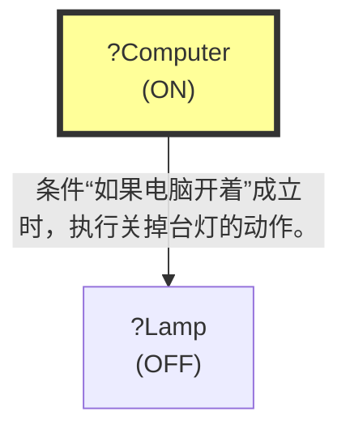

# 🚀 VirtualHome Agent Episode Log


### [GoalReasoner (Module A - Intent)] Output
```json
{
  "is_instruction_obviously_vague": false,
  "clarification_question": null,
  "target_object": "台灯",
  "location_hint": null,
  "reasoning_chain": [
    {
      "question": "Why does the user want this object?",
      "answer": "Because they want the lamp to be turned off if the computer is on."
    },
    {
      "question": "Why is that important?",
      "answer": "To reduce unnecessary lighting or change the room's lighting condition when the computer is operating."
    },
    {
      "question": "What fundamental need does this fulfill?",
      "answer": "To control indoor lighting."
    },
    {
      "question": "Are there any deeper psychological or physical motivations?",
      "answer": "It may be to save energy, reduce glare, or create a more suitable lighting environment."
    }
  ],
  "deep_intent": "The user wants to control indoor lighting conditionally based on whether the computer is on.",
  "acceptable_alternatives_properties": [
    {
      "priority": 1,
      "description": "Other indoor light sources that can be turned off, such as a desk lamp or floor lamp"
    },
    {
      "priority": 2,
      "description": "Any nearby room lighting device with a simple on/off control"
    },
    {
      "priority": 3,
      "description": "Other controllable household lights that affect the same area"
    },
    {
      "priority": 4,
      "description": "A different light source in the room that can be disabled to reduce brightness"
    }
  ]
}
```

### [PerceptionFilter] Output
```json
{
  "reasoning": "Need the computer state trigger and the lamp to turn off. Since the target is a table lamp and alternatives should be retained, include both visible table lamps plus the other controllable light source in the room and the computer/lightswitch relevant to the conditional lighting task.",
  "selected_ids": [
    102,
    103,
    101,
    173,
    174,
    175
  ],
  "raw_item_count": 70
}
```

### [LLMExecutor] Output
```json
{
  "reasoning": "The SDG requires ?Computer to be ON before turning ?Lamp OFF. In the filtered graph, the only computer instance is computer(174), but it is explicitly marked BROKEN and currently OFF. Because the prerequisite state ON is permanently impossible for the available computer, the conditional task cannot be satisfied as specified. I should report this impossibility rather than guess or interact with a substitute device, since the exact object class must be used.",
  "satisfied_nodes": [],
  "current_node_focus": "N1",
  "mapped_variables": {
    "?Computer": "computer(174)",
    "?Lamp": "tablelamp(102)"
  },
  "action": "[ask] The only available computer is computer(174), and it is marked BROKEN and OFF, so the required condition \"if the computer is on\" cannot be satisfied. Please clarify if you want me to turn off a lamp anyway or if there is another computer to use."
}
```
## Step 0
- **Action**: `[ask] The only available computer is <computer> (174), and it is marked BROKEN and OFF, so the required condition "if the computer is on" cannot be satisfied. Please clarify if you want me to turn off a lamp anyway or if there is another computer to use.`
- **SDG Status**:

- **Observed Items (7)**: ceilinglamp(101), tablelamp(102) [ON], tablelamp(103) [ON], lightswitch(173) [ON], computer(174) [OFF,BROKEN], cpuscreen(175), character(1)

