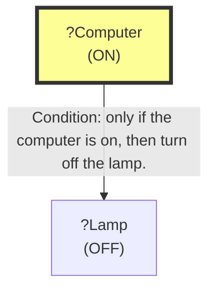

# 🚀 VirtualHome Agent Episode Log


### [GoalReasoner (Module A - Intent)] Output
```json
{
  "is_instruction_obviously_vague": false,
  "clarification_question": null,
  "target_object": "台灯",
  "location_hint": null,
  "reasoning_chain": [
    {
      "question": "Why does the user want this object?",
      "answer": "To turn off the lamp if the computer is on."
    },
    {
      "question": "Why is that important?",
      "answer": "To reduce unnecessary lighting or align the lighting state with the computer's status."
    },
    {
      "question": "What fundamental need does this fulfill?",
      "answer": "The user wants to control the room's lighting condition."
    },
    {
      "question": "Are there any deeper psychological or physical motivations?",
      "answer": "The user may want to save energy, avoid excess brightness, or create a more suitable indoor lighting environment."
    }
  ],
  "deep_intent": "The user wants to adjust indoor lighting to a less illuminated state when the computer is on.",
  "acceptable_alternatives_properties": [
    {
      "priority": 1,
      "description": "Other indoor light sources that can be turned off, such as a desk lamp or floor lamp"
    },
    {
      "priority": 2,
      "description": "Nearby lamps or room lights that provide similar illumination and can be switched off"
    },
    {
      "priority": 3,
      "description": "Any controllable household lighting device that can reduce the room's brightness"
    },
    {
      "priority": 4,
      "description": "If no lamp is available, other ways to reduce brightness indoors, such as turning off a light fixture"
    }
  ]
}
```

### [PerceptionFilter] Output
```json
{
  "reasoning": "The goal is to turn off a lamp while the computer is on. The minimum needed classes are the computer plus the lamp-type lighting devices that could be turned off. Because acceptable alternatives include other indoor light sources and backups, I keep all visible controllable lamps/lights that could satisfy the goal.",
  "selected_classes": [
    "computer",
    "floor",
    "character",
    "lightswitch",
    "walllamp",
    "ceilinglamp",
    "door",
    "desk",
    "tablelamp"
  ],
  "raw_class_count": 112
}
```

### [LLMExecutor] Output
```json
{
  "reasoning": "The SDG requires the computer to be ON first, then a lamp to be OFF. The only visible computers (174, 433) are both marked BROKEN and OFF, so the required prerequisite state N1 is permanently impossible in the current environment. Because this is an inherently false precondition, I must report impossibility rather than guess or act on an unrelated lamp.",
  "satisfied_nodes": [],
  "current_node_focus": "N1",
  "mapped_variables": {
    "?Computer": "computer(174)",
    "?Lamp": "tablelamp(102)"
  },
  "action": "[ask] The task is impossible as specified because the only visible computers are marked BROKEN and OFF, so I cannot satisfy the شرط that the computer is ON."
}
```
## Step 0
- **Action**: `[ask] The task is impossible as specified because the only visible computers are marked BROKEN and OFF, so I cannot satisfy the شرط that the computer is ON.`
- **SDG Status**:

- **Observed Items (59)**: character(1), bathroom(11), floor(12), floor(13), floor(14), floor(15), floor(16), floor(17), ceilinglamp(34), walllamp(35), walllamp(36), walllamp(37), door(51) [OPEN], lightswitch(71) [ON], bedroom(73)...

