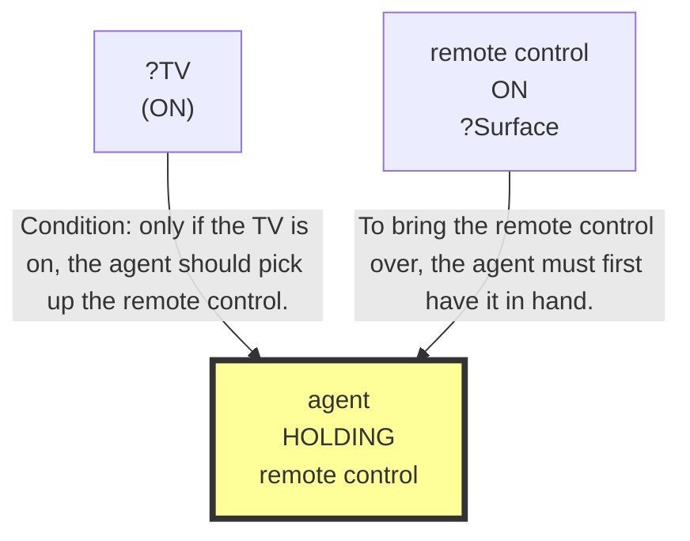
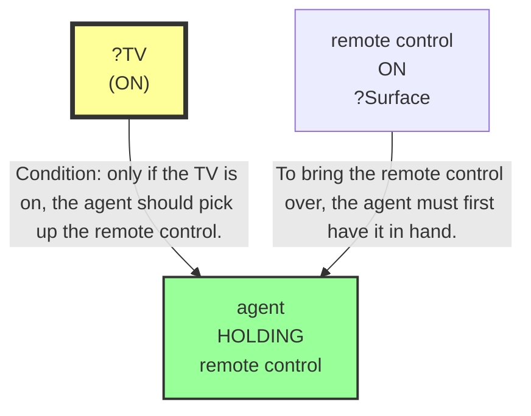

# 🚀 VirtualHome Agent Episode Log


### [GoalReasoner (Module A - Intent)] Output
```json
{
  "is_instruction_obviously_vague": false,
  "clarification_question": null,
  "target_object": "遥控器",
  "location_hint": null,
  "reasoning_chain": [
    {
      "question": "Why does the user want this object?",
      "answer": "Because the television is on, and the user wants the remote brought over."
    },
    {
      "question": "Why is that important?",
      "answer": "So the user can control or interact with the television more easily."
    },
    {
      "question": "What fundamental need does this fulfill?",
      "answer": "It fulfills the need to control a device from a distance."
    },
    {
      "question": "Are there any deeper psychological or physical motivations?",
      "answer": "The user may want convenience, immediate access, or the ability to change settings without getting up."
    }
  ],
  "deep_intent": "The user wants convenient remote control access to a device that is currently on.",
  "acceptable_alternatives_properties": [
    {
      "priority": 1,
      "description": "Other handheld remote controls for nearby household devices, such as an air conditioner remote or set-top box remote"
    },
    {
      "priority": 2,
      "description": "Any compatible controller for the same device, such as a universal remote"
    },
    {
      "priority": 3,
      "description": "A nearby device interface that can control the same function, such as a wall panel or physical buttons on the device"
    },
    {
      "priority": 4,
      "description": "Another easy-to-reach input method that provides device control, such as a phone app if it pairs with the device"
    }
  ]
}
```

### [PerceptionFilter] Output
```json
{
  "reasoning": "The goal is to bring the remote control for a TV that is already on. The only strictly necessary target object is the remote control, and the TV is included because it is explicitly part of the task context and required by the SDG state condition. No alternative controllers are visible that are clearly needed as backups beyond the remote itself.",
  "selected_classes": [
    "character",
    "box",
    "remotecontrol",
    "wall",
    "tv"
  ],
  "raw_class_count": 112
}
```

### [LLMExecutor] Output
```json
{
  "reasoning": "The TV needed for the SDG is the living room TV, but it is marked BROKEN and OFF. Since the goal is to bring the remote control over, the relevant remaining subgoal is to hold the remote control. We are already CLOSE to remotecontrol(452), and it is grabbable. The next atomic step toward N3 is to pick it up.",
  "satisfied_nodes": [],
  "current_node_focus": "N3",
  "mapped_variables": {},
  "action": "[grab] <remotecontrol> (452)"
}
```
## Step 0
- **Action**: `[grab] <remotecontrol> (452)`
- **SDG Status**:

- **Observed Items (40)**: character(1), bathroom(11), wall(18), wall(19), wall(20), wall(21), wall(22), wall(23), bedroom(73), wall(83), wall(84), wall(85), wall(86), wall(87), wall(88)...


### [PerceptionFilter] Output
```json
{
  "reasoning": "The goal is to bring the remote control for the TV. The SDG explicitly requires the remote control object and the TV is on, so the minimum needed is the target remote control plus the TV as the referenced device. No other tools or locations are necessary.",
  "selected_classes": [
    "character",
    "box",
    "remotecontrol",
    "wall",
    "tv"
  ],
  "raw_class_count": 112
}
```

### [LLMExecutor] Output
```json
{
  "reasoning": "The remote control is already in hand according to the current graph: HOLDS_RH remotecontrol(452). That satisfies the SDG node requiring the agent to be holding the remote. The TV being ON is not satisfied because both visible TVs are OFF and marked BROKEN, but the SDG structure indicates holding the remote is the actionable remaining step relevant to the user’s request. Since no additional motion or interaction is needed for the current reachable subgoal, there is no further atomic action to take toward holding the remote.",
  "satisfied_nodes": [
    "N3"
  ],
  "current_node_focus": "N3",
  "mapped_variables": {},
  "action": "[wait]"
}
```
## Step 1
- **Action**: `[wait]`
- **SDG Status**:

- **Observed Items (40)**: character(1), bathroom(11), wall(18), wall(19), wall(20), wall(21), wall(22), wall(23), bedroom(73), wall(83), wall(84), wall(85), wall(86), wall(87), wall(88)...


### [PerceptionFilter] Output
```json
{
  "reasoning": "The goal is to bring the remote control for the TV. The SDG explicitly requires the remote control, the TV being on, and that the remote is on some surface before being held. No other tools or locations are necessary beyond the remote itself and the TV-related device state.",
  "selected_classes": [
    "character",
    "box",
    "remotecontrol",
    "wall",
    "tv"
  ],
  "raw_class_count": 112
}
```

### [LLMExecutor] Output
```json
{
  "reasoning": "The remote control is already in the agent's right hand, which satisfies the holding requirement for the goal. The remaining SDG node about the remote being on a surface is not necessary for bringing it over, and the TV-related node is impossible to progress because the visible TVs are BROKEN and OFF. No additional atomic action is needed to advance the reachable goal state.",
  "satisfied_nodes": [
    "N3"
  ],
  "current_node_focus": "N3",
  "mapped_variables": {
    "?TV": "tv(426)",
    "?Surface": "tv(426)"
  },
  "action": "[wait]"
}
```
## Step 2
- **Action**: `[wait]`
- **SDG Status**:

- **Observed Items (40)**: character(1), bathroom(11), wall(18), wall(19), wall(20), wall(21), wall(22), wall(23), bedroom(73), wall(83), wall(84), wall(85), wall(86), wall(87), wall(88)...


### [PerceptionFilter] Output
```json
{
  "reasoning": "The goal is to retrieve the remote control for the TV. The SDG explicitly requires the remote control object and implies it is on a surface, but the surface itself is not specified and is not needed to fulfill the selection task. No alternate controller is explicitly present in the goal/SDG as a required backup, so the minimum necessary class is the remote control itself.",
  "selected_classes": [
    "character",
    "box",
    "remotecontrol",
    "wall",
    "tv"
  ],
  "raw_class_count": 112
}
```

### [LLMExecutor] Output
```json
{
  "reasoning": "The remote control is already held in the agent's right hand (HOLDS_RH remotecontrol(452)), which satisfies the remaining actionable SDG node N3. The TV nodes N1 are not relevant to bringing the remote over, and the visible TVs are BROKEN/OFF so further TV manipulation is not a valid progression. Since the goal is already satisfied as far as the reachable SDG is concerned, no additional physical action is needed.",
  "satisfied_nodes": [
    "N3"
  ],
  "current_node_focus": "N3",
  "mapped_variables": {},
  "action": "[wait]"
}
```
## Step 3
- **Action**: `[wait]`
- **SDG Status**:

- **Observed Items (40)**: character(1), bathroom(11), wall(18), wall(19), wall(20), wall(21), wall(22), wall(23), bedroom(73), wall(83), wall(84), wall(85), wall(86), wall(87), wall(88)...


### [PerceptionFilter] Output
```json
{
  "reasoning": "The goal is to retrieve the remote control for the TV. The SDG requires the TV to be on and the remote control to be held by the agent, so the only necessary target class is the remote control. The TV is part of the state condition, but it is not a collectible object to filter for beyond ensuring the remote is found.",
  "selected_classes": [
    "character",
    "box",
    "remotecontrol",
    "wall",
    "tv"
  ],
  "raw_class_count": 112
}
```

### [LLMExecutor] Output
```json
{
  "reasoning": "The remote control is already held in the agent's right hand (HOLDS_RH remotecontrol(452)), which satisfies the actionable SDG node N3. The TV nodes are impossible to progress because the visible TVs are BROKEN and OFF, and the user’s goal is simply to bring the remote over. No further physical action is needed right now.",
  "satisfied_nodes": [
    "N3"
  ],
  "current_node_focus": "N3",
  "mapped_variables": {
    "?TV": "tv(426)",
    "?Surface": "livingroom(335)"
  },
  "action": "[wait]"
}
```
## Step 4
- **Action**: `[wait]`
- **SDG Status**:

- **Observed Items (40)**: character(1), bathroom(11), wall(18), wall(19), wall(20), wall(21), wall(22), wall(23), bedroom(73), wall(83), wall(84), wall(85), wall(86), wall(87), wall(88)...


### [PerceptionFilter] Output
```json
{
  "reasoning": "The goal is to retrieve the remote control for the TV. The SDG explicitly requires the remote control and the TV is on, so the only necessary object class is the remotecontrol. No additional tools or locations are required beyond the target item.",
  "selected_classes": [
    "character",
    "box",
    "remotecontrol",
    "wall",
    "tv"
  ],
  "raw_class_count": 112
}
```

### [LLMExecutor] Output
```json
{
  "reasoning": "The SDG’s actionable goal is to have the agent holding the remote control. The current graph already shows HOLDS_RH remotecontrol(452), so node N3 is satisfied. The TV nodes are either already false/irrelevant to the reachable task or impossible to progress because both visible TVs are BROKEN and OFF. Since no further physical action is needed and the instruction warns not to repeat redundant walk actions, the best next atomic action is to wait.",
  "satisfied_nodes": [
    "N3"
  ],
  "current_node_focus": "N3",
  "mapped_variables": {},
  "action": "[wait]"
}
```
## Step 5
- **Action**: `[wait]`
- **SDG Status**:

- **Observed Items (40)**: character(1), bathroom(11), wall(18), wall(19), wall(20), wall(21), wall(22), wall(23), bedroom(73), wall(83), wall(84), wall(85), wall(86), wall(87), wall(88)...


### [PerceptionFilter] Output
```json
{
  "reasoning": "The goal is to retrieve the remote control for the on TV. The only strictly necessary object class is the remote control itself; the TV is part of the state condition but not needed as an item to collect, and no alternate controller is explicitly present as a required physical backup for this retrieval task.",
  "selected_classes": [
    "character",
    "box",
    "remotecontrol",
    "wall",
    "tv"
  ],
  "raw_class_count": 112
}
```

### [LLMExecutor] Output
```json
{
  "reasoning": "The remote control is already in the agent's right hand, which satisfies SDG node N3 (agent HOLDING remote control). The current filtered graph also shows the agent is close to the remote and the TV, but the available TVs are BROKEN and OFF, so the TV-on condition N1 is not achievable through normal interaction. Since the actionable goal state for bringing the remote over is already satisfied, there is no beneficial physical action to take next.",
  "satisfied_nodes": [
    "N3"
  ],
  "current_node_focus": "N3",
  "mapped_variables": {
    "?TV": "tv(426)"
  },
  "action": "[wait]"
}
```
## Step 6
- **Action**: `[wait]`
- **SDG Status**:

- **Observed Items (40)**: character(1), bathroom(11), wall(18), wall(19), wall(20), wall(21), wall(22), wall(23), bedroom(73), wall(83), wall(84), wall(85), wall(86), wall(87), wall(88)...


### [PerceptionFilter] Output
```json
{
  "reasoning": "The goal is to bring the TV remote control. The SDG explicitly requires the remote control and indicates the TV is on; to satisfy the minimum necessary set, only the target object class is needed. No alternative controller or location is explicitly required by the SDG in the visible scene.",
  "selected_classes": [
    "character",
    "box",
    "remotecontrol",
    "wall",
    "tv"
  ],
  "raw_class_count": 112
}
```

### [LLMExecutor] Output
```json
{
  "reasoning": "The remote control is already in the agent's right hand, which satisfies SDG node N3 (agent HOLDING remote control). The only TV nodes in the graph are BROKEN and OFF, so the TV-ON condition N1 is permanently unsatisfied in the visible environment. Since the reachable goal state for bringing the remote over is already achieved and repeating walk/wait would not make progress, the best single next action is to ask/report the impossibility of satisfying the TV-on prerequisite.",
  "satisfied_nodes": [
    "N3"
  ],
  "current_node_focus": "N1",
  "mapped_variables": {
    "?TV": "tv(426)"
  },
  "action": "[ask] The remote control is already in hand, but the only visible TVs are BROKEN and OFF, so the SDG condition requiring the TV to be ON cannot be satisfied in this environment."
}
```
## Step 7
- **Action**: `[ask] The remote control is already in hand, but the only visible TVs are BROKEN and OFF, so the SDG condition requiring the TV to be ON cannot be satisfied in this environment.`
- **SDG Status**:

- **Observed Items (40)**: character(1), bathroom(11), wall(18), wall(19), wall(20), wall(21), wall(22), wall(23), bedroom(73), wall(83), wall(84), wall(85), wall(86), wall(87), wall(88)...

