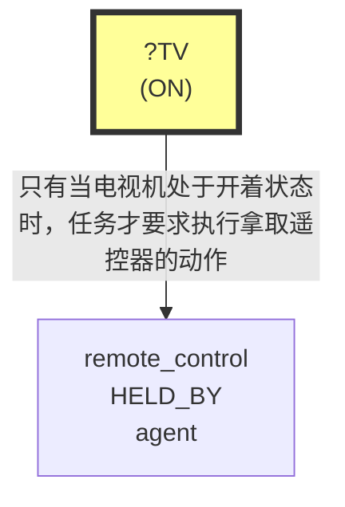

# 🚀 VirtualHome Agent Episode Log


### [GoalReasoner (Module A - Intent)] Output
```json
{
  "is_instruction_obviously_vague": false,
  "clarification_question": null,
  "target_object": "遥控器",
  "location_hint": "电视机",
  "reasoning_chain": [
    {
      "question": "Why does the user want this object?",
      "answer": "Because the TV is on, and the remote is needed to control it."
    },
    {
      "question": "Why is that important?",
      "answer": "To change the TV's state or operation without having to interact with it directly."
    },
    {
      "question": "What fundamental need does this fulfill?",
      "answer": "The user wants convenient control over the television."
    },
    {
      "question": "Are there any deeper psychological or physical motivations?",
      "answer": "The user may want to manage viewing conditions, such as turning the TV off or adjusting settings, which supports comfort and control of the environment."
    }
  ],
  "deep_intent": "The user wants convenient control over an active television.",
  "acceptable_alternatives_properties": [
    {
      "priority": 1,
      "description": "Other nearby TV control devices or universal remotes that can operate the television."
    },
    {
      "priority": 2,
      "description": "A replacement remote compatible with the television."
    },
    {
      "priority": 3,
      "description": "Any handheld controller or smart-device app that can control the television."
    },
    {
      "priority": 4,
      "description": "A physical method of interacting with the television's controls directly, if remote control is unavailable."
    }
  ]
}
```

### [PerceptionFilter] Output
```json
{
  "reasoning": "Need the target remote control and the active television it is meant to control. The SDG only requires the remote to be held by the agent, and the location hint points to the TV, so both IDs are necessary. If multiple remotes existed I would keep all compatible controls, but only one remote is visible here.",
  "selected_ids": [
    426,
    452
  ],
  "raw_item_count": 75
}
```

### [LLMExecutor] Output
```json
{
  "reasoning": "The SDG requires two conditions: the TV must be ON (N1) and the remote_control must be held by the agent (N2). In the current graph, the TV is explicitly OFF and BROKEN, which makes the required TV-ON state permanently impossible. Because the goal's prerequisite condition cannot be satisfied, I must report this impossibility rather than proceed with physical actions.",
  "satisfied_nodes": [],
  "current_node_focus": "N1",
  "mapped_variables": {
    "?TV": "tv(426)"
  },
  "action": "[ask] The required prerequisite is impossible: the target TV (426) is marked BROKEN and OFF, so it cannot be brought to the ON state needed before taking the remote."
}
```
## Step 0
- **Action**: `[ask] The required prerequisite is impossible: the target <TV> (426) is marked BROKEN and OFF, so it cannot be brought to the ON state needed before taking the remote.`
- **SDG Status**:

- **Observed Items (3)**: tv(426) [OFF,BROKEN], remotecontrol(452) [OFF], character(1)

