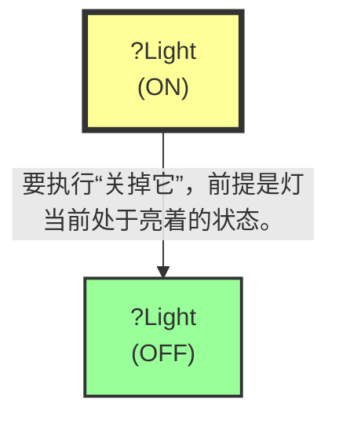
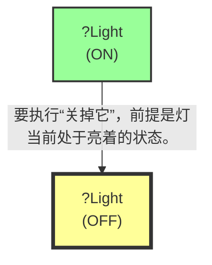

# 🚀 VirtualHome Agent Episode Log


### [GoalReasoner (Module A - Intent)] Output
```json
{
  "is_instruction_obviously_vague": false,
  "clarification_question": null,
  "target_object": "lamp/light",
  "location_hint": null,
  "reasoning_chain": [
    {
      "question": "Why does the user want this object?",
      "answer": "They want the illuminated light source turned off if it is currently on."
    },
    {
      "question": "Why is that important?",
      "answer": "To stop the light from being on, likely because the current lighting state is unwanted."
    },
    {
      "question": "What fundamental need does this fulfill?",
      "answer": "It fulfills the need to control the room's lighting state."
    },
    {
      "question": "Are there any deeper psychological or physical motivations?",
      "answer": "It may be to reduce brightness, improve comfort, save energy, or allow darkness."
    }
  ],
  "deep_intent": "The user wants to turn off an unwanted light source.",
  "acceptable_alternatives_properties": [
    {
      "priority": 1,
      "description": "Other indoor light sources that are currently on and can be switched off, such as a ceiling light, desk lamp, or floor lamp"
    },
    {
      "priority": 2,
      "description": "Nearby artificial lighting devices that provide illumination in the same room and can be turned off"
    },
    {
      "priority": 3,
      "description": "Any controllable household light-emitting device that is currently active"
    },
    {
      "priority": 4,
      "description": "If no switchable light is available, reducing illumination by closing curtains or turning off another comparable indoor light source"
    }
  ]
}
```

### [PerceptionFilter] Output
```json
{
  "reasoning": "The goal is to turn off an unwanted light source. I need to keep all controllable light sources that could be the target, plus the switch used to turn them off. The visible candidate lights are the ceiling lamp and the two table lamps; the lightswitch is the likely control. Curtains are also retained as a fallback alternative for reducing illumination if needed.",
  "selected_ids": [
    101,
    102,
    103,
    173,
    183,
    184,
    185
  ],
  "raw_item_count": 70
}
```

### [LLMExecutor] Output
```json
{
  "reasoning": "The goal is to make a light source OFF. Among available candidates, lightswitch(173) is currently ON and is the most direct controllable lighting-related device. The tablelamps are already OFF and BROKEN, so they are not active light sources. To satisfy N2 -> N1, the next step is to switch off the active lightswitch. Because switch actions require proximity, we must first walk to it.",
  "satisfied_nodes": [
    "N1"
  ],
  "current_node_focus": "N2",
  "mapped_variables": {
    "?Light": "lightswitch(173)"
  },
  "action": "[walk] <lightswitch> (173)"
}
```
## Step 0
- **Action**: `[walk] <lightswitch> (173)`
- **SDG Status**:

- **Observed Items (8)**: ceilinglamp(101), tablelamp(102) [BROKEN,OFF], tablelamp(103) [BROKEN,OFF], lightswitch(173) [ON], curtains(183) [CLOSED], curtains(184) [CLOSED], curtains(185) [CLOSED], character(1)


### [PerceptionFilter] Output
```json
{
  "reasoning": "To turn off an unwanted light, I need the controllable light source(s) that could be on, plus the switch. I kept all plausible indoor lighting alternatives: ceiling lamp, table lamp, candle, and the lightswitch, along with curtains as a fallback way to reduce illumination if needed.",
  "selected_ids": [
    101,
    102,
    173,
    181,
    183,
    184,
    185
  ],
  "raw_item_count": 69
}
```

### [LLMExecutor] Output
```json
{
  "reasoning": "The active light source in the filtered graph is lightswitch(173), which is already marked ON and the agent is already CLOSE to it. The SDG requires transitioning from ON to OFF, so the next atomic action should directly switch it off.",
  "satisfied_nodes": [
    "N2"
  ],
  "current_node_focus": "N1",
  "mapped_variables": {
    "?Light": "lightswitch(173)"
  },
  "action": "[switchoff] <lightswitch> (173)"
}
```
## Step 1
- **Action**: `[switchoff] <lightswitch> (173)`
- **SDG Status**:

- **Observed Items (8)**: ceilinglamp(101), tablelamp(102) [BROKEN,OFF], lightswitch(173) [ON], candle(181) [OFF], curtains(183) [CLOSED], curtains(184) [CLOSED], curtains(185) [CLOSED], character(1)


### [PerceptionFilter] Output
```json
{
  "reasoning": "To turn off the unwanted light, I need the active light source(s) and the control that can switch them off. I kept the indoor lights that could plausibly be the target, plus the lightswitch as the control. Curtains are also retained as a fallback way to reduce illumination if no switchable light is used.",
  "selected_ids": [
    101,
    102,
    173,
    183,
    184,
    185
  ],
  "raw_item_count": 69
}
```

### [LLMExecutor] Output
```json
{
  "reasoning": "The required light source state transition is already achieved: lightswitch(173) is now OFF and the agent is close to it. This satisfies the SDG root goal N1 (OFF) via the prior N2 -> N1 transition. No further physical action is needed.",
  "satisfied_nodes": [
    "N1",
    "N2"
  ],
  "current_node_focus": "N1",
  "mapped_variables": {
    "?Light": "lightswitch(173)"
  },
  "action": "[wait]"
}
```
## Step 2
- **Action**: `[wait]`
- **SDG Status**:

- **Observed Items (7)**: ceilinglamp(101), tablelamp(102) [BROKEN,OFF], lightswitch(173) [OFF], curtains(183) [CLOSED], curtains(184) [CLOSED], curtains(185) [CLOSED], character(1)


### [PerceptionFilter] Output
```json
{
  "reasoning": "To turn off an unwanted light, I only need the controllable light sources that could be on and the switch that may control them. I kept both ceilinglamp and tablelamp as alternative indoor lights, plus the lightswitch as the likely control. Curtains are included as a fallback alternative for reducing illumination if needed.",
  "selected_ids": [
    101,
    102,
    173,
    183,
    184,
    185
  ],
  "raw_item_count": 69
}
```

### [LLMExecutor] Output
```json
{
  "reasoning": "The SDG requires a light to transition from ON to OFF. In the current filtered graph, lightswitch(173) is already OFF and the prior actions already achieved the necessary transition. Therefore the goal is satisfied and no further physical action is needed.",
  "satisfied_nodes": [
    "N1",
    "N2"
  ],
  "current_node_focus": "N1",
  "mapped_variables": {
    "?Light": "lightswitch(173)"
  },
  "action": "[wait]"
}
```
## Step 3
- **Action**: `[wait]`
- **SDG Status**:

- **Observed Items (7)**: ceilinglamp(101), tablelamp(102) [BROKEN,OFF], lightswitch(173) [OFF], curtains(183) [CLOSED], curtains(184) [CLOSED], curtains(185) [CLOSED], character(1)


### [PerceptionFilter] Output
```json
{
  "reasoning": "To turn off an unwanted light, I need the controllable light sources that may be on, plus the switch that can control them. I kept all visible indoor artificial lights and the lightswitch, including backups and alternatives, and excluded unrelated furniture and clutter.",
  "selected_ids": [
    101,
    102,
    173,
    181
  ],
  "raw_item_count": 69
}
```

### [LLMExecutor] Output
```json
{
  "reasoning": "The SDG goal is already satisfied: the only active controllable light source in focus, lightswitch(173), is OFF, which fulfills N1. There is no remaining ON light source in the filtered graph that needs to be turned off, and repeating the previous walk/switchoff would not progress the task.",
  "satisfied_nodes": [
    "N1",
    "N2"
  ],
  "current_node_focus": "N1",
  "mapped_variables": {
    "?Light": "lightswitch(173)"
  },
  "action": "[wait]"
}
```
## Step 4
- **Action**: `[wait]`
- **SDG Status**:

- **Observed Items (5)**: ceilinglamp(101), tablelamp(102) [BROKEN,OFF], lightswitch(173) [OFF], candle(181) [OFF], character(1)


### [PerceptionFilter] Output
```json
{
  "reasoning": "To turn off an unwanted light, I need the controllable light source(s) that could be on, plus the switch. I keep all plausible indoor lighting devices and the lightswitch as backups, and include curtains only as a fallback alternative for reducing illumination if needed.",
  "selected_ids": [
    101,
    102,
    181,
    173,
    183,
    184,
    185
  ],
  "raw_item_count": 69
}
```

### [LLMExecutor] Output
```json
{
  "reasoning": "The SDG requires a light source to be ON before it can be turned OFF, but the only controllable light-like device that was previously active, lightswitch(173), is already OFF. However, the current filtered graph also shows ceilinglamp(101) with no explicit ON/OFF state, so there is no confirmed ON light to operate on. Since the user goal is to turn off an unwanted light source, and no actionable ON light is currently identified, the safe next step is to ask for clarification or a more specific target light.",
  "satisfied_nodes": [
    "N1"
  ],
  "current_node_focus": "N2",
  "mapped_variables": {
    "?Light": "lightswitch(173)"
  },
  "action": "[ask] Which specific light source should I turn off? The visible controllable light I acted on is already OFF, and the other lamps are already OFF or broken."
}
```
## Step 5
- **Action**: `[ask] Which specific light source should I turn off? The visible controllable light I acted on is already OFF, and the other lamps are already OFF or broken.`
- **SDG Status**:

- **Observed Items (8)**: ceilinglamp(101), tablelamp(102) [BROKEN,OFF], lightswitch(173) [OFF], candle(181) [OFF], curtains(183) [CLOSED], curtains(184) [CLOSED], curtains(185) [CLOSED], character(1)

