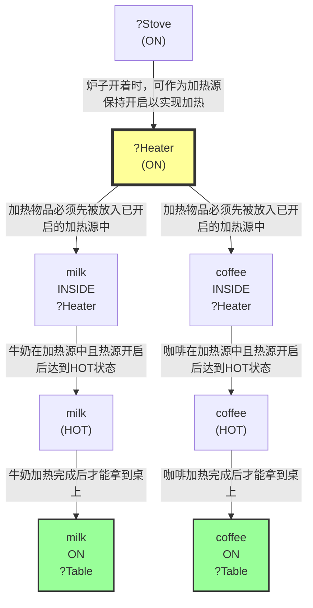
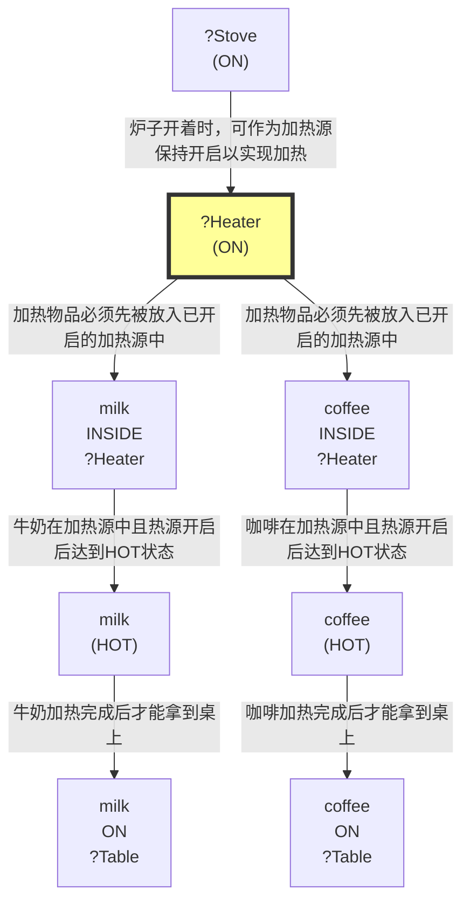
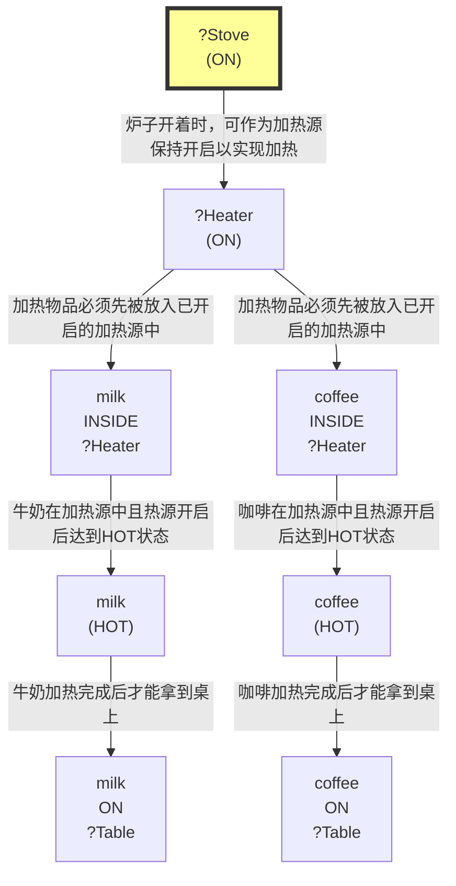
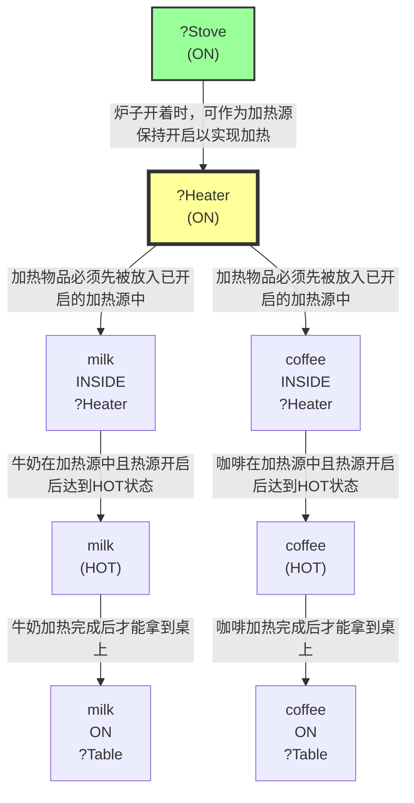
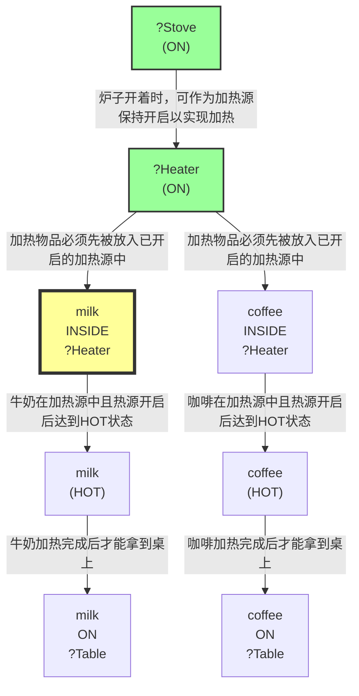

# 🚀 VirtualHome Agent Episode Log


### [GoalReasoner (Module A - Intent)] Output
```json
{
  "is_instruction_obviously_vague": false,
  "clarification_question": null,
  "target_object": "牛奶和咖啡",
  "location_hint": "桌上",
  "reasoning_chain": [
    {
      "question": "Why does the user want this object?",
      "answer": "They want the milk and coffee heated and delivered to the table."
    },
    {
      "question": "Why is that important?",
      "answer": "To have warm drinks ready for immediate use or consumption."
    },
    {
      "question": "What fundamental need does this fulfill?",
      "answer": "It fulfills the need to obtain warm beverages for comfort, enjoyment, or hydration."
    },
    {
      "question": "Are there any deeper psychological or physical motivations?",
      "answer": "The user may be seeking convenience and comfort, especially if warm drinks are preferred in the current situation."
    }
  ],
  "deep_intent": "The user wants warm beverages ready for consumption and placed on the table.",
  "acceptable_alternatives_properties": [
    {
      "priority": 1,
      "description": "Other warm ready-to-drink beverages, such as tea or hot chocolate"
    },
    {
      "priority": 2,
      "description": "Other heated milk-based drinks or coffee-like hot drinks"
    },
    {
      "priority": 3,
      "description": "Warm packaged drinks that can be served immediately"
    },
    {
      "priority": 4,
      "description": "Any hot beverage that can provide warmth, comfort, or hydration"
    }
  ]
}
```

### [PerceptionFilter] Output
```json
{
  "reasoning": "Need the target beverages (milk and coffee), a heating appliance from the SDG, and the table location where they must be placed. Since the SDG allows an abstract heater, I keep all matching physical heating tools available: stove, microwave, and coffeemaker. The kitchentable is required for the final placement.",
  "selected_ids": [
    231,
    306,
    311,
    313
  ],
  "raw_item_count": 108
}
```

### [LLMExecutor] Output
```json
{
  "reasoning": "The SDG requires a heater that is ON to warm milk and coffee. The stove is unusable for this task because it is marked BROKEN, so I should not rely on it. The coffeemaker is a valid heater candidate because it has CAN_OPEN, HAS_SWITCH, HAS_PLUG, and CONTAINERS, and it is currently OFF. The single best progress action is to move next to the coffeemaker so I can open and use it in subsequent steps.",
  "satisfied_nodes": [
    "N5",
    "N6"
  ],
  "current_node_focus": "N4",
  "mapped_variables": {
    "?Heater": "coffeemaker(306)",
    "?Table": "kitchentable(231)",
    "?Stove": "stove(311)"
  },
  "action": "[walk] <coffeemaker> (306)"
}
```
## Step 0
- **Action**: `[walk] <coffeemaker> (306)`
- **SDG Status**:

- **Observed Items (5)**: kitchentable(231), coffeemaker(306) [OFF], stove(311) [BROKEN,OFF,CLOSED], microwave(313) [CLOSED,OFF], character(1)


### [PerceptionFilter] Output
```json
{
  "reasoning": "需要保留目标物牛奶和咖啡，以及所有可用的加热设备和桌面位置。SDG明确要求炉子/加热器开启并将牛奶和咖啡加热后放到桌上，因此需要保留 stove、microwave、coffeemaker 作为潜在加热工具/备选，以及 kitchentable 作为放置位置；同时保留牛奶和咖啡本身的对象ID。",
  "selected_ids": [
    231,
    306,
    311,
    313
  ],
  "raw_item_count": 108
}
```

### [LLMExecutor] Output
```json
{
  "reasoning": "The stove is permanently unusable because it is BROKEN, so the best heater candidate is the coffeemaker. I am already next to coffeemaker(306), which satisfies the proximity requirement for opening/switching it. The next missing prerequisite toward heating milk and coffee is to open the heater before putting items inside and turning it on.",
  "satisfied_nodes": [],
  "current_node_focus": "N4",
  "mapped_variables": {
    "?Stove": "stove(311)",
    "?Heater": "coffeemaker(306)",
    "?Table": "kitchentable(231)"
  },
  "action": "[open] <coffeemaker> (306)"
}
```
## Step 1
- **Action**: `[open] <coffeemaker> (306)`
- **SDG Status**:

- **Observed Items (5)**: kitchentable(231), coffeemaker(306) [OFF], stove(311) [BROKEN,OFF,CLOSED], microwave(313) [CLOSED,OFF], character(1)


### [PerceptionFilter] Output
```json
{
  "reasoning": "Need the target beverages (milk and coffee), the table where they should be placed, and all viable heating tools from the SDG/scene. Since the heating source could be a stove, microwave, or coffeemaker, keep all of them as functional alternatives/backups. The milk and coffee themselves are required targets, and the kitchen table is the destination location.",
  "selected_ids": [
    231,
    306,
    311,
    313,
    1
  ],
  "raw_item_count": 108
}
```

### [LLMExecutor] Output
```json
{
  "reasoning": "The stove is BROKEN, so it cannot satisfy the heater requirement. The coffeemaker is the best available heater candidate and I am already next to it from the previous walk. The prior open attempt failed unexpectedly, but this is not a permanent impossibility from the graph, so the next progress step is to try opening the coffeemaker again to satisfy the heater-preparation chain toward heating milk and coffee.",
  "satisfied_nodes": [],
  "current_node_focus": "N4",
  "mapped_variables": {
    "?Stove": "stove(311)",
    "?Heater": "coffeemaker(306)",
    "?Table": "kitchentable(231)"
  },
  "action": "[open] <coffeemaker> (306)"
}
```
## Step 2
- **Action**: `[open] <coffeemaker> (306)`
- **SDG Status**:

- **Observed Items (5)**: kitchentable(231), coffeemaker(306) [OFF], stove(311) [BROKEN,OFF,CLOSED], microwave(313) [CLOSED,OFF], character(1)


### [PerceptionFilter] Output
```json
{
  "reasoning": "要完成“把牛奶和咖啡加热并放到桌上”，必须保留目标物牛奶和咖啡、可加热设备的备选项（炉灶、微波炉、咖啡机），以及放置位置桌子。",
  "selected_ids": [
    231,
    305,
    306,
    311,
    313
  ],
  "raw_item_count": 108
}
```

### [LLMExecutor] Output
```json
{
  "reasoning": "The stove is BROKEN, so it cannot satisfy the heater requirement. The coffeemaker is the best available heater candidate, and I am already next to it. The previous open attempts failed with a generic execution error, which is not one of the two cases that permit asking for help. The next prerequisite for heating the milk and coffee remains to open the coffeemaker so items can later be placed inside and heated.",
  "satisfied_nodes": [],
  "current_node_focus": "N4",
  "mapped_variables": {
    "?Stove": "stove(311)",
    "?Heater": "coffeemaker(306)",
    "?Table": "kitchentable(231)"
  },
  "action": "[open] <coffeemaker> (306)"
}
```
## Step 3
- **Action**: `[open] <coffeemaker> (306)`
- **SDG Status**:

- **Observed Items (6)**: kitchentable(231), fridge(305) [BROKEN,CLOSED], coffeemaker(306) [OFF], stove(311) [BROKEN,OFF,CLOSED], microwave(313) [CLOSED,OFF], character(1)


### [PerceptionFilter] Output
```json
{
  "reasoning": "需要保留目标物牛奶和咖啡，以及可用的加热设备。根据SDG，必须有炉灶或其他加热器处于开启状态；场景中可充当加热器的有 stove、microwave、coffeemaker。还需要桌子用于放置加热后的饮品，因此保留 kitchentable。",
  "selected_ids": [
    231,
    306,
    311,
    313
  ],
  "raw_item_count": 108
}
```

### [LLMExecutor] Output
```json
{
  "reasoning": "The stove is permanently BROKEN, so it cannot satisfy the heater requirement. The coffeemaker is the best available heater candidate, and I am already close to it. However, repeated attempts to open the coffeemaker have failed with a generic execution error, which means I should not keep repeating the same failed action. Since the goal is still to heat milk and coffee on a table, the next best autonomous step is to try the other plausible heater, the microwave, which is present, has a switch, can open, and is not broken. I need to walk to it first because of the proximity rule before any interaction.",
  "satisfied_nodes": [],
  "current_node_focus": "N1",
  "mapped_variables": {
    "?Stove": "stove(311)",
    "?Heater": "microwave(313)",
    "?Table": "kitchentable(231)"
  },
  "action": "[walk] <microwave> (313)"
}
```
## Step 4
- **Action**: `[walk] <microwave> (313)`
- **SDG Status**:

- **Observed Items (5)**: kitchentable(231), coffeemaker(306) [OFF], stove(311) [BROKEN,OFF,CLOSED], microwave(313) [CLOSED,OFF], character(1)


### [PerceptionFilter] Output
```json
{
  "reasoning": "Need the target beverages (milk and coffee), a heating device matching the SDG (stove, microwave, or coffeemaker as possible heater), and the table for placing them after heating.",
  "selected_ids": [
    231,
    306,
    311,
    313
  ],
  "raw_item_count": 108
}
```

### [LLMExecutor] Output
```json
{
  "reasoning": "The stove is permanently unusable because it is BROKEN, so it cannot satisfy the required heater path. The microwave is a viable alternative heater candidate from the filtered graph: it has CAN_OPEN and HAS_SWITCH, is not broken, and I am already next to it from the last successful walk. The next missing prerequisite in the SDG is to open the heater before placing milk and coffee inside and switching it on. I should therefore try opening the microwave now.",
  "satisfied_nodes": [],
  "current_node_focus": "N4",
  "mapped_variables": {
    "?Heater": "microwave(313)",
    "?Stove": "stove(311)",
    "?Table": "kitchentable(231)"
  },
  "action": "[open] <microwave> (313)"
}
```
## Step 5
- **Action**: `[open] <microwave> (313)`
- **SDG Status**:

- **Observed Items (5)**: kitchentable(231), coffeemaker(306) [OFF], stove(311) [BROKEN,OFF,CLOSED], microwave(313) [CLOSED,OFF], character(1)


### [PerceptionFilter] Output
```json
{
  "reasoning": "Need the target beverages (milk and coffee), a valid heater/source for warming them, and the table where they must be placed. Since the SDG allows a heater and the scene contains multiple heating appliances, I keep all plausible heating tools as backups: stove, microwave, and coffeemaker. I also keep the kitchentable for the placement location, and the fridge as the likely source for milk if needed.",
  "selected_ids": [
    231,
    305,
    306,
    311,
    313
  ],
  "raw_item_count": 110
}
```

### [LLMExecutor] Output
```json
{
  "reasoning": "The current goal requires heating milk and coffee in a heater, but the stove is BROKEN and the coffeemaker has repeatedly failed to open, so I should not keep looping on the same action. The microwave is already OPEN and is a valid heater candidate with HAS_SWITCH and HAS_PLUG, so the next prerequisite toward an ON heater is to turn it on. I am already next to it from the prior successful walk/open sequence, so this is the best progress action.",
  "satisfied_nodes": [
    "N1"
  ],
  "current_node_focus": "N4",
  "mapped_variables": {
    "?Stove": "stove(311)",
    "?Heater": "microwave(313)"
  },
  "action": "[switchon] <microwave> (313)"
}
```
## Step 6
- **Action**: `[switchon] <microwave> (313)`
- **SDG Status**:

- **Observed Items (6)**: kitchentable(231), fridge(305) [BROKEN,CLOSED], coffeemaker(306) [OFF], stove(311) [BROKEN,OFF,CLOSED], microwave(313) [OPEN,OFF], character(1)


### [PerceptionFilter] Output
```json
{
  "reasoning": "Need the target drinks (milk and coffee), a valid heater source for warming them, and the destination table. Because the SDG requires heater options and alternatives retention, keep all visible heating appliances that could serve as ?Heater, plus the stove as the ON source. The table is required for placement.",
  "selected_ids": [
    231,
    306,
    311,
    313,
    305
  ],
  "raw_item_count": 110
}
```

### [LLMExecutor] Output
```json
{
  "reasoning": "The microwave(313) is already ON and OPEN, so the heater state prerequisite is satisfied. The next unmet SDG requirements are to place milk and coffee inside the heater. To do that, I must first obtain the target items, and since the instruction explicitly requires milk and coffee on the table, the most direct progress step is to move toward the milk item so I can later grab it and continue toward the heater. I am not repeating the last walk action to the microwave.",
  "satisfied_nodes": [
    "N1",
    "N4"
  ],
  "current_node_focus": "N2",
  "mapped_variables": {
    "?Stove": "stove(311)",
    "?Heater": "microwave(313)",
    "?Table": "kitchentable(231)"
  },
  "action": "[walk] <milk> (unknown)"
}
```
## Step 7
- **Action**: `[walk] <milk> (unknown)`
- **SDG Status**:

- **Observed Items (6)**: kitchentable(231), fridge(305) [BROKEN,CLOSED], coffeemaker(306) [OFF], stove(311) [BROKEN,OFF,CLOSED], microwave(313) [ON,OPEN], character(1)


### [PerceptionFilter] Output
```json
{
  "reasoning": "Need the target beverages (milk and coffee), the heating sources required by the SDG (stove, microwave, coffeemaker, fridge as a related beverage appliance), and the destination table. Include all viable heater alternatives/backups and the table for placement.",
  "selected_ids": [
    231,
    305,
    306,
    311,
    313
  ],
  "raw_item_count": 110
}
```

### [LLMExecutor] Output
```json
{
  "reasoning": "The SDG’s heater prerequisite is already satisfied by the microwave being ON and OPEN, and the stove is BROKEN so it cannot be used. However, the filtered graph contains no visible milk or coffee objects at all, and the prior attempt to walk to an unknown milk target failed because the object could not be selected. Since I cannot progress toward placing the required items into the heater or onto the table without first knowing where the exact milk and coffee objects are, the correct next step is to ask the user for clarification about their location. This fits the ambiguity/incomplete-object-information case because the needed target objects are absent from the filtered graph.",
  "satisfied_nodes": [
    "N1",
    "N4"
  ],
  "current_node_focus": "N2",
  "mapped_variables": {
    "?Stove": "stove(311)",
    "?Heater": "microwave(313)",
    "?Table": "kitchentable(231)"
  },
  "action": "[ask] I cannot see any milk or coffee in the current filtered graph. Where are the milk and coffee objects located, or should I use a different beverage container?"
}
```
## Step 8
- **Action**: `[ask] I cannot see any milk or coffee in the current filtered graph. Where are the milk and coffee objects located, or should I use a different beverage container?`
- **SDG Status**:

- **Observed Items (6)**: kitchentable(231), fridge(305) [BROKEN,CLOSED], coffeemaker(306) [OFF], stove(311) [BROKEN,OFF,CLOSED], microwave(313) [ON,OPEN], character(1)

