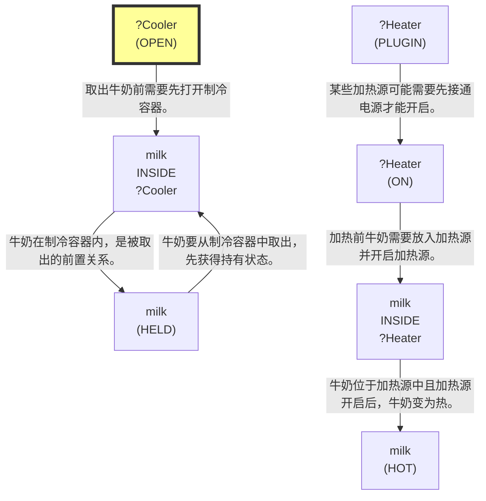
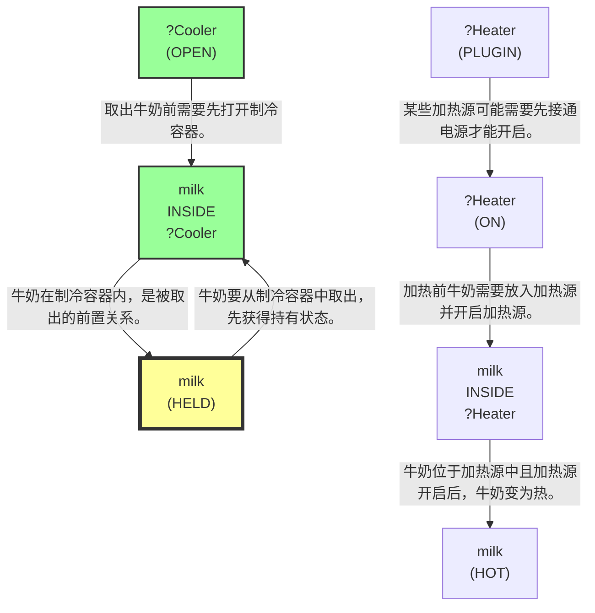
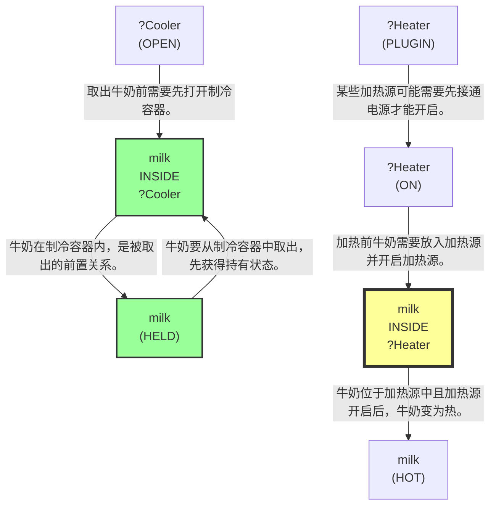
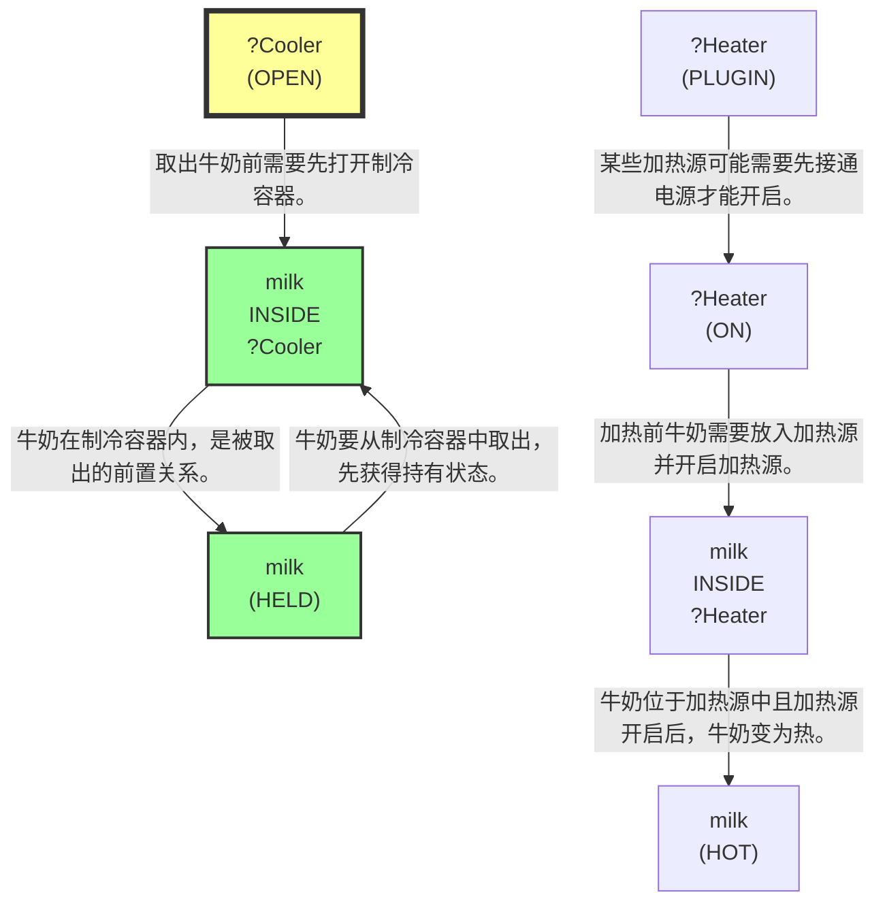
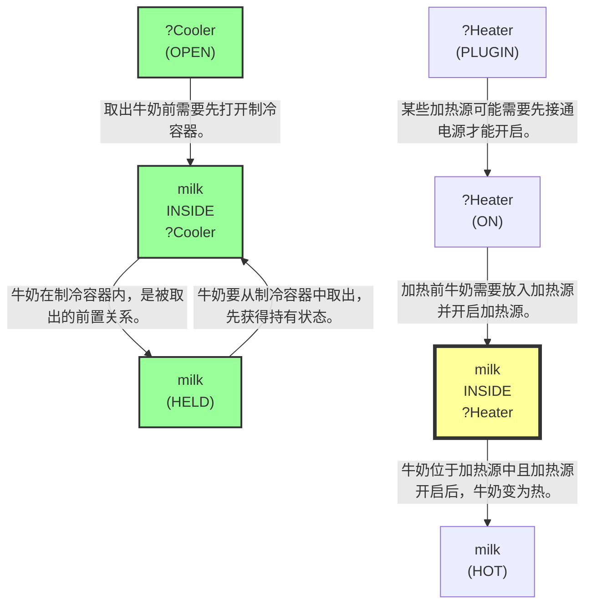
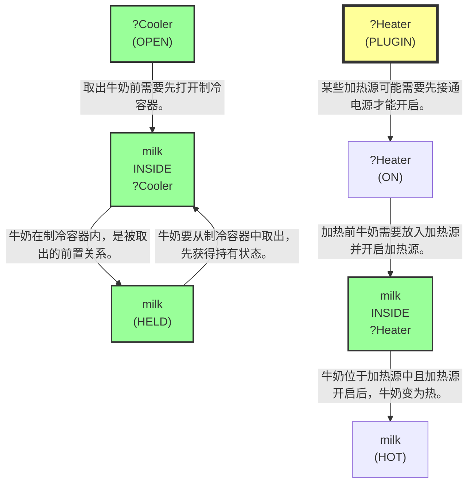
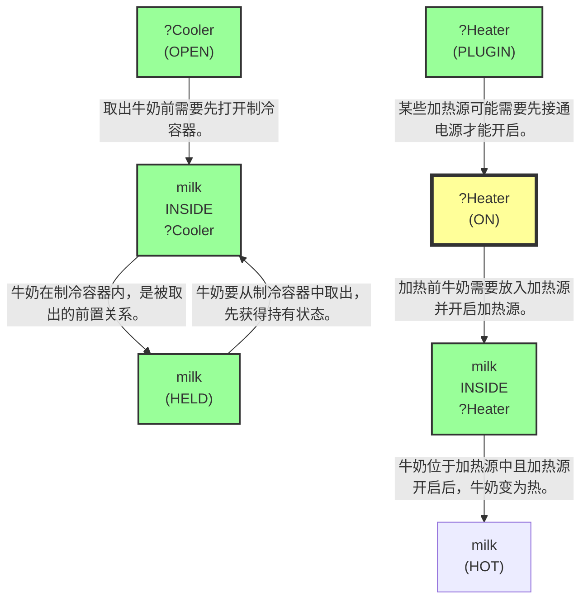
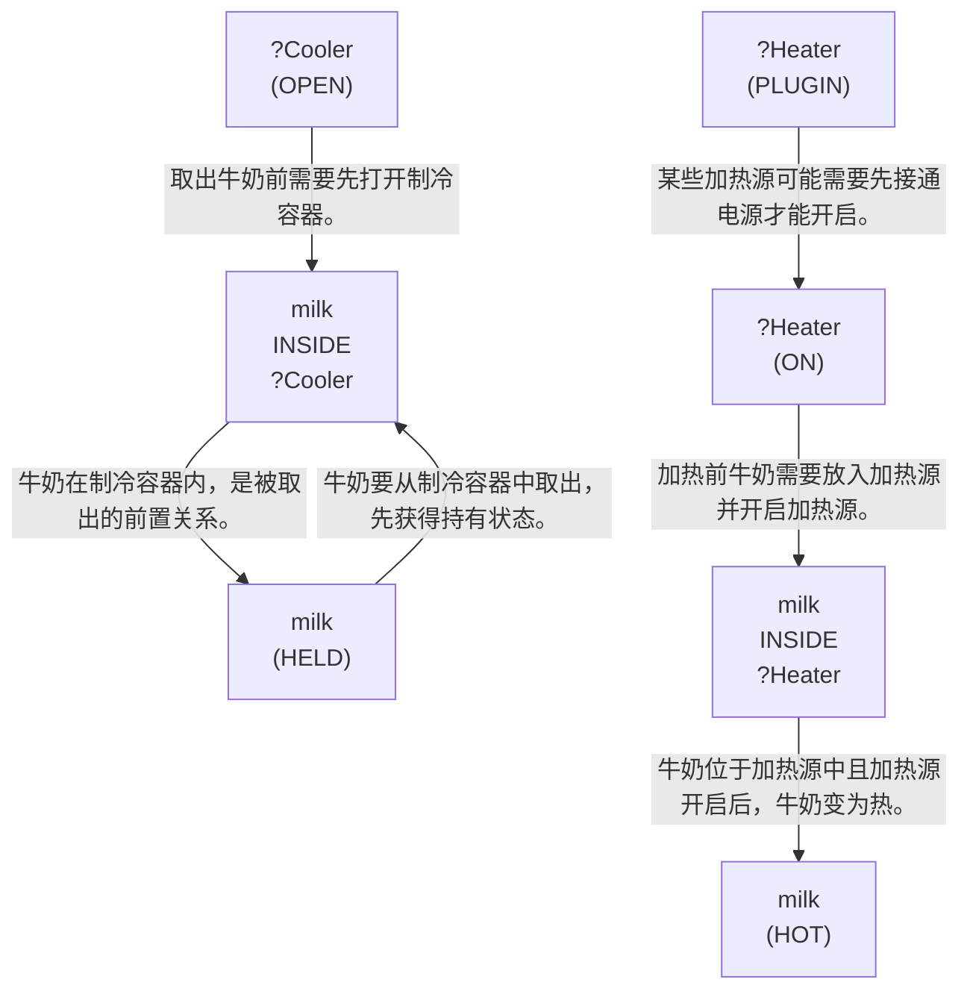

# 🚀 VirtualHome Agent Episode Log


### [GoalReasoner (Module A - Intent)] Output
```json
{
  "is_instruction_obviously_vague": false,
  "clarification_question": null,
  "target_object": "milk",
  "location_hint": "refrigerator",
  "reasoning_chain": [
    {
      "question": "Why does the user want this object?",
      "answer": "To warm a cup of milk using a microwave if milk is available in the refrigerator."
    },
    {
      "question": "Why is that important?",
      "answer": "The user likely wants the milk in a more suitable or preferred drinking temperature."
    },
    {
      "question": "What fundamental need does this fulfill?",
      "answer": "It helps satisfy a need for a warm drink."
    },
    {
      "question": "Are there any deeper psychological or physical motivations?",
      "answer": "The user may want comfort, convenience, or to relieve thirst or hunger with a warm beverage."
    }
  ],
  "deep_intent": "The user wants a warm drink for comfort or refreshment.",
  "acceptable_alternatives_properties": [
    {
      "priority": 1,
      "description": "Other drinkable dairy or plant-based beverages that can be safely warmed, such as soy milk or oat milk"
    },
    {
      "priority": 2,
      "description": "Other ready-to-heat beverages, such as hot chocolate or soup broth"
    },
    {
      "priority": 3,
      "description": "Any microwave-safe beverage that can provide warmth and hydration"
    },
    {
      "priority": 4,
      "description": "Warm liquid drinks in general, such as tea or diluted juice, if the exact beverage is unavailable"
    }
  ]
}
```

### [PerceptionFilter] Output
```json
{
  "reasoning": "Needed items are the milk target, the refrigerator as the cooler/location to retrieve it from, and the microwave as the heater to warm it. The stove is also a valid alternative heating tool and should be kept as a backup. The microwave may require power, so the power socket is included as a possible plugin source.",
  "selected_ids": [
    162,
    171,
    163,
    57
  ],
  "raw_item_count": 152
}
```

### [LLMExecutor] Output
```json
{
  "reasoning": "The SDG requires milk to be inside a cooler first, and the current graph shows the refrigerator (fridge(162)) as the best match for ?Cooler. It is currently CLOSED, so the immediate prerequisite is to open it before attempting to retrieve the milk. No holding state is satisfied yet, and we cannot grab milk until the fridge is open and we are near it, but the next atomic step toward the goal is opening the fridge.",
  "satisfied_nodes": [],
  "current_node_focus": "N2",
  "mapped_variables": {
    "?Cooler": "fridge(162)",
    "?Heater": "microwave(171)"
  },
  "action": "[open] fridge (162)"
}
```
## Step 0
- **Action**: `[open] <fridge> (162)`
- **SDG Status**:

- **Observed Items (5)**: powersocket(57), fridge(162) [CLOSED], stove(163) [OFF,CLOSED], microwave(171) [CLOSED,OFF], character(1)


### [PerceptionFilter] Output
```json
{
  "reasoning": "Needed objects are the target milk, the refrigerator as the cooler containing it, and the microwave as the heater for warming it. The sink is not required by the SDG, and other kitchen items are irrelevant.",
  "selected_ids": [
    176,
    162,
    171
  ],
  "raw_item_count": 153
}
```

### [LLMExecutor] Output
```json
{
  "reasoning": "The fridge is already OPEN, and milk(176) is currently inside the fridge, satisfying N1 and N2. To progress toward holding the milk so it can later be moved to the heater, the next required atomic step is to grab the milk. The current graph shows the character is close to the milk, so no walk is needed before grabbing.",
  "satisfied_nodes": [
    "N1",
    "N2"
  ],
  "current_node_focus": "N3",
  "mapped_variables": {
    "?Cooler": "fridge(162)",
    "?Heater": "microwave(171)"
  },
  "action": "[grab] <milk> (176)"
}
```
## Step 1
- **Action**: `[grab] <milk> (176)`
- **SDG Status**:

- **Observed Items (4)**: fridge(162) [OPEN], microwave(171) [CLOSED,OFF], character(1), milk(176) [COLD,CLOSED]


### [PerceptionFilter] Output
```json
{
  "reasoning": "Need the target milk plus the refrigerator because the SDG says the milk is inside a cooler/refrigerator and must be opened to retrieve it. Need the microwave as the heater to warm the milk. Also keep the stove as an alternative heating tool in case the microwave is unavailable, per backup-tool retention.",
  "selected_ids": [
    162,
    171,
    163,
    176
  ],
  "raw_item_count": 154
}
```

### [LLMExecutor] Output
```json
{
  "reasoning": "Milk(176) is already held in the right hand, so N1 and N3 are satisfied. The next unmet prerequisite on the path to HOT is to move the milk into a heater. Among the available heater candidates, microwave(171) is the best match because it is a container appliance that can heat milk and it has HAS_PLUG, though it is currently OFF and CLOSED. Before the milk can be put inside, I must first go to the microwave; since putin requires explicit proximity and the container must be open, the single next atomic action is to walk to the microwave.",
  "satisfied_nodes": [
    "N1",
    "N3"
  ],
  "current_node_focus": "N4",
  "mapped_variables": {
    "?Cooler": "fridge(162)",
    "?Heater": "microwave(171)"
  },
  "action": "[walk] <microwave> (171)"
}
```
## Step 2
- **Action**: `[walk] <microwave> (171)`
- **SDG Status**:

- **Observed Items (6)**: fridge(162) [OPEN], stove(163) [OFF,CLOSED], microwave(171) [CLOSED,OFF], character(1), milk(176) [COLD,CLOSED], milk(176) [COLD,CLOSED]


### [PerceptionFilter] Output
```json
{
  "reasoning": "Needed objects are the target milk, the refrigerator as the cooler/location to retrieve it from, and the microwave as the heater to warm it. The goal and SDG specifically require milk inside a cooler and then inside a heater, so these are the minimum relevant objects; no other tools are necessary from the visible set.",
  "selected_ids": [
    176,
    162,
    171
  ],
  "raw_item_count": 154
}
```

### [LLMExecutor] Output
```json
{
  "reasoning": "Milk(176) is already held, the fridge/ cooler requirement is satisfied and the robot is already close to the microwave(171). The next missing prerequisite for heating is that the heater must be opened before the milk can be placed inside. Since putin requires the container to be OPEN, the single best next atomic action is to open the microwave.",
  "satisfied_nodes": [
    "N1",
    "N2",
    "N3"
  ],
  "current_node_focus": "N2",
  "mapped_variables": {
    "?Cooler": "fridge(162)",
    "?Heater": "microwave(171)"
  },
  "action": "[open] <microwave> (171)"
}
```
## Step 3
- **Action**: `[open] <microwave> (171)`
- **SDG Status**:

- **Observed Items (5)**: fridge(162) [OPEN], microwave(171) [CLOSED,OFF], character(1), milk(176) [COLD,CLOSED], milk(176) [COLD,CLOSED]


### [PerceptionFilter] Output
```json
{
  "reasoning": "Need the target milk and the appliances/locations required by the SDG: the refrigerator as the cooler holding the milk, and the microwave as the heater to warm it. Since the goal is to warm milk, both the fridge and microwave are necessary, along with the milk itself.",
  "selected_ids": [
    176,
    162,
    171
  ],
  "raw_item_count": 156
}
```

### [LLMExecutor] Output
```json
{
  "reasoning": "The milk is already held and the microwave heater is already open and nearby. The next unmet prerequisite in the SDG is to place the milk inside the heater before turning it on. Since the container is open and we are close to it, the single next atomic action is to put the held milk into the microwave.",
  "satisfied_nodes": [
    "N1",
    "N2",
    "N3"
  ],
  "current_node_focus": "N4",
  "mapped_variables": {
    "?Cooler": "fridge(162)",
    "?Heater": "microwave(171)"
  },
  "action": "[putin] <milk> (176) <microwave> (171)"
}
```
## Step 4
- **Action**: `[putin] <milk> (176) <microwave> (171)`
- **SDG Status**:

- **Observed Items (5)**: fridge(162) [OPEN], microwave(171) [OPEN,OFF], character(1), milk(176) [COLD,CLOSED], milk(176) [COLD,CLOSED]


### [PerceptionFilter] Output
```json
{
  "reasoning": "Needed items are the target milk, the refrigerator as the cooler holding it, and a microwave as the heater to warm it. Since the SDG requires opening the cooler and heating the milk, these are the minimum relevant objects; I also keep the target milk itself.",
  "selected_ids": [
    176,
    162,
    171
  ],
  "raw_item_count": 155
}
```

### [LLMExecutor] Output
```json
{
  "reasoning": "The milk is already held and placed inside the microwave, so N1, N2, N3, and N4 are effectively satisfied/underway. The next missing SDG prerequisite is to turn the heater on. The microwave(171) is already OPEN and has HAS_PLUG, so it must be plugged in before switching on. We are already close to it, and the previous action was a walk to this same appliance, so the correct next atomic step is to plug it in.",
  "satisfied_nodes": [
    "N1",
    "N2",
    "N3",
    "N4"
  ],
  "current_node_focus": "N6",
  "mapped_variables": {
    "?Cooler": "fridge(162)",
    "?Heater": "microwave(171)"
  },
  "action": "[plugin] <microwave> (171)"
}
```
## Step 5
- **Action**: `[plugin] <microwave> (171)`
- **SDG Status**:

- **Observed Items (4)**: fridge(162) [OPEN], microwave(171) [OPEN,OFF], character(1), milk(176) [COLD,CLOSED]


### [PerceptionFilter] Output
```json
{
  "reasoning": "Needed objects are the target milk, the refrigerator as the cooler containing it, and the microwave as the heater to warm it. These are the minimum SDG-relevant items for retrieving and heating the milk; no other alternatives are visible that are necessary beyond these primary functional tools.",
  "selected_ids": [
    162,
    171,
    176
  ],
  "raw_item_count": 155
}
```

### [LLMExecutor] Output
```json
{
  "reasoning": "The milk is already inside the microwave and the microwave is plugged in and open, so N1, N2, N3, N4, and N6 are satisfied. The remaining missing prerequisite to heat the milk is turning the heater ON (N5). We are already close to the microwave, so the correct single next atomic action is to switch it on.",
  "satisfied_nodes": [
    "N1",
    "N2",
    "N3",
    "N4",
    "N6"
  ],
  "current_node_focus": "N5",
  "mapped_variables": {
    "?Cooler": "fridge(162)",
    "?Heater": "microwave(171)"
  },
  "action": "[switchon] <microwave> (171)"
}
```
## Step 6
- **Action**: `[switchon] <microwave> (171)`
- **SDG Status**:

- **Observed Items (4)**: fridge(162) [OPEN], microwave(171) [OPEN,OFF,PLUGGED_IN], character(1), milk(176) [COLD,CLOSED]


### [PerceptionFilter] Output
```json
{
  "reasoning": "Needed items are the target milk, the refrigerator as the cooler/retrieval location, and the microwave as the heater for warming it. The SDG also implies the cooler must be opened and the milk heated, so both appliance types must be retained; no other objects are necessary.",
  "selected_ids": [
    162,
    171,
    176
  ],
  "raw_item_count": 155
}
```
## Step 7
- **Action**: `FINISH (Goal Reached)`
- **SDG Status**:

- **Observed Items (4)**: fridge(162) [OPEN], microwave(171) [OPEN,ON,PLUGGED_IN], character(1), milk(176) [HOT,CLOSED]

