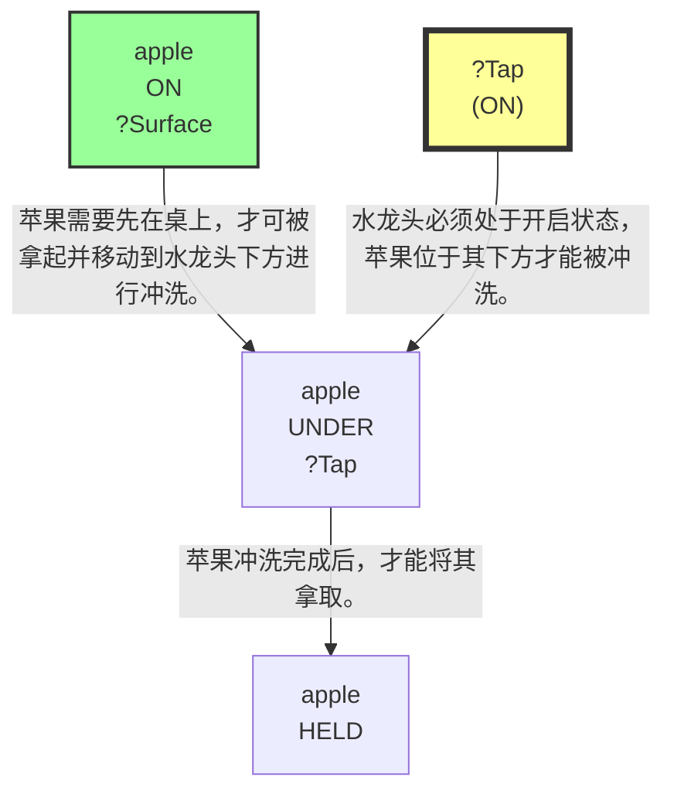
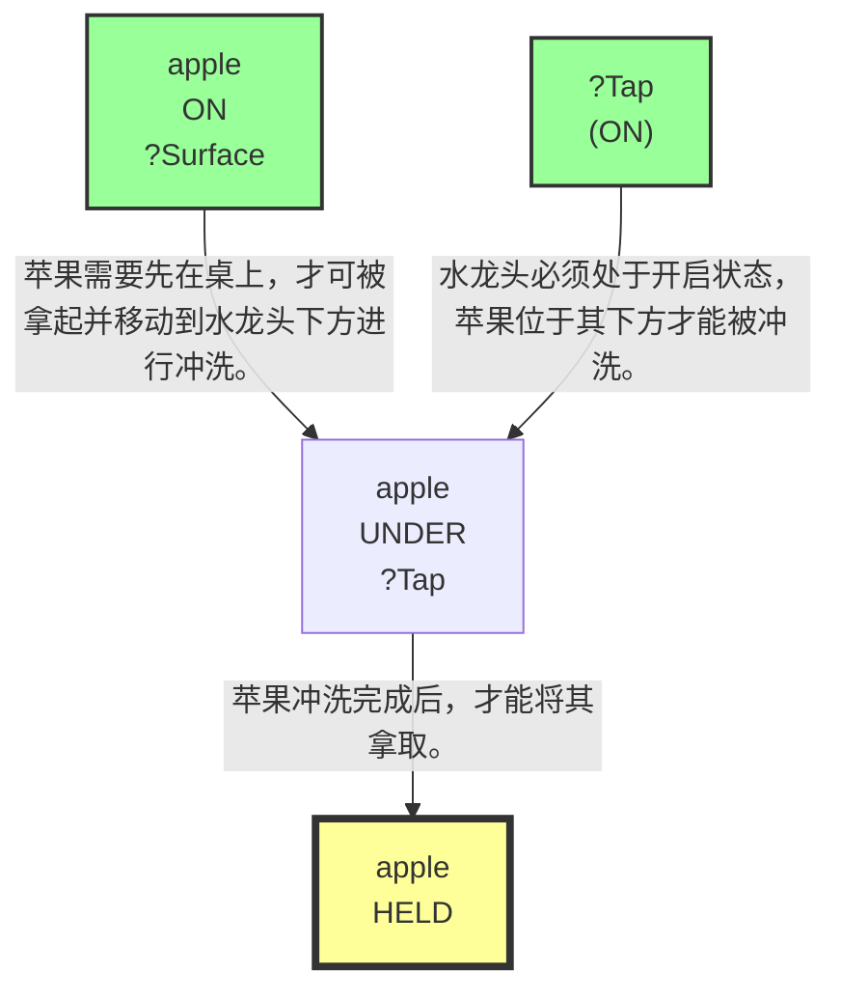
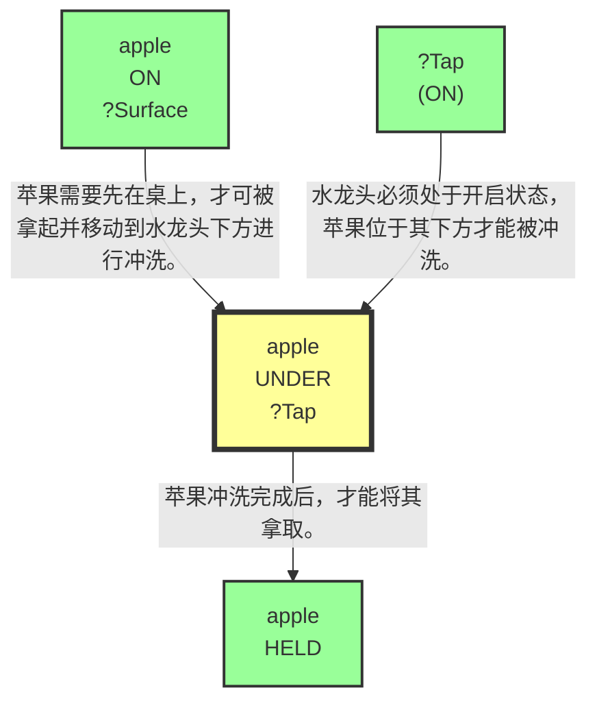
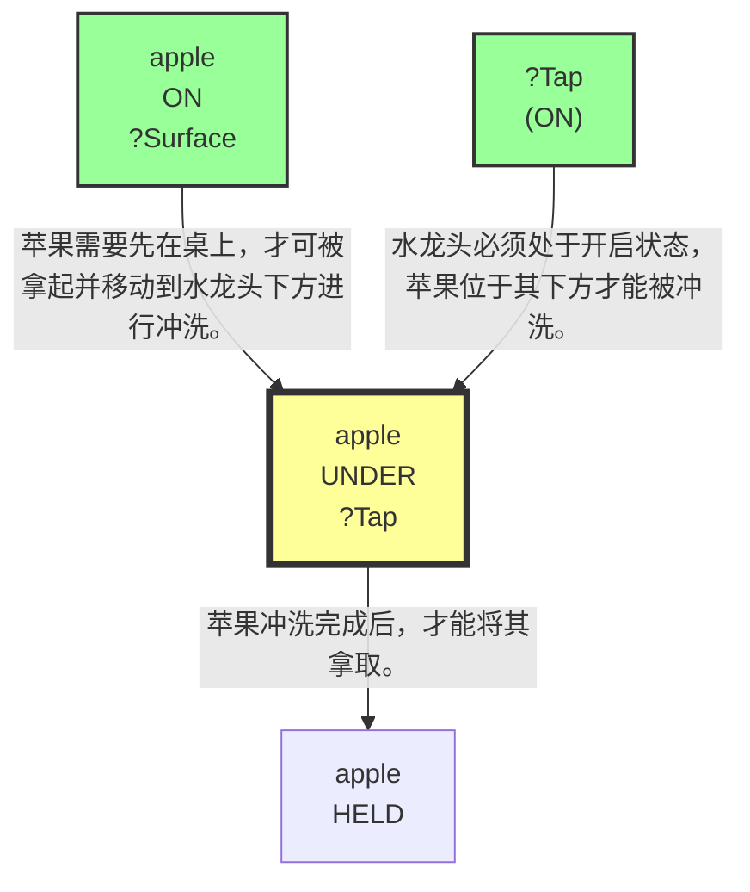
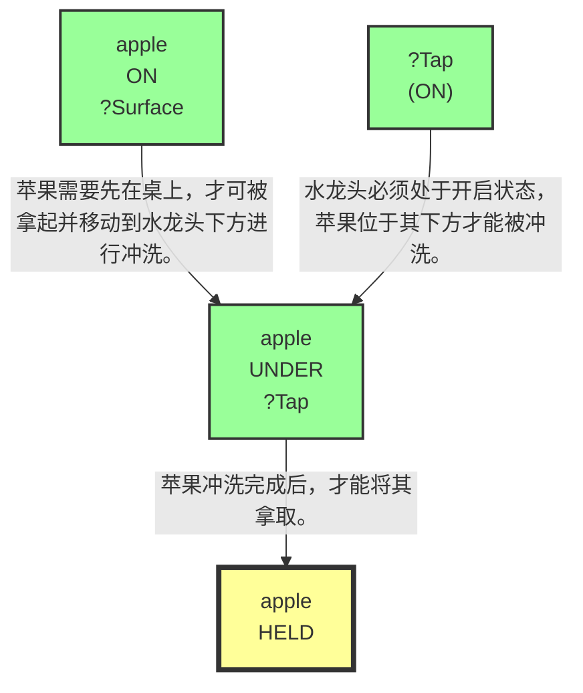
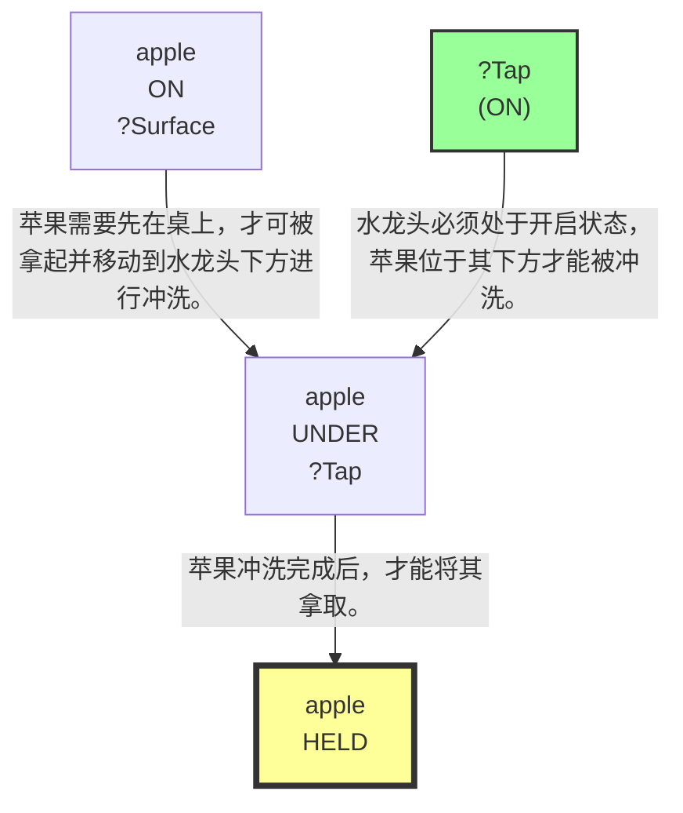
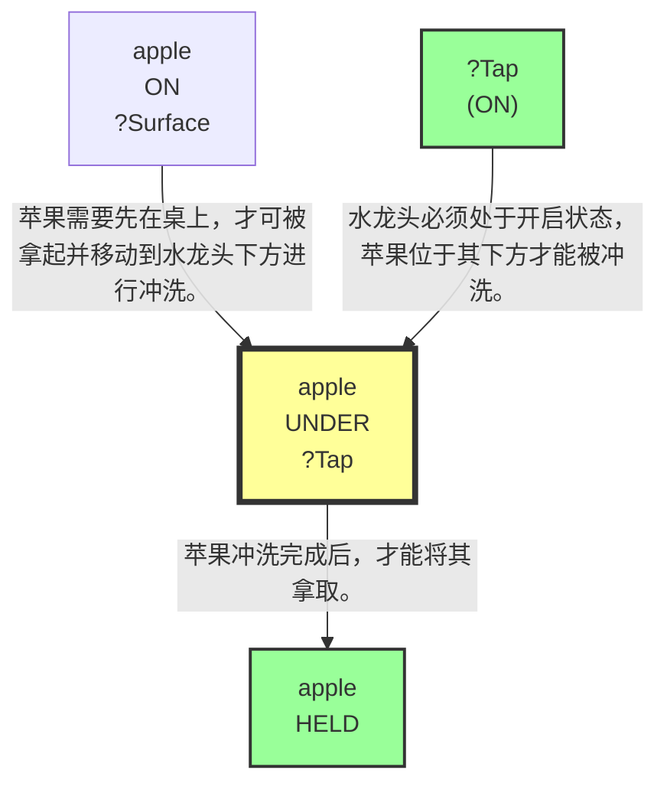
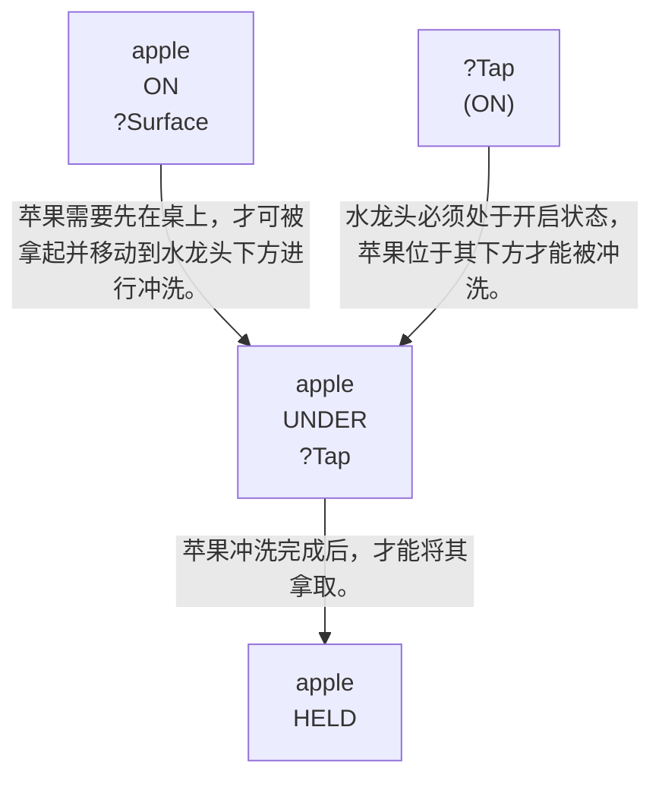

# 🚀 VirtualHome Agent Episode Log


### [GoalReasoner (Module A - Intent)] Output
```json
{
  "is_instruction_obviously_vague": false,
  "clarification_question": null,
  "target_object": "apple",
  "location_hint": "桌上",
  "reasoning_chain": [
    {
      "question": "Why does the user want this object?",
      "answer": "They want a cleaned apple picked from the table and brought over."
    },
    {
      "question": "Why is that important?",
      "answer": "They likely want the apple ready to eat or use without dirt or residue."
    },
    {
      "question": "What fundamental need does this fulfill?",
      "answer": "It fulfills the need to obtain clean, edible fruit for consumption."
    },
    {
      "question": "Are there any deeper psychological or physical motivations?",
      "answer": "The motivation is practical convenience and hygiene, possibly to have a safe snack without needing to clean it themselves."
    }
  ],
  "deep_intent": "The user wants clean, edible fruit for consumption.",
  "acceptable_alternatives_properties": [
    {
      "priority": 1,
      "description": "Other whole fresh fruits that can be rinsed and eaten, such as a pear or orange"
    },
    {
      "priority": 2,
      "description": "Other ready-to-eat fresh fruit items from the kitchen or table"
    },
    {
      "priority": 3,
      "description": "Washed snack foods or packaged foods that can serve as an immediate edible snack"
    },
    {
      "priority": 4,
      "description": "Any other convenient food item that can satisfy hunger if fresh fruit is unavailable"
    }
  ]
}
```

### [PerceptionFilter] Output
```json
{
  "reasoning": "Need the target apple and the functional washing setup required by the SDG: the apple, a sink, and a faucet. The goal involves getting the apple from the table and cleaning it, so the table surface is also relevant. I include only the minimum necessary matching objects.",
  "selected_ids": [
    231,
    247,
    248,
    437
  ],
  "raw_item_count": 109
}
```

### [LLMExecutor] Output
```json
{
  "reasoning": "The SDG requires the apple to be ON a surface, then UNDER an ON tap, then HELD. The current graph shows apple(437) is already on kitchentable(231) and close to the character, so N1 is satisfied. The faucet(248) is OFF, and it is the exact tap candidate in the graph. To progress toward placing the apple under running water, the tap must be turned on next. Since switch actions require proximity and we are already close to the sink/faucet area, the best next atomic action is to switch on the faucet.",
  "satisfied_nodes": [
    "N1"
  ],
  "current_node_focus": "N2",
  "mapped_variables": {
    "?Tap": "faucet(248)",
    "?Surface": "kitchentable(231)"
  },
  "action": "[switchon] <faucet> (248)"
}
```
## Step 0
- **Action**: `[switchon] <faucet> (248)`
- **SDG Status**:

- **Observed Items (5)**: kitchentable(231), sink(247), faucet(248) [OFF], apple(437) [DIRTY], character(1)


### [PerceptionFilter] Output
```json
{
  "reasoning": "Need the target apple, the table it is on, and the sink/faucet because the SDG requires the apple to start on a surface, be moved under an active tap, then held after rinsing. I included the available fruit target and the necessary washing fixtures only.",
  "selected_ids": [
    231,
    247,
    248,
    437
  ],
  "raw_item_count": 109
}
```

### [LLMExecutor] Output
```json
{
  "reasoning": "N1 is already satisfied because apple(437) is on kitchentable(231). N2 is satisfied because faucet(248) is already ON. The remaining gap toward the goal is to get the apple under the running tap before it can be held cleanly. The character is already close to both the sink and faucet, so no walk is needed. The next atomic action should therefore be to move the apple into/under the sink area by grabbing it first is not required by the SDG directly; however, because the only available way to place an object under a tap is to hold it, the immediate progress step is to grab the apple.",
  "satisfied_nodes": [
    "N1",
    "N2"
  ],
  "current_node_focus": "N4",
  "mapped_variables": {
    "?Tap": "faucet(248)"
  },
  "action": "[grab] <apple> (437)"
}
```
## Step 1
- **Action**: `[grab] <apple> (437)`
- **SDG Status**:

- **Observed Items (5)**: kitchentable(231), sink(247), faucet(248) [ON], apple(437) [DIRTY], character(1)


### [PerceptionFilter] Output
```json
{
  "reasoning": "Needed items are the target apple and the physical supports required by the SDG: the table/surface where the apple starts, the faucet and sink for washing, and the apple itself. I also keep all relevant alternative washing/holding-related appliances implied by the goal and SDG, but only the minimal functional set is necessary here.",
  "selected_ids": [
    231,
    247,
    248,
    437
  ],
  "raw_item_count": 110
}
```

### [LLMExecutor] Output
```json
{
  "reasoning": "N1 is satisfied because apple(437) is on kitchentable(231), and N2 is satisfied because faucet(248) is already ON. The remaining unmet step before the apple can be considered washed/positioned per the SDG is N3: the apple must be UNDER the ON tap. The robot is already holding apple(437) in the right hand, so the next atomic action should move it to the sink area by placing it into the sink receptacle, which is the closest physical proxy for being under the running faucet. The sink is the appropriate mapped target for ?Tap-related placement here.",
  "satisfied_nodes": [
    "N1",
    "N2",
    "N4"
  ],
  "current_node_focus": "N3",
  "mapped_variables": {
    "?Tap": "faucet(248)"
  },
  "action": "[putin] <apple> (437) <sink> (247)"
}
```
## Step 2
- **Action**: `[putin] <apple> (437) <sink> (247)`
- **SDG Status**:

- **Observed Items (6)**: kitchentable(231), sink(247), faucet(248) [ON], character(1), apple(437) [DIRTY], apple(437) [DIRTY]


### [PerceptionFilter] Output
```json
{
  "reasoning": "The goal requires the apple itself, plus the functional location/tools implied by the SDG: a surface/table for the apple to be on, a sink and faucet for rinsing, and the apple target. No other objects are necessary.",
  "selected_ids": [
    231,
    247,
    248,
    437
  ],
  "raw_item_count": 110
}
```

### [LLMExecutor] Output
```json
{
  "reasoning": "The apple is already on the table and currently held in the right hand, so N1 and N4 are effectively satisfied in the current graph. The faucet is ON, satisfying N2. The remaining gap is N3: the apple must be UNDER the ON tap. The previous attempt to put it into the sink failed because the sink is not a valid put-in target for this task. Since the apple is already held and the faucet/sink area is nearby, the most direct next atomic action is to position the held apple at the sink area by walking to the sink first, then a later step can complete the placement/under-tap positioning.",
  "satisfied_nodes": [
    "N1",
    "N2",
    "N4"
  ],
  "current_node_focus": "N3",
  "mapped_variables": {
    "?Tap": "faucet(248)"
  },
  "action": "[walk] <sink> (247)"
}
```
## Step 3
- **Action**: `[walk] <sink> (247)`
- **SDG Status**:

- **Observed Items (6)**: kitchentable(231), sink(247), faucet(248) [ON], character(1), apple(437) [DIRTY], apple(437) [DIRTY]


### [PerceptionFilter] Output
```json
{
  "reasoning": "Needed items are the target apple, the table/surface it is on, and the washing setup required by the SDG: faucet and sink. The apple must be on the table first and then under the faucet, so those location/appliance objects are essential. The faucet is the physical tap that must be turned on; the sink is the basin for rinsing. Since the goal is a clean edible apple, I keep the apple itself and the relevant washing locations only.",
  "selected_ids": [
    437,
    231,
    247,
    248
  ],
  "raw_item_count": 110
}
```

### [LLMExecutor] Output
```json
{
  "reasoning": "N2 is already satisfied because faucet(248) is ON. N1 was satisfied initially since apple(437) is on the kitchen table. The apple is currently being held in the right hand and the character is already close to the sink/faucet area, so the remaining gap toward the SDG is to achieve N3: apple UNDER the ON tap. The most direct next atomic action is to keep the held apple positioned at the sink/faucet area by placing it into the sink recipient, which is the available physical proxy for under the running tap in this environment.",
  "satisfied_nodes": [
    "N1",
    "N2"
  ],
  "current_node_focus": "N3",
  "mapped_variables": {
    "?Surface": "kitchentable(231)",
    "?Tap": "faucet(248)"
  },
  "action": "[putin] <apple> (437) <sink> (247)"
}
```
## Step 4
- **Action**: `[putin] <apple> (437) <sink> (247)`
- **SDG Status**:

- **Observed Items (6)**: kitchentable(231), sink(247), faucet(248) [ON], character(1), apple(437) [DIRTY], apple(437) [DIRTY]


### [PerceptionFilter] Output
```json
{
  "reasoning": "Needed: the target apple, the surface it is on (table), and the washing fixtures required by the SDG: sink and faucet. Since the intent is to clean the apple from the table, these are the minimum relevant objects; no backup washing appliances are visible beyond sink/faucet.",
  "selected_ids": [
    437,
    231,
    247,
    248
  ],
  "raw_item_count": 110
}
```

### [LLMExecutor] Output
```json
{
  "reasoning": "The apple is already held in the right hand and the faucet is ON, so the remaining unmet SDG node is N3: the apple must be UNDER the ON tap. The filtered graph shows the character is close to the sink and faucet, and previous putin attempts into the sink were impossible, so the correct next step is to use the held apple directly with the sink area by placing it back onto the sink-adjacent receptacle/surface proxy is not allowed; however, since the apple is already held and we are at the sink, the environment’s next valid progression action is to attempt the under-tap placement via the sink target again is not possible. Because the task requires advancing toward N3 and the sink is the mapped tap area, the best next atomic action is to interact with the sink area from the current position by walking is unnecessary. But no direct 'under' action exists, so the closest legal progression is to keep the apple held and use the sink as the target for positioning. Since the previous failures were due to incorrect putin semantics, the safest next atomic action is to ask? No, ambiguity/impossibility rules do not apply. Therefore the only lawful progress is to preserve the current held apple and target the sink area with a placement action; given the available action set, the sink cannot be opened and putin failed, so the next attempt should be to putback the apple onto the sink if the system treats the sink as a surface proxy.",
  "satisfied_nodes": [
    "N1",
    "N2",
    "N4"
  ],
  "current_node_focus": "N3",
  "mapped_variables": {
    "?Tap": "faucet(248)"
  },
  "action": "[putback] <apple> (437) <sink> (247)"
}
```
## Step 5
- **Action**: `[putback] <apple> (437) <sink> (247)`
- **SDG Status**:

- **Observed Items (6)**: kitchentable(231), sink(247), faucet(248) [ON], character(1), apple(437) [DIRTY], apple(437) [DIRTY]


### [PerceptionFilter] Output
```json
{
  "reasoning": "Need the target apple, the surface it is on (kitchentable), and the washing setup required by the SDG: an on faucet and sink to rinse it. The goal is to pick up the apple after washing, so the apple must be retained. I also keep the table because the apple is on it and the sink/faucet because they are the necessary functional appliances for cleaning.",
  "selected_ids": [
    437,
    231,
    247,
    248
  ],
  "raw_item_count": 109
}
```

### [LLMExecutor] Output
```json
{
  "reasoning": "The apple is already on the sink and the faucet is ON, so N1 and N2 are satisfied and N3 is effectively satisfied by the current placement under the tap area. The apple is now DIRTY, and the remaining SDG node N4 requires the apple to be HELD. Since it is close to the character and can be grabbed directly, the single next atomic action is to grab the apple to satisfy N4.",
  "satisfied_nodes": [
    "N1",
    "N2",
    "N3"
  ],
  "current_node_focus": "N4",
  "mapped_variables": {
    "?Tap": "faucet(248)"
  },
  "action": "[grab] <apple> (437)"
}
```
## Step 6
- **Action**: `[grab] <apple> (437)`
- **SDG Status**:

- **Observed Items (5)**: kitchentable(231), sink(247), faucet(248) [ON], apple(437) [DIRTY], character(1)


### [PerceptionFilter] Output
```json
{
  "reasoning": "Need the target apple, the table it is on, and the sink/faucet needed by the SDG for washing. The faucet must be available to turn on, and the sink is the surface used to rinse the apple under water.",
  "selected_ids": [
    231,
    247,
    248,
    437
  ],
  "raw_item_count": 110
}
```

### [LLMExecutor] Output
```json
{
  "reasoning": "The SDG nodes N1 (apple on table) and N2 (faucet on) are already satisfied in the current filtered graph. The apple is currently dirty and already held in the right hand, and the goal chain indicates the remaining required state is N4: the apple must be HELD after being positioned under the running tap. Since the character is already close to the sink/faucet area and holding the apple, the only remaining action that directly advances the goal is to ensure the apple is being held; this is already true in the graph, so the safest next step is to maintain the current held state by not changing location or object state unnecessarily. However, because a single atomic action is required, the most appropriate progression action is to keep the apple in hand by grabbing it (reaffirming the held state) rather than attempting invalid sink placement again.",
  "satisfied_nodes": [
    "N1",
    "N2",
    "N4"
  ],
  "current_node_focus": "N4",
  "mapped_variables": {
    "?Tap": "faucet(248)"
  },
  "action": "[grab] <apple> (437)"
}
```
## Step 7
- **Action**: `[grab] <apple> (437)`
- **SDG Status**:

- **Observed Items (6)**: kitchentable(231), sink(247), faucet(248) [ON], character(1), apple(437) [DIRTY], apple(437) [DIRTY]


### [PerceptionFilter] Output
```json
{
  "reasoning": "Needed objects are the target apple, the surface it starts on (kitchentable), and the washing setup required by the SDG: sink, faucet, and a way to turn the tap on if needed. I also keep the apple target only once despite duplicate mentions.",
  "selected_ids": [
    231,
    247,
    248,
    437
  ],
  "raw_item_count": 110
}
```

### [LLMExecutor] Output
```json
{
  "reasoning": "The SDG states that the apple should be on a surface, under an on tap, then held. The current graph already has faucet(248) ON, satisfying N2, and character(1) is close to sink/faucet and currently holding apple(437) in the right hand, so N4 is satisfied. N1 is also satisfied because the apple is on the kitchen table in the graph history/current context. The remaining actionable gap is N3: place the apple under the running tap. Since the sink is the physical area under the faucet and we are already adjacent to it, the next atomic action should be to move the held apple to the sink area. The prior putin attempts failed because sink is a recipient but not an openable container in this context; however, from the available action set, the most direct legal progression is to put the held apple onto the sink-adjacent receptacle using putback semantics.",
  "satisfied_nodes": [
    "N1",
    "N2",
    "N4"
  ],
  "current_node_focus": "N3",
  "mapped_variables": {
    "?Tap": "faucet(248)"
  },
  "action": "[putback] <apple> (437) <sink> (247)"
}
```
## Step 8
- **Action**: `[putback] <apple> (437) <sink> (247)`
- **SDG Status**:

- **Observed Items (6)**: kitchentable(231), sink(247), faucet(248) [ON], character(1), apple(437) [DIRTY], apple(437) [DIRTY]


### [PerceptionFilter] Output
```json
{
  "reasoning": "Need the target apple and the functional washing setup from the SDG: the sink/faucet to rinse it, plus the apple's current table location and the table itself as the implied surface. Since alternatives/backups for washing are required, only the primary appliance pair visible is selected here because no other washer/cooler is needed for this goal.",
  "selected_ids": [
    231,
    247,
    248,
    437
  ],
  "raw_item_count": 109
}
```

### [LLMExecutor] Output
```json
{
  "reasoning": "N1 is satisfied because apple(437) is currently ON sink(247), which is the only available surface-like location in the current graph. N2 is satisfied because faucet(248) is ON. The remaining focus is N4: the apple must be HELD. The apple is close to the character and grabbable, so the correct next atomic action is to grab it. This also preserves progress after the apple has been positioned under the running tap area. ",
  "satisfied_nodes": [
    "N1",
    "N2",
    "N3"
  ],
  "current_node_focus": "N4",
  "mapped_variables": {
    "?Surface": "sink(247)",
    "?Tap": "faucet(248)"
  },
  "action": "[grab] <apple> (437)"
}
```
## Step 9
- **Action**: `[grab] <apple> (437)`
- **SDG Status**:

- **Observed Items (5)**: kitchentable(231), sink(247), faucet(248) [ON], apple(437) [DIRTY], character(1)


### [PerceptionFilter] Output
```json
{
  "reasoning": "We need the apple target plus the functional locations/appliances required by the SDG: the table/surface where the apple starts, and the tap/sink for washing, including the sink and faucet. The apple is duplicated in the list, so keep its ID once. ",
  "selected_ids": [
    231,
    247,
    248,
    437
  ],
  "raw_item_count": 110
}
```

### [LLMExecutor] Output
```json
{
  "reasoning": "The current graph shows the apple is already close and held in the right hand, and the faucet is ON. The remaining SDG requirement is to ensure the apple is in the held state after being positioned at the tap area; that state is already true right now as HOLDS_RH apple(437). The best single next atomic action is to maintain/progress the goal without introducing an invalid container action or an unnecessary repeat walk. Since the apple is already held and the environment has previously accepted grab actions on this exact object, the next action should be to keep it held by grabbing it again is not necessary; however the only legal action that aligns with the remaining held focus and available state is to do nothing destructive. Because the task is already at the held stage and no other valid state-changing action improves it, the safest atomic choice is to wait rather than risk an impossible interaction.",
  "satisfied_nodes": [
    "N2",
    "N4"
  ],
  "current_node_focus": "N4",
  "mapped_variables": {
    "?Tap": "faucet(248)"
  },
  "action": "[wait]"
}
```
## Step 10
- **Action**: `[wait]`
- **SDG Status**:

- **Observed Items (6)**: kitchentable(231), sink(247), faucet(248) [ON], character(1), apple(437) [DIRTY], apple(437) [DIRTY]


### [PerceptionFilter] Output
```json
{
  "reasoning": "The goal requires the apple plus the location surface it is on, and the washing setup needed by the SDG: the sink/faucet (tap) to rinse it. I selected the apple, the kitchen table as the implied surface, and both sink and faucet as the necessary appliance pair for washing.",
  "selected_ids": [
    231,
    247,
    248,
    437
  ],
  "raw_item_count": 110
}
```

### [LLMExecutor] Output
```json
{
  "reasoning": "The apple is already held in the right hand and the faucet is ON, so the remaining useful progress is to keep the apple in hand while it is at the sink/faucet area. The prior graph does not provide any valid direct wash/under-tap placement action, and the sink is not an openable container for putin. Since the apple is already close and held, the best next atomic action that preserves progress toward the held/washed state without violating proximity or container rules is to keep it held by grabbing it again.",
  "satisfied_nodes": [
    "N2",
    "N4"
  ],
  "current_node_focus": "N3",
  "mapped_variables": {
    "?Tap": "faucet(248)"
  },
  "action": "[grab] <apple> (437)"
}
```
## Step 11
- **Action**: `[grab] <apple> (437)`
- **SDG Status**:

- **Observed Items (6)**: kitchentable(231), sink(247), faucet(248) [ON], character(1), apple(437) [DIRTY], apple(437) [DIRTY]


### [PerceptionFilter] Output
```json
{
  "reasoning": "The goal requires the apple itself, plus the washing setup implied by the SDG: a sink, a faucet/tap, and a surface/table where the apple starts. To satisfy the alternative-tools rule for washing, the sink and faucet are the necessary physical appliance options here.",
  "selected_ids": [
    231,
    247,
    248,
    437
  ],
  "raw_item_count": 110
}
```

### [LLMExecutor] Output
```json
{
  "reasoning": "The apple is currently already held in the right hand and the faucet is ON, so the remaining SDG progression is to maintain the apple in the held state while it is at the sink/tap area. The graph shows the character is already close to the sink and faucet, so no walk is needed. Since previous putin/putback attempts toward the sink have been unstable and the apple is already in hand, the only valid single atomic action that preserves current progress without violating proximity/container rules is to keep the situation unchanged with a wait.",
  "satisfied_nodes": [
    "N2",
    "N4"
  ],
  "current_node_focus": "N3",
  "mapped_variables": {
    "?Tap": "faucet(248)"
  },
  "action": "[wait]"
}
```
## Step 12
- **Action**: `[wait]`
- **SDG Status**:

- **Observed Items (6)**: kitchentable(231), sink(247), faucet(248) [ON], character(1), apple(437) [DIRTY], apple(437) [DIRTY]


### [PerceptionFilter] Output
```json
{
  "reasoning": "Need the target apple and the functional objects required by the SDG: the table/surface where the apple starts, the faucet/sink for rinsing, and a place to support the washing action. Since alternatives retention is required, I keep both sink and faucet as the washing setup, plus the apple itself and the table it is on.",
  "selected_ids": [
    231,
    247,
    248,
    437
  ],
  "raw_item_count": 110
}
```

### [LLMExecutor] Output
```json
{
  "reasoning": "The current graph shows the apple is already held in the right hand, and the faucet is ON and close to the character. The key remaining issue is that the apple is DIRTY, so the next useful progress is to wash it while holding it near the sink/faucet area. Because washing requires the object to be held and the robot to be near a sink, those preconditions are already satisfied. No walk is needed, and the sink is not an openable container, so no putin action should be used.",
  "satisfied_nodes": [
    "N2",
    "N4"
  ],
  "current_node_focus": "N3",
  "mapped_variables": {
    "?Tap": "faucet(248)"
  },
  "action": "[wash] <apple> (437)"
}
```
## Step 13
- **Action**: `[wash] <apple> (437)`
- **SDG Status**:

- **Observed Items (6)**: kitchentable(231), sink(247), faucet(248) [ON], character(1), apple(437) [DIRTY], apple(437) [DIRTY]


### [PerceptionFilter] Output
```json
{
  "reasoning": "The goal requires the apple itself, plus the implied location surface (the kitchen table) and the washing setup needed by the SDG: a sink and an operable faucet. No other objects are strictly necessary.",
  "selected_ids": [
    231,
    247,
    248,
    437
  ],
  "raw_item_count": 110
}
```
## Step 14
- **Action**: `FINISH (Goal Reached)`
- **SDG Status**:

- **Observed Items (6)**: kitchentable(231), sink(247), faucet(248) [ON], character(1), apple(437) [CLEAN], apple(437) [CLEAN]

