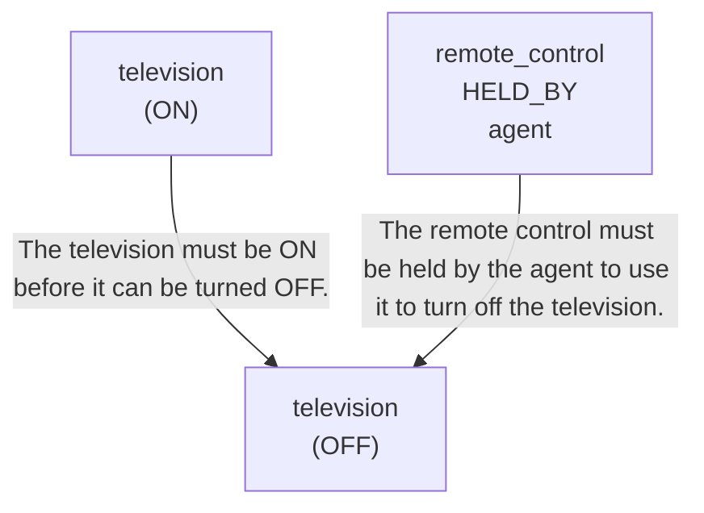

# 🚀 VirtualHome Agent Episode Log


### [GoalReasoner (Module A - Intent)] Output
```json
{
  "is_instruction_obviously_vague": false,
  "clarification_question": null,
  "target_object": "television",
  "location_hint": null,
  "reasoning_chain": [
    {
      "question": "Why does the user want this object?",
      "answer": "They want the television to be turned off if it is currently on."
    },
    {
      "question": "Why is that important?",
      "answer": "Turning it off stops the device from actively displaying or emitting sound."
    },
    {
      "question": "What fundamental need does this fulfill?",
      "answer": "It fulfills the need to stop an unnecessary active display/sound source and bring the room into a quieter, inactive state."
    },
    {
      "question": "Are there any deeper psychological or physical motivations?",
      "answer": "The user likely wants to reduce distraction, save energy, or ensure the television is not left on."
    }
  ],
  "deep_intent": "The user wants to stop an active entertainment device from operating.",
  "acceptable_alternatives_properties": [
    {
      "priority": 1,
      "description": "Other ways to turn off the television, such as using a physical power button on the device or a wall switch controlling its power source."
    },
    {
      "priority": 2,
      "description": "Other household display devices that are currently on and can be turned off, such as a monitor or projector."
    },
    {
      "priority": 3,
      "description": "Any active audio-visual device that can be safely powered down to stop noise or distraction."
    },
    {
      "priority": 4,
      "description": "A different quieting action in the same environment, such as muting an active sound source if turning it off is not possible."
    }
  ]
}
```

### [PerceptionFilter] Output
```json
{
  "reasoning": "Needed objects are the television itself and the remote control required by the SDG to turn it off. No other tools or locations are necessary for this goal.",
  "selected_classes": [
    "wall",
    "remotecontrol",
    "character",
    "tv"
  ],
  "raw_class_count": 112
}
```
## Step 0
- **Action**: `FINISH (Goal Reached)`
- **SDG Status**:

- **Observed Items (36)**: character(1), bathroom(11), wall(18), wall(19), wall(20), wall(21), wall(22), wall(23), bedroom(73), wall(83), wall(84), wall(85), wall(86), wall(87), wall(88)...

