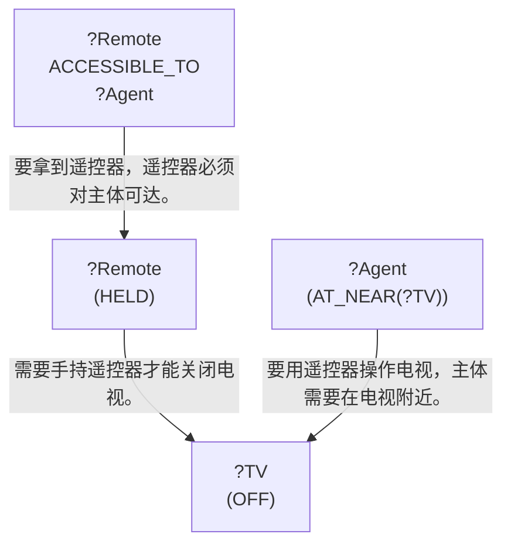

# 🚀 VirtualHome Agent Episode Log


### [GoalReasoner (Module A - Intent)] Output
```json
{
  "is_instruction_obviously_vague": false,
  "clarification_question": null,
  "target_object": "remote control",
  "location_hint": "television",
  "reasoning_chain": [
    {
      "question": "Why does the user want this object?",
      "answer": "To operate the television and turn it off if it is on."
    },
    {
      "question": "Why is that important?",
      "answer": "To stop the television from being active and likely reduce ongoing distraction, noise, or energy use."
    },
    {
      "question": "What fundamental need does this fulfill?",
      "answer": "The user wants to stop an active appliance from running."
    },
    {
      "question": "Are there any deeper psychological or physical motivations?",
      "answer": "The user may want a quieter, less distracting environment or to conserve power."
    }
  ],
  "deep_intent": "The user wants to stop an active appliance from running.",
  "acceptable_alternatives_properties": [
    {
      "priority": 1,
      "description": "Other control methods for the same television, such as a power button on the TV itself or a wall control if available."
    },
    {
      "priority": 2,
      "description": "Other ways to stop the television from operating, such as unplugging it if that is appropriate and accessible."
    },
    {
      "priority": 3,
      "description": "Other household devices used to shut off active electronics, such as a universal remote."
    },
    {
      "priority": 4,
      "description": "Other methods to reduce noise or activity from the room, such as turning off nearby audio devices."
    }
  ]
}
```

### [PerceptionFilter] Output
```json
{
  "reasoning": "The goal is to turn off the television, so we need the TV itself and the remote control specified by the SDG. The remote must be accessible/held to operate the TV, and the TV is the target appliance to be turned off. No other objects are necessary.",
  "selected_ids": [
    426,
    452
  ],
  "raw_item_count": 74
}
```
## Step 0
- **Action**: `FINISH (Goal Reached)`
- **SDG Status**:

- **Observed Items (3)**: tv(426) [ON,OFF], remotecontrol(452) [OFF], character(1)

