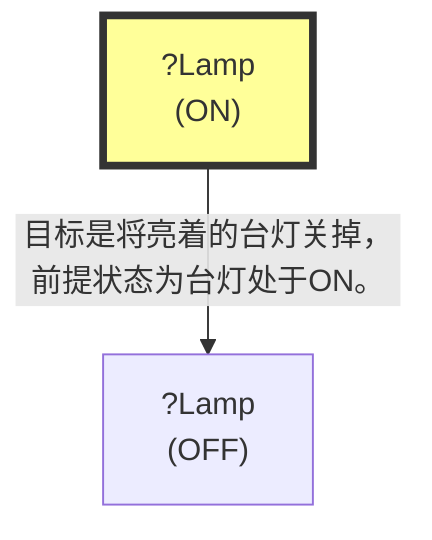
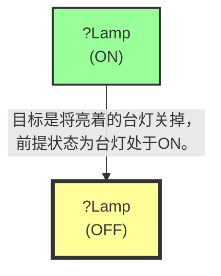
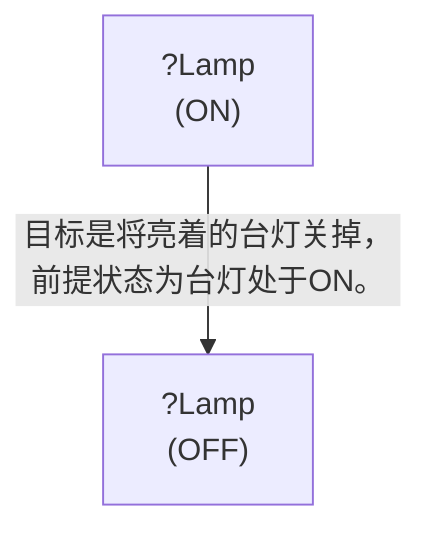

# 🚀 VirtualHome Agent Episode Log


### [GoalReasoner (Module A - Intent)] Output
```json
{
  "is_instruction_obviously_vague": false,
  "clarification_question": null,
  "target_object": "台灯",
  "location_hint": null,
  "reasoning_chain": [
    {
      "question": "Why does the user want this object?",
      "answer": "Because the lamp is currently on and the user wants it turned off."
    },
    {
      "question": "Why is that important?",
      "answer": "To stop the light from being emitted, likely to reduce brightness or save energy."
    },
    {
      "question": "What fundamental need does this fulfill?",
      "answer": "The need to control lighting conditions in the room."
    },
    {
      "question": "Are there any deeper psychological or physical motivations?",
      "answer": "The user may want a darker, more comfortable environment, less visual distraction, or reduced power use."
    }
  ],
  "deep_intent": "The user wants to reduce room illumination.",
  "acceptable_alternatives_properties": [
    {
      "priority": 1,
      "description": "Other indoor light sources that can be switched off, such as a desk lamp or floor lamp."
    },
    {
      "priority": 2,
      "description": "Any nearby room lighting device with an on/off control, such as a ceiling light or wall lamp."
    },
    {
      "priority": 3,
      "description": "Other sources of unnecessary brightness that can be turned off to darken the space."
    },
    {
      "priority": 4,
      "description": "Ways to create a dimmer environment, such as closing blinds or curtains if the goal is reduced light."
    }
  ]
}
```

### [PerceptionFilter] Output
```json
{
  "reasoning": "The goal is to turn off the lamp to reduce room illumination. The required target object is a lamp, and acceptable alternatives include other controllable indoor light sources and dimming options. I will keep both visible table lamps, the ceiling lamp, the light switch, and the curtains as possible ways to reduce light, along with the target lamp category present in the scene.",
  "selected_ids": [
    101,
    102,
    103,
    173,
    183,
    184,
    185
  ],
  "raw_item_count": 69
}
```

### [LLMExecutor] Output
```json
{
  "reasoning": "The SDG requires the lamp to transition from ON to OFF. In the filtered graph, both tablelamp(102) and tablelamp(103) are ON and have HAS_SWITCH, but the goal specifically targets a table lamp (台灯), so either is a valid lamp candidate. Since switching off requires being near the object first, and there has been no prior walk, the next atomic step is to walk to one of the ON table lamps. I choose tablelamp(102) as the best available binding for ?Lamp.",
  "satisfied_nodes": [
    "N1"
  ],
  "current_node_focus": "N1",
  "mapped_variables": {
    "?Lamp": "tablelamp(102)"
  },
  "action": "[walk] <tablelamp> (102)"
}
```
## Step 0
- **Action**: `[walk] <tablelamp> (102)`
- **SDG Status**:

- **Observed Items (8)**: ceilinglamp(101), tablelamp(102) [ON], tablelamp(103) [ON], lightswitch(173) [ON], curtains(183) [CLOSED], curtains(184) [CLOSED], curtains(185) [CLOSED], character(1)


### [PerceptionFilter] Output
```json
{
  "reasoning": "The goal is to reduce room illumination by turning off the lamp. I must keep the target lamp and any alternative lighting controls that could also accomplish the same lighting-reduction task, plus the explicit room light control device and other dimming options mentioned in the intent (like curtains).",
  "selected_ids": [
    101,
    102,
    173,
    183,
    184,
    185
  ],
  "raw_item_count": 68
}
```

### [LLMExecutor] Output
```json
{
  "reasoning": "tablelamp(102) is the best binding for ?Lamp because it is explicitly a table lamp, it is already marked ON, and the previous action already moved us close to it. The next required SDG step is to turn that lamp OFF, which can be done only when near it.",
  "satisfied_nodes": [
    "N1"
  ],
  "current_node_focus": "N2",
  "mapped_variables": {
    "?Lamp": "tablelamp(102)"
  },
  "action": "[switchoff] <tablelamp> (102)"
}
```
## Step 1
- **Action**: `[switchoff] <tablelamp> (102)`
- **SDG Status**:

- **Observed Items (7)**: ceilinglamp(101), tablelamp(102) [ON], lightswitch(173) [ON], curtains(183) [CLOSED], curtains(184) [CLOSED], curtains(185) [CLOSED], character(1)


### [PerceptionFilter] Output
```json
{
  "reasoning": "The goal is to turn off the lamp to reduce room illumination. I must keep the target lamp and any alternative lighting controls that could also reduce brightness, plus the explicit lighting control and dimming option mentioned in the intent. The relevant visible objects are the table lamp, ceiling lamp, and the light switch, with curtains as a fallback way to dim the room.",
  "selected_ids": [
    101,
    102,
    173,
    183,
    184,
    185
  ],
  "raw_item_count": 68
}
```
## Step 2
- **Action**: `FINISH (Goal Reached)`
- **SDG Status**:

- **Observed Items (7)**: ceilinglamp(101), tablelamp(102) [OFF], lightswitch(173) [ON], curtains(183) [CLOSED], curtains(184) [CLOSED], curtains(185) [CLOSED], character(1)

