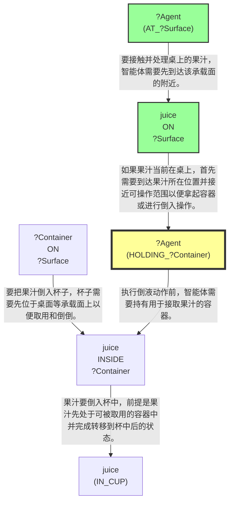
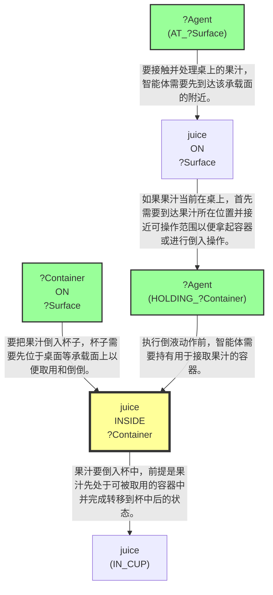
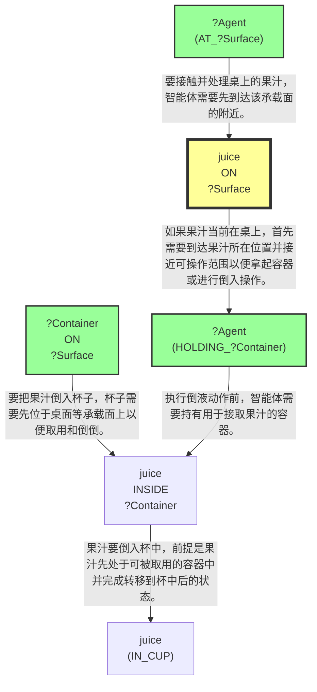
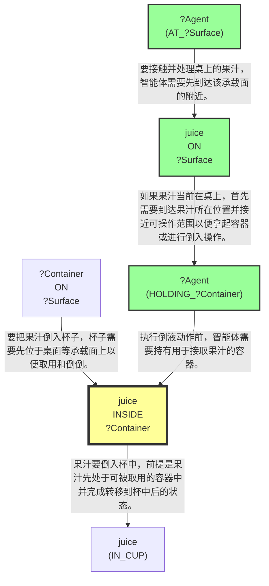
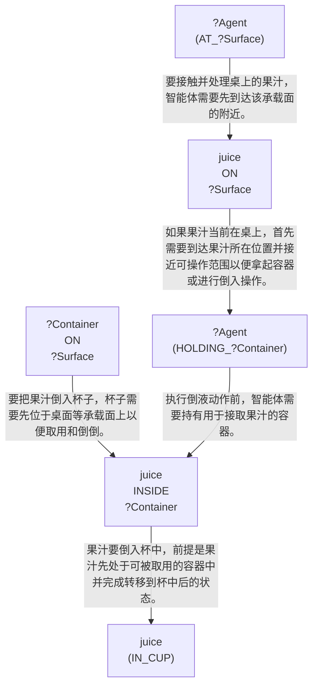

# 🚀 VirtualHome Agent Episode Log


### [GoalReasoner (Module A - Intent)] Output
```json
{
  "is_instruction_obviously_vague": false,
  "clarification_question": null,
  "target_object": "果汁",
  "location_hint": "桌上",
  "reasoning_chain": [
    {
      "question": "Why does the user want this object?",
      "answer": "因为用户想喝一杯桌上的果汁。"
    },
    {
      "question": "Why is that important?",
      "answer": "因为这样可以满足饮用需求并获得想要的饮品。"
    },
    {
      "question": "What fundamental need does this fulfill?",
      "answer": "满足口渴、补充水分，并获得饮料带来的即时舒适感。"
    },
    {
      "question": "Are there any deeper psychological or physical motivations?",
      "answer": "可能是为了缓解干渴、获得能量或享受口味。"
    }
  ],
  "deep_intent": "The user wants to relieve thirst and obtain a refreshing drink.",
  "acceptable_alternatives_properties": [
    {
      "priority": 1,
      "description": "Other ready-to-drink beverages found indoors, such as water, tea, or milk"
    },
    {
      "priority": 2,
      "description": "Similar sweet or fruit-based drinks, such as other juice or flavored drinks"
    },
    {
      "priority": 3,
      "description": "Packaged beverages that can satisfy thirst, such as bottled drinks or electrolyte drinks"
    },
    {
      "priority": 4,
      "description": "Any safe potable liquid available indoors that can reduce thirst"
    }
  ]
}
```

### [PerceptionFilter] Output
```json
{
  "reasoning": "Need the target juice, the likely holding container to pick it up or drink from, and the table/surface context implied by the goal and SDG. Since juice is already visible, include it plus all plausible drink containers/alternatives nearby (waterglass/dishbowl) and the table/surface where it is located. Also retain the agent-accessible liquid alternative? No extra appliance is needed because this is a ready-to-drink beverage task.",
  "selected_ids": [
    173,
    64,
    71,
    72,
    79,
    80,
    87,
    88,
    100,
    115,
    116,
    117,
    118,
    119,
    131,
    135,
    47,
    176,
    177,
    1
  ],
  "raw_item_count": 153
}
```

### [LLMExecutor] Output
```json
{
  "reasoning": "The goal is to get the juice into a cup. The filtered graph already shows juice(173) on kitchentable(131), and the agent is close to that table. To satisfy the prerequisite for pouring, I need to hold a suitable recipient container first. A nearby valid POURABLE recipient is waterglass(64), which is on the same table and close to the agent. The next atomic step should therefore be to walk to that glass before grabbing it.",
  "satisfied_nodes": [
    "N5",
    "N6"
  ],
  "current_node_focus": "N4",
  "mapped_variables": {
    "?Container": "waterglass(64)",
    "?Surface": "kitchentable(131)"
  },
  "action": "[walk] <waterglass> (64)"
}
```
## Step 0
- **Action**: `[walk] <waterglass> (64)`
- **SDG Status**:

- **Observed Items (20)**: door(47) [OPEN], waterglass(64), waterglass(71), waterglass(72), waterglass(79), waterglass(80), waterglass(87), waterglass(88), waterglass(100), dishbowl(115), dishbowl(116), dishbowl(117), dishbowl(118), dishbowl(119), kitchentable(131)...


### [PerceptionFilter] Output
```json
{
  "reasoning": "Need the target juice and the minimal objects required to access or handle it based on the SDG: the juice itself, a suitable container/receptacle if needed, and the table/surface location. Since the goal mentions juice on the table, keep the table. For safe potable alternatives and backups, no extra drink is needed because the target juice is already visible.",
  "selected_ids": [
    173,
    131,
    135,
    64,
    71,
    72,
    79,
    80,
    87,
    88,
    100,
    47,
    176,
    177,
    1
  ],
  "raw_item_count": 153
}
```

### [LLMExecutor] Output
```json
{
  "reasoning": "The SDG requires eventually holding a suitable container and getting juice into it. The agent is already close to the target table and to juice(173), and the past action indicates we have just walked to waterglass(64). The next atomic step should be to grab the nearby valid recipient container so we can later pour the juice into it. Waterglass(64) is GRABBABLE, RECIPIENT, and POURABLE, making it the best container choice among the visible glasses.",
  "satisfied_nodes": [
    "N6",
    "N5"
  ],
  "current_node_focus": "N4",
  "mapped_variables": {
    "?Container": "waterglass(64)",
    "?Surface": "kitchentable(131)"
  },
  "action": "[grab] <waterglass> (64)"
}
```
## Step 1
- **Action**: `[grab] <waterglass> (64)`
- **SDG Status**:

- **Observed Items (15)**: door(47) [OPEN], waterglass(64), waterglass(71), waterglass(72), waterglass(79), waterglass(80), waterglass(87), waterglass(88), waterglass(100), kitchentable(131), kitchentable(135), milk(176) [CLOSED], milk(177) [CLOSED], juice(173), character(1)


### [PerceptionFilter] Output
```json
{
  "reasoning": "To satisfy the goal, I need the target drink (juice) and a suitable container on the table. The SDG indicates the juice is currently in a cup/container and that the agent must be near the surface and holding that container. Since juice is the target and waterglasses are the relevant containers/backups for a drinkable liquid setup, I keep the juice and the available drinking vessels, plus the table surface needed by the intent. ",
  "selected_ids": [
    173,
    64,
    71,
    72,
    79,
    80,
    87,
    88,
    100,
    131,
    135,
    47,
    176,
    177,
    1
  ],
  "raw_item_count": 154
}
```

### [LLMExecutor] Output
```json
{
  "reasoning": "The agent is already holding a valid pourable recipient: waterglass(64). The juice(173) is on the nearby kitchentable(131) and the agent is close to both, so the next missing SDG step is to transfer the juice into the held container. This directly progresses toward N1/N2 while preserving the required holding state for the recipient.",
  "satisfied_nodes": [
    "N4",
    "N6",
    "N3"
  ],
  "current_node_focus": "N2",
  "mapped_variables": {
    "?Container": "waterglass(64)",
    "?Surface": "kitchentable(131)",
    "?Agent": "character(1)"
  },
  "action": "[pour] <juice> (173) <waterglass> (64)"
}
```
## Step 2
- **Action**: `[pour] <juice> (173) <waterglass> (64)`
- **SDG Status**:

- **Observed Items (16)**: door(47) [OPEN], waterglass(71), waterglass(72), waterglass(79), waterglass(80), waterglass(87), waterglass(88), waterglass(100), kitchentable(131), kitchentable(135), milk(176) [CLOSED], milk(177) [CLOSED], juice(173), character(1), waterglass(64)...


### [PerceptionFilter] Output
```json
{
  "reasoning": "Need the target juice and the container it should be in/handled with, plus the nearby table surface implied by the goal/SDG. To satisfy alternatives retention for a drink goal, keep other ready-to-drink beverages that could serve as backups. Also keep the relevant surface/furniture for 'on the table' handling.",
  "selected_ids": [
    173,
    64,
    71,
    72,
    79,
    80,
    87,
    88,
    100,
    176,
    177,
    131,
    135,
    47,
    1
  ],
  "raw_item_count": 154
}
```

### [LLMExecutor] Output
```json
{
  "reasoning": "The previous pour failed because the source juice was not held. The agent is already holding a valid recipient container (waterglass(64)) and is close to the juice on the same table, so the next atomic step must be to grab the source juice first. This directly satisfies the prerequisite for the later pour action and continues toward getting the juice into a cup.",
  "satisfied_nodes": [
    "N6",
    "N3",
    "N4"
  ],
  "current_node_focus": "N5",
  "mapped_variables": {
    "?Container": "waterglass(64)",
    "?Surface": "kitchentable(131)",
    "?Agent": "character(1)"
  },
  "action": "[grab] <juice> (173)"
}
```
## Step 3
- **Action**: `[grab] <juice> (173)`
- **SDG Status**:

- **Observed Items (16)**: door(47) [OPEN], waterglass(71), waterglass(72), waterglass(79), waterglass(80), waterglass(87), waterglass(88), waterglass(100), kitchentable(131), kitchentable(135), milk(176) [CLOSED], milk(177) [CLOSED], juice(173), character(1), waterglass(64)...


### [PerceptionFilter] Output
```json
{
  "reasoning": "Need the juice target, a suitable container for it (cup/glass), and the table/surface location implied by the goal and SDG. To satisfy backup/alternative tool retention, keep all visible drink containers that could hold or receive juice: waterglasses and dishbowls. Also keep the table surfaces where the drink/container are located.",
  "selected_ids": [
    173,
    64,
    71,
    72,
    79,
    80,
    87,
    88,
    100,
    115,
    116,
    117,
    118,
    119,
    131,
    135,
    47,
    176,
    177,
    1
  ],
  "raw_item_count": 155
}
```

### [LLMExecutor] Output
```json
{
  "reasoning": "The current SDG focus is to get juice into the held recipient container. The agent is already holding both the recipient waterglass(64) and the source juice(173), and both are close to the agent. The previous pour failed only because the source had not been held; that prerequisite is now satisfied. The next atomic action that directly advances N1/N2 is to pour the juice into the held waterglass.",
  "satisfied_nodes": [
    "N4",
    "N6",
    "N5"
  ],
  "current_node_focus": "N2",
  "mapped_variables": {
    "?Container": "waterglass(64)",
    "?Surface": "kitchentable(131)",
    "?Agent": "character(1)"
  },
  "action": "[pour] <juice> (173) <waterglass> (64)"
}
```
## Step 4
- **Action**: `[pour] <juice> (173) <waterglass> (64)`
- **SDG Status**:

- **Observed Items (22)**: door(47) [OPEN], waterglass(71), waterglass(72), waterglass(79), waterglass(80), waterglass(87), waterglass(88), waterglass(100), dishbowl(115), dishbowl(116), dishbowl(117), dishbowl(118), dishbowl(119), kitchentable(131), kitchentable(135)...


### [PerceptionFilter] Output
```json
{
  "reasoning": "Need the target juice and the container/surface required by the SDG. Since the juice is on the table and must be in a cup, keep the juice plus a suitable container (water glass) and the table surface for access. I also retain alternative drink containers present only if needed, but the minimum here is the juice and one usable glass on the table.",
  "selected_ids": [
    173,
    64,
    131,
    47,
    176,
    177,
    1
  ],
  "raw_item_count": 155
}
```
## Step 5
- **Action**: `FINISH (Goal Reached)`
- **SDG Status**:

- **Observed Items (9)**: door(47) [OPEN], kitchentable(131), milk(176) [CLOSED], milk(177) [CLOSED], character(1), juice(173), waterglass(64) [FILLED_JUICE], waterglass(64) [FILLED_JUICE], juice(173)

