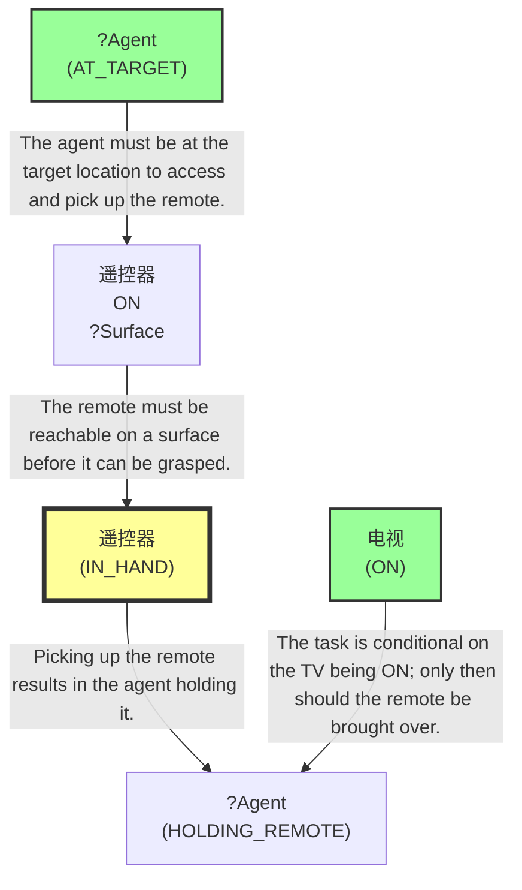
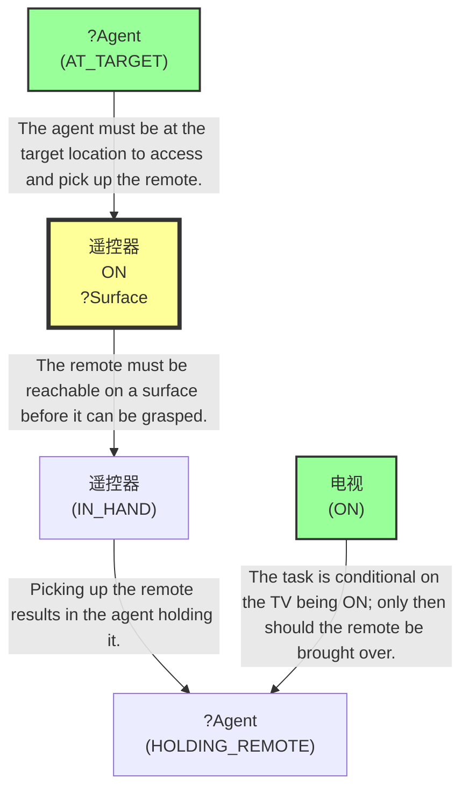
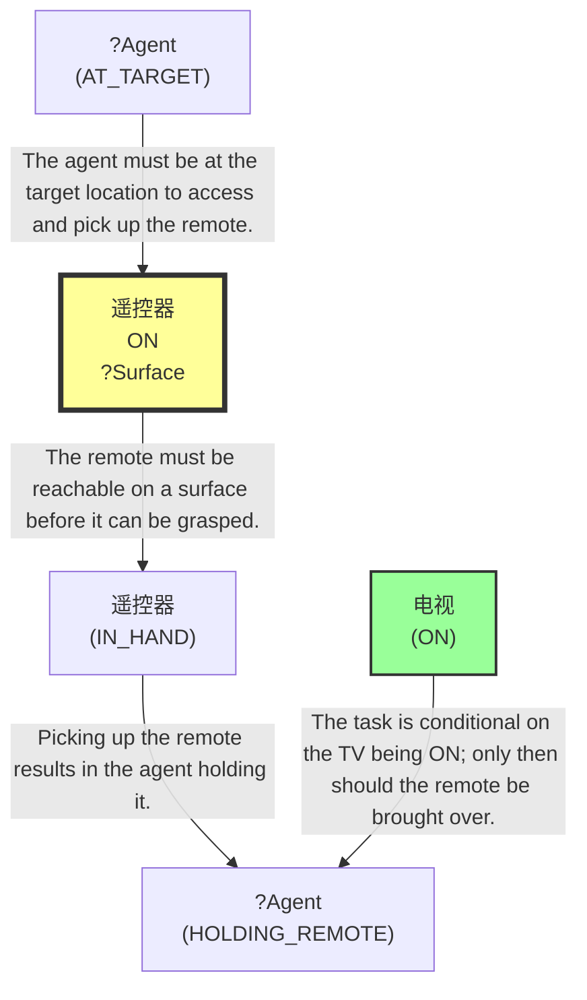
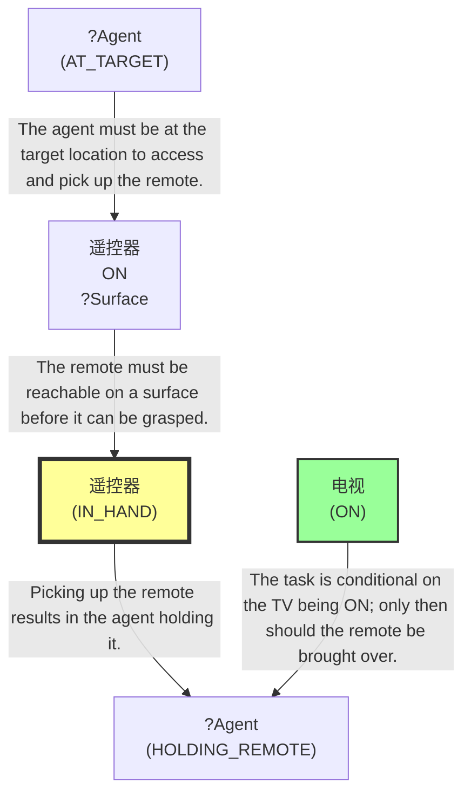
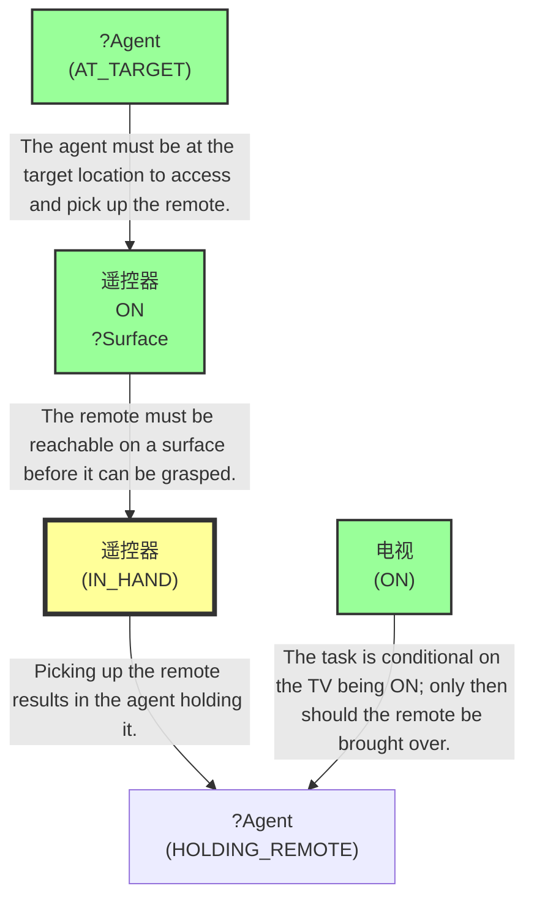
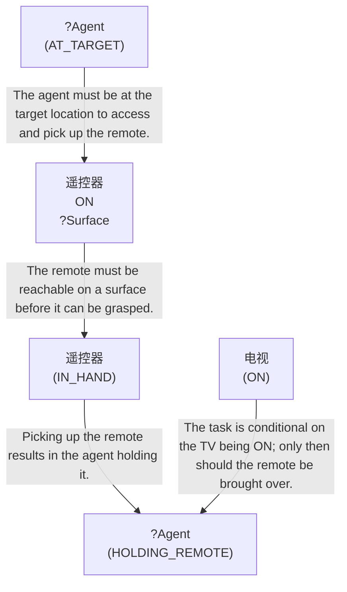

# 🚀 VirtualHome Agent Episode Log


### [GoalReasoner (Module A - Intent)] Output
```json
{
  "is_instruction_obviously_vague": false,
  "clarification_question": null,
  "target_object": "遥控器",
  "location_hint": "电视附近",
  "reasoning_chain": [
    {
      "question": "Why does the user want this object?",
      "answer": "为了在电视开着时控制电视或进行操作。"
    },
    {
      "question": "Why is that important?",
      "answer": "这样可以方便地管理电视状态或进行关闭、调节等操作。"
    },
    {
      "question": "What fundamental need does this fulfill?",
      "answer": "满足对正在运行设备的即时控制需求。"
    },
    {
      "question": "Are there any deeper psychological or physical motivations?",
      "answer": "可能是为了节省走动、快速处理电视相关操作，或避免电视继续运行带来的干扰。"
    }
  ],
  "deep_intent": "用户想要获得对正在运行的电视的控制能力。",
  "acceptable_alternatives_properties": [
    {
      "priority": 1,
      "description": "其他可用于控制电视的输入设备，例如备用遥控器或通用遥控器"
    },
    {
      "priority": 2,
      "description": "可直接操作电视的控制方式，例如电视机身按键"
    },
    {
      "priority": 3,
      "description": "其他能实现同样控制目的的家庭设备控制工具，例如机顶盒遥控器（若可兼容）"
    },
    {
      "priority": 4,
      "description": "无需遥控器的替代控制方式，例如通过手机应用进行电视控制（若设备支持）"
    }
  ]
}
```

### [PerceptionFilter] Output
```json
{
  "reasoning": "Need the target remote control and the TV it is meant to operate, since the goal is to gain control of the running television. The SDG also requires the remote to be reachable on a surface, so the remote is the key object to select; the TV is the location-relevant appliance mentioned in the intent and SDG. No backup control devices are visible besides the remote, so only the necessary matching objects are kept.",
  "selected_ids": [
    321,
    300,
    1
  ],
  "raw_item_count": 316
}
```

### [LLMExecutor] Output
```json
{
  "reasoning": "The SDG requires the agent to be at the remote's location and then pick it up. The filtered graph shows the remotecontrol(321) is already CLOSE to the character, so the proximity requirement is satisfied and no walk is needed. The TV is already ON, satisfying the conditional prerequisite. The next atomic step toward holding the remote is to grab it.",
  "satisfied_nodes": [
    "N1",
    "N4"
  ],
  "current_node_focus": "N3",
  "mapped_variables": {},
  "action": "[grab] <remotecontrol> (321)"
}
```
## Step 0
- **Action**: `[grab] <remotecontrol> (321)`
- **SDG Status**:

- **Observed Items (3)**: character(1), tv(300) [ON,OFF], remotecontrol(321) [OFF]


### [PerceptionFilter] Output
```json
{
  "reasoning": "The goal is to obtain the TV remote, so I must keep the target remote control and the TV it will control. The SDG also requires the agent to be at the target location and the remote to be on a reachable surface; the visible TV area includes a tvstand, so I keep that as the likely surface/location context. No other tools are necessary because the direct target remote is present.",
  "selected_ids": [
    300,
    321,
    292,
    1
  ],
  "raw_item_count": 316
}
```

### [LLMExecutor] Output
```json
{
  "reasoning": "The TV is already ON, so the conditional prerequisite is satisfied. The remotecontrol(321) is CLOSE to the agent, so the proximity requirement for grabbing is met. The previous grab failed because another person is using it, which indicates the object is temporarily unavailable rather than permanently missing. According to the failure-handling rule, the correct next step is to wait in place for it to become available again.",
  "satisfied_nodes": [
    "N1",
    "N4"
  ],
  "current_node_focus": "N2",
  "mapped_variables": {},
  "action": "[wait]"
}
```
## Step 1
- **Action**: `[wait]`
- **SDG Status**:

- **Observed Items (4)**: character(1), tvstand(292), tv(300) [ON,OFF], remotecontrol(321) [OFF]


### [PerceptionFilter] Output
```json
{
  "reasoning": "Need the target remote control and the TV it is meant to operate. The SDG also requires the remote to be reachable on a surface, so I keep the TV area objects that are directly relevant: the TV, its stand, and the remote control.",
  "selected_ids": [
    300,
    292,
    321,
    1
  ],
  "raw_item_count": 316
}
```

### [LLMExecutor] Output
```json
{
  "reasoning": "The TV is already ON, satisfying N1. The remotecontrol(321) is still CLOSE to the agent but the last grab failed because another person was using it, which indicates a temporary unavailability. Per the failure-handling rule, the correct autonomous action is to wait in place until it becomes available again. This is the best next step toward eventually satisfying the IN_HAND and HOLDING_REMOTE states.",
  "satisfied_nodes": [
    "N1",
    "N4"
  ],
  "current_node_focus": "N2",
  "mapped_variables": {
    "?Surface": "tvstand(292)"
  },
  "action": "[wait]"
}
```
## Step 2
- **Action**: `[wait]`
- **SDG Status**:

- **Observed Items (4)**: character(1), tvstand(292), tv(300) [ON,OFF], remotecontrol(321) [OFF]


### [PerceptionFilter] Output
```json
{
  "reasoning": "Need the target remote control and the TV because the goal is to gain control of the running television. The SDG also requires the remote to be reachable on a surface, so the tvstand is kept as the likely surface/location near the TV.",
  "selected_ids": [
    321,
    300,
    292,
    1
  ],
  "raw_item_count": 316
}
```

### [LLMExecutor] Output
```json
{
  "reasoning": "The TV is already ON, satisfying N1. The remotecontrol(321) is close to the agent, so the physical access requirement for grabbing is met. The previous grab failed because another person was using it, which is a temporary unavailability; per the rules, the correct next step is to wait in place rather than retrying or moving. This keeps progress toward holding the remote once it becomes available.",
  "satisfied_nodes": [
    "N1"
  ],
  "current_node_focus": "N2",
  "mapped_variables": {
    "?Surface": "tvstand(292)"
  },
  "action": "[wait]"
}
```
## Step 3
- **Action**: `[wait]`
- **SDG Status**:

- **Observed Items (4)**: character(1), tvstand(292), tv(300) [ON,OFF], remotecontrol(321) [OFF]


### [PerceptionFilter] Output
```json
{
  "reasoning": "Need the target remote control and the TV it controls, plus the TV stand/area context implied by the intent and SDG. Since the remote must be reachable on a surface, keep the remote and the TV-related furniture/TV object; no other items are necessary.",
  "selected_ids": [
    321,
    300,
    292,
    201,
    1
  ],
  "raw_item_count": 316
}
```

### [LLMExecutor] Output
```json
{
  "reasoning": "The TV is already ON, so N1 is satisfied. The remotecontrol(321) is close to the agent and therefore reachable, and the previous grab failure was due to temporary use by another person. Per the disappearing/temporary-unavailable rule, the correct next step is to wait in place for the remote to become available again rather than retrying or moving. This is the best progress toward satisfying IN_HAND and HOLDING_REMOTE.",
  "satisfied_nodes": [
    "N1"
  ],
  "current_node_focus": "N3",
  "mapped_variables": {},
  "action": "[wait]"
}
```
## Step 4
- **Action**: `[wait]`
- **SDG Status**:

- **Observed Items (5)**: character(1), tvstand(201), tvstand(292), tv(300) [ON,OFF], remotecontrol(321) [OFF]


### [PerceptionFilter] Output
```json
{
  "reasoning": "The goal is to obtain the remote control for an on TV. I must keep the target object and the TV, and include the only visible compatible control device. The SDG also requires the remote to be on a reachable surface, so no extra furniture is needed beyond the remote and TV for selection.",
  "selected_ids": [
    300,
    321,
    1
  ],
  "raw_item_count": 316
}
```

### [LLMExecutor] Output
```json
{
  "reasoning": "The TV is already ON, satisfying N1. The remotecontrol(321) is still CLOSE to the agent, so the proximity requirement for grabbing is met. The previous failure was due to temporary use by another person, and the object is still present in the graph, so the correct autonomous step is to wait in place again for availability rather than retrying or moving.",
  "satisfied_nodes": [
    "N1"
  ],
  "current_node_focus": "N2",
  "mapped_variables": {},
  "action": "[wait]"
}
```
## Step 5
- **Action**: `[wait]`
- **SDG Status**:

- **Observed Items (3)**: character(1), tv(300) [ON,OFF], remotecontrol(321) [OFF]


### [PerceptionFilter] Output
```json
{
  "reasoning": "Need the target remote control and the TV it is meant to operate. The SDG requires the TV to be ON and the remote to be reachable on a surface before pickup, so I keep the remote, the TV, and the TV stand as the relevant location/support surface near the TV. No other objects are necessary.",
  "selected_ids": [
    321,
    300,
    292,
    1
  ],
  "raw_item_count": 316
}
```

### [LLMExecutor] Output
```json
{
  "reasoning": "The TV is already ON, satisfying the conditional prerequisite N1. The remotecontrol(321) is CLOSE to the agent, so the proximity requirement for grabbing is met, and N2 is effectively satisfied because the remote is reachable on the nearby tvstand area / surface context. The previous repeated waits were for temporary unavailability, but the remote is still present and close, so the next progress-making step is to attempt to pick it up again. This should satisfy IN_HAND and HOLDING_REMOTE if the object is now available.",
  "satisfied_nodes": [
    "N1",
    "N2",
    "N4"
  ],
  "current_node_focus": "N3",
  "mapped_variables": {
    "?Surface": "tvstand(292)"
  },
  "action": "[grab] <remotecontrol> (321)"
}
```
## Step 6
- **Action**: `[grab] <remotecontrol> (321)`
- **SDG Status**:

- **Observed Items (4)**: character(1), tvstand(292), tv(300) [ON,OFF], remotecontrol(321) [OFF]


### [PerceptionFilter] Output
```json
{
  "reasoning": "需要保留目标遥控器，以及与目标明确相关的电视和电视附近的支撑家具/表面。根据SDG，遥控器需要在某个表面上可达并被拿起，同时电视必须处于开启状态；场景中可见电视、电视柜和遥控器，因此只保留这些必要对象即可。",
  "selected_ids": [
    321,
    300,
    292,
    1
  ],
  "raw_item_count": 316
}
```
## Step 7
- **Action**: `FINISH (Goal Reached)`
- **SDG Status**:

- **Observed Items (4)**: character(1), tvstand(292), tv(300) [ON,OFF], remotecontrol(321) [OFF]

