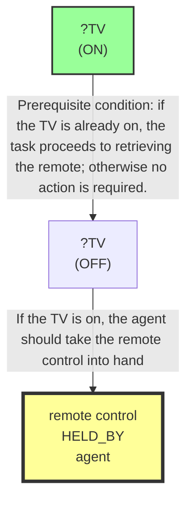
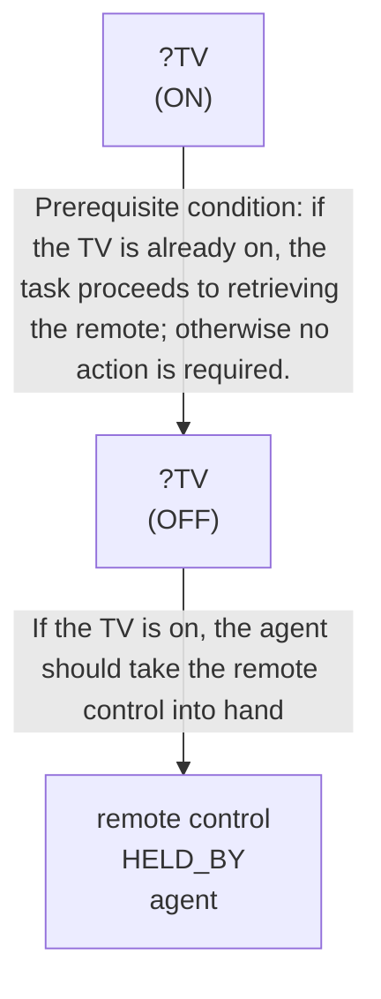

# 🚀 VirtualHome Agent Episode Log


### [GoalReasoner (Module A - Intent)] Output
```json
{
  "is_instruction_obviously_vague": false,
  "clarification_question": null,
  "target_object": "遥控器",
  "location_hint": "电视附近",
  "reasoning_chain": [
    {
      "question": "Why does the user want this object?",
      "answer": "Because the user wants to use the remote control when the television is on."
    },
    {
      "question": "Why is that important?",
      "answer": "Having the remote available allows the user to operate or adjust the television without getting up or reaching for controls on the device."
    },
    {
      "question": "What fundamental need does this fulfill?",
      "answer": "It fulfills the need to conveniently control an active television."
    },
    {
      "question": "Are there any deeper psychological or physical motivations?",
      "answer": "The user likely wants ease, comfort, and immediate control over the television's current state."
    }
  ],
  "deep_intent": "The user wants convenient control over an active television.",
  "acceptable_alternatives_properties": [
    {
      "priority": 1,
      "description": "Another handheld device used to control the television, such as a universal remote or a compatible TV remote."
    },
    {
      "priority": 2,
      "description": "A nearby control interface for the television, such as buttons on the TV or a wall-mounted control panel."
    },
    {
      "priority": 3,
      "description": "A substitute control device for the same entertainment system, such as a set-top box remote if it can operate the television."
    },
    {
      "priority": 4,
      "description": "Any accessible means to change the television's state without moving far away, such as a smartphone app if it already controls the TV."
    }
  ]
}
```

### [PerceptionFilter] Output
```json
{
  "reasoning": "The goal is to obtain the TV remote, and the SDG says to keep the TV if it is on. The relevant items are the television, the target remote control near it, and any viable alternative control interfaces that could also operate the TV. From the visible objects, that includes the TV, the remote control, the computer/phone-like device that could potentially be used as an accessible control substitute, and the nearby control interfaces if applicable.",
  "selected_ids": [
    300,
    321,
    318,
    295,
    1,
    12,
    13,
    14,
    15,
    60,
    61,
    62,
    63,
    64,
    65,
    66,
    67,
    106,
    147,
    148,
    149,
    150,
    151,
    152,
    153,
    154,
    262,
    263,
    264,
    265,
    266,
    267,
    268,
    269
  ],
  "raw_item_count": 316
}
```

### [LLMExecutor] Output
```json
{
  "reasoning": "The SDG indicates that if the TV is already ON, the next objective is to retrieve the remote control into the agent's hand. The filtered graph shows tv(300) has state ON, and remotecontrol(321) is already CLOSE to the agent, so proximity is satisfied. The remote is grabbable and not currently held, so the best next atomic action is to grab it.",
  "satisfied_nodes": [
    "N1"
  ],
  "current_node_focus": "N3",
  "mapped_variables": {
    "?TV": "tv(300)"
  },
  "action": "[grab] remotecontrol (321)"
}
```
## Step 0
- **Action**: `[grab] <remotecontrol> (321)`
- **SDG Status**:

- **Observed Items (34)**: character(1), wall(12), wall(13), wall(14), wall(15), wall(60), wall(61), wall(62), wall(63), wall(64), wall(65), wall(66), wall(67), box(106) [CLOSED], wall(147)...


### [PerceptionFilter] Output
```json
{
  "reasoning": "Need the target remote control and the TV it is meant to operate. Since the goal is to get convenient control of an active television, and alternatives/backups must be retained, include the TV plus the nearby handheld control device; no other objects are necessary.",
  "selected_ids": [
    300,
    321,
    1,
    12,
    13,
    14,
    15,
    60,
    61,
    62,
    63,
    64,
    65,
    66,
    67,
    106,
    147,
    148,
    149,
    150,
    151,
    152,
    153,
    154,
    262,
    263,
    264,
    265,
    266,
    267,
    268,
    269
  ],
  "raw_item_count": 316
}
```

### [LLMExecutor] Output
```json
{
  "reasoning": "The SDG focus is to satisfy N3 by getting the remote control held by the agent, and the prerequisite TV state branch is already satisfied because tv(300) is ON. The remotecontrol(321) is already CLOSE to the agent, so no walk is needed. A previous grab attempt failed because another person was using it, so the correct autonomous response is to wait in place for the remote to become available again.",
  "satisfied_nodes": [
    "N1"
  ],
  "current_node_focus": "N3",
  "mapped_variables": {
    "?TV": "tv(300)"
  },
  "action": "[wait]"
}
```
## Step 1
- **Action**: `[wait]`
- **SDG Status**:

- **Observed Items (32)**: character(1), wall(12), wall(13), wall(14), wall(15), wall(60), wall(61), wall(62), wall(63), wall(64), wall(65), wall(66), wall(67), box(106) [CLOSED], wall(147)...


### [PerceptionFilter] Output
```json
{
  "reasoning": "Need the target remote control and the TV it operates, since the goal is convenient control of the active television and the SDG requires the TV to be on before retrieving the remote. Also keep the nearby TV stand because it is part of the mentioned TV area and can help locate the remote. No other objects are necessary.",
  "selected_ids": [
    300,
    321,
    292,
    1,
    12,
    13,
    14,
    15,
    60,
    61,
    62,
    63,
    64,
    65,
    66,
    67,
    106,
    147,
    148,
    149,
    150,
    151,
    152,
    153,
    154,
    262,
    263,
    264,
    265,
    266,
    267,
    268,
    269
  ],
  "raw_item_count": 316
}
```

### [LLMExecutor] Output
```json
{
  "reasoning": "The TV branch condition is satisfied because tv(300) is ON, so the active SDG node is N3: get the remote control held by the agent. The remotecontrol(321) is currently CLOSE to the agent, so no walk is needed. It is grabbable and not already held, and the previous grab failed only because another person was using it; after waiting one step, the correct next attempt is to grab the remote again.",
  "satisfied_nodes": [
    "N1"
  ],
  "current_node_focus": "N3",
  "mapped_variables": {
    "?TV": "tv(300)"
  },
  "action": "[grab] <remotecontrol> (321)"
}
```
## Step 2
- **Action**: `[grab] <remotecontrol> (321)`
- **SDG Status**:

- **Observed Items (33)**: character(1), wall(12), wall(13), wall(14), wall(15), wall(60), wall(61), wall(62), wall(63), wall(64), wall(65), wall(66), wall(67), box(106) [CLOSED], wall(147)...


### [PerceptionFilter] Output
```json
{
  "reasoning": "Need the television and a usable remote/control device near it. The SDG says the TV should be on and the remote control should be held by the agent, so I keep the TV plus the remote control. Nearby TV furniture is not necessary unless specifically needed to operate, so I exclude it.",
  "selected_ids": [
    300,
    321,
    1,
    12,
    13,
    14,
    15,
    60,
    61,
    62,
    63,
    64,
    65,
    66,
    67,
    106,
    147,
    148,
    149,
    150,
    151,
    152,
    153,
    154,
    262,
    263,
    264,
    265,
    266,
    267,
    268,
    269
  ],
  "raw_item_count": 316
}
```

### [LLMExecutor] Output
```json
{
  "reasoning": "The SDG branch for the TV is already satisfied in the sense that the television is ON (N1). The remaining active node is N3: the remote control should be held by the agent. The remotecontrol(321) is already CLOSE to the agent, so no walk is needed. The previous grab attempts failed because another person was using it, and we have already waited once; the correct next atomic action is to attempt grabbing the same remote again.",
  "satisfied_nodes": [
    "N1"
  ],
  "current_node_focus": "N3",
  "mapped_variables": {
    "?TV": "tv(300)"
  },
  "action": "[grab] <remotecontrol> (321)"
}
```
## Step 3
- **Action**: `[grab] <remotecontrol> (321)`
- **SDG Status**:

- **Observed Items (32)**: character(1), wall(12), wall(13), wall(14), wall(15), wall(60), wall(61), wall(62), wall(63), wall(64), wall(65), wall(66), wall(67), box(106) [CLOSED], wall(147)...


### [PerceptionFilter] Output
```json
{
  "reasoning": "The goal is to get the remote control for convenient TV control. Per the SDG and intent, we need the target remote and the TV itself as the nearby relevant location/device. Since alternatives should be retained, include any other handheld TV-control device if present; here only the remote control is clearly relevant, and the TV is the location anchor.",
  "selected_ids": [
    300,
    321,
    1,
    12,
    13,
    14,
    15,
    60,
    61,
    62,
    63,
    64,
    65,
    66,
    67,
    106,
    147,
    148,
    149,
    150,
    151,
    152,
    153,
    154,
    262,
    263,
    264,
    265,
    266,
    267,
    268,
    269
  ],
  "raw_item_count": 316
}
```
## Step 4
- **Action**: `FINISH (Goal Reached)`
- **SDG Status**:

- **Observed Items (32)**: character(1), wall(12), wall(13), wall(14), wall(15), wall(60), wall(61), wall(62), wall(63), wall(64), wall(65), wall(66), wall(67), box(106) [CLOSED], wall(147)...

