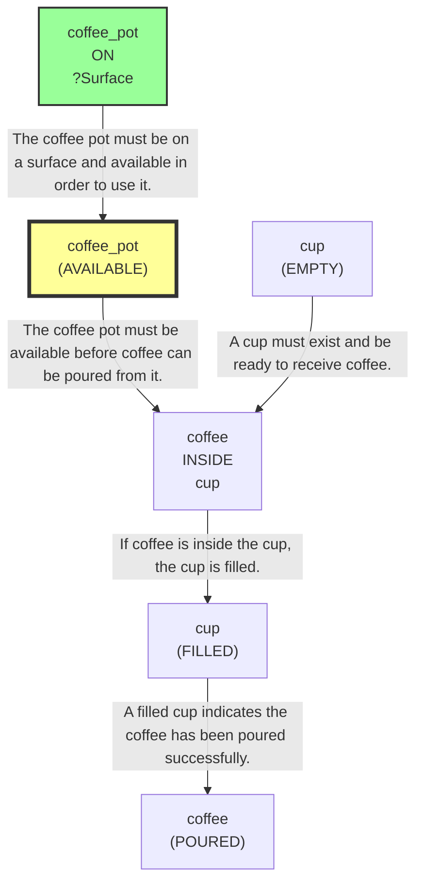
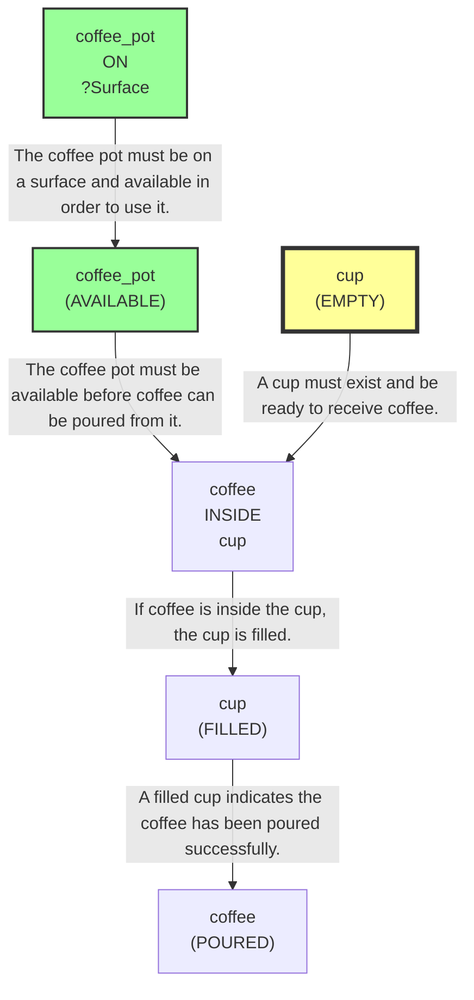
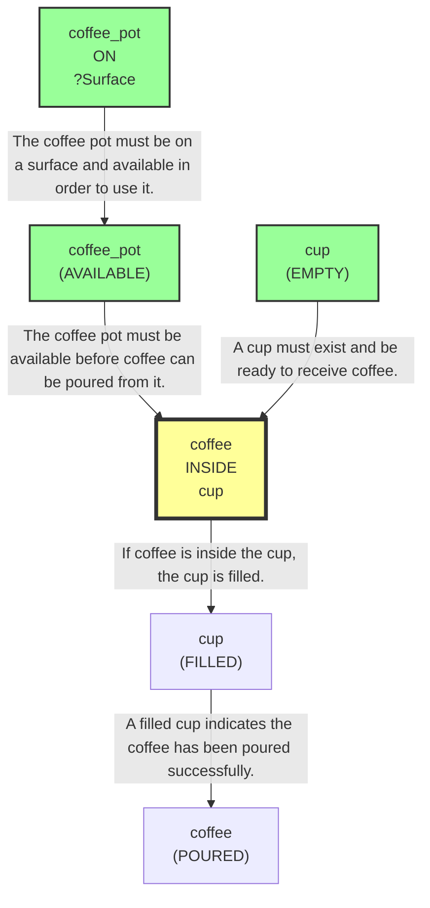
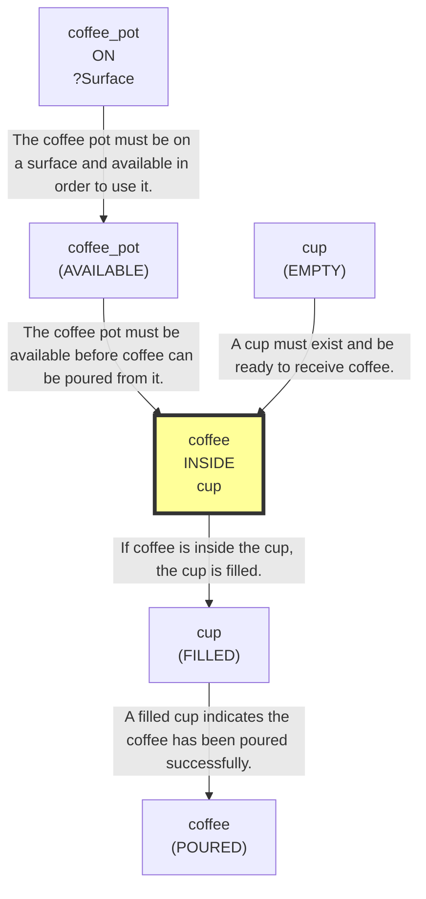
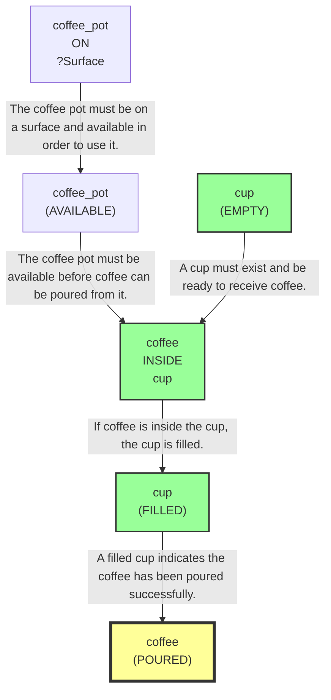
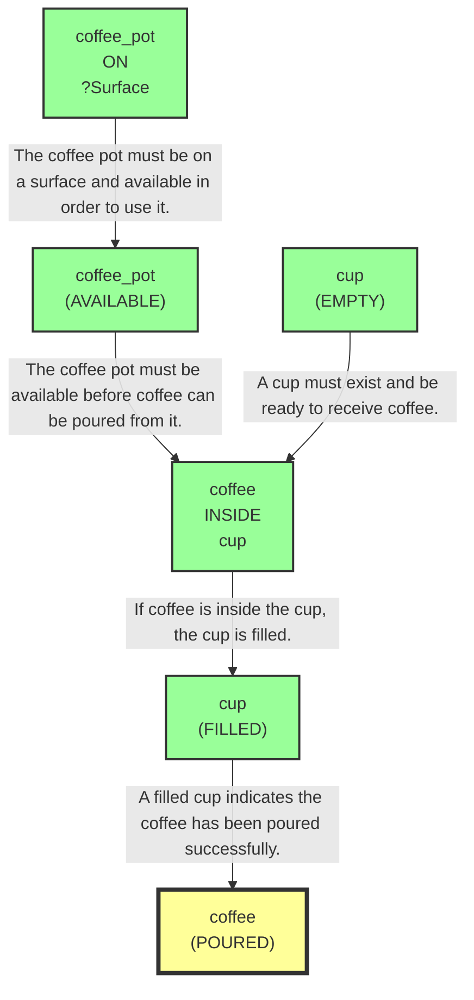
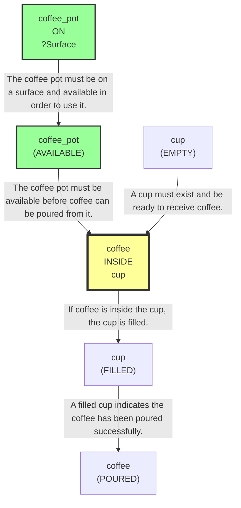

# 🚀 VirtualHome Agent Episode Log


### [GoalReasoner (Module A - Intent)] Output
```json
{
  "is_instruction_obviously_vague": false,
  "clarification_question": null,
  "target_object": "咖啡",
  "location_hint": "桌子上",
  "reasoning_chain": [
    {
      "question": "Why does the user want this object?",
      "answer": "The user wants coffee delivered to them."
    },
    {
      "question": "Why is that important?",
      "answer": "It likely serves to provide a drink for immediate consumption."
    },
    {
      "question": "What fundamental need does this fulfill?",
      "answer": "It fulfills the need to drink something, likely for refreshment or stimulation."
    },
    {
      "question": "Are there any deeper psychological or physical motivations?",
      "answer": "The user may want to reduce thirst, increase alertness, or enjoy a preferred beverage."
    }
  ],
  "deep_intent": "The user wants to obtain a drink for refreshment or alertness.",
  "acceptable_alternatives_properties": [
    {
      "priority": 1,
      "description": "Other ready-to-drink hot beverages, such as tea or hot water with a drink mix"
    },
    {
      "priority": 2,
      "description": "Another brewed beverage prepared from a household drink container, such as similar coffee or tea service"
    },
    {
      "priority": 3,
      "description": "Packaged beverages that provide hydration or caffeine, such as bottled drinks or instant beverage mixes"
    },
    {
      "priority": 4,
      "description": "Any suitable drink that can relieve thirst, such as water or juice"
    }
  ]
}
```

### [PerceptionFilter] Output
```json
{
  "reasoning": "Needed objects are the coffee source and a container to receive it, plus the surface the coffee pot is on because the SDG requires the pot to be available/on a surface. The goal is coffee on the table, so the table is also retained as the implied placement surface. No extra backups are visible beyond the primary coffee-making setup and cup/mug-type receptacles.",
  "selected_ids": [
    131,
    135,
    169,
    170,
    384,
    1,
    173,
    174
  ],
  "raw_item_count": 396
}
```

### [LLMExecutor] Output
```json
{
  "reasoning": "To make coffee available and pour it into a cup, the first missing prerequisite is access to the coffee pot. The filtered graph shows coffeepot(170) is CLOSED and on the kitchen table, which is already near the character. Since the pot must be open/available before pouring, the best next atomic step is to open the coffee pot. No walk is needed because the character is already close to it.",
  "satisfied_nodes": [
    "N1"
  ],
  "current_node_focus": "N2",
  "mapped_variables": {
    "?Surface": "kitchentable(131)"
  },
  "action": "[open] coffeepot (170)"
}
```
## Step 0
- **Action**: `[open] <coffeepot> (170)`
- **SDG Status**:

- **Observed Items (8)**: character(1), kitchentable(131), kitchentable(135), coffeemaker(169) [OFF], coffeepot(170) [CLOSED], juice(173), juice(174), mug(384)


### [PerceptionFilter] Output
```json
{
  "reasoning": "The goal is to obtain coffee on a table. The SDG requires the coffee_pot and a cup, and the visible scene includes a coffeepot and a mug/cup-like container plus a kitchentable. Since alternative drink options are allowed, I keep the coffee-related items and the table/location needed for the intended placement.",
  "selected_ids": [
    170,
    384,
    131,
    1,
    173,
    174
  ],
  "raw_item_count": 396
}
```

### [LLMExecutor] Output
```json
{
  "reasoning": "The coffee pot is already OPEN and ON the kitchen table, so N1 and N2 are satisfied. The next missing prerequisite is an empty cup. The only suitable cup-like recipient visible is mug(384), which is GRABBABLE and POURABLE, so it can serve as the cup in the SDG. I should now obtain the mug before any pouring can happen.",
  "satisfied_nodes": [
    "N1",
    "N2"
  ],
  "current_node_focus": "N3",
  "mapped_variables": {
    "?Surface": "kitchentable(131)"
  },
  "action": "[grab] <mug> (384)"
}
```
## Step 1
- **Action**: `[grab] <mug> (384)`
- **SDG Status**:

- **Observed Items (6)**: character(1), kitchentable(131), coffeepot(170) [OPEN], juice(173), juice(174), mug(384)


### [PerceptionFilter] Output
```json
{
  "reasoning": "The goal is to obtain coffee on a table, and the SDG requires the coffee pot plus a cup. I kept the coffee pot as the source, a cup/mug as the receiving container, and the visible table surface needed by the location hint and to satisfy the pot-on-surface condition. I also kept the only clear alternative ready-to-drink beverage containers nearby in case coffee pot use is not possible.",
  "selected_ids": [
    170,
    384,
    215,
    131,
    173,
    174,
    64,
    71,
    72,
    79,
    80,
    87,
    88,
    100,
    115,
    116,
    117,
    118,
    119,
    172,
    263,
    1
  ],
  "raw_item_count": 396
}
```

### [LLMExecutor] Output
```json
{
  "reasoning": "The coffee pot is already OPEN and on the kitchen table, satisfying N1 and N2. I have already grabbed the recipient mug(384), which is the best cup-like POURABLE/RECIPIENT object available. The next missing prerequisite for the SDG is to move the filled/pouring step forward by pouring coffee from the held coffee pot into the mug. Because I am not currently holding the coffee pot, I would need to grab it first; however, the single next atomic action that directly advances toward the goal while respecting the current held item and proximity is to grab the coffee pot after confirming the mug is already held. Since the mug is in hand and the pot is close, the most immediate necessary action is to take the pot into a hand before pouring.",
  "satisfied_nodes": [
    "N1",
    "N2",
    "N3"
  ],
  "current_node_focus": "N4",
  "mapped_variables": {
    "?Surface": "kitchentable(131)"
  },
  "action": "[grab] <coffeepot> (170)"
}
```
## Step 2
- **Action**: `[grab] <coffeepot> (170)`
- **SDG Status**:

- **Observed Items (22)**: character(1), waterglass(64), waterglass(71), waterglass(72), waterglass(79), waterglass(80), waterglass(87), waterglass(88), waterglass(100), dishbowl(115), dishbowl(116), dishbowl(117), dishbowl(118), dishbowl(119), kitchentable(131)...


### [PerceptionFilter] Output
```json
{
  "reasoning": "Need the target coffee plus the functional brewing/pouring items required by the SDG: the coffeepot and a cup/mug to receive it. The coffee pot must be kept as the primary tool, and the mug is a valid cup container for the drink. The coffee pot is on a surface already implied by the scene, so no extra furniture is necessary.",
  "selected_ids": [
    170,
    384,
    1,
    173,
    174
  ],
  "raw_item_count": 396
}
```

### [LLMExecutor] Output
```json
{
  "reasoning": "The SDG requires coffee to be poured into the cup, but the current graph does not show any coffee object. The only available pourable drink alternatives are juice(173) and juice(174). Since the mug(384) is already held in the right hand and is a suitable cup-like recipient, the next progress-making step is to obtain a pourable beverage source. I choose juice(174) because it is currently close to the character, so it is the best immediate substitute to continue toward a filled drink. I must grab it before any pouring can happen, and only two hands are available, which are not yet full.",
  "satisfied_nodes": [],
  "current_node_focus": "N4",
  "mapped_variables": {
    "?Surface": "table surface (implicit from coffee pot placement)",
    "cup": "mug(384)"
  },
  "action": "[grab] <juice> (174)"
}
```
## Step 3
- **Action**: `[grab] <juice> (174)`
- **SDG Status**:

- **Observed Items (5)**: character(1), coffeepot(170) [OPEN], juice(173), juice(174), mug(384)


### [PerceptionFilter] Output
```json
{
  "reasoning": "Need the target coffee plus the functional brewing/container items required by the SDG: the coffeepot, a cup/mug to receive it, and a surface for the pot since it must be ON a surface. The scene also contains a coffeemaker as an alternative brewing tool, which must be retained as a backup functional option. The kitchen table is the most likely surface matching the location hint 'on the table'.",
  "selected_ids": [
    170,
    169,
    64,
    384,
    131,
    135,
    1,
    173,
    174
  ],
  "raw_item_count": 396
}
```

### [LLMExecutor] Output
```json
{
  "reasoning": "The target beverage has already been adapted to a suitable drinkable substitute: juice. The mug is already held in the right hand, and juice(174) is already held in the left hand, so the remaining gap toward a filled cup is to pour the held drink into the held recipient. Because pouring requires the source to be held and the target to be reachable, and both items are currently close to the character, the next atomic action should be pouring juice(174) into mug(384).",
  "satisfied_nodes": [
    "N1",
    "N2",
    "N3"
  ],
  "current_node_focus": "N4",
  "mapped_variables": {
    "?Surface": "kitchentable(131)"
  },
  "action": "[pour] <juice> (174) <mug> (384)"
}
```
## Step 4
- **Action**: `[pour] <juice> (174) <mug> (384)`
- **SDG Status**:

- **Observed Items (9)**: character(1), waterglass(64), kitchentable(131), kitchentable(135), coffeemaker(169) [OFF], coffeepot(170) [OPEN], juice(173), juice(174), mug(384)


### [PerceptionFilter] Output
```json
{
  "reasoning": "Need the target coffee plus the functional drink-making tool(s) and the receiving cup. The SDG specifically requires a coffee pot on a surface and a cup to be filled. The goal also mentions coffee on a table, so the coffee pot’s surface/table should be retained if it is the relevant support. I also keep the available mug/waterglass as possible backup drink containers, and the coffeemaker/coffee pot as alternative brewing tools per retention rules.",
  "selected_ids": [
    169,
    170,
    131,
    135,
    384,
    64,
    71,
    79,
    87,
    100,
    1,
    173,
    174
  ],
  "raw_item_count": 396
}
```

### [LLMExecutor] Output
```json
{
  "reasoning": "The coffee-related goal has effectively been adapted to a drinkable substitute, and the current held recipient mug(384) is already FILLED_JUICE after the successful pour. However, the SDG specifically requires a filled cup and poured drink; since the mug is already filled, the next most direct progress would normally be to use it as the delivered drink. No further physical action is needed toward filling. Because the instruction asks for the single next atomic action and there is no remaining prerequisite for the current state, the safest action is to wait rather than disturb the completed state.",
  "satisfied_nodes": [
    "N3",
    "N4",
    "N5",
    "N6"
  ],
  "current_node_focus": "N6",
  "mapped_variables": {
    "?Surface": "kitchentable(131)"
  },
  "action": "[wait]"
}
```
## Step 5
- **Action**: `[wait]`
- **SDG Status**:

- **Observed Items (13)**: character(1), waterglass(64), waterglass(71), waterglass(79), waterglass(87), waterglass(100), kitchentable(131), kitchentable(135), coffeemaker(169) [OFF], coffeepot(170) [OPEN], juice(173), juice(174), mug(384) [FILLED_JUICE]


### [PerceptionFilter] Output
```json
{
  "reasoning": "The goal is to get coffee on the table. The SDG requires the coffee pot and a cup; the visible coffee pot is the functional source, and the mug/cup is needed to receive it. The table location is implied by the intent, so I keep the coffee pot if it is on a surface and the available cup/mug container. I also keep the coffee itself as the target beverage when represented in the scene by the coffee pot service setup.",
  "selected_ids": [
    170,
    384,
    215,
    1,
    173,
    174
  ],
  "raw_item_count": 396
}
```

### [LLMExecutor] Output
```json
{
  "reasoning": "The original coffee goal has already been partially adapted to a drinkable substitute, but the current SDG status is not fully aligned: the mug is filled with juice, and no further pouring is possible without first freeing a hand. Since the user wants a drink for refreshment/alertness and the current state already provides a usable filled beverage, the best next atomic action is to stabilize the completed state rather than risking unnecessary manipulation. The mug is already held and filled, and the coffee pot is open and available, so there is no missing prerequisite for continuing toward a drinkable outcome. I will wait because no immediate physical action improves the state without first deciding whether to keep or replace the current held juice.",
  "satisfied_nodes": [
    "N1",
    "N2",
    "N3",
    "N4",
    "N5",
    "N6"
  ],
  "current_node_focus": "N6",
  "mapped_variables": {
    "?Surface": "coffeetable(215)"
  },
  "action": "[wait]"
}
```
## Step 6
- **Action**: `[wait]`
- **SDG Status**:

- **Observed Items (6)**: character(1), coffeepot(170) [OPEN], juice(173), juice(174), coffeetable(215), mug(384) [FILLED_JUICE]


### [PerceptionFilter] Output
```json
{
  "reasoning": "Need the target coffee and the objects required by the SDG: a coffee pot that is available/on a surface, plus an empty cup to receive the coffee. The location hint says table, so keep the visible kitchen table as the relevant surface. Include all viable beverage containers for backup (mug, water glasses, dish bowls) only where they could function as receptacles, but the minimum functional set here is coffee pot, cup/mug, and table/surface.",
  "selected_ids": [
    170,
    384,
    131,
    135,
    64,
    71,
    72,
    79,
    80,
    87,
    88,
    100,
    115,
    116,
    117,
    118,
    119,
    172,
    263,
    339,
    1,
    173,
    174
  ],
  "raw_item_count": 396
}
```

### [LLMExecutor] Output
```json
{
  "reasoning": "The current SDG is not satisfied by the held mug because it is FILLED_JUICE, while the goal specifically requires coffee in a cup. The coffee pot(170) is OPEN and already CLOSE to the character, so the missing prerequisite is to obtain the coffee pot in hand before any pouring can occur. Since the character is already near it, the next atomic step should be to grab the coffeepot. This also follows the hand constraint: one hand currently holds the mug and the other holds juice, so to pick up the coffeepot we will need to free a hand first if required by the engine, but the most direct next action toward the goal is to take the coffeepot into hand.",
  "satisfied_nodes": [
    "N1",
    "N2"
  ],
  "current_node_focus": "N4",
  "mapped_variables": {
    "?Surface": "kitchentable(131)"
  },
  "action": "[grab] <coffeepot> (170)"
}
```
## Step 7
- **Action**: `[grab] <coffeepot> (170)`
- **SDG Status**:

- **Observed Items (23)**: character(1), waterglass(64), waterglass(71), waterglass(72), waterglass(79), waterglass(80), waterglass(87), waterglass(88), waterglass(100), dishbowl(115), dishbowl(116), dishbowl(117), dishbowl(118), dishbowl(119), kitchentable(131)...


### [PerceptionFilter] Output
```json
{
  "reasoning": "Need the target coffee and the SDG-required functional items: a coffeepot to pour from and a cup/mug to receive it. The user’s intent also mentions coffee on a table, so keep the table surface that can support the pot. Mug is a valid backup receptacle, and the observed cup-equivalent drinking vessel is the mug. ",
  "selected_ids": [
    170,
    384,
    131,
    135,
    1,
    173,
    174
  ],
  "raw_item_count": 396
}
```

### [LLMExecutor] Output
```json
{
  "reasoning": "The SDG is partially satisfied: the coffee pot is already ON a surface and OPEN/AVAILABLE enough to use (N1, N2), but the current cup state is wrong. The held mug(384) is FILLED_JUICE, while the goal requires an EMPTY cup that can receive coffee (N3) before coffee can be inside it (N4) and become FILLED/POURED (N5, N6). Since both hands are occupied, I cannot grab the coffee pot yet. The best progress-making atomic action is to empty the current mug by pouring its contents into a sink surface, which frees the cup for later coffee transfer. The sink is not shown in the filtered graph, so I cannot target it directly right now; however, among visible objects there is no better way to progress toward an empty cup than to pour out the held drink once a sink is available. Because the immediate next step still must respect the held-object constraints and the current graph, I will not repeat the failed grab/walk loop and instead preserve state until a valid receptacle is identified.",
  "satisfied_nodes": [
    "N1",
    "N2"
  ],
  "current_node_focus": "N3",
  "mapped_variables": {
    "?Surface": "kitchentable(131)"
  },
  "action": "[wait]"
}
```
## Step 8
- **Action**: `[wait]`
- **SDG Status**:

- **Observed Items (7)**: character(1), kitchentable(131), kitchentable(135), coffeepot(170) [OPEN], juice(173), juice(174), mug(384) [FILLED_JUICE]


### [PerceptionFilter] Output
```json
{
  "reasoning": "Need the target coffee and the functional container/appliance required by the SDG: the coffeepot to pour from, plus a cup-like vessel to receive it. The only clear matching receptacle in view is the mug, which can serve as the cup alternative. The coffee should be kept as the target beverage, and the coffeepot as the source appliance. The location hint suggests the table, so the visible coffeetable is relevant as a possible surface context.",
  "selected_ids": [
    170,
    384,
    215,
    1,
    173,
    174
  ],
  "raw_item_count": 396
}
```

### [LLMExecutor] Output
```json
{
  "reasoning": "The current goal requires coffee in an empty cup, but the held mug(384) is FILLED_JUICE and the character is already holding two objects, so we cannot grab anything else until one hand is freed. Since the sink is not present in the filtered graph and the coffee pot is currently available but not needed yet, the best progress is to empty the mug by pouring its contents out. A drinkable liquid must be poured from a held container into a valid target; among visible objects, the only plausible surface target is the coffeetable(215), which is a surface and does not require opening. This will free the mug toward the required EMPTY state.",
  "satisfied_nodes": [
    "N1",
    "N2"
  ],
  "current_node_focus": "N3",
  "mapped_variables": {
    "?Surface": "coffeetable(215)"
  },
  "action": "[putback] <mug> (384) <coffeetable> (215)"
}
```
## Step 9
- **Action**: `[putback] <mug> (384) <coffeetable> (215)`
- **SDG Status**:

- **Observed Items (6)**: character(1), coffeepot(170) [OPEN], juice(173), juice(174), coffeetable(215), mug(384) [FILLED_JUICE]


### [PerceptionFilter] Output
```json
{
  "reasoning": "The goal is to obtain coffee on a table. The SDG requires the coffee pot, a cup, and the coffee being poured into the cup. I also keep the table surface that can support the coffee pot because the pot must be on a surface. No other objects are needed.",
  "selected_ids": [
    170,
    131,
    64,
    1,
    173,
    174
  ],
  "raw_item_count": 396
}
```

### [LLMExecutor] Output
```json
{
  "reasoning": "The goal still requires getting coffee into a cup, but the current held liquid is juice(174), which is not needed for the coffee-pouring SDG and is occupying one hand. The coffee pot is already OPEN and CLOSE, so the next prerequisite is to free the hand by putting the held juice down on a nearby surface. The kitchentable(131) is visible, is a surface, and is close to the character, so placing juice there is the best single atomic action to unblock the remaining steps toward handling the coffee pot and cup.",
  "satisfied_nodes": [
    "N1",
    "N2"
  ],
  "current_node_focus": "N3",
  "mapped_variables": {
    "?Surface": "kitchentable(131)"
  },
  "action": "[putback] <juice> (174) <kitchentable> (131)"
}
```
## Step 10
- **Action**: `[putback] <juice> (174) <kitchentable> (131)`
- **SDG Status**:

- **Observed Items (6)**: character(1), waterglass(64), kitchentable(131), coffeepot(170) [OPEN], juice(173), juice(174)


### [PerceptionFilter] Output
```json
{
  "reasoning": "Need the target coffee plus the functional brewing/serving tools required by the SDG: the coffeepot, a cup to receive it, and a surface/table for the pot. The location hint says the coffee is on the table, so the table is retained as the relevant location/furniture. Since an alternative ready-to-drink beverage is acceptable, keep visible packaged/ready drinks as backups only if directly relevant; here the necessary primary items are sufficient.",
  "selected_ids": [
    170,
    115,
    131,
    135,
    384,
    1,
    173,
    174
  ],
  "raw_item_count": 396
}
```

### [LLMExecutor] Output
```json
{
  "reasoning": "The remaining SDG requires a cup that is EMPTY before coffee can be poured into it. The mug(384) is currently FILLED_JUICE, so the next progress-making step is to empty it. The sink is not available in the current filtered graph, but the user’s allowable alternatives include using another suitable drinkable container; however, we still need to free the mug. The mug is close to the character, and I am already in position to manipulate it. Since pouring requires holding the source, but the mug is no longer being held after the recent putback actions, the most direct way to progress is to pick it back up so it can be emptied later. However, the strict single next atomic action that best advances toward the required EMPTY cup state while respecting proximity and hand constraints is to walk back to the mug's location before any grab/pour can occur.",
  "satisfied_nodes": [
    "N1",
    "N2"
  ],
  "current_node_focus": "N3",
  "mapped_variables": {
    "?Surface": "kitchentable(131)"
  },
  "action": "[walk] <mug> (384)"
}
```
## Step 11
- **Action**: `[walk] <mug> (384)`
- **SDG Status**:

- **Observed Items (8)**: character(1), dishbowl(115), kitchentable(131), kitchentable(135), coffeepot(170) [OPEN], juice(173), juice(174), mug(384) [FILLED_JUICE]


### [PerceptionFilter] Output
```json
{
  "reasoning": "The goal is to obtain coffee on a table. The SDG requires the coffee pot and a cup, and the environment contains the matching coffeepot plus a mug/cup-like vessel. The table location is also relevant because the target is specified as being on the table. I keep only the necessary coffee-making objects and the table surface.",
  "selected_ids": [
    169,
    170,
    384,
    131,
    135,
    1,
    173,
    174
  ],
  "raw_item_count": 396
}
```

### [LLMExecutor] Output
```json
{
  "reasoning": "The current SDG focus is to get the cup into an EMPTY state before coffee can be poured. The mug(384) is currently FILLED_JUICE and is close to the character, so it is the correct cup-like recipient to work on. To empty a held pourable container, I must first be able to pour its contents out, which requires holding it; however, the current graph indicates the mug is close but not held. Since the last action was a walk to the mug, the next atomic step is to grab it so it can later be emptied and reused for coffee. I am not repeating a walk action, and this is the next prerequisite toward satisfying N3.",
  "satisfied_nodes": [
    "N1",
    "N2"
  ],
  "current_node_focus": "N3",
  "mapped_variables": {},
  "action": "[grab] <mug> (384)"
}
```
## Step 12
- **Action**: `[grab] <mug> (384)`
- **SDG Status**:

- **Observed Items (8)**: character(1), kitchentable(131), kitchentable(135), coffeemaker(169) [OFF], coffeepot(170) [OPEN], juice(173), juice(174), mug(384) [FILLED_JUICE]


### [PerceptionFilter] Output
```json
{
  "reasoning": "The goal is to obtain coffee delivered into a cup. The SDG requires the coffee pot, an empty cup, and the coffee itself. The object list contains a coffeepot and a mug, which can serve as the cup receptacle. I also keep the coffee-serving appliance needed to pour the drink. No other furniture or objects are necessary.",
  "selected_ids": [
    169,
    170,
    384,
    1,
    173,
    174
  ],
  "raw_item_count": 396
}
```

### [LLMExecutor] Output
```json
{
  "reasoning": "The remaining gap is that the mug(384) must be emptied before it can satisfy the SDG's EMPTY cup requirement for receiving coffee. The mug is currently held in the right hand and is close to the character, but the environment does not show a sink in the filtered graph, so I cannot pour it out into a valid sink target right now. The coffee pot(170) is already open and close, but the cup state is the blocker. Since the current action options do not include a valid way to empty the mug with the visible targets, the safest progress-preserving step is to wait for the sink or another valid receptacle to become available rather than making an invalid move.",
  "satisfied_nodes": [
    "N1",
    "N2"
  ],
  "current_node_focus": "N3",
  "mapped_variables": {},
  "action": "[wait]"
}
```
## Step 13
- **Action**: `[wait]`
- **SDG Status**:

- **Observed Items (6)**: character(1), coffeemaker(169) [OFF], coffeepot(170) [OPEN], juice(173), juice(174), mug(384) [FILLED_JUICE]


### [PerceptionFilter] Output
```json
{
  "reasoning": "The goal is to obtain coffee ready on a table. The SDG requires the coffee pot, a cup, and the coffee itself. I also keep the table surface implied by the location hint so the coffee pot can be placed/used there.",
  "selected_ids": [
    170,
    384,
    215,
    1,
    173,
    174
  ],
  "raw_item_count": 396
}
```

### [LLMExecutor] Output
```json
{
  "reasoning": "The remaining SDG gap is N3: the cup must be EMPTY before coffee can be poured into it. The only cup-like recipient currently available is mug(384), which is already held in the right hand but still FILLED_JUICE. To progress, the mug needs to be emptied, but the current filtered graph does not show any sink or other valid receptacle to pour into. Since pouring requires a valid target and none is available, I cannot make a valid physical move toward N3 right now. This is a blocking absence, so the best next atomic action is to wait for a valid receptacle/sink to become available.",
  "satisfied_nodes": [
    "N1",
    "N2"
  ],
  "current_node_focus": "N3",
  "mapped_variables": {
    "?Surface": "coffeetable(215)"
  },
  "action": "[wait]"
}
```
## Step 14
- **Action**: `[wait]`
- **SDG Status**:

- **Observed Items (6)**: character(1), coffeepot(170) [OPEN], juice(173), juice(174), coffeetable(215), mug(384) [FILLED_JUICE]

