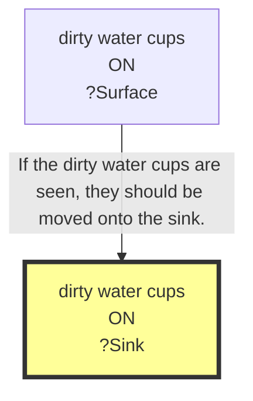
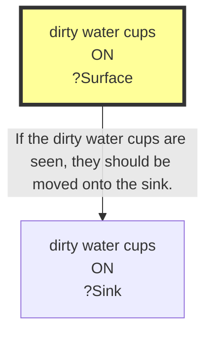
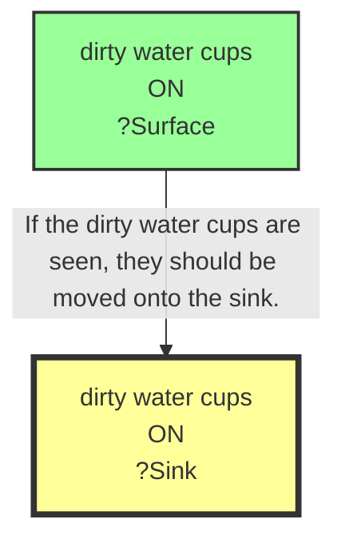
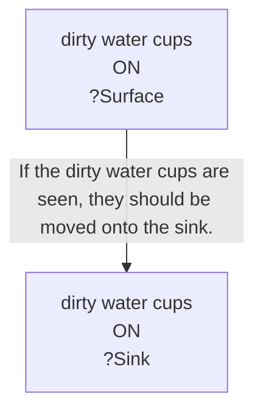

# 🚀 VirtualHome Agent Episode Log


### [GoalReasoner (Module A - Intent)] Output
```json
{
  "is_instruction_obviously_vague": false,
  "clarification_question": null,
  "target_object": "dirty water cup",
  "location_hint": "sink",
  "reasoning_chain": [
    {
      "question": "Why does the user want this object?",
      "answer": "Because the cup is dirty and should be put into the sink."
    },
    {
      "question": "Why is that important?",
      "answer": "Because moving dirty cups to the sink helps keep the area orderly and makes the cups available for washing."
    },
    {
      "question": "What fundamental need does this fulfill?",
      "answer": "It fulfills the need to organize and manage used dishware for cleanup."
    },
    {
      "question": "Are there any deeper psychological or physical motivations?",
      "answer": "The user likely wants to reduce clutter, maintain cleanliness, and ensure dirty items are collected in the proper place for later washing."
    }
  ],
  "deep_intent": "The user wants used dishware to be collected in the proper place for cleanup and organization.",
  "acceptable_alternatives_properties": [
    {
      "priority": 1,
      "description": "Other dirty drinkware or used dishware that should be gathered for washing, such as cups, glasses, or mugs"
    },
    {
      "priority": 2,
      "description": "Other used tableware items that belong in a sink or dish area, such as bowls or plates"
    },
    {
      "priority": 3,
      "description": "Any dirty kitchen items awaiting washing, such as utensils or food containers"
    },
    {
      "priority": 4,
      "description": "Nearby clutter that is part of cleanup and organization, if the exact item is unavailable"
    }
  ]
}
```

### [PerceptionFilter] Output
```json
{
  "reasoning": "The goal is to place the dirty water cup in the sink for cleanup. I must keep the target drinkware and the sink as the required location/receptacle. I also include the other visible drinkware/tableware that could serve as acceptable alternatives or backups for cleanup organization, per the instructions.",
  "selected_ids": [
    64,
    115,
    116,
    117,
    118,
    119,
    155,
    326,
    384,
    67,
    68,
    75,
    76,
    83,
    84,
    91,
    103,
    104,
    172,
    180,
    263,
    273,
    336,
    1,
    11,
    228,
    233,
    383
  ],
  "raw_item_count": 388
}
```

### [LLMExecutor] Output
```json
{
  "reasoning": "The goal is to move a dirty drink container to the sink. The clearest matching object is waterglass(64), which is dirty and already close to the character, so the next required step is to carry it to the sink. Since putback requires being near the surface first, I should walk to the sink before attempting to place it there. This also advances the SDG toward N2 (dirty water cups on the sink).",
  "satisfied_nodes": [],
  "current_node_focus": "N2",
  "mapped_variables": {
    "?Surface": "sink(155)",
    "?Sink": "sink(155)"
  },
  "action": "[walk] <sink> (155)"
}
```
## Step 0
- **Action**: `[walk] <sink> (155)`
- **SDG Status**:

- **Observed Items (28)**: character(1), kitchen(11), waterglass(64) [DIRTY], plate(67), plate(68), plate(75), plate(76), plate(83), plate(84), plate(91), plate(103), plate(104), dishbowl(115), dishbowl(116), dishbowl(117)...


### [PerceptionFilter] Output
```json
{
  "reasoning": "The goal is to move the dirty water cup(s) to the sink. I must keep the target drinkware and the sink location. Since the SDG allows the cup(s) to be on a surface and then on a sink, the only necessary physical objects are the drinkware item(s) that match the target and the sink(s) available. Both sinks are retained as possible functional locations/receptacles.",
  "selected_ids": [
    64,
    155,
    326,
    1,
    11,
    67,
    68,
    75,
    76,
    83,
    84,
    91,
    103,
    104,
    228,
    233,
    273,
    336,
    383,
    384
  ],
  "raw_item_count": 388
}
```

### [LLMExecutor] Output
```json
{
  "reasoning": "We are already close to sink(155), so the next gap is that the dirty drinkware is still not on the sink. The best matching item for the SDG's 'dirty water cups' is waterglass(64) because it is a dirty pourable drink container. Since the agent is already near the sink, the correct next atomic action is to pick up the glass before placing it on the sink in a later step.",
  "satisfied_nodes": [],
  "current_node_focus": "N1",
  "mapped_variables": {
    "?Surface": "sink(155)",
    "?Sink": "sink(155)"
  },
  "action": "[grab] <waterglass> (64)"
}
```
## Step 1
- **Action**: `[grab] <waterglass> (64)`
- **SDG Status**:

- **Observed Items (20)**: character(1), kitchen(11), waterglass(64) [DIRTY], plate(67), plate(68), plate(75), plate(76), plate(83), plate(84), plate(91), plate(103), plate(104), sink(155), plate(228), plate(233)...


### [PerceptionFilter] Output
```json
{
  "reasoning": "The goal is to move the dirty water cup(s) to the sink. I must keep the target drinkware and the sink as the required location. Since the SDG mentions dirty water cups on a surface and on a sink, I include the visible waterglass and the available sink(s) relevant to completing the placement. No other objects are necessary.",
  "selected_ids": [
    64,
    155,
    326,
    1,
    11,
    67,
    68,
    75,
    76,
    83,
    84,
    91,
    103,
    104,
    228,
    233,
    273,
    336,
    383,
    384
  ],
  "raw_item_count": 388
}
```

### [LLMExecutor] Output
```json
{
  "reasoning": "We are already close to sink(155), and the previous grab attempt on waterglass(64) failed because another person is using it. Per the disappearing-object strategy, when the needed object is temporarily unavailable, the correct next step is to wait rather than substitute or retry immediately. This keeps the plan aligned with moving the dirty drinkware to the sink once it becomes available. N2 is not yet satisfied because the dirty drink container is not on the sink.",
  "satisfied_nodes": [],
  "current_node_focus": "N1",
  "mapped_variables": {
    "?Surface": "sink(155)",
    "?Sink": "sink(155)"
  },
  "action": "[wait]"
}
```
## Step 2
- **Action**: `[wait]`
- **SDG Status**:

- **Observed Items (20)**: character(1), kitchen(11), waterglass(64) [DIRTY], plate(67), plate(68), plate(75), plate(76), plate(83), plate(84), plate(91), plate(103), plate(104), sink(155), plate(228), plate(233)...


### [PerceptionFilter] Output
```json
{
  "reasoning": "Need the dirty drinkware target and the sink location for placing it. The SDG also implies the cup should be on a surface and then on the sink, so I keep the cup and the sink only.",
  "selected_ids": [
    64,
    155,
    1,
    11,
    67,
    68,
    75,
    76,
    83,
    84,
    91,
    103,
    104,
    228,
    233,
    273,
    326,
    336,
    383,
    384
  ],
  "raw_item_count": 388
}
```

### [LLMExecutor] Output
```json
{
  "reasoning": "We are already close to sink(155), so the proximity requirement for placing an item on the sink is satisfied. The intended object waterglass(64) is still the best match for the SDG's dirty water cups, but it was temporarily unavailable because another person was using it, and the last correct recovery step was to wait. Since the graph now still shows waterglass(64) present and no other action has progressed N2, the next best atomic step is to try grabbing it again so it can later be placed on the sink.",
  "satisfied_nodes": [],
  "current_node_focus": "N1",
  "mapped_variables": {
    "?Surface": "sink(155)",
    "?Sink": "sink(155)"
  },
  "action": "[grab] <waterglass> (64)"
}
```
## Step 3
- **Action**: `[grab] <waterglass> (64)`
- **SDG Status**:

- **Observed Items (20)**: character(1), kitchen(11), waterglass(64) [DIRTY], plate(67), plate(68), plate(75), plate(76), plate(83), plate(84), plate(91), plate(103), plate(104), sink(155), plate(228), plate(233)...


### [PerceptionFilter] Output
```json
{
  "reasoning": "The goal is to move dirty drinkware to the sink. I need the target item(s) matching the dirty water cup and the sink as the destination. Since the SDG allows a surface and a sink relation, I keep the sink and any visible cup/glass/mug-like target items that could be the dirty water cup; among the visible objects, the matching drinkware is the waterglass. The sink is required as the location for cleanup.",
  "selected_ids": [
    64,
    155,
    326,
    384,
    1,
    11,
    67,
    68,
    75,
    76,
    83,
    84,
    91,
    103,
    104,
    228,
    233,
    273,
    336,
    383
  ],
  "raw_item_count": 388
}
```

### [LLMExecutor] Output
```json
{
  "reasoning": "The target dirty drinkware is still waterglass(64), which matches the SDG's 'dirty water cups' and is already in the kitchen. We are already close to sink(155), so the remaining gap for N2 is to get the dirty cup onto the sink. The last two grab attempts failed because another person was using the glass, and the correct recovery was to wait; since the object is still present in the graph and no alternative is needed, the best next atomic action is to try grabbing it again now that it may be available.",
  "satisfied_nodes": [],
  "current_node_focus": "N2",
  "mapped_variables": {
    "?Sink": "sink(155)",
    "?Surface": "sink(155)"
  },
  "action": "[grab] <waterglass> (64)"
}
```
## Step 4
- **Action**: `[grab] <waterglass> (64)`
- **SDG Status**:

- **Observed Items (20)**: character(1), kitchen(11), waterglass(64) [DIRTY], plate(67), plate(68), plate(75), plate(76), plate(83), plate(84), plate(91), plate(103), plate(104), sink(155), plate(228), plate(233)...


### [PerceptionFilter] Output
```json
{
  "reasoning": "Need the target dirty drinkware and the sink where it should be placed. Also keep other matching used dishware as acceptable alternatives for cleanup, but only the minimal visible candidates related to the goal.",
  "selected_ids": [
    64,
    115,
    116,
    117,
    118,
    119,
    172,
    180,
    263,
    326,
    1,
    11,
    67,
    68,
    75,
    76,
    83,
    84,
    91,
    103,
    104,
    155,
    228,
    233,
    273,
    336,
    383,
    384
  ],
  "raw_item_count": 388
}
```

### [LLMExecutor] Output
```json
{
  "reasoning": "The target dirty drinkware is already held in the right hand: waterglass(64) is DIRTY and POURABLE/RECIPIENT, matching the SDG's dirty water cups. We are already close to sink(155), which is the correct surface to place it on. The remaining gap for N2 is to get the glass onto the sink. Since the sink is a flat surface and not a container, the correct next atomic action is to put the held glass back onto the sink.",
  "satisfied_nodes": [
    "N1"
  ],
  "current_node_focus": "N2",
  "mapped_variables": {
    "?Surface": "sink(155)",
    "?Sink": "sink(155)"
  },
  "action": "[putback] <waterglass> (64) <sink> (155)"
}
```
## Step 5
- **Action**: `[putback] <waterglass> (64) <sink> (155)`
- **SDG Status**:

- **Observed Items (28)**: character(1), kitchen(11), waterglass(64) [DIRTY], plate(67), plate(68), plate(75), plate(76), plate(83), plate(84), plate(91), plate(103), plate(104), dishbowl(115), dishbowl(116), dishbowl(117)...


### [PerceptionFilter] Output
```json
{
  "reasoning": "The goal is to move the dirty water cup(s) to the sink. So I need the sink as the required location, and the drinkware items that could be the target or acceptable alternatives. I also keep the dishwasher as a functional backup for dish cleanup, since it is an alternative washing receptacle/appliance related to the task.",
  "selected_ids": [
    64,
    155,
    165,
    384,
    1,
    11,
    67,
    68,
    75,
    76,
    83,
    84,
    91,
    103,
    104,
    228,
    233,
    273,
    326,
    336,
    383
  ],
  "raw_item_count": 388
}
```
## Step 6
- **Action**: `FINISH (Goal Reached)`
- **SDG Status**:

- **Observed Items (21)**: character(1), kitchen(11), waterglass(64) [DIRTY], plate(67), plate(68), plate(75), plate(76), plate(83), plate(84), plate(91), plate(103), plate(104), sink(155), dishwasher(165) [CLOSED,OFF], plate(228)...

