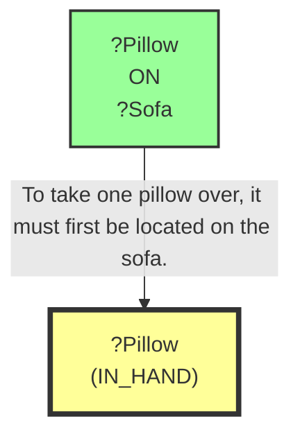
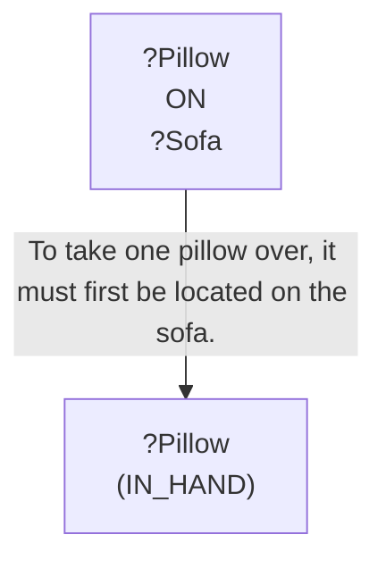

# 🚀 VirtualHome Agent Episode Log


### [GoalReasoner (Module A - Intent)] Output
```json
{
  "is_instruction_obviously_vague": false,
  "clarification_question": null,
  "target_object": "抱枕",
  "location_hint": "沙发上",
  "reasoning_chain": [
    {
      "question": "Why does the user want this object?",
      "answer": "Because they want one of the cushions from the sofa brought to them if it is available."
    },
    {
      "question": "Why is that important?",
      "answer": "Having the cushion nearby likely helps them use it right away for comfort or support."
    },
    {
      "question": "What fundamental need does this fulfill?",
      "answer": "It fulfills a need for physical comfort and support."
    },
    {
      "question": "Are there any deeper psychological or physical motivations?",
      "answer": "It may also help the user feel more relaxed, settled, or supported while sitting or resting."
    }
  ],
  "deep_intent": "The user wants physical comfort and support.",
  "acceptable_alternatives_properties": [
    {
      "priority": 1,
      "description": "Other soft cushions or small pillows found indoors that can provide similar comfort and support."
    },
    {
      "priority": 2,
      "description": "Any comparable padded support item, such as a throw pillow or seat cushion."
    },
    {
      "priority": 3,
      "description": "Other soft resting aids that can improve comfort, such as a folded blanket or folded towel."
    },
    {
      "priority": 4,
      "description": "Any household item that can serve as temporary back or body support, as long as it is soft and safe to use."
    }
  ]
}
```

### [PerceptionFilter] Output
```json
{
  "reasoning": "The goal is to retrieve a pillow/cushion from the sofa. I need the target pillow and the sofa it is on, and I should keep any valid alternative soft support item if present. Only one pillow is visible, so the minimum set is the sofa and that pillow.",
  "selected_ids": [
    288,
    122,
    1,
    47,
    85,
    145,
    146
  ],
  "raw_item_count": 302
}
```

### [LLMExecutor] Output
```json
{
  "reasoning": "The SDG requires the pillow to be on the sofa and then in hand. The current graph shows pillow(122) is already ON sofa(85) and CLOSE to the character, so the first unmet node is obtaining it in hand. Since the pillow is nearby and grabbable, the next atomic step is to grab it.",
  "satisfied_nodes": [
    "N1"
  ],
  "current_node_focus": "N2",
  "mapped_variables": {
    "?Pillow": "pillow(122)",
    "?Sofa": "sofa(85)"
  },
  "action": "[grab] pillow (122)"
}
```
## Step 0
- **Action**: `[grab] <pillow> (122)`
- **SDG Status**:

- **Observed Items (7)**: character(1), door(47) [OPEN], sofa(85), pillow(122), door(145) [OPEN], door(146) [OPEN], sofa(288)


### [PerceptionFilter] Output
```json
{
  "reasoning": "Need the target pillow and the sofa because the pillow is specified to be on the sofa, and the SDG requires locating that pillow and then having it in hand. No other tools or backups are necessary for this simple retrieval task.",
  "selected_ids": [
    122,
    288,
    1,
    47,
    85,
    145,
    146
  ],
  "raw_item_count": 302
}
```

### [LLMExecutor] Output
```json
{
  "reasoning": "The target pillow(122) is already on sofa(85) and the character is close to it. The previous grab failed because another person was using it, which indicates the pillow may be temporarily unavailable rather than absent. According to the rules, when an object disappears or is in use upon approach, the correct response is to wait in place rather than change strategy. The SDG focus remains obtaining the pillow in hand, and waiting is the only valid next atomic action.",
  "satisfied_nodes": [
    "N1"
  ],
  "current_node_focus": "N2",
  "mapped_variables": {
    "?Pillow": "pillow(122)",
    "?Sofa": "sofa(85)"
  },
  "action": "[wait]"
}
```
## Step 1
- **Action**: `[wait]`
- **SDG Status**:

- **Observed Items (7)**: character(1), door(47) [OPEN], sofa(85), pillow(122), door(145) [OPEN], door(146) [OPEN], sofa(288)


### [PerceptionFilter] Output
```json
{
  "reasoning": "The goal is to bring a sofa pillow/cushion. The SDG says the pillow must be ON the sofa and then IN_HAND. So I need the sofa location and the pillow object itself, selecting the matching pillow on/near the sofa area.",
  "selected_ids": [
    288,
    122,
    1,
    47,
    85,
    145,
    146
  ],
  "raw_item_count": 302
}
```

### [LLMExecutor] Output
```json
{
  "reasoning": "The SDG’s first unmet node is N2 (pillow in hand), and the filtered graph shows pillow(122) is close and grabbable. The previous grab failed because another person was using it, but after waiting, the pillow is still present and adjacent. Since no walk is needed and the goal is to obtain the pillow, the best next atomic action is to try grabbing the same pillow again.",
  "satisfied_nodes": [
    "N1"
  ],
  "current_node_focus": "N2",
  "mapped_variables": {
    "?Pillow": "pillow(122)",
    "?Sofa": "sofa(85)"
  },
  "action": "[grab] <pillow> (122)"
}
```
## Step 2
- **Action**: `[grab] <pillow> (122)`
- **SDG Status**:

- **Observed Items (7)**: character(1), door(47) [OPEN], sofa(85), pillow(122), door(145) [OPEN], door(146) [OPEN], sofa(288)


### [PerceptionFilter] Output
```json
{
  "reasoning": "The goal is to վերց取 a pillow/cushion from the sofa. Per the SDG, I need the pillow object and the sofa it is on. The scene contains a matching pillow and sofa, so only those IDs are necessary.",
  "selected_ids": [
    122,
    288,
    1,
    47,
    85,
    145,
    146
  ],
  "raw_item_count": 302
}
```

### [LLMExecutor] Output
```json
{
  "reasoning": "The SDG has two nodes: N1 requires the pillow to be on the sofa, and N2 requires it to be in hand. The filtered graph already satisfies N1 because pillow(122) is ON sofa(85). The remaining unmet node is N2. The pillow is close and grabbable, and no walk is needed. However, the last two grab attempts failed with the error that another person is using it, so per the failure-handling rule the correct next step is to wait in place for the temporary blockage to clear.",
  "satisfied_nodes": [
    "N1"
  ],
  "current_node_focus": "N2",
  "mapped_variables": {
    "?Pillow": "pillow(122)",
    "?Sofa": "sofa(85)"
  },
  "action": "[wait]"
}
```
## Step 3
- **Action**: `[wait]`
- **SDG Status**:

- **Observed Items (7)**: character(1), door(47) [OPEN], sofa(85), pillow(122), door(145) [OPEN], door(146) [OPEN], sofa(288)


### [PerceptionFilter] Output
```json
{
  "reasoning": "The goal is to bring a pillow/cushion from the sofa. The SDG requires the pillow and the sofa it is on, so both must be kept. I also include the specific visible pillow candidate on the sofa and the sofa location itself.",
  "selected_ids": [
    122,
    288,
    1,
    47,
    85,
    145,
    146
  ],
  "raw_item_count": 302
}
```

### [LLMExecutor] Output
```json
{
  "reasoning": "N1 is already satisfied because pillow(122) is on sofa(85). The only remaining unmet SDG node is N2: the pillow must be in hand. The pillow is still close and grabbable, and the previous failures indicated it was temporarily in use, so the correct autonomous response is to wait until it becomes available rather than changing strategy.",
  "satisfied_nodes": [
    "N1"
  ],
  "current_node_focus": "N2",
  "mapped_variables": {
    "?Pillow": "pillow(122)",
    "?Sofa": "sofa(85)"
  },
  "action": "[wait]"
}
```
## Step 4
- **Action**: `[wait]`
- **SDG Status**:

- **Observed Items (7)**: character(1), door(47) [OPEN], sofa(85), pillow(122), door(145) [OPEN], door(146) [OPEN], sofa(288)


### [PerceptionFilter] Output
```json
{
  "reasoning": "The goal is to retrieve the pillow/cushion on the sofa and bring it to hand. So I only need the target pillow and the sofa that it is on, plus the specific pillow instance visible in the room.",
  "selected_ids": [
    122,
    288,
    1,
    47,
    85,
    145,
    146
  ],
  "raw_item_count": 302
}
```

### [LLMExecutor] Output
```json
{
  "reasoning": "N1 is already satisfied because pillow(122) is ON sofa(85). The only unmet SDG node is N2: the pillow must be IN_HAND. The pillow is still close and grabbable, and repeated previous grab attempts failed only because another person was using it. Per the disappearance/temporary-use rule, the correct next step is to wait in place again until it becomes available.",
  "satisfied_nodes": [
    "N1"
  ],
  "current_node_focus": "N2",
  "mapped_variables": {
    "?Pillow": "pillow(122)",
    "?Sofa": "sofa(85)"
  },
  "action": "[wait]"
}
```
## Step 5
- **Action**: `[wait]`
- **SDG Status**:

- **Observed Items (7)**: character(1), door(47) [OPEN], sofa(85), pillow(122), door(145) [OPEN], door(146) [OPEN], sofa(288)


### [PerceptionFilter] Output
```json
{
  "reasoning": "Need the target pillow and the sofa it is on, because the SDG says to find a pillow on the sofa and pick it up. Only the relevant sofa and pillow IDs are kept; other objects are irrelevant to this comfort/support task.",
  "selected_ids": [
    85,
    122,
    288,
    1,
    47,
    145,
    146
  ],
  "raw_item_count": 302
}
```

### [LLMExecutor] Output
```json
{
  "reasoning": "N1 is already satisfied because pillow(122) is on sofa(85). The remaining unmet SDG node is N2: the pillow must be in hand. The pillow is still close and grabbable, and repeated prior failures indicate it is temporarily being used by another person. Per the failure-handling rule, the correct next atomic action is to wait in place again rather than changing strategy.",
  "satisfied_nodes": [
    "N1"
  ],
  "current_node_focus": "N2",
  "mapped_variables": {
    "?Pillow": "pillow(122)",
    "?Sofa": "sofa(85)"
  },
  "action": "[wait]"
}
```
## Step 6
- **Action**: `[wait]`
- **SDG Status**:

- **Observed Items (7)**: character(1), door(47) [OPEN], sofa(85), pillow(122), door(145) [OPEN], door(146) [OPEN], sofa(288)


### [PerceptionFilter] Output
```json
{
  "reasoning": "Need the target cushion/pillow and the sofa it is on, since the goal is to retrieve the pillow from the sofa. No other tools or alternatives are required by the SDG.",
  "selected_ids": [
    288,
    122,
    1,
    47,
    85,
    145,
    146
  ],
  "raw_item_count": 302
}
```

### [LLMExecutor] Output
```json
{
  "reasoning": "The SDG already satisfies N1 because pillow(122) is ON sofa(85). The only unmet node is N2: the pillow must be IN_HAND. The pillow is still close and grabbable, and prior grab attempts failed because another person was using it; repeated waiting has not changed the graph, but the object remains present and available to try again. Since no walk is needed and the goal is to obtain the pillow, the next atomic action is to attempt grabbing the same pillow again.",
  "satisfied_nodes": [
    "N1"
  ],
  "current_node_focus": "N2",
  "mapped_variables": {
    "?Pillow": "pillow(122)",
    "?Sofa": "sofa(85)"
  },
  "action": "[grab] <pillow> (122)"
}
```
## Step 7
- **Action**: `[grab] <pillow> (122)`
- **SDG Status**:

- **Observed Items (7)**: character(1), door(47) [OPEN], sofa(85), pillow(122), door(145) [OPEN], door(146) [OPEN], sofa(288)


### [PerceptionFilter] Output
```json
{
  "reasoning": "Need the target pillow and the sofa it is on, because the goal is to bring the cushion from the sofa. The SDG requires locating a pillow on a sofa and picking it up, so only the matching pillow and sofa IDs are necessary.",
  "selected_ids": [
    122,
    288,
    1,
    47,
    85,
    145,
    146
  ],
  "raw_item_count": 302
}
```
## Step 8
- **Action**: `FINISH (Goal Reached)`
- **SDG Status**:

- **Observed Items (7)**: character(1), door(47) [OPEN], sofa(85), pillow(122), door(145) [OPEN], door(146) [OPEN], sofa(288)

