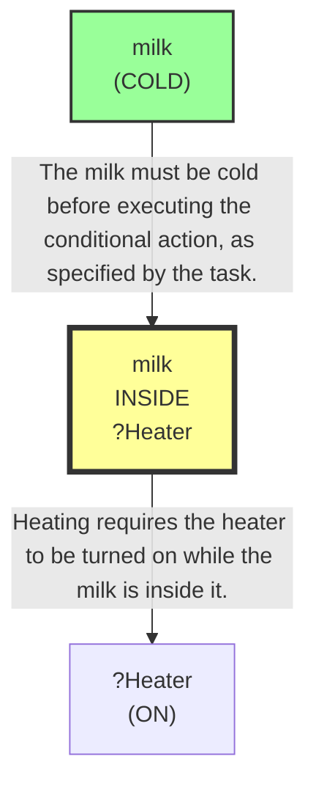
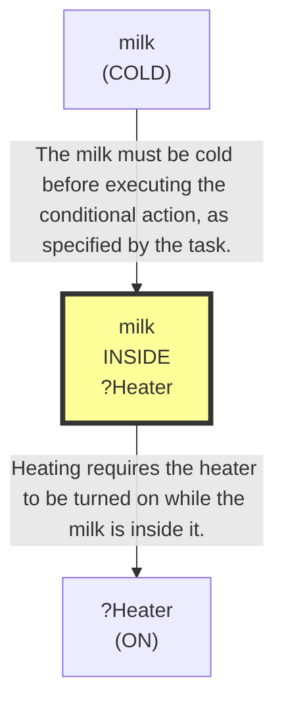

# 🚀 VirtualHome Agent Episode Log


### [GoalReasoner (Module A - Intent)] Output
```json
{
  "is_instruction_obviously_vague": false,
  "clarification_question": null,
  "target_object": "牛奶",
  "location_hint": null,
  "reasoning_chain": [
    {
      "question": "Why does the user want this object?",
      "answer": "Because the milk is cold and they want it heated."
    },
    {
      "question": "Why is that important?",
      "answer": "A warmer temperature may make it ready to drink or otherwise more suitable for use."
    },
    {
      "question": "What fundamental need does this fulfill?",
      "answer": "It fulfills the need to have a beverage at the desired temperature."
    },
    {
      "question": "Are there any deeper psychological or physical motivations?",
      "answer": "The likely motivation is comfort and convenience, specifically warming a drink to make it more pleasant or usable."
    }
  ],
  "deep_intent": "The user wants to warm a beverage to a desired drinkable temperature.",
  "acceptable_alternatives_properties": [
    {
      "priority": 1,
      "description": "Other beverages that can be warmed for drinking, such as tea, coffee, or hot chocolate."
    },
    {
      "priority": 2,
      "description": "Milk-based or other drinkable liquids that serve the same warming function, such as plant-based milk or broth."
    },
    {
      "priority": 3,
      "description": "Ready-to-drink beverages that are commonly consumed warm, such as soup-like drinks or warmed juice."
    },
    {
      "priority": 4,
      "description": "Any safe indoor liquid beverage that can satisfy the need for a warm drink, if milk is unavailable."
    }
  ]
}
```

### [PerceptionFilter] Output
```json
{
  "reasoning": "The goal is to warm milk, so we need the target milk and a suitable heater from the visible appliances. The SDG requires an appliance that can contain the milk and be turned on, so the microwave is the most direct heater. As a backup heating option, the stove is also a valid alternative heater and must be retained.",
  "selected_ids": [
    176,
    171,
    163,
    1,
    47,
    173,
    174,
    254,
    305
  ],
  "raw_item_count": 386
}
```

### [LLMExecutor] Output
```json
{
  "reasoning": "The goal is to warm the cold milk. The milk object is present, cold, and currently close to the character, but it is also CLOSED, which may prevent pouring or heating-related handling depending on the environment. The SDG requires milk to be inside a heater and the heater to be on; among available heater candidates, the microwave is the most appropriate because it has CONTAINERS, HAS_SWITCH, and HAS_PLUG, and can heat liquid containers. Before putting milk inside it, the microwave must be near and then opened. Since the current instruction asks for a single next atomic action, the best progress is to move to the microwave so the next step can open it and place the milk inside.",
  "satisfied_nodes": [
    "N1"
  ],
  "current_node_focus": "N2",
  "mapped_variables": {
    "?Heater": "microwave(171)"
  },
  "action": "[walk] <microwave> (171)"
}
```
## Step 0
- **Action**: `[walk] <microwave> (171)`
- **SDG Status**:

- **Observed Items (9)**: character(1), door(47) [OPEN], stove(163) [OFF,CLOSED], microwave(171) [CLOSED,OFF], juice(173), juice(174), milk(176) [COLD,CLOSED], door(254) [OPEN], door(305) [OPEN]


### [PerceptionFilter] Output
```json
{
  "reasoning": "The task is to warm the milk, so we need the target milk and a viable heater appliance. The SDG requires an object that can contain the milk and be turned on; from the visible objects, the microwave, stove, and coffeemaker are relevant possible heating tools. Keeping all heater alternatives preserves functional backups.",
  "selected_ids": [
    176,
    163,
    171,
    169,
    1,
    47,
    173,
    174,
    254,
    305
  ],
  "raw_item_count": 386
}
```

### [LLMExecutor] Output
```json
{
  "reasoning": "The SDG requires the milk to be inside a heater and the heater turned on. The best heater candidate available is the microwave(171), which is closed and currently nearby. Since we are already close to it from the previous walk, the next required atomic step is to open it before placing the milk inside. This progresses toward satisfying N2 after the milk is handled.",
  "satisfied_nodes": [],
  "current_node_focus": "N2",
  "mapped_variables": {
    "?Heater": "microwave(171)"
  },
  "action": "[open] <microwave> (171)"
}
```
## Step 1
- **Action**: `[open] <microwave> (171)`
- **SDG Status**:

- **Observed Items (10)**: character(1), door(47) [OPEN], stove(163) [OFF,CLOSED], coffeemaker(169) [OFF], microwave(171) [CLOSED,OFF], juice(173), juice(174), milk(176) [COLD,CLOSED], door(254) [OPEN], door(305) [OPEN]


### [PerceptionFilter] Output
```json
{
  "reasoning": "The goal is to warm milk, so the milk itself and a suitable heating appliance are required. The SDG says the milk must be inside a heater that is on, so I kept all visible heater-capable options to preserve alternatives and backups: stove, microwave, coffeemaker, toaster, and oven tray-related heating context is not enough alone, so not included. Milk is the target object.",
  "selected_ids": [
    176,
    163,
    171,
    169,
    166,
    1,
    47,
    173,
    174,
    254,
    305
  ],
  "raw_item_count": 386
}
```

### [LLMExecutor] Output
```json
{
  "reasoning": "The milk is already identified and is cold, satisfying N1. The microwave(171) is the chosen heater candidate and is currently open but OFF. To progress toward N2 and then N3, the next required atomic action is to place the milk inside the open microwave. The character is already close to the microwave, so no additional walk is needed before putting the milk in.",
  "satisfied_nodes": [
    "N1"
  ],
  "current_node_focus": "N2",
  "mapped_variables": {
    "?Heater": "microwave(171)"
  },
  "action": "[putin] <milk> (176) <microwave> (171)"
}
```
## Step 2
- **Action**: `[putin] <milk> (176) <microwave> (171)`
- **SDG Status**:

- **Observed Items (11)**: character(1), door(47) [OPEN], stove(163) [OFF,CLOSED], toaster(166) [OFF], coffeemaker(169) [OFF], microwave(171) [OPEN,OFF], juice(173), juice(174), milk(176) [COLD,CLOSED], door(254) [OPEN], door(305) [OPEN]


### [PerceptionFilter] Output
```json
{
  "reasoning": "The task is to warm the target beverage milk. Based on the SDG, we need the milk itself and a heater appliance that can turn on and heat it. The visible functional heating options include microwave, stove, and coffeemaker/coffee pot, but the best minimum set is to retain the milk plus all plausible heaters as backups that can warm a beverage.",
  "selected_ids": [
    176,
    171,
    163,
    169,
    1,
    47,
    173,
    174,
    254,
    305
  ],
  "raw_item_count": 386
}
```

### [LLMExecutor] Output
```json
{
  "reasoning": "The previous attempt to put the milk into the microwave failed, so I should not repeat the same action blindly. The SDG requires milk to be inside a heater and the heater to be on. The milk(176) is already cold and the microwave(171) is the best heater candidate available because it has CONTAINERS and HAS_SWITCH. However, the milk itself is marked CLOSED, which likely prevents putting it directly into the microwave until it is opened. Since I am already near the microwave and the microwave is open, the next atomic step toward satisfying N2 is to open the milk so it can be placed inside the heater next.",
  "satisfied_nodes": [
    "N1"
  ],
  "current_node_focus": "N2",
  "mapped_variables": {
    "?Heater": "microwave(171)"
  },
  "action": "[open] <milk> (176)"
}
```
## Step 3
- **Action**: `[open] <milk> (176)`
- **SDG Status**:

- **Observed Items (10)**: character(1), door(47) [OPEN], stove(163) [OFF,CLOSED], coffeemaker(169) [OFF], microwave(171) [OPEN,OFF], juice(173), juice(174), milk(176) [COLD,CLOSED], door(254) [OPEN], door(305) [OPEN]


### [PerceptionFilter] Output
```json
{
  "reasoning": "The goal is to warm milk. Required SDG says we need the milk and a heater appliance that can contain it, turned on. The visible heater options are microwave, stove, coffeemaker, toaster, and oven-like appliances; for warming milk, the relevant safe alternatives are microwave and stove. I keep the milk plus all functional heating alternatives as backups.",
  "selected_ids": [
    176,
    163,
    171,
    1,
    47,
    173,
    174,
    254,
    305
  ],
  "raw_item_count": 386
}
```

### [LLMExecutor] Output
```json
{
  "reasoning": "N1 is already satisfied because milk(176) is cold. The previous putin failed because milk is not a container and cannot be opened; the correct way to heat it is to place the milk inside an open heater. The microwave(171) is open, has CONTAINERS and HAS_SWITCH, and is the best heater candidate. However, to use putin we must already be holding the milk. Since we are currently near the microwave and do not yet hold the milk, the next atomic step is to grab the milk so it can be placed inside the microwave on the following action.",
  "satisfied_nodes": [
    "N1"
  ],
  "current_node_focus": "N2",
  "mapped_variables": {
    "?Heater": "microwave(171)"
  },
  "action": "[grab] <milk> (176)"
}
```
## Step 4
- **Action**: `[grab] <milk> (176)`
- **SDG Status**:

- **Observed Items (9)**: character(1), door(47) [OPEN], stove(163) [OFF,CLOSED], microwave(171) [OPEN,OFF], juice(173), juice(174), milk(176) [COLD,CLOSED], door(254) [OPEN], door(305) [OPEN]


### [PerceptionFilter] Output
```json
{
  "reasoning": "The goal is to warm the milk, so the minimum needed is the target milk plus a suitable heater. The SDG requires a heater that can contain the milk and be turned on, so I keep the microwave as the primary heating tool and the stove as a functional backup alternative.",
  "selected_ids": [
    176,
    171,
    163,
    1,
    47,
    173,
    174,
    254,
    305
  ],
  "raw_item_count": 386
}
```

### [LLMExecutor] Output
```json
{
  "reasoning": "The milk is already cold, so N1 is satisfied. The previous grab failed because another person is currently using the milk, and the filtered graph still shows the microwave is open and nearby. Per the disappearing-object strategy, when an object is temporarily unavailable due to another person using it, I should wait in place rather than substitute or retry immediately. This is the best next step to bridge toward placing the milk inside the microwave once it returns.",
  "satisfied_nodes": [
    "N1"
  ],
  "current_node_focus": "N2",
  "mapped_variables": {
    "?Heater": "microwave(171)"
  },
  "action": "[wait]"
}
```
## Step 5
- **Action**: `[wait]`
- **SDG Status**:

- **Observed Items (9)**: character(1), door(47) [OPEN], stove(163) [OFF,CLOSED], microwave(171) [OPEN,OFF], juice(173), juice(174), milk(176) [COLD,CLOSED], door(254) [OPEN], door(305) [OPEN]


### [PerceptionFilter] Output
```json
{
  "reasoning": "The goal is to warm milk, so I need the target milk and a heating appliance that can serve as the heater. The SDG requires the milk to be inside a heater and that heater to be ON. Visible valid heater options are the microwave and stove; both should be retained as functional alternatives.",
  "selected_ids": [
    176,
    171,
    163,
    1,
    47,
    173,
    174,
    254,
    305
  ],
  "raw_item_count": 386
}
```

### [LLMExecutor] Output
```json
{
  "reasoning": "N1 is already satisfied because milk(176) is COLD. The next missing SDG requirement is N2: the milk must be INSIDE a heater. The microwave(171) is the best heater candidate in the filtered graph because it has CONTAINERS and HAS_SWITCH and is already CLOSE to the character. It is currently OPEN, so the correct next step is to place the milk inside it. The earlier failure suggests the milk may have been temporarily unavailable, but it is present again in the graph now, so the autonomous next atomic action is to put the milk into the open microwave.",
  "satisfied_nodes": [
    "N1"
  ],
  "current_node_focus": "N2",
  "mapped_variables": {
    "?Heater": "microwave(171)"
  },
  "action": "[putin] <milk> (176) <microwave> (171)"
}
```
## Step 6
- **Action**: `[putin] <milk> (176) <microwave> (171)`
- **SDG Status**:

- **Observed Items (9)**: character(1), door(47) [OPEN], stove(163) [OFF,CLOSED], microwave(171) [OPEN,OFF], juice(173), juice(174), milk(176) [COLD,CLOSED], door(254) [OPEN], door(305) [OPEN]


### [PerceptionFilter] Output
```json
{
  "reasoning": "The goal is to warm the milk, so we need the milk itself and all plausible heating tools available in the scene. The SDG requires a heater that can be turned on and contain the milk; visible functional options are the microwave, stove, and coffeemaker as potential heating appliances, with the fridge as a relevant backup for the milk’s cold state if needed.",
  "selected_ids": [
    176,
    163,
    171,
    169,
    162,
    1,
    47,
    173,
    174,
    254,
    305
  ],
  "raw_item_count": 386
}
```

### [LLMExecutor] Output
```json
{
  "reasoning": "The SDG still needs N2: milk must be INSIDE a heater, and the best heater candidate is the nearby microwave(171), which is already OPEN and OFF. The repeated failure history shows the milk(176) is temporarily unavailable because another person is using it. Per the disappearing-object strategy, when an object is temporarily unavailable, I should wait in place rather than retrying or substituting. Waiting is the only safe atomic action that can bridge to the moment the milk becomes available again so it can later be placed inside the microwave and heated.",
  "satisfied_nodes": [
    "N1"
  ],
  "current_node_focus": "N2",
  "mapped_variables": {
    "?Heater": "microwave(171)"
  },
  "action": "[wait]"
}
```
## Step 7
- **Action**: `[wait]`
- **SDG Status**:

- **Observed Items (11)**: character(1), door(47) [OPEN], fridge(162) [CLOSED], stove(163) [OFF,CLOSED], coffeemaker(169) [OFF], microwave(171) [OPEN,OFF], juice(173), juice(174), milk(176) [COLD,CLOSED], door(254) [OPEN], door(305) [OPEN]


### [PerceptionFilter] Output
```json
{
  "reasoning": "Need the target milk and a heating appliance that can contain/heat it. The SDG requires a heater inside relation and ON state, so keep all plausible heaters available: stove and microwave. The milk itself must also be kept.",
  "selected_ids": [
    176,
    163,
    171,
    1,
    47,
    173,
    174,
    254,
    305
  ],
  "raw_item_count": 386
}
```

### [LLMExecutor] Output
```json
{
  "reasoning": "N1 is already satisfied because milk(176) is COLD. The remaining gap is N2: the milk must be INSIDE a heater, with N3 following after the heater is turned on. The microwave(171) is the best heater candidate in the filtered graph because it is a container with a switch, it is OPEN, and it is already CLOSE to the character. However, the milk itself is currently marked CLOSED and, more importantly, earlier attempts to grab/put it failed because another person was using it. According to the disappearing-object strategy, when a needed object is temporarily unavailable, the correct action is to wait in place rather than retry or substitute. Since there has been no new evidence that the milk is now available for interaction, the safest and most progress-preserving next action is to wait.",
  "satisfied_nodes": [
    "N1"
  ],
  "current_node_focus": "N2",
  "mapped_variables": {
    "?Heater": "microwave(171)"
  },
  "action": "[wait]"
}
```
## Step 8
- **Action**: `[wait]`
- **SDG Status**:

- **Observed Items (9)**: character(1), door(47) [OPEN], stove(163) [OFF,CLOSED], microwave(171) [OPEN,OFF], juice(173), juice(174), milk(176) [COLD,CLOSED], door(254) [OPEN], door(305) [OPEN]


### [PerceptionFilter] Output
```json
{
  "reasoning": "The goal is to warm milk. The SDG requires the milk target and a heater that can be turned on; among visible objects, the relevant heating appliances are the microwave, stove, coffeemaker, and toaster, but only microwave and stove are suitable functional alternatives for heating liquid milk. The milk itself must be kept.",
  "selected_ids": [
    176,
    163,
    171,
    1,
    47,
    173,
    174,
    254,
    305
  ],
  "raw_item_count": 386
}
```

### [LLMExecutor] Output
```json
{
  "reasoning": "N1 is already satisfied because milk(176) is COLD. The remaining gap is N2: the milk must be INSIDE a heater, and N3 can only follow after that. The microwave(171) is the best heater candidate because it is OPEN, has CONTAINERS and HAS_SWITCH, and is already close to the character. However, the milk is marked CLOSED and, based on the previous failed interactions, appears to be unavailable for direct handling right now. Since the object is temporarily unavailable rather than permanently missing, the correct action is to wait in place for it to become available again instead of retrying a different action or substituting another object.",
  "satisfied_nodes": [
    "N1"
  ],
  "current_node_focus": "N2",
  "mapped_variables": {
    "?Heater": "microwave(171)"
  },
  "action": "[wait]"
}
```
## Step 9
- **Action**: `[wait]`
- **SDG Status**:

- **Observed Items (9)**: character(1), door(47) [OPEN], stove(163) [OFF,CLOSED], microwave(171) [OPEN,OFF], juice(173), juice(174), milk(176) [COLD,CLOSED], door(254) [OPEN], door(305) [OPEN]


### [PerceptionFilter] Output
```json
{
  "reasoning": "Need the target milk plus a heating appliance that matches the SDG requirement (?Heater). The visible suitable heaters are microwave, stove, and coffeemaker/kettle-like options; to satisfy alternative retention, keep all plausible heating tools. Also keep the milk itself.",
  "selected_ids": [
    176,
    163,
    171,
    169,
    170,
    1,
    47,
    173,
    174,
    254,
    305
  ],
  "raw_item_count": 386
}
```

### [LLMExecutor] Output
```json
{
  "reasoning": "N1 is already satisfied because milk(176) is COLD. The next missing SDG requirement is N2: the milk must be INSIDE a heater. Among the available heater candidates, microwave(171) is the best fit because it has CAN_OPEN, HAS_SWITCH, and CONTAINERS, and it is already CLOSE to the character. It is currently OPEN, so the remaining blocker is that the milk must be handled next. However, repeated attempts earlier indicate the milk is temporarily unavailable because another person is using it. Per the disappearing-object strategy, when a needed object is temporarily unavailable, the correct next atomic action is to wait rather than substitute or force progress.",
  "satisfied_nodes": [
    "N1"
  ],
  "current_node_focus": "N2",
  "mapped_variables": {
    "?Heater": "microwave(171)"
  },
  "action": "[wait]"
}
```
## Step 10
- **Action**: `[wait]`
- **SDG Status**:

- **Observed Items (11)**: character(1), door(47) [OPEN], stove(163) [OFF,CLOSED], coffeemaker(169) [OFF], coffeepot(170) [CLOSED], microwave(171) [OPEN,OFF], juice(173), juice(174), milk(176) [COLD,CLOSED], door(254) [OPEN], door(305) [OPEN]


### [PerceptionFilter] Output
```json
{
  "reasoning": "The goal is to warm milk. I need to keep the target milk and all plausible heating appliances that can serve as the heater backup options: microwave, stove, and coffeemaker/cooking pot nearby as a possible heating setup. Fridge is not needed because the milk is already cold, and other objects are irrelevant.",
  "selected_ids": [
    176,
    163,
    171,
    169,
    170,
    63,
    1,
    47,
    173,
    174,
    254,
    305
  ],
  "raw_item_count": 386
}
```

### [LLMExecutor] Output
```json
{
  "reasoning": "The remaining SDG gap is N2: milk must be INSIDE a heater, and the best heater candidate in the filtered graph is microwave(171), which is already open and close to the character. However, repeated prior attempts to interact with milk(176) failed because another person was using it, and the graph still shows milk as present but not currently in hand. Per the disappearing-object strategy, when a needed object is temporarily unavailable, the correct action is to wait rather than retry or substitute. This is the only progress-preserving atomic action available right now.",
  "satisfied_nodes": [
    "N1"
  ],
  "current_node_focus": "N2",
  "mapped_variables": {
    "?Heater": "microwave(171)"
  },
  "action": "[wait]"
}
```
## Step 11
- **Action**: `[wait]`
- **SDG Status**:

- **Observed Items (12)**: character(1), door(47) [OPEN], cookingpot(63) [CLOSED], stove(163) [OFF,CLOSED], coffeemaker(169) [OFF], coffeepot(170) [CLOSED], microwave(171) [OPEN,OFF], juice(173), juice(174), milk(176) [COLD,CLOSED], door(254) [OPEN], door(305) [OPEN]


### [PerceptionFilter] Output
```json
{
  "reasoning": "The goal is to warm milk, so we need the target milk and a functional heating appliance. The SDG requires a heater containing the milk and being ON; among the visible objects, microwave, stove, and coffeemaker are all potential heating tools, so all viable heater alternatives should be retained. ",
  "selected_ids": [
    176,
    163,
    171,
    169,
    1,
    47,
    173,
    174,
    254,
    305
  ],
  "raw_item_count": 386
}
```

### [LLMExecutor] Output
```json
{
  "reasoning": "The SDG still has N2 unsatisfied: milk(176) must be INSIDE a heater. The best heater candidate is microwave(171) because it is a container with HAS_SWITCH and is already CLOSE to the character. However, the past history shows repeated failures caused by the milk being temporarily unavailable because another person is using it. Since the object has not been reported as permanently missing, the disappearing-object strategy says to wait in place rather than retry or substitute. No other prerequisite can be progressed safely right now.",
  "satisfied_nodes": [
    "N1"
  ],
  "current_node_focus": "N2",
  "mapped_variables": {
    "?Heater": "microwave(171)"
  },
  "action": "[wait]"
}
```
## Step 12
- **Action**: `[wait]`
- **SDG Status**:

- **Observed Items (10)**: character(1), door(47) [OPEN], stove(163) [OFF,CLOSED], coffeemaker(169) [OFF], microwave(171) [OPEN,OFF], juice(173), juice(174), milk(176) [COLD,CLOSED], door(254) [OPEN], door(305) [OPEN]


### [PerceptionFilter] Output
```json
{
  "reasoning": "The goal is to warm the milk, so we must keep the target milk and all plausible heating appliances that could satisfy ?Heater. The visible functional alternatives are the microwave, stove, coffeemaker, and oven-like cooking appliance options are not otherwise present; among the listed appliances, microwave, stove, and coffeemaker are the most relevant heating tools. Since the task also requires turning the heater on, these appliances are needed as candidates.",
  "selected_ids": [
    176,
    171,
    163,
    169,
    1,
    47,
    173,
    174,
    254,
    305
  ],
  "raw_item_count": 386
}
```

### [LLMExecutor] Output
```json
{
  "reasoning": "N1 is already satisfied because milk(176) is COLD. The remaining SDG requirement is N2: milk must be INSIDE a heater, and then N3 requires that heater to be ON. The microwave(171) is the best heater candidate because it is a container with a switch, is currently OPEN, and is already close to the character. However, the past several attempts to handle milk have consistently failed because another person was using it, and the current filtered graph still shows milk(176) as present. Per the disappearing-object strategy, when a needed object is temporarily unavailable, the correct action is to wait in place rather than retrying or substituting. Since no new interaction with milk is currently possible, the next atomic step is to wait.",
  "satisfied_nodes": [
    "N1"
  ],
  "current_node_focus": "N2",
  "mapped_variables": {
    "?Heater": "microwave(171)"
  },
  "action": "[wait]"
}
```
## Step 13
- **Action**: `[wait]`
- **SDG Status**:

- **Observed Items (10)**: character(1), door(47) [OPEN], stove(163) [OFF,CLOSED], coffeemaker(169) [OFF], microwave(171) [OPEN,OFF], juice(173), juice(174), milk(176) [COLD,CLOSED], door(254) [OPEN], door(305) [OPEN]


### [PerceptionFilter] Output
```json
{
  "reasoning": "The goal is to heat milk, so the target object milk and a valid heater are required. The SDG specifies the heater must be ON and the milk must go INSIDE it. Among visible appliances, microwave, stove, coffeemaker, and toaster are potential heating tools, but the minimum practical heating options are microwave and stove as primary alternatives. Milk must be included as the target.",
  "selected_ids": [
    176,
    171,
    163,
    1,
    47,
    173,
    174,
    254,
    305
  ],
  "raw_item_count": 386
}
```

### [LLMExecutor] Output
```json
{
  "reasoning": "N1 is already satisfied because milk(176) is COLD. The remaining gap is N2: the milk must be INSIDE a heater, and the microwave(171) is the best available heater because it has CONTAINERS and HAS_SWITCH, is already CLOSE to the character, and is OPEN. Since the milk is currently present in the graph and the previous issue was temporary unavailability, the next progress-making atomic action is to grab the milk so it can be placed inside the microwave on the following step.",
  "satisfied_nodes": [
    "N1"
  ],
  "current_node_focus": "N2",
  "mapped_variables": {
    "?Heater": "microwave(171)"
  },
  "action": "[grab] <milk> (176)"
}
```
## Step 14
- **Action**: `[grab] <milk> (176)`
- **SDG Status**:

- **Observed Items (9)**: character(1), door(47) [OPEN], stove(163) [OFF,CLOSED], microwave(171) [OPEN,OFF], juice(173), juice(174), milk(176) [COLD,CLOSED], door(254) [OPEN], door(305) [OPEN]

