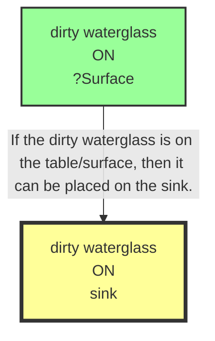
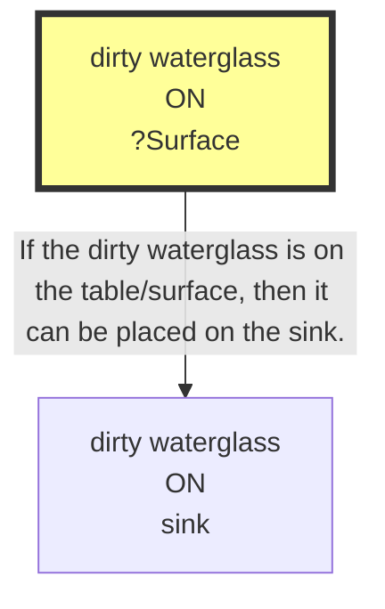
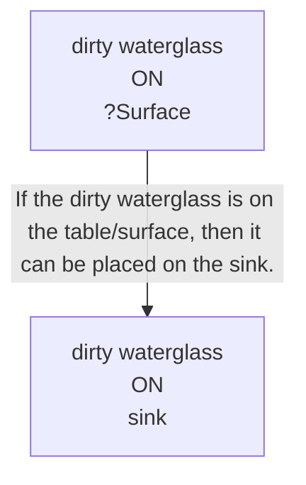

# 🚀 VirtualHome Agent Episode Log


### [GoalReasoner (Module A - Intent)] Output
```json
{
  "is_instruction_obviously_vague": false,
  "clarification_question": null,
  "target_object": "waterglass",
  "location_hint": "桌上",
  "reasoning_chain": [
    {
      "question": "Why does the user want this object?",
      "answer": "They want the dirty water cup moved from the table to the sink."
    },
    {
      "question": "Why is that important?",
      "answer": "To remove the dirty cup from the table and place it where dirty dishes are collected or cleaned."
    },
    {
      "question": "What fundamental need does this fulfill?",
      "answer": "It helps keep the tabletop clear and supports cleaning/organizing dirty dishware."
    },
    {
      "question": "Are there any deeper psychological or physical motivations?",
      "answer": "The likely motivations are maintaining a tidy environment and preparing the cup for washing."
    }
  ],
  "deep_intent": "The user wants to clear a dirty dish from the table by moving it to a place for washing.",
  "acceptable_alternatives_properties": [
    {
      "priority": 1,
      "description": "Other dirty drinkware or small used dishes that can be moved to the sink for washing."
    },
    {
      "priority": 2,
      "description": "Other dirty kitchenware items that belong in the sink or dish area."
    },
    {
      "priority": 3,
      "description": "Any small used household items that need to be collected for cleaning."
    },
    {
      "priority": 4,
      "description": "Other clutter-removal actions that help clear the table and organize items for cleanup."
    }
  ]
}
```

### [PerceptionFilter] Output
```json
{
  "reasoning": "The goal is to move a dirty waterglass from the table to the sink for washing. So the target object class must be kept, along with the source surface/location implied by the intent (table) and the destination receptacle for cleaning (sink).",
  "selected_classes": [
    "kitchentable",
    "waterglass",
    "character",
    "sink"
  ],
  "raw_class_count": 99
}
```

### [LLMExecutor] Output
```json
{
  "reasoning": "The SDG requires a dirty waterglass that is ON some surface (N1), then ON the sink (N2). In the filtered graph, waterglass(64) is the only waterglass marked DIRTY and it is ON kitchentable(131), so it best matches the target object. The sink in the same kitchen is sink(155), which is the correct receptacle/surface to place it on. Since the glass is already near the character, the next required atomic step toward satisfying N2 is to move to the sink before any putback action.",
  "satisfied_nodes": [
    "N1"
  ],
  "current_node_focus": "N2",
  "mapped_variables": {
    "?Surface": "kitchentable(131)"
  },
  "action": "[walk] <sink> (155)"
}
```
## Step 0
- **Action**: `[walk] <sink> (155)`
- **SDG Status**:

- **Observed Items (12)**: character(1), kitchen(11), waterglass(64) [DIRTY], waterglass(71), kitchentable(131), kitchentable(135), sink(155), livingroom(183), bedroom(241), bathroom(285), sink(326), bedroom(346)


### [PerceptionFilter] Output
```json
{
  "reasoning": "The goal is to move the dirty waterglass from the table/surface to the sink for washing. The minimum required classes are the target object itself and the destination receptacle for cleaning. A sink is explicitly part of the SDG, and waterglass is the target object.",
  "selected_classes": [
    "waterglass",
    "character",
    "sink"
  ],
  "raw_class_count": 99
}
```

### [LLMExecutor] Output
```json
{
  "reasoning": "The target dirty waterglass is identified as waterglass(64), and the robot is already close to sink(155) from the previous successful walk. N1 (dirty waterglass on a surface/table) is satisfied by waterglass(64) being on the table in the kitchen, while N2 requires the same dirty waterglass to be on the sink. Since sinks are flat surfaces in this environment, the correct next step is to place the held object onto the sink. However, we do not yet hold the waterglass, so the immediate next atomic action must be to grab it before any putback can happen. The glass is the best match because it is the only dirty waterglass and is movable/grabbable.",
  "satisfied_nodes": [
    "N1"
  ],
  "current_node_focus": "N1",
  "mapped_variables": {
    "?Surface": "kitchentable(131)"
  },
  "action": "[grab] <waterglass> (64)"
}
```
## Step 1
- **Action**: `[grab] <waterglass> (64)`
- **SDG Status**:

- **Observed Items (10)**: character(1), kitchen(11), waterglass(64) [DIRTY], waterglass(71), sink(155), livingroom(183), bedroom(241), bathroom(285), sink(326), bedroom(346)


### [PerceptionFilter] Output
```json
{
  "reasoning": "The goal is to move a dirty waterglass from the table/surface to the sink for washing. The target object class must be kept, and the sink is the required destination/receptacle. The surface/table is implied by the SDG and location hint, so kitchen/table surfaces are not needed as separate classes unless they are the only relevant location objects; here the action only needs the waterglass and sink.",
  "selected_classes": [
    "waterglass",
    "character",
    "sink"
  ],
  "raw_class_count": 99
}
```

### [LLMExecutor] Output
```json
{
  "reasoning": "The dirty target waterglass is already being held in the right hand (HOLDS_RH waterglass(64)) and the robot is close to sink(155). N1 is satisfied because the dirty waterglass is on a surface/table in the kitchen. The remaining unsatisfied node is N2: placing that same dirty waterglass on the sink. Since sinks are flat surfaces here, the correct next atomic action is to put the held glass back onto the sink.",
  "satisfied_nodes": [
    "N1"
  ],
  "current_node_focus": "N2",
  "mapped_variables": {
    "?Surface": "kitchentable(131)"
  },
  "action": "[putback] <waterglass> (64) <sink> (155)"
}
```
## Step 2
- **Action**: `[putback] <waterglass> (64) <sink> (155)`
- **SDG Status**:

- **Observed Items (10)**: character(1), kitchen(11), waterglass(64) [DIRTY], waterglass(71), sink(155), livingroom(183), bedroom(241), bathroom(285), sink(326), bedroom(346)


### [PerceptionFilter] Output
```json
{
  "reasoning": "",
  "selected_classes": [
    "waterglass",
    "character",
    "sink"
  ],
  "raw_class_count": 99
}
```
## Step 3
- **Action**: `FINISH (Goal Reached)`
- **SDG Status**:

- **Observed Items (10)**: character(1), kitchen(11), waterglass(64) [DIRTY], waterglass(71), sink(155), livingroom(183), bedroom(241), bathroom(285), sink(326), bedroom(346)

