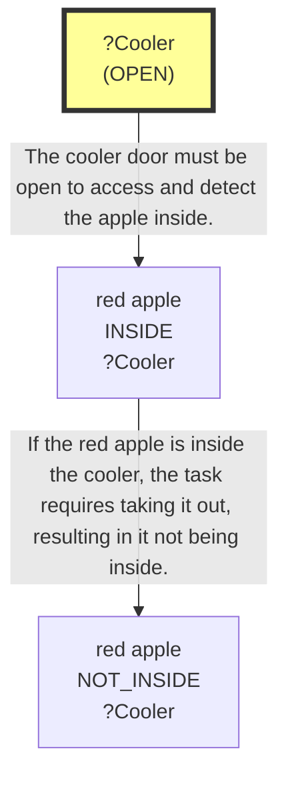
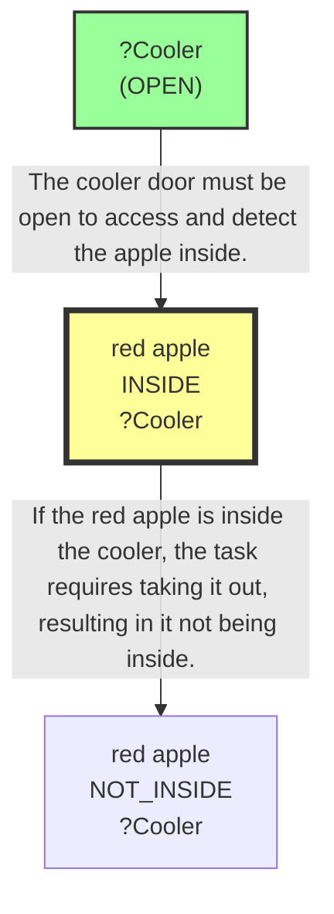
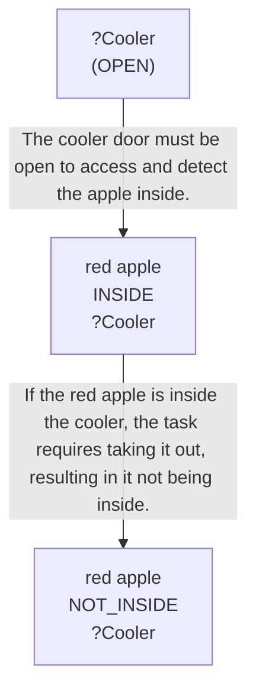

# 🚀 VirtualHome Agent Episode Log


### [GoalReasoner (Module A - Intent)] Output
```json
{
  "is_instruction_obviously_vague": false,
  "clarification_question": null,
  "target_object": "red apple",
  "location_hint": "inside the refrigerator door",
  "reasoning_chain": [
    {
      "question": "Why does the user want this object?",
      "answer": "To obtain the red apple from the refrigerator door if one is present."
    },
    {
      "question": "Why is that important?",
      "answer": "The user likely wants to have the apple available for use, such as eating or handling."
    },
    {
      "question": "What fundamental need does this fulfill?",
      "answer": "It fulfills the need to access and retrieve a desired edible item."
    },
    {
      "question": "Are there any deeper psychological or physical motivations?",
      "answer": "The motivation is likely to satisfy hunger, prepare a snack, or simply get a specific preferred fruit."
    }
  ],
  "deep_intent": "The user wants to access a preferred edible fruit from storage.",
  "acceptable_alternatives_properties": [
    {
      "priority": 1,
      "description": "Other apples that are similarly edible and ready to retrieve from the refrigerator."
    },
    {
      "priority": 2,
      "description": "Other fresh fruits stored in the refrigerator, such as pears or oranges."
    },
    {
      "priority": 3,
      "description": "Other ready-to-eat refrigerated snack foods that can provide a similar edible option."
    },
    {
      "priority": 4,
      "description": "Other snack fruits available indoors that can satisfy the same need to obtain a fresh edible item."
    }
  ]
}
```

### [PerceptionFilter] Output
```json
{
  "reasoning": "Need the target edible item class and the storage appliance implied by the goal/SDG. Since the cooler is the refrigerator, include fridge. Because alternatives retention requires keeping viable substitute fruits/snacks for the same retrieval goal, keep other ready-to-eat fruits visible as backups.",
  "selected_classes": [
    "bananas",
    "fridge",
    "plum",
    "character",
    "peach",
    "door",
    "apple",
    "lime"
  ],
  "raw_class_count": 99
}
```

### [LLMExecutor] Output
```json
{
  "reasoning": "The target red apple is identified as apple(113), which is inside fridge(225). The SDG says the cooler/fridge must be OPEN before the apple can be taken out. The fridge is already close to the character, so the next required atomic step is to open it.",
  "satisfied_nodes": [],
  "current_node_focus": "N2",
  "mapped_variables": {
    "?Cooler": "fridge(225)"
  },
  "action": "[open] fridge (225)"
}
```
## Step 0
- **Action**: `[open] <fridge> (225)`
- **SDG Status**:

- **Observed Items (19)**: character(1), bathroom(11), door(47) [OPEN], bedroom(50), apple(113) [RED,COLD], apple(114) [COLD,GREEN], bananas(115), lime(116), peach(117), peach(118), plum(119), plum(120), kitchen(126), door(145) [OPEN], door(146) [OPEN]...


### [PerceptionFilter] Output
```json
{
  "reasoning": "Need the target edible item class and the storage appliance implied by the goal/SDG. Because the cooler is specified as the refrigerator, and alternatives/backups for the target should be retained among similar edible options, keep the red apple plus other refrigerated fruit alternatives visible nearby. The fridge must be kept as the location/receptacle needed to access the item.",
  "selected_classes": [
    "bananas",
    "fridge",
    "plum",
    "character",
    "peach",
    "door",
    "apple",
    "lime"
  ],
  "raw_class_count": 99
}
```

### [LLMExecutor] Output
```json
{
  "reasoning": "The fridge cooler is already OPEN from the previous step, satisfying SDG node N2. The red apple matching the target is apple(113), and it is currently INSIDE fridge(225), so the next required progress is to remove it from the fridge. Since the robot is already CLOSE to apple(113), the correct next atomic action is to grab it.",
  "satisfied_nodes": [
    "N2"
  ],
  "current_node_focus": "N1",
  "mapped_variables": {
    "?Cooler": "fridge(225)"
  },
  "action": "[grab] <apple> (113)"
}
```
## Step 1
- **Action**: `[grab] <apple> (113)`
- **SDG Status**:

- **Observed Items (19)**: character(1), bathroom(11), door(47) [OPEN], bedroom(50), apple(113) [RED,COLD], apple(114) [COLD,GREEN], bananas(115), lime(116), peach(117), peach(118), plum(119), plum(120), kitchen(126), door(145) [OPEN], door(146) [OPEN]...


### [PerceptionFilter] Output
```json
{
  "reasoning": "Need the target edible item and the likely storage appliance/location implied by the goal and SDG. Since the task is to retrieve a red apple from inside a refrigerator door, keep the apple and the fridge as the necessary object classes. No other tools or furniture are required for this minimal selection.",
  "selected_classes": [
    "apple",
    "fridge",
    "character",
    "door"
  ],
  "raw_class_count": 99
}
```
## Step 2
- **Action**: `FINISH (Goal Reached)`
- **SDG Status**:

- **Observed Items (13)**: character(1), bathroom(11), door(47) [OPEN], bedroom(50), apple(113) [RED,COLD], apple(114) [COLD,GREEN], kitchen(126), door(145) [OPEN], door(146) [OPEN], fridge(225) [OPEN], apple(249) [GREEN], apple(250) [COLD,GREEN], livingroom(261)

