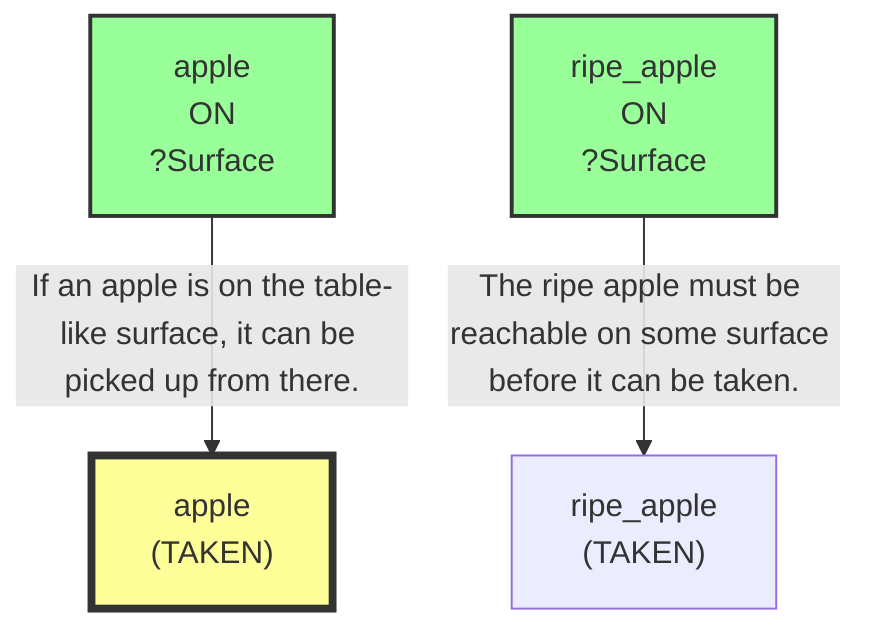
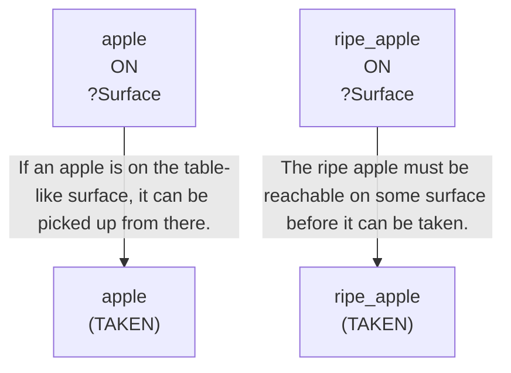

# 🚀 VirtualHome Agent Episode Log


### [GoalReasoner (Module A - Intent)] Output
```json
{
  "is_instruction_obviously_vague": false,
  "clarification_question": null,
  "target_object": "apple",
  "location_hint": "桌子上",
  "reasoning_chain": [
    {
      "question": "Why does the user want this object?",
      "answer": "They want one from the apples on the table."
    },
    {
      "question": "Why is that important?",
      "answer": "They specifically want a ripe one, implying the desired condition is ripeness rather than just any apple."
    },
    {
      "question": "What fundamental need does this fulfill?",
      "answer": "It fulfills the need to obtain a ready-to-eat fruit item that is in the preferred edible state."
    },
    {
      "question": "Are there any deeper psychological or physical motivations?",
      "answer": "The likely motivation is to satisfy hunger or desire for a fruit snack, with a preference for better taste and eating quality from a ripe fruit."
    }
  ],
  "deep_intent": "The user wants to obtain a ripe, ready-to-eat fruit to satisfy a desire for food or a snack.",
  "acceptable_alternatives_properties": [
    {
      "priority": 1,
      "description": "Other ripe, ready-to-eat fruits available indoors, such as a banana, pear, or orange."
    },
    {
      "priority": 2,
      "description": "Other soft or fully ripened fruit items that can be eaten immediately."
    },
    {
      "priority": 3,
      "description": "Prepared snack foods or fruit portions that provide a similar ready-to-eat eating experience."
    },
    {
      "priority": 4,
      "description": "Any other immediately edible indoor food item that can satisfy hunger or a snack craving."
    }
  ]
}
```

### [PerceptionFilter] Output
```json
{
  "reasoning": "The goal is to վերց get a ripe apple from a table-like surface. The SDG requires the apple and ripe_apple, both on some surface, to be taken. Since the location hint says the apple is on the table, the relevant surface/furniture class must be kept as well. No extra tools or alternative foods are needed because the target is specifically an apple and its ripe variant.",
  "selected_classes": [
    "apple",
    "kitchentable",
    "door",
    "character"
  ],
  "raw_class_count": 97
}
```

### [LLMExecutor] Output
```json
{
  "reasoning": "The SDG requires an apple on a surface and taken, plus a ripe apple on a surface and taken. The filtered graph already shows multiple apples on the kitchentable and close to the character. Since we need to make progress toward taking an apple, the best immediate step is to grab one reachable apple. I choose apple(113) because it is on the table, grabbable, and red, which is the most likely ripe candidate among the visible apples.",
  "satisfied_nodes": [
    "N1",
    "N2"
  ],
  "current_node_focus": "N3",
  "mapped_variables": {
    "?Surface": "kitchentable(199)"
  },
  "action": "[grab] apple (113)"
}
```
## Step 0
- **Action**: `[grab] <apple> (113)`
- **SDG Status**:

- **Observed Items (13)**: character(1), bathroom(11), door(47) [OPEN], bedroom(50), apple(113) [RED], apple(114) [GREEN], kitchen(126), door(145) [OPEN], door(146) [OPEN], kitchentable(199), apple(249) [GREEN], apple(250) [GREEN], livingroom(261)


### [PerceptionFilter] Output
```json
{
  "reasoning": "The goal is to վերց վերց obtain a ripe apple from a table-like surface. Only the target fruit and the relevant surface are needed, plus the ripe apple as the condition-aware alternative target from the SDG. No tools or other furniture are required beyond the location surface implied by the intent.",
  "selected_classes": [
    "kitchentable",
    "coffeetable",
    "character",
    "door",
    "table",
    "apple"
  ],
  "raw_class_count": 97
}
```
## Step 1
- **Action**: `FINISH (Goal Reached)`
- **SDG Status**:

- **Observed Items (15)**: character(1), bathroom(11), door(47) [OPEN], bedroom(50), coffeetable(86), apple(113) [RED], apple(114) [GREEN], kitchen(126), door(145) [OPEN], door(146) [OPEN], kitchentable(199), apple(249) [GREEN], apple(250) [GREEN], livingroom(261), coffeetable(289)

