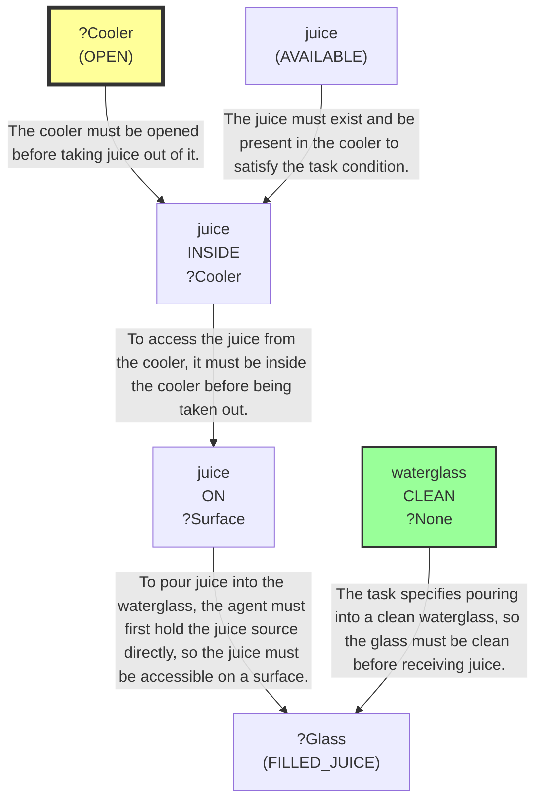
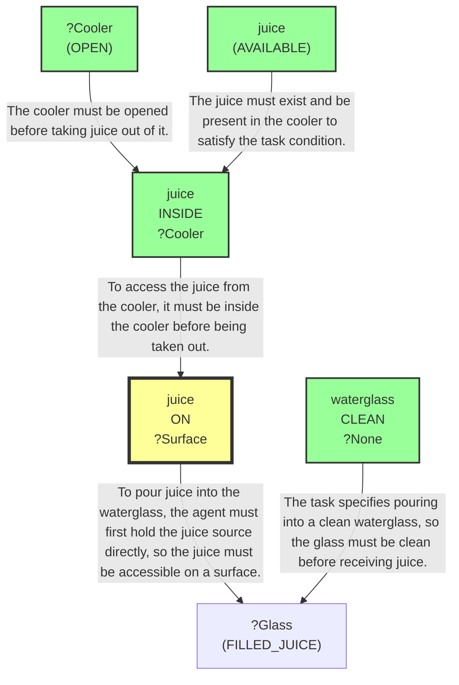
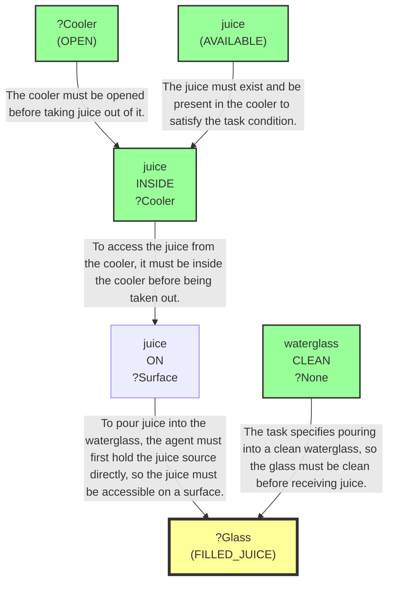
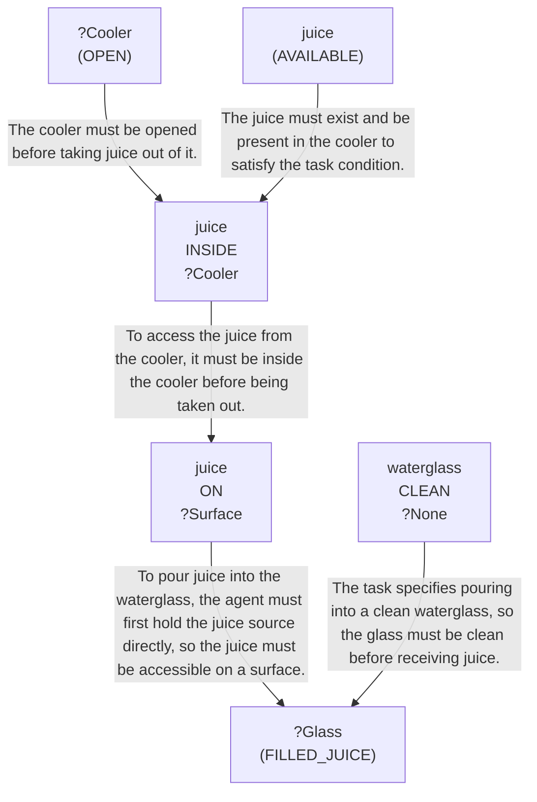

# 🚀 VirtualHome Agent Episode Log


### [GoalReasoner (Module A - Intent)] Output
```json
{
  "is_instruction_obviously_vague": false,
  "clarification_question": null,
  "target_object": "果汁",
  "location_hint": "冰箱",
  "reasoning_chain": [
    {
      "question": "Why does the user want this object?",
      "answer": "They want a drink poured into a clean waterglass."
    },
    {
      "question": "Why is that important?",
      "answer": "To have something to drink that is available from the refrigerator."
    },
    {
      "question": "What fundamental need does this fulfill?",
      "answer": "It fulfills thirst relief and refreshment."
    },
    {
      "question": "Are there any deeper psychological or physical motivations?",
      "answer": "It may also be for convenience, comfort, or to enjoy a beverage that is ready to consume."
    }
  ],
  "deep_intent": "The user wants to relieve thirst by obtaining a drink.",
  "acceptable_alternatives_properties": [
    {
      "priority": 1,
      "description": "Other ready-to-drink beverages found in the refrigerator, such as water, milk, or tea."
    },
    {
      "priority": 2,
      "description": "Similar drinkable liquid beverages stored indoors, such as other bottled or poured drinks."
    },
    {
      "priority": 3,
      "description": "Cold or room-temperature beverages that can provide refreshment, such as juice drinks or flavored drinks."
    },
    {
      "priority": 4,
      "description": "Any safe, consumable beverage that can satisfy thirst, even if it is not juice."
    }
  ]
}
```

### [PerceptionFilter] Output
```json
{
  "reasoning": "Needed classes are the target drink (juice), the storage location/cooler (fridge), and the receiving container that must be clean and filled (waterglass). No other tools or locations are required by the SDG.",
  "selected_classes": [
    "door",
    "juice",
    "fridge",
    "character",
    "milk",
    "waterglass"
  ],
  "raw_class_count": 99
}
```

### [LLMExecutor] Output
```json
{
  "reasoning": "The target juice is inside the fridge, but the fridge is currently CLOSED, so the next necessary step toward extracting juice is to open the fridge. The clean waterglass requirement is already satisfied by waterglass(64), so the remaining gap is access to the juice source.",
  "satisfied_nodes": [
    "N6"
  ],
  "current_node_focus": "N4",
  "mapped_variables": {
    "?Glass": "waterglass(64)",
    "?Cooler": "fridge(162)",
    "?Surface": "fridge(162)"
  },
  "action": "[walk] <fridge> (162)"
}
```
## Step 0
- **Action**: `[walk] <fridge> (162)`
- **SDG Status**:

- **Observed Items (14)**: character(1), kitchen(11), door(47) [OPEN], waterglass(64) [CLEAN], waterglass(71) [DIRTY], fridge(162) [CLOSED], juice(173) [COLD], milk(176) [COLD,CLOSED], livingroom(183), bedroom(241), door(254) [OPEN], bathroom(285), door(305) [OPEN], bedroom(346)


### [PerceptionFilter] Output
```json
{
  "reasoning": "Needed classes are the juice source, the refrigerator/cooler to access it, and the clean drinking vessel required by the SDG. Since alternatives must be retained for possible drink options, milk is also kept as an available beverage in the fridge, and a dishbowl is kept as a backup container for holding/pouring liquids if needed.",
  "selected_classes": [
    "door",
    "juice",
    "fridge",
    "milk",
    "character",
    "waterglass",
    "dishbowl"
  ],
  "raw_class_count": 99
}
```

### [LLMExecutor] Output
```json
{
  "reasoning": "The fridge containing the juice is the current blocker. We are already near the fridge from the previous successful walk, and the fridge is CLOSED, so the next atomic step needed to satisfy access to juice is to open it. The clean waterglass requirement is already satisfied by waterglass(64), so no action on the glass is needed yet.",
  "satisfied_nodes": [
    "N6"
  ],
  "current_node_focus": "N4",
  "mapped_variables": {
    "?Cooler": "fridge(162)",
    "?Glass": "waterglass(64)"
  },
  "action": "[open] <fridge> (162)"
}
```
## Step 1
- **Action**: `[open] <fridge> (162)`
- **SDG Status**:

- **Observed Items (22)**: character(1), kitchen(11), door(47) [OPEN], waterglass(64) [CLEAN], waterglass(71) [DIRTY], dishbowl(115), dishbowl(116), dishbowl(117), dishbowl(118), dishbowl(119), fridge(162) [CLOSED], dishbowl(172), juice(173) [COLD], milk(176) [COLD,CLOSED], dishbowl(180)...


### [PerceptionFilter] Output
```json
{
  "reasoning": "Need the beverage target (juice), the refrigerator/cooler where it is stored, and a clean waterglass to receive it. The SDG also requires the cooler to be opened, so fridge is necessary. No other objects are strictly required.",
  "selected_classes": [
    "door",
    "juice",
    "fridge",
    "character",
    "milk",
    "waterglass"
  ],
  "raw_class_count": 99
}
```

### [LLMExecutor] Output
```json
{
  "reasoning": "The fridge is already open and the juice is visible inside it, so the next missing step toward filling the clean waterglass is to take hold of the juice. I should grab the juice now; the glass is already clean and no further access action is needed before grabbing because the juice is adjacent to the character and marked CLOSE.",
  "satisfied_nodes": [
    "N4",
    "N5",
    "N6",
    "N3"
  ],
  "current_node_focus": "N2",
  "mapped_variables": {
    "?Cooler": "fridge(162)",
    "?Glass": "waterglass(64)",
    "?Surface": "fridge(162)"
  },
  "action": "[grab] <juice> (173)"
}
```
## Step 2
- **Action**: `[grab] <juice> (173)`
- **SDG Status**:

- **Observed Items (14)**: character(1), kitchen(11), door(47) [OPEN], waterglass(64) [CLEAN], waterglass(71) [DIRTY], fridge(162) [OPEN], juice(173) [COLD], milk(176) [COLD,CLOSED], livingroom(183), bedroom(241), door(254) [OPEN], bathroom(285), door(305) [OPEN], bedroom(346)


### [PerceptionFilter] Output
```json
{
  "reasoning": "Needed items are the target beverage (juice), the refrigerator as the cooler/storage location, and a clean waterglass to receive the drink. The SDG requires the juice to be available inside an open cooler and poured into a clean glass; among visible objects, fridge and waterglass satisfy those needed classes.",
  "selected_classes": [
    "door",
    "juice",
    "fridge",
    "character",
    "milk",
    "waterglass"
  ],
  "raw_class_count": 99
}
```

### [LLMExecutor] Output
```json
{
  "reasoning": "The juice source is already accessible and currently held in the right hand (HOLDS_RH juice(173)). The clean waterglass requirement is satisfied by waterglass(64). The remaining gap toward the SDG is to fill the clean glass with juice, which requires being near the glass and holding the juice. Since the character is already close to the glass in the kitchen, the next atomic step is to pour the juice into the clean waterglass.",
  "satisfied_nodes": [
    "N3",
    "N4",
    "N5",
    "N6"
  ],
  "current_node_focus": "N1",
  "mapped_variables": {
    "?Glass": "waterglass(64)",
    "?Cooler": "fridge(162)",
    "?Surface": "kitchen(11)"
  },
  "action": "[pour] <juice> (173) <waterglass> (64)"
}
```
## Step 3
- **Action**: `[pour] <juice> (173) <waterglass> (64)`
- **SDG Status**:

- **Observed Items (14)**: character(1), kitchen(11), door(47) [OPEN], waterglass(64) [CLEAN], waterglass(71) [DIRTY], fridge(162) [OPEN], juice(173) [COLD], milk(176) [COLD,CLOSED], livingroom(183), bedroom(241), door(254) [OPEN], bathroom(285), door(305) [OPEN], bedroom(346)


### [PerceptionFilter] Output
```json
{
  "reasoning": "Needed items are the juice itself, the refrigerator as the cooler/location for storage, and a clean waterglass to receive the pour. The SDG requires the juice to be available inside the cooler and the glass to be clean and filled with juice; no other objects are strictly necessary.",
  "selected_classes": [
    "door",
    "juice",
    "fridge",
    "character",
    "milk",
    "waterglass"
  ],
  "raw_class_count": 99
}
```

### [LLMExecutor] Output
```json
{
  "reasoning": "The last attempt failed because the character is not close to the target waterglass(64). The juice source is already held in the right hand and the clean glass exists, so the next required step is to move next to the waterglass before pouring. This also advances toward filling the glass with juice.",
  "satisfied_nodes": [
    "N3",
    "N4",
    "N5",
    "N6"
  ],
  "current_node_focus": "N2",
  "mapped_variables": {
    "?Glass": "waterglass(64)",
    "?Cooler": "fridge(162)",
    "?Surface": "waterglass(64)"
  },
  "action": "[walk] <waterglass> (64)"
}
```
## Step 4
- **Action**: `[walk] <waterglass> (64)`
- **SDG Status**:

- **Observed Items (14)**: character(1), kitchen(11), door(47) [OPEN], waterglass(64) [CLEAN], waterglass(71) [DIRTY], fridge(162) [OPEN], juice(173) [COLD], milk(176) [COLD,CLOSED], livingroom(183), bedroom(241), door(254) [OPEN], bathroom(285), door(305) [OPEN], bedroom(346)


### [PerceptionFilter] Output
```json
{
  "reasoning": "The goal is to obtain juice from the fridge and pour it into a clean waterglass. So the only required classes are the juice source, the cooler appliance that stores it, and the clean drinking vessel. No other furniture or objects are necessary.",
  "selected_classes": [
    "door",
    "juice",
    "fridge",
    "character",
    "milk",
    "waterglass"
  ],
  "raw_class_count": 99
}
```

### [LLMExecutor] Output
```json
{
  "reasoning": "The juice source is already held in the right hand, the fridge access requirement is satisfied, and the clean waterglass(64) is already close to the character. The previous pour failed only because we were not close enough to the target at that time, but the current graph now marks waterglass(64) as CLOSE, so the next atomic step to satisfy the remaining SDG node N1 is to pour the held juice into the clean glass.",
  "satisfied_nodes": [
    "N3",
    "N4",
    "N5",
    "N6"
  ],
  "current_node_focus": "N1",
  "mapped_variables": {
    "?Glass": "waterglass(64)",
    "?Cooler": "fridge(162)",
    "?Surface": "waterglass(64)"
  },
  "action": "[pour] <juice> (173) <waterglass> (64)"
}
```
## Step 5
- **Action**: `[pour] <juice> (173) <waterglass> (64)`
- **SDG Status**:

- **Observed Items (14)**: character(1), kitchen(11), door(47) [OPEN], waterglass(64) [CLEAN], waterglass(71) [DIRTY], fridge(162) [OPEN], juice(173) [COLD], milk(176) [COLD,CLOSED], livingroom(183), bedroom(241), door(254) [OPEN], bathroom(285), door(305) [OPEN], bedroom(346)


### [PerceptionFilter] Output
```json
{
  "reasoning": "The task is to obtain juice from the refrigerator and pour it into a clean waterglass. So the only necessary classes are the target beverage, the cooler/refrigerator, and the clean receiving glass. A milk alternative is not needed because the target is juice and no backup beverage is required for the current object class selection.",
  "selected_classes": [
    "door",
    "juice",
    "fridge",
    "character",
    "milk",
    "waterglass"
  ],
  "raw_class_count": 99
}
```
## Step 6
- **Action**: `FINISH (Goal Reached)`
- **SDG Status**:

- **Observed Items (14)**: character(1), kitchen(11), door(47) [OPEN], waterglass(64) [FILLED_JUICE,CLEAN], waterglass(71) [DIRTY], fridge(162) [OPEN], juice(173) [COLD], milk(176) [COLD,CLOSED], livingroom(183), bedroom(241), door(254) [OPEN], bathroom(285), door(305) [OPEN], bedroom(346)

